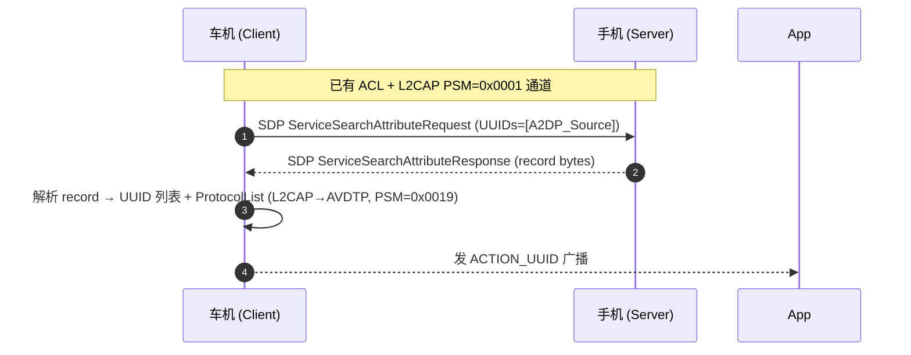

# 05.7 SDP：服务发现协议

> 速通摘要：SDP（Service Discovery Protocol）= **Classic 蓝牙的"我支持哪些服务"目录**。每个 Classic 设备运行一个 SDP Server（监听 L2CAP PSM 0x0001），里面有若干 ServiceRecord；客户端通过 `Service Search Request` 找 UUID 对应的 RFCOMM channel / L2CAP PSM / 协议参数。BLE 不用 SDP，用 GATT。

源码：
- 业务层：`system/bta/sdp/`、`android/app/src/com/android/bluetooth/sdp/SdpManagerService.java`
- 协议层：`system/stack/sdp/sdp_main.cc`、`sdp_discovery.cc`、`sdp_db.cc`

---

## 1. 学习目标

读完本节，你应该能：

1. 说清 SDP 的"我有什么/你要找什么"两种角色。
2. 看懂 SDP ServiceRecord 的属性结构（UUID + Class List + Protocol List + Profile Descriptor 等）。
3. 知道 `fetchUuidsWithSdp()` 走的全链路。
4. 找出本仓 SDP 的关键文件。

---

## 2. 前置知识

- 已读 05.6 L2CAP。
- 知道 RFCOMM 协议通过 SDP 暴露 channel 号给对端。

---

## 3. 场景故事：车机查手机支持哪些 Profile

```java
device.fetchUuidsWithSdp();   // 触发
// 等待
@Override public void onReceive(Context c, Intent intent) {
    if (BluetoothDevice.ACTION_UUID.equals(intent.getAction())) {
        ParcelUuid[] uuids = (ParcelUuid[]) intent.getParcelableArrayExtra(
            BluetoothDevice.EXTRA_UUID);
        for (ParcelUuid u : uuids) {
            // HFP AG / A2DP Source / PBAP Server / MAP Server / ...
        }
    }
}
```

底层：
1. `BluetoothDevice.fetchUuidsWithSdp` → AdapterService → JNI `getRemoteServicesNative`。
2. BTIF `btif_dm.cc` → BTA `BTA_DmDiscover`。
3. BTA → Stack `SDP_ServiceSearchAttributeRequest`。
4. 与对端 SDP Server 交互后，回 ACTION_UUID 广播。

---

## 4. SDP ServiceRecord 结构

一个 ServiceRecord 是一组 Attribute（key-value），每个 Attribute 由 16-bit ID + DataElement 值组成。

| Attribute ID | 含义 |
|--------------|------|
| `0x0000` ServiceRecordHandle | 唯一 ID |
| `0x0001` ServiceClassIDList | UUID 列表（核心） |
| `0x0004` ProtocolDescriptorList | 协议栈（如 L2CAP → RFCOMM channel=N） |
| `0x0005` BrowseGroupList | |
| `0x0006` LanguageBaseAttributeIDList | |
| `0x0008` ServiceAvailability | |
| `0x0009` BluetoothProfileDescriptorList | Profile UUID + 版本 |
| `0x0100+` ServiceName / Description | 字符串 |

DataElement 类型有：UINT8/16/32、UUID16/32/128、字符串、序列、布尔等，按 byte stream 编码。

---

## 5. 主要的查询 PDU

| PDU | 用途 |
|-----|------|
| `SDP_ServiceSearchRequest` | 查包含某 UUID 的 ServiceRecord（返回 RecordHandle 列表） |
| `SDP_ServiceAttributeRequest` | 取某 RecordHandle 的指定 Attribute |
| `SDP_ServiceSearchAttributeRequest` | 二合一（车机常用） |

PDU over L2CAP PSM=0x0001。

---

## 6. 常见 Service UUID（车机相关）

| UUID | Profile |
|------|---------|
| `0x110A` | A2DP Source |
| `0x110B` | A2DP Sink |
| `0x110E` | AVRCP Controller |
| `0x110C` | AVRCP Target |
| `0x111E` | Hands-Free |
| `0x111F` | Hands-Free Audio Gateway |
| `0x1108` | Headset |
| `0x1112` | Headset AG |
| `0x1124` | HID |
| `0x112F` | PBAP-PCE（Phonebook Client） |
| `0x112E` | PBAP-PSE（Server） |
| `0x1132` | MAP MAS |
| `0x1133` | MAP MNS |

完整列表见 Bluetooth SIG "Service Discovery Assigned Numbers"。

---

## 7. 关键源码点

| 文件 | 角色 |
|------|------|
| `framework/java/android/bluetooth/BluetoothDevice.java:2613` | `fetchUuidsWithSdp` |
| `framework/java/android/bluetooth/BluetoothUuid.java` | Java 端常用 UUID 常量 |
| `android/app/src/com/android/bluetooth/sdp/SdpManagerService.java` | 服务记录管理 |
| `android/app/src/com/android/bluetooth/btservice/AdapterService.java`（搜 `sdpSearch`） | API 入口 |
| `system/bta/sdp/bta_sdp.cc` 与同名文件 | BTA SDP |
| `system/stack/sdp/sdp_main.cc` | 协议主入口 |
| `system/stack/sdp/sdp_discovery.cc` | 客户端 discovery |
| `system/stack/sdp/sdp_db.cc` | 本端 ServiceRecord 数据库 |
| `system/stack/sdp/sdp_server.cc` | 本端 Server 响应 |
| `system/stack/sdp/sdp_utils.cc` | 工具 |

---

## 8. 简化时序



---

## 9. 调试方法

| 想看 | 方法 |
|------|------|
| 一次 SDP 查询 | logcat `bt_sdp BluetoothSdpManagerService` |
| 抓包 | BTSnoop 过滤 `btsdp` |
| 当前本端 ServiceRecord | `dumpsys bluetooth_manager` → `SDP Records` |
| `fetchUuidsWithSdp` 触发 | logcat 搜 `getRemoteServices` |

---

## 10. FAQ

**Q1：BLE 设备能用 SDP 吗？**
A：协议上**不能**——BLE 走 GATT 服务发现。但 dual-mode 设备可在 Classic 边发 SDP。

**Q2：SDP 失败导致 Profile 连不上？**
A：常见。如果车机本端没注册自己提供的服务（如 PBAP-PCE），手机查不到就不主动 push 联系人。

**Q3：fetchUuidsWithSdp 多久能拿到结果？**
A：通常 0.5-2 秒。受 ACL 链路质量影响。失败会重试。

**Q4：SDP record 数量上限？**
A：栈实现内部限制，约 32~64 条；车机一般无忧。

**Q5：能否自定义 SDP record？**
A：能。系统 API `BluetoothAdapter.addOnMetadataChangedListener` 等较间接；本仓走 `SdpManagerService.createSdpRecord(...)`（hidden API）。

---

## 11. 上路任务

### 任务 A：抓一次 SDP
做一次新配对，立刻抓 BTSnoop 过滤 `btsdp`，找 ServiceSearchAttribute Req/Resp，看回了多少条 record。

### 任务 B：解一条 ServiceRecord
任挑一条 record 字节，按 §4 attribute 表手工解码出 UUID 与 ProtocolList。

### 任务 C：找 RFCOMM 注册 SDP record
```bash
grep -rn "SDP_CreateRecord\|sdpCreateRecord" system/stack/rfcomm/ system/bta/ag/ system/bta/hf_client/ | head -10
```
看 HFP AG/HF 怎么注册自己的 SDP record。

---

## 12. 本节小结（速记卡）

```
SDP = Classic 服务发现（BLE 用 GATT）
L2CAP PSM = 0x0001
ServiceRecord = Attribute (ID + DataElement) 集合
关键 Attribute：
  0x0001 ServiceClassIDList (UUID)
  0x0004 ProtocolDescriptorList (L2CAP→RFCOMM ch)
  0x0009 BluetoothProfileDescriptorList (Profile 版本)
PDU：ServiceSearchAttributeRequest / Response
入口 API：BluetoothDevice.fetchUuidsWithSdp()
关键源码：
  android/app/.../sdp/SdpManagerService.java
  system/stack/sdp/sdp_main.cc / sdp_discovery.cc / sdp_db.cc / sdp_server.cc
广播：ACTION_UUID
```
