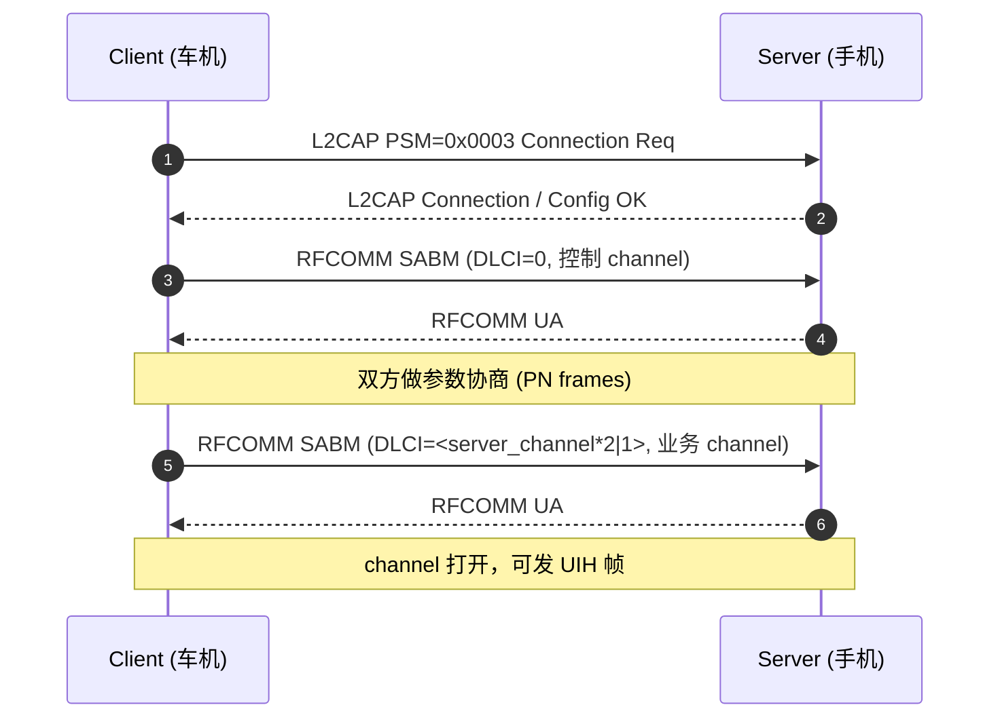

# 05.8 RFCOMM：串口仿真

> 速通摘要：RFCOMM = **L2CAP 上模拟出"多路串口"**，每条 RFCOMM session 内可有最多 60 个 channel。HFP / PBAP / MAP / SAP / 自定义 RFCOMM socket 都走它。一条 channel = 一对 (server side channel, client side channel)；channel 号由 SDP 告知客户端。

源码：
- BTA：`system/bta/rfcomm/`
- Stack：`system/stack/rfcomm/`（`rfc_l2cap_if.cc`、`port_api.cc`、`port_rfc.cc`、`rfc_mx_fsm.cc`、`rfc_port_fsm.cc`）

---

## 1. 学习目标

读完本节，你应该能：

1. 说清 RFCOMM session / channel / port 三层关系。
2. 看懂"多路串口仿真"的协议要点（DLCI / Frame type）。
3. 默写 Android 端使用 RFCOMM socket 的 4 步 API。
4. 找出 HFP / PBAP / MAP 各自的 channel 在哪里注册。

---

## 2. 前置知识

- 已读 05.6 L2CAP、05.7 SDP。

---

## 3. RFCOMM 三层

```
RFCOMM session (1 个 per ACL 链路，多设备多 session)
  ├── channel 1   (一对端到端的串口)
  ├── channel 2
  ├── ...
  └── channel N   (最多 60)
```

- **session**：一条 ACL 上的 RFCOMM 容器，由 L2CAP CID 承载（PSM=0x0003）。
- **channel**：session 内的子通道，由 DLCI（Data Link Connection Identifier）标识。
- **port**：Android 抽象的一个串口端点（`BluetoothSocket`）。

---

## 4. RFCOMM Frame 类型

| Frame | 用途 |
|-------|------|
| **SABM** | Set Asynchronous Balanced Mode（建立 channel） |
| **UA** | Unnumbered Acknowledgement（确认 SABM/DISC） |
| **DISC** | Disconnect |
| **DM** | Disconnected Mode |
| **UIH** | Unnumbered Information with Header check（数据帧，主力） |

每帧含 Address (DLCI)、Control、Length、Payload、FCS。

DLCI = (server_channel << 1) | direction。

---

## 5. channel 号约定

| Channel | 用途（常见） |
|---------|-----------|
| 0 | 控制 channel（参数协商 / Flow Control） |
| 1-30 | server 端分配给业务用 |
| 31-60 | 跨进程或反向 |

具体哪个 channel 是哪个 Profile，由 SDP record 告知。例：HFP AG 把 channel 号写入自己的 SDP record，HF 通过 fetchUuidsWithSdp 找到。

---

## 6. 建立时序



---

## 7. Android 上层 API

```java
// 服务器侧（车机做被发现者）
BluetoothServerSocket server = adapter.listenUsingRfcommWithServiceRecord("MyApp", MY_UUID);
BluetoothSocket socket = server.accept();
// 用 socket.getInputStream() / getOutputStream() 通讯

// 客户端侧
BluetoothSocket socket = device.createRfcommSocketToServiceRecord(MY_UUID);
socket.connect();   // 内部：fetchUuidsWithSdp + 找 channel + 建 RFCOMM
```

底层用 `BluetoothSocketManager` (`framework/java/android/bluetooth/BluetoothSocket.java` / `IBluetoothSocketManager.aidl`) → 蓝牙 App `BluetoothSocketManagerBinder` → JNI → `system/btif/src/btif_sock.cc`。

---

## 8. 关键源码点

| 文件 | 角色 |
|------|------|
| `framework/java/android/bluetooth/BluetoothSocket.java` | App API |
| `framework/java/android/bluetooth/BluetoothServerSocket.java` | server 端 |
| `android/app/aidl/.../IBluetoothSocketManager.aidl` | AIDL |
| `android/app/src/com/android/bluetooth/btservice/BluetoothSocketManagerBinder.java` | Binder 实现 |
| `system/btif/src/btif_sock.cc` 与 `btif_sock_rfc.cc`（如有） | BTIF socket |
| `system/bta/jv/` | Java Virtual（socket 桥接到 RFCOMM） |
| `system/bta/rfcomm/` | BTA RFCOMM |
| `system/stack/rfcomm/rfc_l2cap_if.cc` | RFCOMM 与 L2CAP 衔接 |
| `system/stack/rfcomm/port_api.cc` | Port API |
| `system/stack/rfcomm/port_rfc.cc` | Port 控制 |
| `system/stack/rfcomm/rfc_mx_fsm.cc` | Multiplexer 状态机 |
| `system/stack/rfcomm/rfc_port_fsm.cc` | Port 状态机 |
| `system/stack/rfcomm/rfc_utils.cc` | 工具 |

---

## 9. 实际用 RFCOMM 的 Profile

| Profile | RFCOMM 用途 |
|---------|------------|
| HFP AG / HF | AT 命令双向 |
| PBAP | OBEX over RFCOMM |
| MAP | OBEX over RFCOMM |
| SAP | SIM 数据交换 |
| OPP | OBEX 文件传输 |
| 自定义 SPP | 厂商自由协议 |
| HiCar/CarLink 控制信道 | 厂商专用 channel |

---

## 10. 调试方法

| 想看 | 方法 |
|------|------|
| RFCOMM session 与 channel | `dumpsys bluetooth_manager` → `RFCOMM` 段 |
| Frame 时序 | BTSnoop 过滤 `btrfcomm` |
| Port 状态 | logcat `bt_rfcomm` |
| 数据流量 | dumpsys → port 的 bytes 计数 |

---

## 11. FAQ

**Q1：channel 号怎么分配？**
A：server 端注册 RFCOMM 时由 stack 分配下一个可用 channel，并写到 SDP record；client 通过 fetchUuidsWithSdp 取得。

**Q2：上层用 UUID 还是用 channel？**
A：现代 API 用 **UUID**（`createRfcommSocketToServiceRecord(UUID)`），channel 由 stack 内部解析。旧 API `createRfcommSocket(int channel)` 已不推荐。

**Q3：能不能不走 SDP 直连固定 channel？**
A：能（旧 API）。但建议走 UUID + SDP，因为对端 channel 号可能变。

**Q4：RFCOMM 数据最大多少？**
A：每帧受 RFCOMM PN 协商的 frame_size 限制（典型 127 或 990 字节）。上层 InputStream/OutputStream 自动拼分包。

**Q5：BLE 上有 RFCOMM 吗？**
A：没有。BLE 走 L2CAP CoC（详 05.6）。

---

## 12. 上路任务

### 任务 A：写一个最小 RFCOMM 服务器
车机上 `listenUsingRfcommWithServiceRecord` + accept；手机用 `createRfcommSocketToServiceRecord` 连过来。互发字符串。

### 任务 B：抓 RFCOMM 时序
做一次连接 + 发 100 字节，BTSnoop 看：
1. L2CAP Connect Req (PSM=0x0003)
2. RFCOMM SABM DLCI=0
3. RFCOMM SABM DLCI=<n>
4. RFCOMM UIH 帧

### 任务 C：找 HFP 用的 channel
```bash
grep -rn "HFP_HS_SDP_RFCOMM\|HFP_AG_SDP_RFCOMM\|RFCOMM.*server_channel" \
  system/bta/ag/ system/bta/hf_client/ | head -10
```

---

## 13. 本节小结（速记卡）

```
RFCOMM = L2CAP 上模拟"多路串口"
三层：session(per-ACL) / channel(60 个) / port (Android 抽象)
PSM = 0x0003
DLCI = (server_channel << 1) | direction
帧型：SABM / UA / DISC / DM / UIH
关键 API：
  listenUsingRfcommWithServiceRecord(UUID)
  createRfcommSocketToServiceRecord(UUID)
关键源码：
  Android：BluetoothSocket / BluetoothServerSocket
  Native：system/btif/src/btif_sock.cc
        + system/bta/rfcomm/
        + system/stack/rfcomm/rfc_l2cap_if.cc / port_api.cc / rfc_mx_fsm.cc
关联 Profile：HFP / PBAP / MAP / SAP / OPP / 自定义 SPP / 厂商互联
```
