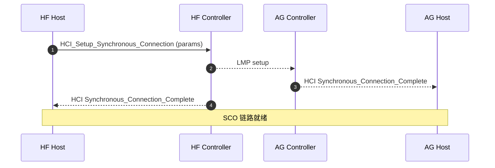

# 05.9 SCO / eSCO：同步音频通道

> 速通摘要：SCO 与 eSCO 是**蓝牙的语音专用链路**（与 ACL 平行存在）。固定时隙、低延迟、**不重传或弱重传**。本节看建立参数（Voice_Setting / Packet_Type）、流控（HCI Number_Of_Completed_Packets for SCO）、错误恢复。

源码：`system/stack/btm/btm_sco*.cc`、`system/bta/ag/bta_ag_sco.cc`、`system/bta/hf_client/bta_hf_client_sco.cc`、`system/audio_hal_interface/hfp_client_interface.cc`。

---

## 1. 学习目标

读完本节，你应该能：

1. 说清 SCO 与 eSCO 的协议差异。
2. 看懂 `HCI_Setup_Synchronous_Connection` 的关键参数。
3. 区分 SCO over HCI 与 SCO Offload 路径。
4. 排查 SCO 建立失败 / 单向音频问题。

---

## 2. 前置知识

- 已读 05.5 HCI、07.3 SCO 应用层。
- 知道 HFP 必备 SCO 承载语音。

---

## 3. SCO 链路的关键参数

`HCI_Setup_Synchronous_Connection` 参数：

| 字段 | 含义 |
|------|------|
| `Handle` | 关联的 ACL handle |
| `Transmit_Bandwidth` | 上行带宽（典型 8000） |
| `Receive_Bandwidth` | 下行带宽（典型 8000） |
| `Max_Latency` | 最大延迟（ms） |
| `Voice_Setting` | 编码（CVSD/μ-law/A-law/Transparent） |
| `Retransmission_Effort` | 0=不重传 / 1=节能优先 / 2=质量优先 / 0xFF=不允许 |
| `Packet_Type` | 允许的包类型（HV1/2/3、EV3/4/5、2-EV3、3-EV3 等） |

**关键事实**：mSBC 时 `Voice_Setting=Transparent`（栈层不解码，Audio HAL 自己处理 mSBC）。

---

## 4. SCO vs eSCO Packet Type

| Packet | 类型 | 带宽 | 是否 eSCO |
|--------|------|------|---------|
| HV1 / HV2 / HV3 | SCO | 64 kbps | 否 |
| EV3 | eSCO 基础 | 64 kbps | 是 |
| EV4 / EV5 | eSCO（更大 payload） | 高 | 是 |
| 2-EV3 / 3-EV3 / 2-EV5 / 3-EV5 | eSCO + EDR（高速） | 更高 | 是 |

mSBC 要求 eSCO（典型 EV3）。

---

## 5. SCO 建立时序（HF 主动）



如果 AG 不接受 → 回 `Connection_Complete with status != success`。HF 一般重试参数（如降级到 EV3 + CVSD）。

---

## 6. SCO over HCI vs Offload

| 路径 | 数据走 | 编码位置 |
|------|--------|---------|
| **SCO over HCI** | HCI SCO 数据包 (0x03) | 主 CPU（mSBC 编码在 Host） |
| **Offload** | 物理 PCM 线 (蓝牙芯片 ↔ Audio HAL) | 芯片 DSP 直接接 Audio HAL |

控制：
- Sysprop `persist.bluetooth.hfp.swb`、`persist.bluetooth.bluetooth_audio_hal.disabled` 等
- Audio HAL 是否支持 HFP Offload（vendor 实现）

---

## 7. 关键源码点

| 文件 | 角色 |
|------|------|
| `system/stack/btm/btm_sco.cc` | SCO 通用 |
| `system/stack/btm/btm_sco_hci.cc`（如有） | SCO over HCI 数据通路 |
| `system/bta/ag/bta_ag_sco.cc` | AG 侧 |
| `system/bta/hf_client/bta_hf_client_sco.cc` | HF 侧 |
| `system/audio_hal_interface/hfp_client_interface.cc` | Audio HAL 对接（Offload） |
| `system/embdrv/sbc/` | mSBC 编解码 |
| `system/btif/src/btif_hf.cc` / `btif_hf_client.cc` | BTIF 端 |

---

## 8. 简化代码片段：SCO 建立

```cpp
// system/bta/hf_client/bta_hf_client_sco.cc 思路图
void bta_hf_client_sco_create(tBTA_HF_CLIENT_CB* client_cb) {
    enh_esco_params_t params = esco_parameters_for_codec(/*selected*/);
    BTM_SetEScoMode(client_cb->peer_addr, &params);
    BTM_CreateSco(client_cb->peer_addr, /*is_orig*/ true, /*pkt_types*/, ...);
}
```

`esco_parameters_for_codec` 根据 CVSD/mSBC 返回不同 `Voice_Setting` 与 `Packet_Type`。

---

## 9. 流控

- 控制器在启动时 `HCI_Read_Buffer_Size` 报告 SCO buffer 数（如 8）。
- Host 维护"未确认 SCO packet 计数"。
- 控制器发 `Number_Of_Completed_Packets` 通知 Host。
- 与 ACL 流控独立。

---

## 10. 调试方法

| 想看 | 方法 |
|------|------|
| SCO 是否建 | btsnoop `HCI Synchronous_Connection_Complete`，status 段 |
| 实际参数 | `HCI_Setup_Synchronous_Connection` 字段 |
| codec | logcat 搜 `+BCS` / `Selected codec` |
| SCO 数据帧 | btsnoop（如果 SCO over HCI 路径） |
| Audio Route | `dumpsys audio` |
| Offload 是否启用 | `dumpsys media.audio_hal` / vendor log |

---

## 11. FAQ

**Q1：SCO 建立失败 status=0x0d (Connection Rejected)？**
A：对端拒绝。可能：① 资源不足（已有 SCO） ② 参数不符（如 mSBC 但对端不支持 transparent voice） ③ 安全要求未满足。

**Q2：通话期间 SCO 突然断？**
A：① RF 弱（supervision timeout） ② AG 主动 disconnect ③ host 端杀进程。

**Q3：单向音频（一侧没声）？**
A：① 一向 Voice_Setting 错 ② Audio HAL 一侧路由错 ③ codec 不对称（一边 mSBC 一边 CVSD）。

**Q4：能否同时有多条 SCO？**
A：硬件上控制器仅支持有限并发（多数 1 条）。同时多通话不能并行。

**Q5：mSBC 的延迟是多少？**
A：mSBC frame 7.5 ms + 编解码 + 双向传输 ≈ 15-30 ms。比 CVSD 略高。

---

## 12. 上路任务

### 任务 A：抓一次 SCO 建立
做一次通话，btsnoop 找：
1. `HCI_Setup_Synchronous_Connection` 命令。
2. 参数 Voice_Setting / Packet_Type / Retransmission_Effort。
3. `HCI_Synchronous_Connection_Complete` 事件 status。

### 任务 B：对比 CVSD / mSBC 参数
分别强制 CVSD 与 mSBC（详 07.3），观察 `Voice_Setting` 与 `Packet_Type` 差异。

### 任务 C：找 SCO 重试逻辑
```bash
grep -rn "BTM_CreateSco\|sco_create" system/bta/ag/ system/bta/hf_client/ system/stack/btm/ | head -10
```
看建立失败时栈侧怎么降级重试。

---

## 13. 本节小结（速记卡）

```
SCO = 同步语音链路（独立于 ACL）
两类：SCO（HV1/2/3）/ eSCO（EV3-EV5，2-EV3 等 EDR）
关键命令：HCI_Setup_Synchronous_Connection (0x0028)
关键参数：
  Transmit/Receive_Bandwidth = 8000
  Voice_Setting：CVSD / mSBC = Transparent
  Retransmission_Effort：0=无 / 1=节能 / 2=质量 / 0xFF=不允许
  Packet_Type：EV3 / 2-EV3 / 3-EV3 / HV3...
两路径：
  SCO over HCI：HCI 0x03 packet
  Offload：芯片直连 Audio HAL（PCM）
关键源码：
  system/stack/btm/btm_sco.cc
  system/bta/ag/bta_ag_sco.cc / hf_client/bta_hf_client_sco.cc
  system/audio_hal_interface/hfp_client_interface.cc
```

至此 05 章 Native 栈基础全部完成。下一站：**09 车机互联专题** + 10 + 11。
