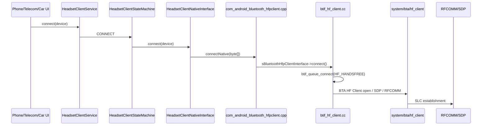

# 06. 蓝牙电话专题：HFP Client、HFP AG 与 SCO 音频

## 1. 学习目标

蓝牙电话比蓝牙音乐多一条语音链路，也多一套通话状态同步协议。车机项目里常见问题包括：电话 Profile 连不上、来电状态不同步、接听/挂断无效、SCO 建不起来、对方听不到声音、车内无声。

读完本章后，你应该能追踪：

- HFP Client 连接链路：Java Service -> JNI -> BTIF -> BTA HF Client。
- SCO 音频链路：`connectAudio()` 如何进入 Native，Native 如何打开/关闭 SCO。
- 通话动作：拨号、接听、拒接、挂断如何进入 Native。
- 通话状态：Native 如何回调 Java 状态机。

## 2. 车机场景里的 HFP 角色

| 角色 | 含义 | 车机场景 |
| --- | --- | --- |
| HFP Client / HF Client | Hands-Free 侧，连接手机的 Audio Gateway | 车机连接手机电话，最常见 |
| HFP AG | Audio Gateway 侧，向免提设备提供电话能力 | 车机自身作为电话网关或特殊设备场景 |
| SCO/eSCO | 通话语音链路 | 车内麦克风和扬声器真正传语音的通道 |

本章优先讲 HFP Client，因为“车机连接手机打电话”通常是这个方向。

## 3. HFP Client 连接总图



## 4. Java Service：策略和状态机入口

连接入口：

```java
// android/app/src/com/android/bluetooth/hfpclient/HeadsetClientService.java
304 public boolean connect(BluetoothDevice device) {
305     Log.d(TAG, "connect " + device);
306     if (getConnectionPolicy(device) == CONNECTION_POLICY_FORBIDDEN) {
311                 + "> is CONNECTION_POLICY_FORBIDDEN");
312         return false;
314     HeadsetClientStateMachine sm = getStateMachine(device, true);
315     if (sm == null) {
316         Log.e(TAG, "Cannot allocate SM for device " + device);
317         return false;
320     sm.sendMessage(HeadsetClientStateMachine.CONNECT, device);
```

和 A2DP 类似，连接策略会先拦截。真正的连接由 `HeadsetClientStateMachine` 处理。

Native 事件回来后，Service 把事件送给状态机：

```java
// android/app/src/com/android/bluetooth/hfpclient/HeadsetClientService.java
822 void messageFromNative(StackEvent stackEvent) {
823     requireNonNull(stackEvent.device);
825     HeadsetClientStateMachine sm =
826             getStateMachine(stackEvent.device, isConnectionEvent(stackEvent));
827     if (sm == null) {
828         throw new IllegalStateException(
829                 "State machine not found for stack event: " + stackEvent);
831     sm.sendMessage(StackEvent.STACK_EVENT, stackEvent);
```

## 5. Java NativeInterface

`HeadsetClientNativeInterface` 是 Java 到 JNI 的集中入口：

```java
// android/app/src/com/android/bluetooth/hfpclient/HeadsetClientNativeInterface.java
65 boolean connect(BluetoothDevice device) {
66     return connectNative(getByteAddress(device));
75 boolean disconnect(BluetoothDevice device) {
76     return disconnectNative(getByteAddress(device));
85 boolean connectAudio(BluetoothDevice device) {
86     return connectAudioNative(getByteAddress(device));
95 boolean disconnectAudio(BluetoothDevice device) {
96     return disconnectAudioNative(getByteAddress(device));
138 boolean dial(BluetoothDevice device, String number) {
139     return dialNative(getByteAddress(device), number);
```

Native 回调连接状态：

```java
// android/app/src/com/android/bluetooth/hfpclient/HeadsetClientNativeInterface.java
297 void onConnectionStateChanged(int state, int peerFeat, int chldFeat, byte[] address) {
298     StackEvent event = new StackEvent(StackEvent.EVENT_TYPE_CONNECTION_STATE_CHANGED);
299     event.valueInt = state;
300     event.valueInt2 = peerFeat;
301     event.valueInt3 = chldFeat;
302     event.device = getDevice(address);
303     Log.d(TAG, "Device addr " + event.device + " State " + state);
304     mService.messageFromNative(event);
```

## 6. JNI：connect、connectAudio、dial

连接设备：

```cpp
// android/app/jni/com_android_bluetooth_hfpclient.cpp
554 static jboolean connectNative(JNIEnv* env, jobject /* object */, jbyteArray address) {
555   std::shared_lock<std::shared_mutex> lock(interface_mutex);
556   if (!sBluetoothHfpClientInterface) {
557     return JNI_FALSE;
565   RawAddress bd_addr = RawAddress::FromOctets(reinterpret_cast<const uint8_t*>(addr));
567   bt_status_t status = sBluetoothHfpClientInterface->connect(bd_addr);
568   if (status != BT_STATUS_SUCCESS) {
569     log::error("Failed AG connection, status: {}", bt_status_text(status));
572   return (status == BT_STATUS_SUCCESS) ? JNI_TRUE : JNI_FALSE;
```

打开 SCO 音频：

```cpp
// android/app/jni/com_android_bluetooth_hfpclient.cpp
596 static jboolean connectAudioNative(JNIEnv* env, jobject /* object */, jbyteArray address) {
597   std::shared_lock<std::shared_mutex> lock(interface_mutex);
598   if (!sBluetoothHfpClientInterface) {
599     return JNI_FALSE;
607   RawAddress bd_addr = RawAddress::FromOctets(reinterpret_cast<const uint8_t*>(addr));
609   bt_status_t status = sBluetoothHfpClientInterface->connect_audio(bd_addr);
610   if (status != BT_STATUS_SUCCESS) {
611     log::error("Failed AG audio connection, status: {}", bt_status_text(status));
614   return (status == BT_STATUS_SUCCESS) ? JNI_TRUE : JNI_FALSE;
```

拨号：

```cpp
// android/app/jni/com_android_bluetooth_hfpclient.cpp
703 static jboolean dialNative(JNIEnv* env, jobject /* object */, jbyteArray address,
704                            jstring number_str) {
716   const char* number = nullptr;
717   if (number_str != nullptr) {
718     number = env->GetStringUTFChars(number_str, nullptr);
720   RawAddress bd_addr = RawAddress::FromOctets(reinterpret_cast<const uint8_t*>(addr));
722   bt_status_t status = sBluetoothHfpClientInterface->dial(bd_addr, number == nullptr ? "" : number);
```

注册表：

```cpp
// android/app/jni/com_android_bluetooth_hfpclient.cpp
960 int register_com_android_bluetooth_hfpclient(JNIEnv* env) {
961   const JNINativeMethod methods[] = {
964           {"connectNative", "([B)Z", (void*)connectNative},
966           {"connectAudioNative", "([B)Z", (void*)connectAudioNative},
971           {"dialNative", "([BLjava/lang/String;)Z", (void*)dialNative},
973           {"handleCallActionNative", "([BII)Z", (void*)handleCallActionNative},
974           {"queryCurrentCallsNative", "([B)Z", (void*)queryCurrentCallsNative},
```

## 7. BTIF HFP Client

BTIF 连接入口：

```cpp
// system/btif/src/btif_hf_client.cc
312 static bt_status_t connect(const RawAddress bd_addr) {
313   CHECK_BTHF_CLIENT_INIT();
314   return btif_queue_connect(UUID_SERVCLASS_HF_HANDSFREE, bd_addr, connect_int);
}
```

BTIF 音频入口：

```cpp
// system/btif/src/btif_hf_client.cc
347 static bt_status_t connect_audio(const RawAddress bd_addr) {
348   btif_hf_client_cb_t* cb = btif_hf_client_get_connected_device(bd_addr);
349   if (!cb) {
350     return BT_STATUS_DEVICE_NOT_FOUND;
353   CHECK_BTHF_CLIENT_SLC_CONNECTED(cb);
355   if ((get_default_hf_client_features() & BTA_HF_CLIENT_FEAT_CODEC) &&
356       (cb->peer_feat & BTA_HF_CLIENT_PEER_CODEC)) {
357     BTA_HfClientSendAT(cb->handle, BTA_HF_CLIENT_AT_CMD_BCC, 0, 0, NULL);
358   } else {
359     BTA_HfClientAudioOpen(cb->handle);
364   btif_transfer_context(btif_in_hf_client_generic_evt, BTIF_HF_CLIENT_CB_AUDIO_CONNECTING,
365                         (char*)&bd_addr, sizeof(RawAddress), NULL);
```

这段有两个重要点：

- 必须是 SLC connected 才能打开音频。
- 如果双方支持 codec negotiation，会先发 `AT+BCC`，否则直接 `BTA_HfClientAudioOpen()`。

拨号入口：

```cpp
// system/btif/src/btif_hf_client.cc
479 static bt_status_t dial(const RawAddress bd_addr, const char* number) {
480   btif_hf_client_cb_t* cb = btif_hf_client_get_connected_device(bd_addr);
481   if (!cb) {
482     return BT_STATUS_DEVICE_NOT_FOUND;
485   CHECK_BTHF_CLIENT_SLC_CONNECTED(cb);
487   // If 'number' is a valid pointer to a non-empty string, send an ATD command.
```

接口表：

```cpp
// system/btif/src/btif_hf_client.cc
793         .disconnect = disconnect,
794         .connect_audio = connect_audio,
795         .disconnect_audio = disconnect_audio,
799         .dial = dial,
800         .dial_memory = dial_memory,
801         .handle_call_action = handle_call_action,
802         .query_current_calls = query_current_calls,
```

## 8. SCO 音频链路

SCO 是电话音频的关键。打开成功时：

```cpp
// system/bta/hf_client/bta_hf_client_sco.cc
560 void bta_hf_client_sco_conn_open(tBTA_HF_CLIENT_DATA* p_data) {
563   tBTA_HF_CLIENT_CB* client_cb = bta_hf_client_find_cb_by_handle(p_data->hdr.layer_specific);
569   bta_hf_client_sco_event(client_cb, BTA_HF_CLIENT_SCO_CONN_OPEN_E);
571   bta_sys_sco_open(BTA_ID_HS, 1, client_cb->peer_addr);
573   if (client_cb->negotiated_codec == BTM_SCO_CODEC_LC3) {
574     bta_hf_client_cback_sco(client_cb, BTA_HF_CLIENT_AUDIO_LC3_OPEN_EVT);
575   } else if (client_cb->negotiated_codec == BTM_SCO_CODEC_MSBC) {
576     bta_hf_client_cback_sco(client_cb, BTA_HF_CLIENT_AUDIO_MSBC_OPEN_EVT);
578     bta_hf_client_cback_sco(client_cb, BTA_HF_CLIENT_AUDIO_OPEN_EVT);
```

关闭时：

```cpp
// system/bta/hf_client/bta_hf_client_sco.cc
592 void bta_hf_client_sco_conn_close(tBTA_HF_CLIENT_DATA* p_data) {
601   /* clear current scb */
602   client_cb->sco_idx = BTM_INVALID_SCO_INDEX;
604   bta_hf_client_sco_event(client_cb, BTA_HF_CLIENT_SCO_CONN_CLOSE_E);
606   bta_sys_sco_close(BTA_ID_HS, 1, client_cb->peer_addr);
608   bta_sys_sco_unuse(BTA_ID_HS, 1, client_cb->peer_addr);
611   bta_hf_client_cback_sco(client_cb, BTA_HF_CLIENT_AUDIO_CLOSE_EVT);
```

车内无声/对方听不到时，重点看：

- HFP SLC 是否 connected。
- `connectAudio()` 是否被调用。
- `BTA_HfClientAudioOpen()` 或 `AT+BCC` 是否成功。
- SCO open callback 是否到达 Java。
- negotiated codec 是 CVSD、mSBC 还是 LC3。
- Audio HAL/AudioPolicy 是否把输入输出路由到车机麦克风和扬声器。

## 9. HFP AG 简要入口

如果车机作为 AG，看 `android/app/src/com/android/bluetooth/hfp` 和 `system/btif/src/btif_hf.cc`。

AG 侧打开音频的 Native 入口会走 `BTA_AgAudioOpen(...)`：

```cpp
// system/btif/src/btif_hf.cc
1027                                   &btif_hf_cb[idx].connected_bda));
1028   BTA_AgAudioOpen(btif_hf_cb[idx].handle, disabled_codecs);
1030   DEVICE_IOT_CONFIG_ADDR_INT_ADD_ONE(bd_addr, IOT_CONF_KEY_HFP_SCO_CONN_COUNT);
```

AG 侧通常还要处理手机网络/电话状态、CLCC 响应、CIND 指示等，复杂度更偏“车机自己提供电话服务”。

## 10. 故障排查表

| 现象 | 优先源码入口 | 判断点 |
| --- | --- | --- |
| HFP Client 连不上 | `HeadsetClientService.connect()`、`connectNative()`、`btif_hf_client.connect()` | connection policy、状态机是否创建、SDP/RFCOMM 是否成功 |
| 已连接但电话音频无声 | `connectAudio()`、`connect_audio()`、`bta_hf_client_sco_conn_open()` | SLC 是否连接、SCO 是否 open、codec、AudioPolicy 路由 |
| 接听/挂断无效 | `acceptCall()`、`rejectCall()`、`terminateCall()`、`handleCallActionNative()` | 状态机当前 call 状态、AT command 是否发送 |
| 拨号失败 | `dial()`、`dialNative()`、`btif_hf_client.dial()` | 是否 SLC connected、三方通话策略、号码是否为空 |
| 来电状态不同步 | `call_cb`、`callsetup_cb`、`current_calls_cb`、`messageFromNative()` | Native callback 是否上来，状态机是否消费 |
| 宽带语音异常 | `bta_hf_client_sco_conn_open()`、codec negotiation | mSBC/LC3/CVSD 协商结果 |

## 11. 本章练习

- 用 `rg -n "connectAudioNative|connect_audio|BTA_HfClientAudioOpen"` 复现 SCO 打开链路。
- 在 `HeadsetClientStateMachine.java` 中找到 `CONNECT_AUDIO`、`DIAL_NUMBER`、`ACCEPT_CALL`、`TERMINATE_CALL` 的处理。
- 用 `rg -n "current_calls_cb|callsetup_cb|callheld_cb" android/app/jni/com_android_bluetooth_hfpclient.cpp system/btif/src/btif_hf_client.cc` 追通话状态回调。
- 对比 A2DP 的 `Started` 和 HFP 的 `SCO open`，解释为什么“Profile connected”不等于“声音一定通”。

