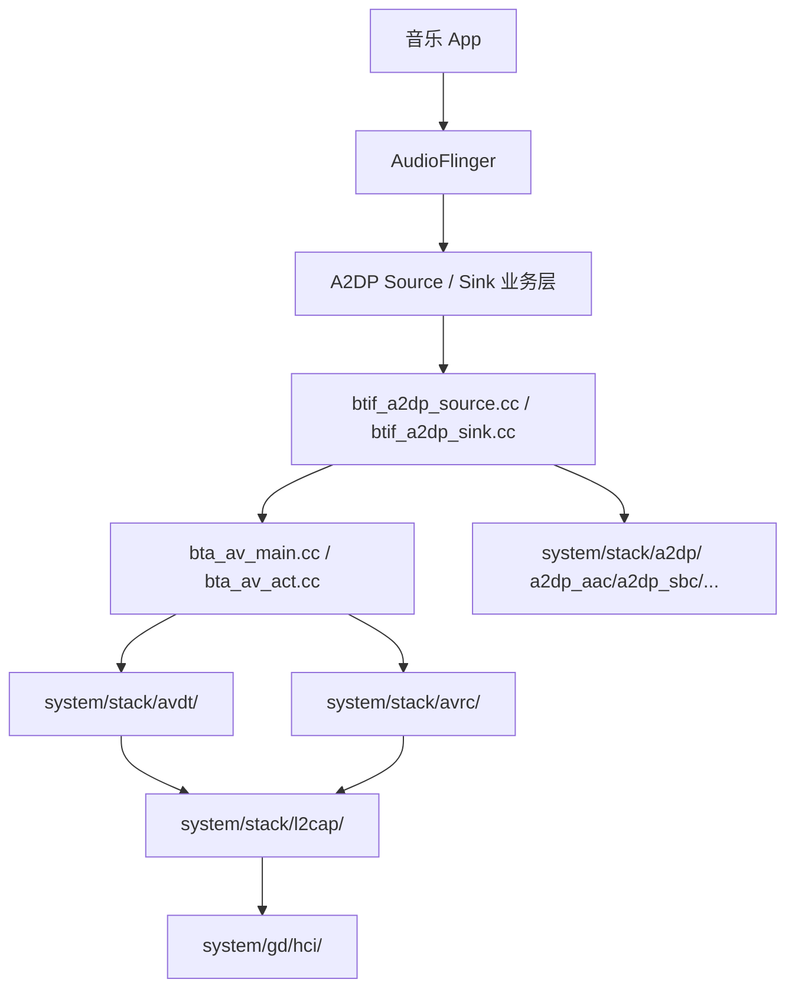
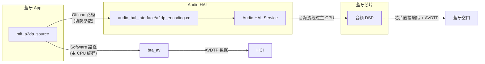

# 06.1 A2DP 架构总览（Source/Sink、编解码、Offload）

> 速通摘要：A2DP（Advanced Audio Distribution Profile）= **蓝牙立体声**。一端是 **Source**（数据源，通常手机），一端是 **Sink**（接收方，车机/耳机）。底层走 AVDTP（音视频传输协议）over L2CAP；编解码 SBC 必备，AAC/aptX/aptX HD/aptX LL/LDAC 可选；现代 Android 支持 **A2DP Offload** —— 由芯片 DSP 直接编码 + 串流，绕过应用处理器以省电省 CPU。

---

## 1. 学习目标

读完本节，你应该能：

1. 区分 A2DP Source 与 Sink，画出"车机 = Sink + 手机 = Source"基本拓扑。
2. 列出 Android 默认支持的 6 种编解码及优先级。
3. 区分 A2DP Software 路径与 A2DP Offload 路径。
4. 找到本仓中 A2DP 相关的 8 个关键 Java/Native 文件。

---

## 2. 前置知识

- 已读 02、03、04 章。
- 知道蓝牙 Profile = Java Service + JNI + Native 三层（02.3）。

---

## 3. 场景故事：你在手机上点播放，车机出声了

```
[手机] 网易云 → AudioTrack → AudioFlinger → A2DP Source 软件编码 SBC/AAC
                                              ↓ AVDTP MEDIA over L2CAP
                                       (空中 ACL 数据帧)
                                              ↓
[车机] BTM/L2CAP/AVDT → A2DP Sink 软件解码 SBC/AAC → AudioTrack → 扬声器
```

车机做 **Sink** 时，本仓主要走 `a2dpsink/`；车机做 **Source** 时（例如手机互联）走 `a2dp/`。两套并存、对称。

---

## 4. 协议栈视角



| 层 | 协议 / 文件 |
|----|-----------|
| 业务 Profile | A2DP / AVRCP |
| 媒体传输 | **AVDTP** (`system/stack/avdt/`) — 流的建立、暂停、关闭 |
| 控制 | **AVCTP/AVRCP** (`system/stack/avct/`、`avrc/`) — 播放/暂停/音量 |
| 编解码协商 | A2DP Codec Capabilities (`system/stack/a2dp/`) |
| 数据通道 | L2CAP CoC（媒体）+ L2CAP（控制） |
| 物理 | ACL（同 03.4） |

---

## 5. Source vs Sink

| 维度 | Source (`a2dp/`) | Sink (`a2dpsink/`) |
|------|------------------|--------------------|
| 角色 | 发音源 | 接音源 |
| 车机典型 | 手机互联场景做 Source | 蓝牙音乐场景做 Sink |
| Java Service | `A2dpService.java` | `A2dpSinkService.java` |
| JNI 接口 | `A2dpNativeInterface.java` + `com_android_bluetooth_a2dp.cpp` | `A2dpSinkNativeInterface.java` + `com_android_bluetooth_a2dp_sink.cpp` |
| BTIF | `system/btif/src/btif_av.cc:411 BtifAvSource` | `:651 BtifAvSink` |
| 编码 | 编（发送侧） | 解（接收侧） |
| Audio HAL 协作 | `system/audio_hal_interface/a2dp_encoding.cc` | 通常软件解码 |

**注意**：Android 设计上一台设备可同时启 Source + Sink 两套服务（不同 SEP），但**同一 Codec 同时收发不常见**。

---

## 6. 6 种编解码（按优先级）

来自 `system/stack/a2dp/` + `flags/`：

| Codec | 文件 | 必备/可选 | 车载常见 |
|-------|------|-----------|---------|
| **SBC** | `a2dp_sbc.cc` | A2DP 强制必备 | 兜底 |
| **AAC** | `a2dp_aac.cc` | 可选（iPhone 必有） | ★★★ |
| **aptX** | `a2dp_vendor_aptx.cc` | 可选（Qualcomm） | ★★ |
| **aptX HD** | `a2dp_vendor_aptx_hd.cc` | 可选 | ★★ |
| **aptX LL / aptX Adaptive** | 部分实现可能在 vendor | 可选 | ★ |
| **LDAC** | `a2dp_vendor_ldac.cc` | 可选（Sony 推） | ★ |
| **Opus** | `a2dp_vendor_opus.cc`（如有） | 实验性 | — |

Codec 协商在配对后第一次 AVDTP `SET_CONFIG` 时发生，由 Source 提供"我能编码的列表"，Sink 挑一个。优先级由 `A2dpCodecConfig.java` 与 sysprop `persist.bluetooth.a2dp_aac.disabled` 等控制。

---

## 7. Offload 路径 vs Software 路径



| 维度 | Software | Offload |
|------|----------|---------|
| 谁编码 | 主 CPU（蓝牙 App 进程内） | 芯片 DSP |
| CPU 占用 | 高 | 低 |
| 兼容性 | 所有设备 | 取决于厂商芯片 |
| 切换控制 | sysprop `persist.bluetooth.a2dp_offload.disabled` + flag |
| 关键代码 | `btif_a2dp_source.cc` + `system/embdrv/` 软件 codec | `system/audio_hal_interface/a2dp_encoding.cc` |

车机绝大多数会启用 Offload（省电关键），但**调试时常关闭 Offload 切回 Software 看问题**——更易抓到栈侧异常。

---

## 8. 关键源码点

| 文件:行 | 角色 |
|---------|------|
| `framework/java/android/bluetooth/BluetoothA2dp.java` | Source 代理 |
| `framework/java/android/bluetooth/BluetoothA2dpSink.java` | Sink 代理 |
| `framework/java/android/bluetooth/BluetoothCodecConfig.java` | Codec 配置 Parcelable |
| `android/app/src/com/android/bluetooth/a2dp/A2dpService.java` | Source Service |
| `android/app/src/com/android/bluetooth/a2dp/A2dpStateMachine.java` | per-device 状态机 |
| `android/app/src/com/android/bluetooth/a2dp/A2dpNativeInterface.java` | JNI Java 端 |
| `android/app/jni/com_android_bluetooth_a2dp.cpp` | JNI C 端 |
| `android/app/src/com/android/bluetooth/a2dpsink/A2dpSinkService.java` | Sink Service |
| `android/app/src/com/android/bluetooth/a2dpsink/A2dpSinkStateMachine.java` | Sink 状态机 |
| `system/btif/src/btif_av.cc:411` | `BtifAvSource` |
| `system/btif/src/btif_av.cc:651` | `BtifAvSink` |
| `system/btif/src/btif_a2dp.cc` | A2DP 通用 |
| `system/btif/src/btif_a2dp_source.cc` | Source 编码 + 发送线程 |
| `system/btif/src/btif_a2dp_sink.cc` | Sink 解码 + 播放队列 |
| `system/bta/av/bta_av_main.cc` | BTA AV 状态机 |
| `system/stack/avdt/avdt_msg.cc` | AVDTP 协议 |
| `system/stack/a2dp/a2dp_codec_config.cc` | Codec Capabilities |
| `system/stack/a2dp/a2dp_sbc.cc` | SBC |
| `system/stack/a2dp/a2dp_aac.cc` | AAC |
| `system/audio_hal_interface/a2dp_encoding.cc` | Audio HAL 对接 |

---

## 9. 调试方法

| 想看 | 方法 |
|------|------|
| 当前 A2DP 状态 | `dumpsys bluetooth_manager` → `A2DP State` |
| 当前 codec | dumpsys 同上，看 `codec=` 段 |
| 是否 Offload | `getprop persist.bluetooth.a2dp_offload.disabled`；为 `true` 即软件 |
| 关闭 Offload 临时调试 | `setprop persist.bluetooth.a2dp_offload.disabled true` + 重启蓝牙 |
| AVDTP 时序 | btsnoop 看 `Stream Configure` / `Open` / `Start` / `Close` |
| 编码失败 | logcat `bt_btif_a2dp_source bt_a2dp_sbc bt_a2dp_aac` |

---

## 10. FAQ

**Q1：车机播音乐有点延迟正常吗？**
A：A2DP 标准延迟 100-300 ms（缓冲队列）。aptX LL / aptX Adaptive 可降到 ~40 ms，但需要双端都支持。

**Q2：为什么换车之后音质差了？**
A：常见三因：① 切到 SBC 而不是 AAC/LDAC；② Offload 失效退到软件；③ 蓝牙信号弱导致重传压缩有损。dumpsys 看 codec 与重传率。

**Q3：能不能强制用某 codec？**
A：`setCodecConfigPreference(...)`（SystemApi）或通过 sysprop disable 其它编码。但要双端协商一致才行。

**Q4：iPhone 接车机一定用 AAC？**
A：是。Apple 不支持 aptX/LDAC，AAC 是 iPhone 唯一非 SBC 选项。

**Q5：A2DP 和 SCO 能同时开吗？**
A：能共存但**通话期间 A2DP 通常被"挂起"**——SCO 物理上抢射频资源。`AvrcpVolumeManager`、`A2dpService.suspend()` 处理。详 06.5 + 07 章。

---

## 11. 上路任务

### 任务 A：识别本机 A2DP 角色
连一台手机播音乐，dumpsys 查：
1. Source 还是 Sink？
2. 用哪个 codec？
3. 是 Offload 还是 Software？

### 任务 B：临时切到 Software
```bash
adb shell setprop persist.bluetooth.a2dp_offload.disabled true
adb shell svc bluetooth disable && adb shell svc bluetooth enable
# 重新放音乐，再 dumpsys
```
对比有何不同。

### 任务 C：找出 BtifAvSource 的成员函数
```bash
grep -n "class BtifAvSource" system/btif/src/btif_av.cc
# 然后看 :411 起的类定义
```

---

## 12. 本节小结（速记卡）

```
A2DP = 蓝牙立体声
角色：Source（发）/ Sink（收）
车机典型：Sink（蓝牙音乐）+ Source（手机互联）双套
协议：AVDTP(媒体) + AVCTP/AVRCP(控制) over L2CAP
6 种 codec：SBC / AAC / aptX / aptX HD / LDAC / Opus(实验)
两种路径：Software（主 CPU）/ Offload（芯片 DSP）
关键源码：
  btif_av.cc:411 BtifAvSource / :651 BtifAvSink
  bta_av_main.cc / system/stack/avdt|avrc|a2dp
  audio_hal_interface/a2dp_encoding.cc（Offload）
```
