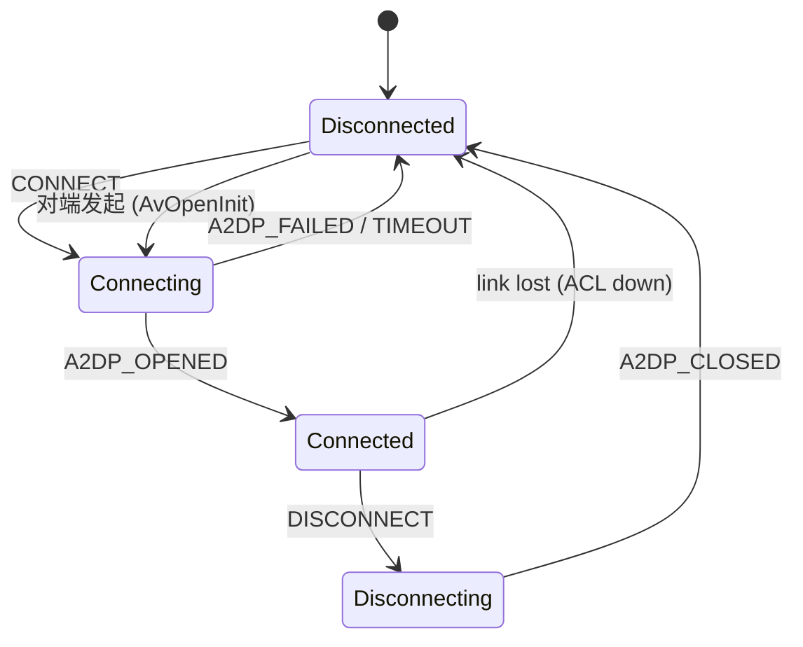
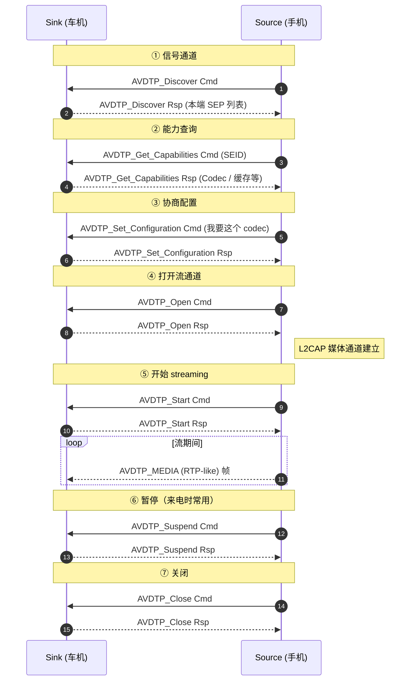
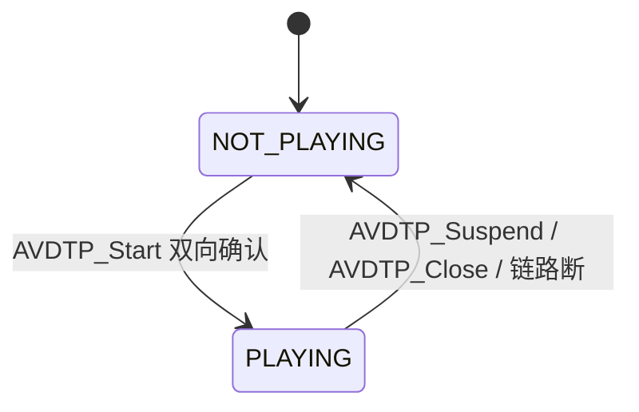

# 06.2 A2DP 连接全链路（Java ↔ JNI ↔ BTIF ↔ BTA ↔ AVDT）

> 速通摘要：A2DP 连接 = **6 段衔接 + 1 个状态机**。Java 层 `A2dpService.connect()` → JNI `connectA2dpNative` → BTIF `btif_av_*` → BTA `bta_av_main.cc` 状态机 → Stack `avdt_msg.cc` 发 AVDTP `SET_CONFIG` → 对端回 `SET_CONFIG_RESP` → 协商 codec → `OPEN` → `START` → 媒体流跑起来。本节按时序拆解。

---

## 1. 学习目标

读完本节，你应该能：

1. 默写 A2DP 连接的 7 步 AVDTP 时序（DISCOVER/GET_CAP/SET_CONFIG/OPEN/START/SUSPEND/CLOSE）。
2. 看懂 `A2dpStateMachine` 的 4 个状态。
3. 跟踪 `A2dpService.connect(device)` 一路到 Stack 的全链。
4. 排查"连上了但不出声"或"出声但没建 STREAM"类问题。

---

## 2. 前置知识

- 已读 06.1。
- 已读 03.4（连接 = ACL + Profile）。

---

## 3. 场景故事：手机点连接车机蓝牙

```
[手机点连接]
  ↓
ACL 建立（HCI Connection Complete）
  ↓
PhonePolicy 决定要连 A2DP
  ↓
A2dpService.connect(device)
  ↓
A2dpStateMachine: Disconnected → Connecting
  ↓
A2dpNativeInterface.connectA2dpNative(byte[] addr)
  ↓ JNI
sBtAvInterface->connect(addr)
  ↓
btif_av.cc → BTA_AvOpen()
  ↓
bta_av_main.cc 状态机：INIT → OPENING → OPEN
  ↓
AVDTP DISCOVER → GET_CAPABILITIES → SET_CONFIGURATION → OPEN
  ↓ AVDTP OPEN_RESP
A2dpStateMachine: Connecting → Connected
  ↓ 广播
ACTION_CONNECTION_STATE_CHANGED (CONNECTED)
  ↓ 用户按播放
A2DP_StreamStart → AVDTP START → ACTION_PLAYING_STATE_CHANGED (PLAYING)
  ↓ 媒体流开始
[L2CAP CoC] AVDTP_MEDIA 帧持续传输
```

---

## 4. `A2dpStateMachine` 状态机

来自 `android/app/src/com/android/bluetooth/a2dp/A2dpStateMachine.java`：



**per-device 状态机** —— 多台手机连车机时每台一个实例（map `mStateMachines: BluetoothDevice → A2dpStateMachine`）。

---

## 5. AVDTP 7 步时序



源码位置：
- AVDTP 协议：`system/stack/avdt/avdt_msg.cc`、`avdt_ad.cc`、`avdt_scb.cc`
- BTA AV 状态机：`system/bta/av/bta_av_act.cc`、`bta_av_main.cc`、`bta_av_aact.cc`
- BTIF AV：`system/btif/src/btif_av.cc`（搜 `BtifAvSource::Connect` 等）

---

## 6. Java → Stack 跨层映射

| 层 | Java/Native 函数 | 触发的下一层 |
|----|-----------------|------------|
| Java Service | `A2dpService.connect(device)` | `A2dpStateMachine.sendMessage(CONNECT, device)` |
| Java State Machine | `Disconnected.processConnectRequest()` | `A2dpNativeInterface.connectA2dpNative(addr)` |
| JNI | `connectA2dpNative` (在 `com_android_bluetooth_a2dp.cpp`) | `sBtAvInterface->connect(addr)` |
| BTIF | `BtifAvSource::ConnectSource(addr)` (`btif_av.cc:411` 类) | `BTA_AvOpen(...)` |
| BTA | `bta_av_api_open` → `BTA_AV_API_OPEN_EVT` → `bta_av_main.cc` 状态机 | AVDT 一系列 cmd |
| Stack AVDT | `avdt_msg_send_cmd / avdt_msg_send_rsp` | L2CAP 数据 |
| Stack L2CAP | `L2CA_DataWrite` | HCI ACL |

---

## 7. 简化代码片段

### 7.1 Java Service connect 入口（思路图）

```java
// A2dpService.java（思路）
public boolean connect(BluetoothDevice device) {
    if (!Utils.callerIsSystemOrActiveUser(...)) return false;
    A2dpStateMachine sm = mStateMachines.computeIfAbsent(device,
            d -> A2dpStateMachine.make(d, this, mNativeInterface, mLooper));
    sm.sendMessage(A2dpStateMachine.CONNECT);
    return true;
}
```

### 7.2 State Machine 处理 CONNECT

```java
// A2dpStateMachine.java 内 Disconnected 子态
class Disconnected extends State {
    @Override public boolean processMessage(Message msg) {
        switch (msg.what) {
            case CONNECT:
                if (mNativeInterface.connectA2dp(mDevice)) {
                    transitionTo(mConnecting);
                } else {
                    logErr(...);
                }
                return true;
        }
        return false;
    }
}
```

### 7.3 BTIF 连接（`btif_av.cc:411` 起）

```cpp
class BtifAvSource {
public:
    bt_status_t Connect(const RawAddress& peer_address);
    bt_status_t Disconnect(const RawAddress& peer_address);
    // ……
};
```

实现里会构造 `BtifAvPeer`、维护对端列表、发 `BTA_AvOpen`。

### 7.4 BTA → AVDT

`bta_av_main.cc` 是状态机的"中央调度"，收到 `BTA_AV_API_OPEN_EVT` 后投递到对应 SCB（Stream Control Block），SCB 进入 `AVDT_CONFIGURING` 子态，发 AVDT `DISCOVER` 命令。

---

## 8. 媒体流通道（L2CAP CoC）

A2DP 实际数据走 L2CAP 面向连接通道（CoC），CID 在 AVDTP `OPEN` 完成时双方约定。每个 RTP-like 帧由 `AVDT_MEDIA` 头部 + payload（编码后的音频）组成。

车机调试要关注：
- **MTU 协商**：通常 672 或更大，影响单帧能传多少音频。
- **L2CAP 流控**：拥塞时会出现 RX/TX 缓冲堆积，导致音频延迟变大。
- **HCI Number_of_Completed_Packets**：芯片告诉 Host 已发送多少帧，是 host 端"何时可发下一帧"的依据。

---

## 9. PLAYING 状态广播



监听 `BluetoothA2dp.ACTION_PLAYING_STATE_CHANGED`（Source）或在 Sink 端监听对应广播，可以做"HMI 显示音乐图标"。

---

## 10. 调试方法

| 想看 | 方法 |
|------|------|
| 连接卡在哪一步 | `dumpsys bluetooth_manager` 找 `A2dpStateMachine` 段 |
| AVDTP 时序 | btsnoop 看 `AV/A2DP` 段；过滤 `btavdtp` |
| Codec 协商结果 | dumpsys 段中 `selected codec = ...` |
| 是否真的开 STREAM | 看 BTSnoop `AVDTP_Start Resp Accept` |
| 媒体帧是否在流 | btsnoop 抓 `AVDTP MEDIA` |
| 软/硬路径 | `dumpsys media.audio_hal` 或 `dumpsys audio` 找 a2dp policy |

---

## 11. FAQ

**Q1：A2DP 连上但不出声，第一步看什么？**
A：① dumpsys 看是不是 `PLAYING`；② 看 `setActiveDevice` 是否选到对的设备；③ 看 AudioFlinger 是否真把流路由到蓝牙；④ 抓 btsnoop 看是否 `AVDTP_Start` 完成。

**Q2：codec 切换会断流吗？**
A：是。AVDTP 不支持在线换 codec，必须 `Suspend → Close → ReConfig → Open → Start`，所以会有几百 ms 静音。

**Q3：连上一会儿就断怎么办？**
A：常见原因：① ACL 链路质量差（dumpsys 看 link quality）；② 对端策略主动断（Apple 设备某些情况下"不活动 10 分钟断流"）；③ 协议错误（BTA 状态机错位）。BTSnoop 看 `Disconnect` 原因码。

**Q4：连接顺序：先 A2DP 还是先 AVRCP？**
A：实际并行。栈侧 BTA 会同时发起。AVRCP 用同一台设备的另一对 L2CAP CID。

**Q5：能不能阻止某设备连 A2DP？**
A：`setConnectionPolicy(device, CONNECTION_POLICY_FORBIDDEN)`。或 `Config.java` 不启用 A2DP Profile。

---

## 12. 上路任务

### 任务 A：跟踪一次完整 A2DP 连接
```bash
adb logcat -c
# 操作：连一台手机
adb logcat -d | grep -E "A2dpStateMachine|A2dpService|bt_btif_av|bt_bta_av|bt_avdt"
```
找出 7 步 AVDTP 对应的 log。

### 任务 B：BTSnoop 验证
抓 BTSnoop，Wireshark 过滤 `btavdtp`，找：
- AVDTP_Discover
- AVDTP_Get_Capabilities
- AVDTP_Set_Configuration
- AVDTP_Open
- AVDTP_Start

### 任务 C：找出 BtifAvSource::Connect 实现
```bash
grep -n "BtifAvSource::ConnectSource\|BtifAvSource::Connect\b" system/btif/src/btif_av.cc
```
读它怎么调 `BTA_AvOpen`。

---

## 13. 本节小结（速记卡）

```
A2DP 连接 7 步：DISCOVER → GET_CAPABILITIES → SET_CONFIGURATION → OPEN → START → SUSPEND → CLOSE
状态机：Disconnected → Connecting → Connected → Disconnecting
Java→Native 链：
  A2dpService.connect → A2dpStateMachine
  → A2dpNativeInterface.connectA2dp
  → JNI connectA2dpNative
  → sBtAvInterface->connect
  → btif_av.cc BtifAvSource::Connect
  → BTA_AvOpen
  → bta_av_main.cc 状态机
  → AVDTP commands (system/stack/avdt/avdt_msg.cc)
广播：
  ACTION_CONNECTION_STATE_CHANGED（Connected / Disconnected）
  ACTION_PLAYING_STATE_CHANGED（PLAYING / NOT_PLAYING）
```
