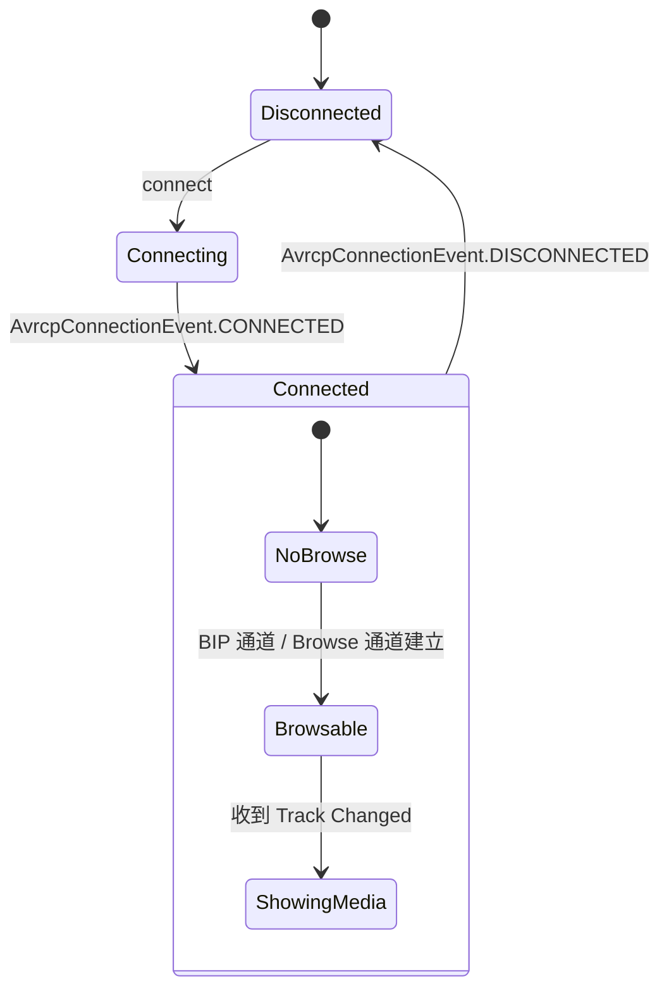
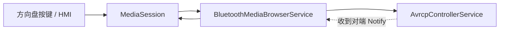

# 06.3 AVRCP Target / Controller

> 速通摘要：AVRCP（Audio/Video Remote Control Profile）= **遥控**。Target 是"被控方"（手机播放器），Controller 是"控制方"（车机按"暂停"）。两端**互发** AVCTP 帧 over L2CAP，通常 AVRCP 1.6+ 走 Browse/Cover Art 两个独立 L2CAP 通道。车机最常用 **Controller**（控制手机）+ AVRCP Target 在某些手机互联反向场景。

源码：
- 车机 Controller：`android/app/src/com/android/bluetooth/avrcpcontroller/`
- 车机 Target（手机互联用）：`android/app/src/com/android/bluetooth/avrcp/`
- Native：`system/stack/avrc/`、`system/stack/avct/`、`system/profile/avrcp/`

---

## 1. 学习目标

读完本节，你应该能：

1. 区分 AVRCP Target / Controller / Browse / Cover Art 四个角色与通道。
2. 看懂 `AvrcpControllerService.java` 与 `AvrcpControllerStateMachine.java` 关系。
3. 默写"按下方向盘暂停按钮"的源码路径。
4. 知道 AVRCP 1.3 / 1.4 / 1.5 / 1.6 的主要差异。

---

## 2. 前置知识

- 已读 06.1（A2DP 总览）、06.2（A2DP 连接）。
- 知道 AVRCP 与 A2DP 是"独立 Profile 但常在一起用"。

---

## 3. 场景故事：你方向盘按"下一首"

```
[车机方向盘按键] → InputDispatcher → MediaSession ← BluetoothMediaBrowserService
                                                    ↓
                                       AvrcpControllerService.passThrough(KEY_NEXT)
                                                    ↓
                                       AvrcpControllerNativeInterface.sendPassThroughCommandNative
                                                    ↓ JNI
                                       AvrcpControllerCallbacks → BTA AVRC
                                                    ↓
                                       AVRCP PassThrough Cmd (Next, Pressed)
                                                    ↓ AVCTP/L2CAP
                                                    ↓
                                       [手机] AVRCP Target → 播放器跳下一首
                                                    ↓
                                       Source 端 Notify Track Changed
                                                    ↓
                                       车机 Controller 收到 → 更新 HMI
```

---

## 4. AVRCP 四种通道

| 通道 | L2CAP PSM | 用途 |
|------|-----------|------|
| **Control** | 0x0017 | PassThrough（播/暂/上/下/音量）、Capability 查询 |
| **Browse** | 0x001B | 浏览播放器/歌单/曲目（AVRCP 1.4+） |
| **Cover Art**（BIP） | 0x001C 区间 | 专辑封面（AVRCP 1.6+，走 OBEX） |
| **AVCTP** | 同 Control | 帧承载格式（更精确说 AVCTP 在 L2CAP 之上） |

车机现实：Control 通道是必备；Browse 用来在 HMI 上选歌单；Cover Art 用来显示封面。**Cover Art 由 BIP（Basic Imaging Profile）over OBEX 实现**，本仓有完整的 `AvrcpBipClient.java` / `AvrcpBipObexServer.java`。

---

## 5. AVRCP 版本演进

| 版本 | 关键能力 |
|------|---------|
| 1.0 | 基础 PassThrough |
| 1.3 | Metadata（曲名、艺人）查询 |
| 1.4 | Browsing + Notification（Now Playing 改变） |
| 1.5 | Search、UTF-16 文本 |
| 1.6 | Cover Art via BIP |
| 1.6.1+ | 蓝牙 5 时代的微调（Notification 时序） |

车机端 Controller 推荐声明 1.6，能拿到封面。

---

## 6. Target vs Controller 双子目录

| 目录 | 角色 | 关键文件 |
|------|------|---------|
| `android/app/src/com/android/bluetooth/avrcp/` | **Target** | `AvrcpTargetService.java`、`AvrcpNativeInterface.java`、`AvrcpVolumeManager.java`、`AvrcpCoverArtService.java` |
| `android/app/src/com/android/bluetooth/avrcpcontroller/` | **Controller** | `AvrcpControllerService.java`、`AvrcpControllerStateMachine.java`、`AvrcpPlayer.java`、`AvrcpItem.java`、`BluetoothMediaBrowserService.java`、`AvrcpCoverArtManager.java` |

`BluetoothMediaBrowserService` 是车机最常打交道的一个 —— 它把 AVRCP 数据封装成 Android 标准的 `MediaBrowserService`，让车机 HMI 能用 `MediaBrowser` API 显示和控制。

---

## 7. AvrcpControllerStateMachine



per-device 状态机；在 `AvrcpControllerStateMachine.java` 内。

---

## 8. 关键源码点（Controller 视角）

| 文件 | 角色 |
|------|------|
| `framework/java/android/bluetooth/BluetoothAvrcpController.java` | Java 代理 |
| `android/app/aidl/.../IBluetoothAvrcpController.aidl` | AIDL |
| `android/app/src/com/android/bluetooth/avrcpcontroller/AvrcpControllerService.java` | Service |
| `…/AvrcpControllerStateMachine.java` | per-device 状态机 |
| `…/AvrcpControllerNativeInterface.java` | JNI Java 端 |
| `…/BluetoothMediaBrowserService.java` | MediaBrowser 适配 |
| `…/AvrcpPlayer.java` | 远端播放器抽象 |
| `…/AvrcpItem.java` | 浏览项（歌单/歌曲） |
| `…/AvrcpCoverArtManager.java` | Cover Art 管理 |
| `…/AvrcpBipClient.java` | BIP 客户端（拉封面） |
| `android/app/jni/com_android_bluetooth_avrcp_controller.cpp` | JNI C |
| `system/stack/avrc/avrc_api.cc`、`avrc_pars_*.cc` | AVRCP 协议核心 |
| `system/stack/avct/` | AVCTP 承载 |
| `system/profile/avrcp/` | 新版 AVRCP Native 实现（部分） |

---

## 9. 简化代码片段：发送 PassThrough

```java
// AvrcpControllerService.java（思路）
public boolean sendPassThroughCmd(BluetoothDevice device, int keyCode, int keyState) {
    AvrcpControllerStateMachine sm = mDeviceStateMachineMap.get(device);
    if (sm == null) return false;
    sm.sendMessage(MESSAGE_SEND_PASS_THROUGH_CMD, keyCode, keyState);
    return true;
}
```

State Machine 内：
```java
// AvrcpControllerStateMachine.java（思路）
case MESSAGE_SEND_PASS_THROUGH_CMD:
    mNativeInterface.sendPassThroughCommand(mDevice, msg.arg1, msg.arg2);
    return true;
```

JNI：
```cpp
// com_android_bluetooth_avrcp_controller.cpp（思路）
static jboolean sendPassThroughCommandNative(JNIEnv* env, jobject obj,
                                             jbyteArray address, jint keyCode, jint keyState) {
    sBtAvrcpControllerInterface->send_pass_through_cmd(
        addr, (uint8_t)keyCode, (uint8_t)keyState);
}
```

Native 端最终发 AVRCP PASS THROUGH 帧 over AVCTP。

---

## 10. AVRCP 控制 → MediaSession 衔接



车机 HMI 通过 Android 标准 `MediaSession` 拿到当前播放信息，无需直接操作 AVRCP API。

---

## 11. 调试方法

| 想看 | 方法 |
|------|------|
| AVRCP 连接状态 | `dumpsys bluetooth_manager` → `AvrcpControllerService` 或 `AvrcpTargetService` |
| MediaBrowser 状态 | `adb shell dumpsys media_session` |
| PassThrough 命令 | `logcat -s BluetoothAvrcpControllerService BluetoothAvrcpControllerStateMachine bt_avrc` |
| 抓 AVRCP 帧 | btsnoop 过滤 `btavrcp` |
| Cover Art 失败 | logcat `BluetoothAvrcpBipClient bt_avrc_bip` |

---

## 12. FAQ

**Q1：方向盘按键有时不响应？**
A：常见原因：① AVRCP 没连上；② 手机端播放器没注册 MediaSession（Spotify/系统播放器都有，但有些第三方没）；③ HMI 把按键消费在自己 layer 而没下发。

**Q2：为什么显示不出歌名？**
A：① AVRCP 版本太老（手机或车机仅 1.0）；② Metadata 没拿到（BTSnoop 看 `GetElementAttributes`）；③ MediaSession 字段未同步。

**Q3：封面不显示？**
A：① 双端都需 1.6+；② BIP 通道协商失败；③ 图片解码失败。`AvrcpCoverArtManager` log。

**Q4：能不能"模拟"按键？**
A：可以。`AvrcpControllerService.sendPassThroughCmd(device, AVRCP_KEY_PLAY, ...)`（SystemApi）或 `MediaController.getTransportControls().play()`。

**Q5：AVRCP Target 在车机上什么时候用？**
A：当车机作为"播放方"——例如车机里的本地音乐通过 A2DP Source 推到 BT 耳机，AVRCP Target 让耳机能控制车机播放器。手机互联中也有用到。

---

## 13. 上路任务

### 任务 A：自己实现一次方向盘"暂停"
通过 `MediaController` 或直接 `AvrcpControllerService.sendPassThroughCmd` 触发一次 KEY_PAUSE。验证 btsnoop 里有 AVRCP PASS THROUGH 帧。

### 任务 B：找出 BIP Cover Art 流程
```bash
grep -n "AvrcpBipClient" android/app/src/com/android/bluetooth/avrcpcontroller/*.java
```
读 `AvrcpBipClient.java` 怎么 OBEX 拉图片。

### 任务 C：理解 MediaBrowserService 衔接
打开 `BluetoothMediaBrowserService.java`，看它如何把 `AvrcpPlayer` 数据转成 `MediaBrowser` API。

---

## 14. 本节小结（速记卡）

```
AVRCP = 蓝牙遥控
角色：Target（被控）/ Controller（控制）
车机典型：Controller（按方向盘控手机播放器）
通道：Control(0x0017) / Browse(0x001B) / Cover Art (BIP over OBEX)
版本：1.0(PassThrough) → 1.3(Metadata) → 1.4(Browse) → 1.6(Cover Art)
关键 Java：
  avrcpcontroller/AvrcpControllerService + AvrcpControllerStateMachine
  + BluetoothMediaBrowserService（车机 HMI 接入点）
  + AvrcpBipClient（封面）
关键 Native：system/stack/avrc/ + system/stack/avct/ + system/profile/avrcp/
```
