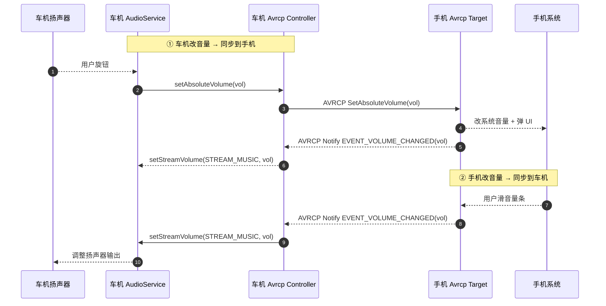

# 06.4 绝对音量同步原理与坑点

> 速通摘要：**绝对音量（Absolute Volume）= 车机和手机的音量数值一致同步**——你旋车机音量旋钮，手机界面同步动；你滑手机音量条，车机扬声器跟着变。背后由 **AVRCP 1.4+ 的 `SetAbsoluteVolume` Notify** 实现，**双向同步**。本节是车机最高频的"奇怪 bug 来源"——80% 通话/音乐音量问题都跟它有关。

源码核心：
- 车机 Controller 侧：`AvrcpControllerService.java`（搜 `Volume`）+ `AvrcpControllerStateMachine.java`
- 车机 Target 侧（手机互联用）：`AvrcpVolumeManager.java`
- Native：`system/stack/avrc/avrc_pars_*.cc`、`system/btif/src/btif_av.cc`

---

## 1. 学习目标

读完本节，你应该能：

1. 说清绝对音量的双向同步机制（who is master / who is slave 看场景）。
2. 看懂 `AvrcpVolumeManager`（Target 侧）与 Controller 侧的 SetAbsoluteVolume 路径。
3. 排查"音量不同步 / 跳变 / 卡某个值"这三种典型 bug。
4. 知道与 Android Audio Stream `STREAM_BLUETOOTH_SCO` / `STREAM_MUSIC` 的关系。

---

## 2. 前置知识

- 已读 06.3（AVRCP）。
- 知道 Android `AudioManager` / `STREAM_*` 概念。

---

## 3. 场景故事：你旋了车机音量旋钮一下

```
[车机旋钮旋一格]
   ↓
AudioManager.adjustStreamVolume(STREAM_MUSIC, +1)
   ↓
AudioService 决定"要不要同步到蓝牙对端"——若 A2DP active + 支持绝对音量
   ↓
A2dpService / AvrcpTargetService 调 setAbsoluteVolume
   ↓
AvrcpNativeInterface → JNI → BTA AVRC
   ↓
AVRCP SetAbsoluteVolume Cmd (vol = 0~127)
   ↓ AVCTP over L2CAP
   ↓
[手机] AVRCP Controller 收 → 同步系统音量条 UI
```

反过来：手机滑动音量条 → AVRCP Notify → 车机 → `AudioManager.setStreamVolume(...)`。

---

## 4. AVRCP 绝对音量协议要点

| 项 | 取值 |
|----|------|
| 范围 | 0..127 |
| 量化 | 实际车机/手机内部音量级别会"映射"到 0..127（如 0..15 → 0..127） |
| 通知 | `RegisterNotification(EVENT_VOLUME_CHANGED)` |
| 命令 | `SetAbsoluteVolume`（Controller 发给 Target） |

**关键事实**：绝对音量是 **AVRCP Target 拥有最终值** —— Target 发出的 `Notify` 才是权威；Controller 调 `SetAbsoluteVolume` 是"请求"，Target 可以拒绝或调整。

---

## 5. 车机两种角色

| 场景 | 车机角色 | 谁是 Target |
|------|---------|------------|
| 蓝牙音乐：手机 → 车机播 | Controller | 手机 |
| 手机互联：车机做"被显示" | Target | 车机 |
| LE Audio：车机做 unicast sink | VCS（Volume Control Service） | LE 协议族 |

本节聚焦最常见的"蓝牙音乐 + 车机做 Controller"。

---

## 6. `AvrcpVolumeManager` 解读

虽然在 `avrcp/`（Target 目录），但里面处理的是**车机做 Target 时**的音量记忆：

- 每台远端 device 一份音量记录（写到 SharedPreferences）。
- 重连时回放上次音量，避免"重连后跳到 100%"。
- 与 Android `AudioManager` 联动：`AVRCP volume = STREAM_MUSIC 当前值`。

源码：`android/app/src/com/android/bluetooth/avrcp/AvrcpVolumeManager.java`。

---

## 7. 关键源码点

| 文件 | 角色 |
|------|------|
| `framework/java/android/bluetooth/BluetoothA2dp.java` | 公开 `setAvrcpAbsoluteVolume`（SystemApi） |
| `android/app/src/com/android/bluetooth/avrcp/AvrcpTargetService.java` | Target 端 SetAbsoluteVolume 入口 |
| `android/app/src/com/android/bluetooth/avrcp/AvrcpVolumeManager.java` | 音量记忆与映射 |
| `android/app/src/com/android/bluetooth/avrcp/AvrcpNativeInterface.java` | JNI Java 端 |
| `android/app/src/com/android/bluetooth/avrcpcontroller/AvrcpControllerService.java` | Controller 端 |
| `android/app/jni/com_android_bluetooth_avrcp_target.cpp` | JNI C |
| `system/stack/avrc/avrc_pars_tg.cc` / `avrc_pars_ct.cc` | AVRCP TG / CT 解析 |
| `system/btif/src/btif_av.cc` | A2DP active device 关联 |
| `flags/avrcp.aconfig` | 一堆 flag 控制版本/行为 |

---

## 8. Mermaid：双向同步时序



注意"②" 这条单向 Notify 是关键——你滑手机的反向回路 = AVRCP Target → Controller 的事件流。

---

## 9. 三种典型 Bug

### Bug 1：音量不同步
- 现象：旋车机不影响手机，反之亦然。
- 排查：
  1. 手机/车机 AVRCP 版本是不是 ≥ 1.4？
  2. dumpsys 看是否启用了 absolute volume（`mAbsoluteVolumeSupport`）。
  3. 抓 btsnoop 看 `RegisterNotification(EVENT_VOLUME_CHANGED)` 是否被 reject。
- 修法：往往是 interop 黑名单——`system/conf/interop_database.conf` 把对端设备列为 "不支持绝对音量"。

### Bug 2：音量来回跳变（震荡）
- 现象：旋一下，音量来回闪一两次稳定。
- 原因：双方都做了"我收到 Notify 再回 SetAbsoluteVolume"导致回环。
- 修法：节流（debounce）—— `AvrcpVolumeManager` 内有 mute window。

### Bug 3：音量卡在某个值
- 现象：调到某个值之后再调没反应。
- 原因：Target 拒绝 / 映射函数舍入到同值。
- 修法：看 `AvrcpVolumeManager` 的映射表是不是步进太大。

---

## 10. Android Audio Stream 映射

| Profile | Stream | 备注 |
|---------|--------|------|
| A2DP | `STREAM_MUSIC` | 音乐音量 |
| HFP（SCO） | `STREAM_BLUETOOTH_SCO` | 通话音量；与 STREAM_MUSIC **独立**（这是 HMI 容易混淆的点） |
| LE Audio Media | `STREAM_MUSIC` | 同 A2DP |
| LE Audio Conversational | `STREAM_VOICE_CALL`（通常） | |

**车机调试坑**：通话中按"+音量"，你以为调的是通话音量，可能 HMI 配错调了 `STREAM_MUSIC`——结果发现什么都没变。

---

## 11. 调试方法

| 想看 | 方法 |
|------|------|
| 当前是否支持绝对音量 | `dumpsys bluetooth_manager` 找 `mAbsoluteVolumeSupport` |
| 音量记忆值 | `cat /data/user/0/com.android.bluetooth/shared_prefs/` 下的 AVRCP 偏好 |
| AVRCP 帧 | btsnoop 过滤 `btavrcp.opcode == 0x50`（SetAbsoluteVolume） |
| 同步事件 | `logcat -s BluetoothAvrcpVolumeManager BluetoothA2dpService BluetoothAvrcpControllerService bt_avrc` |
| Audio HAL 这一侧 | `dumpsys audio` |

---

## 12. FAQ

**Q1：iPhone 绝对音量经常坏？**
A：是常见 interop 问题。Apple 在不同 iOS 版本对绝对音量行为不一致。本仓 `system/conf/interop_database.conf` 有一些黑名单条目处理。

**Q2：能否禁用绝对音量？**
A：可以。在 `interop_database.conf` 加 device 条目，或 `setprop persist.bluetooth.disableabsvol true`（具体名以本仓 sysprop 为准）。

**Q3：通话时音量不同步？**
A：那是 **HFP volume**（不是 AVRCP）。HFP 用 `+VGS` / `+VGM` AT 命令同步。详 07 章。

**Q4：LE Audio 也有绝对音量吗？**
A：LE Audio 用 VCP/VCS（Volume Control Profile/Service），机制不同但目的一致。

**Q5：车机自家 HMI 显示的音量数和实际 STREAM 值不一致？**
A：HMI 通常自做映射（0..30 步），而 AVRCP 是 0..127。映射函数必须双向一致，否则会"差 1 步"。

---

## 13. 上路任务

### 任务 A：抓一次音量同步 btsnoop
做一次旋车机音量旋钮 + 滑手机音量条。Wireshark 过滤 `btavrcp.opcode == 0x50`，应看到两个方向的 SetAbsoluteVolume / Notify。

### 任务 B：读 AvrcpVolumeManager
打开 `android/app/src/com/android/bluetooth/avrcp/AvrcpVolumeManager.java`，找：
1. 音量映射函数（系统音量 ↔ AVRCP 0..127）。
2. 是否有 debounce/throttle。
3. 是否有 device interop 判断。

### 任务 C：interop 实验
在测试机 `interop_database.conf` 加一个测试条目：
```
[interop_disable_absolute_volume]
<对端 MAC 前缀>
```
重启蓝牙，验证音量同步是否真的关闭。

---

## 14. 本节小结（速记卡）

```
绝对音量 = AVRCP 1.4+ 双向同步系统音量
范围：0..127
方向：Controller→Target = SetAbsoluteVolume；Target→Controller = Notify EVENT_VOLUME_CHANGED
车机做 Controller 时：监听 Notify → 改 STREAM_MUSIC
车机做 Target 时（AvrcpVolumeManager）：记忆 + 映射 + 防震荡
关键文件：
  AvrcpVolumeManager.java（Target）
  AvrcpControllerStateMachine.java（Controller）
  system/stack/avrc/avrc_pars_*.cc
  system/conf/interop_database.conf（坑点设备的黑名单）
通话音量不走绝对音量——走 HFP +VGS/+VGM
```
