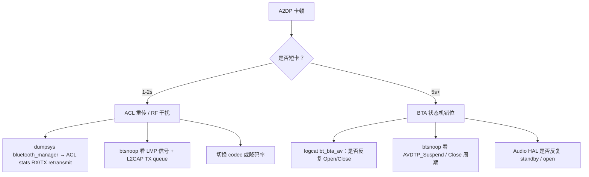

# 06.5 卡顿 / 无声排查手册

> 速通摘要：A2DP 卡顿/无声是车机最高发的"用户投诉"。**90% 能用 4 个步骤定位**：① dumpsys 看连接与 PLAYING 状态、② btsnoop 看 AVDTP 时序与 ACL 重传、③ logcat 看编解码/缓冲水位、④ Audio HAL 看路由。本节按 9 种现象给排查路径。

---

## 1. 学习目标

读完本节，你应该能：

1. 拿到一个 "A2DP 投诉" 立即说出该走哪几条调查路径。
2. 看懂 dumpsys + btsnoop 三层（栈/链路/Audio HAL）的对应关系。
3. 修复 3 种高频问题：codec 协商失败、绝对音量异常、Offload 不出声。

---

## 2. 前置知识

- 已读 06.1 ~ 06.4。
- 已读 01.2（日志体系）。

---

## 3. 9 种现象 → 排查路径

| 现象 | 第一步 |
|------|--------|
| 连不上 | 06.2 连接全链路；先看 `A2dpStateMachine` |
| 连上不出声 | 看 PLAYING 状态 + Audio Route + setActiveDevice |
| 出声但有底噪 | 检查 codec / 采样率匹配 |
| 短卡 1-2 秒一次 | 看 ACL 重传率、RF 干扰 |
| 长卡 5+ 秒 | 看 BTA 状态机错位、`AVDTP_Suspend` 反复 |
| 切歌瞬间无声 | 看 AVRCP 时序、PassThrough 与 Suspend 时序 |
| 音量异常 | 06.4 绝对音量 |
| 切换到通话后回不来 | A2dpService.resume + setActiveDevice |
| 偶发掉线 | ACL 链路质量 + interop |

---

## 4. 排查路径 A：连不上

```
1) dumpsys 找 A2dpStateMachine：是 Disconnected / Connecting / Connected？
2) 卡 Connecting → 看 logcat bt_btif_av / bt_bta_av：哪一步失败？
3) 卡在 SET_CONFIG → codec 协商问题，看 a2dp_codec_config.cc 报错
4) BTSnoop 看 AVDTP_Discover / Get_Capabilities 是否被 reject
5) ACL 是否真的连着：dumpsys 看 ACL Stats
```

---

## 5. 排查路径 B：连上不出声

```
1) dumpsys → A2DP PLAYING ?
   - NOT_PLAYING：去看 AVDTP_Start 时序
   - PLAYING 但没声：去 Audio Route 路径
2) 看 ActiveDevice：
   adb shell dumpsys bluetooth_manager | grep "Active A2DP device"
   - 如果不是当前手机，说明多手机场景选错；调 setActiveDevice
3) 看 Audio HAL：
   adb shell dumpsys audio | grep -iE "blueto|a2dp"
   - Audio Policy 是否路由 STREAM_MUSIC 到 bluetooth_a2dp_output
4) Offload 路径：
   - getprop persist.bluetooth.a2dp_offload.disabled
   - 临时关 Offload 切软件，看是否出声 → 判断是 Offload 链断了还是栈错了
```

---

## 6. 排查路径 C：卡顿（最常见）



**实战经验**：
- 重传率 > 5% 通常意味着 RF 环境差或天线问题。
- 切到 SBC 一般能减卡顿（编码简单、抗丢包好），但音质变差。
- 关 Offload 让主 CPU 做软件编码可定位"Offload DSP 是否故障"。

---

## 7. 排查路径 D：切歌瞬间无声

通常是 AVRCP PassThrough 与 AVDTP_Suspend 时序不齐：
```
1) 看 btsnoop 顺序：
   - PassThrough KEY_NEXT (pressed)
   - PassThrough KEY_NEXT (released)
   - 对端 Suspend → Open → Start
2) 若 Start 没在 200ms 内回 → 检查对端播放器实现
3) 若车机 HMI 在 KEY 之后又发了一遍 Pause → 时序错
```

---

## 8. 排查路径 E：偶发掉线

通常根因：
1. **对端策略**（iPhone 长时间静音会断 A2DP）—— interop_database.conf 可调。
2. **ACL Supervision Timeout**（RF 弱 → 链路超时断）。
3. **Audio Focus 抢占**（车机播放本地音乐会暂停蓝牙 A2DP，进而对端断开）。

`dumpsys audio` + `dumpsys bluetooth_manager` 同步看 timestamp。

---

## 9. 常用工具表

| 工具 | 何时用 |
|------|-------|
| `dumpsys bluetooth_manager` | 状态、Active device、PLAYING、Bond |
| `dumpsys audio` | Audio Route、Stream volume |
| `dumpsys media.audio_flinger` | Mixer、Output thread |
| `dumpsys media.audio_policy` | Audio policy routing |
| btsnoop_hci.log + Wireshark | AVDTP / ACL / L2CAP / AVRCP |
| `logcat -s BluetoothA2dpService bt_btif_av bt_bta_av bt_a2dp bt_avdt` | 栈侧时序 |
| `logcat -s AudioPolicyManager AudioFlinger BluetoothHidleHandler` | Audio 路由 |

---

## 10. 三个高频 Bug 修法

### 10.1 Codec 协商失败 → 切到 SBC 还不行
- 临时：
  ```bash
  adb shell setprop persist.bluetooth.a2dp_aac.disabled true
  adb shell svc bluetooth disable && enable
  ```
- 永久：`Config.java` Profile 配置 + `a2dp_codec_config.cc` 默认优先级。

### 10.2 Offload 不出声但 Software 可以
- 看 Audio HAL log。
- 检查 `system/audio_hal_interface/a2dp_encoding.cc` 与 HAL AIDL 协商是否成功。
- 验证芯片 vendor 库版本（OEM 提供）。

### 10.3 通话结束后 A2DP 不恢复
- 看 `A2dpService.setActiveDevice` 是否调用。
- 看 `HeadsetClientService` 通话结束时是否发了 `AUDIO_STATE_DISCONNECTED`。
- 检查 `AvrcpVolumeManager` 是否覆盖了音量到 0。

---

## 11. 简化代码片段：定位 Active Device 的 dumpsys 解析

```bash
adb shell dumpsys bluetooth_manager | awk '
  /A2dpService/{flag=1}
  /Active A2DP device/{print; flag=0}
  flag && /Connected:/{print}
'
```

---

## 12. FAQ

**Q1：卡顿能不能定位到是手机还是车机的问题？**
A：抓双端 btsnoop 对照；看是哪一端先发 `Suspend` 或 `Close`。Source 端发 Suspend = Source 主动；Sink 端发 Close = Sink 出错。

**Q2：A2DP 和 Wi-Fi 共存有什么坑？**
A：2.4 GHz Wi-Fi 占用宽带会推 BT 重传。建议 Wi-Fi 用 5 GHz 或关 Wi-Fi 排除。

**Q3：能不能不重启蓝牙就切 codec？**
A：必须断流（详 06.2 Q2）。所以 HMI 不能"边播边切"。

**Q4：日志里看到 `disconnected_for_other` 是什么？**
A：栈侧"被别的事件挤掉"的统称（如 SCO 抢资源）。下一步看 `bt_btif_hf` 是否同步在建立 SCO。

**Q5：抓 BTSnoop 影响性能吗？**
A：full 模式会写盘频繁，对高码率（LDAC 990 kbps）有 1-2% CPU 开销。生产环境用 filtered。

---

## 13. 上路任务

### 任务 A：写一个排查脚本
照本节 §4-§7，把"卡顿排查 5 步"做成 shell 脚本，输出 `/tmp/a2dp_diag/` 目录包含 dumpsys/logcat/btsnoop/Audio dump。

### 任务 B：故意制造一个卡顿
在测试机上把蓝牙天线包一层金属箔（模拟干扰），播音乐看 dumpsys 重传率从 0% 飙到 ?%。

### 任务 C：复盘
把你过去遇到过的一个 A2DP 投诉，用本节方法重新走一遍。如果原修复方案不对，写一段"换我再来一次"的复盘。

---

## 14. 本节小结（速记卡）

```
排查四步：
  ① dumpsys bluetooth_manager（栈侧状态）
  ② dumpsys audio（Audio Route）
  ③ btsnoop_hci.log（HCI/AVDTP/L2CAP）
  ④ logcat bt_btif_av / bt_bta_av / bt_a2dp / bt_avdt
高频根因：
  - Active device 选错
  - codec 协商失败
  - Offload 链路异常
  - ACL 重传 / 干扰
  - 通话与音乐互抢
临时切换：
  - 关 Offload：setprop persist.bluetooth.a2dp_offload.disabled true
  - 关 AAC：setprop persist.bluetooth.a2dp_aac.disabled true
```

至此 06 章 A2DP & AVRCP 全部完成。下一站：**07 HFP / HFP Client**。
