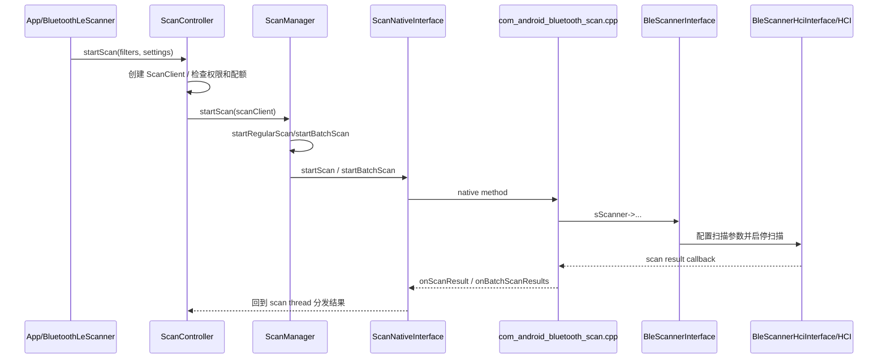
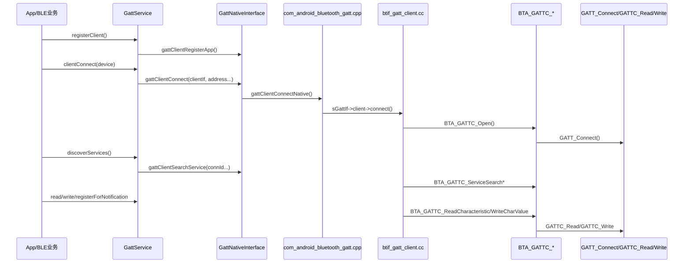
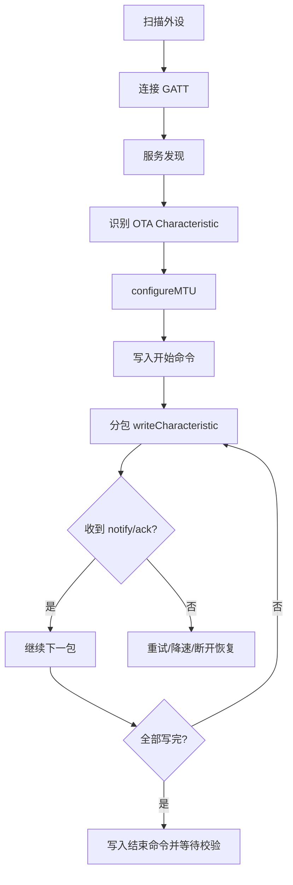

# 07. BLE/GATT 与 AIoT：扫描、连接、读写、通知与 OTA

## 1. 学习目标

车机里的 BLE/GATT 通常不负责大带宽音频，而负责“发现设备、建立短连接、读写少量数据、订阅状态变化”。典型场景包括胎压传感器、香氛、空气净化器、座舱传感器、钥匙类设备、低功耗配件、AIoT 外设配置和小包 OTA。

读完本章后，你应该能追踪：

- BLE 扫描链路：`ScanController` -> `ScanManager` -> `ScanNativeInterface` -> JNI -> BLE scanner/HCI。
- GATT Client 链路：注册 app -> 连接 -> 服务发现 -> 读写 characteristic -> notification/indication -> MTU。
- `clientIf`、`connId`、`handle`、service、characteristic、descriptor、CCCD 的作用。
- 车载 AIoT 和 OTA 问题如何从 Java API 一路定位到 Native 协议栈。

## 2. 车载 BLE/AIoT 场景

| 场景 | BLE 角色 | 关键动作 | 常见问题 |
| --- | --- | --- | --- |
| 胎压/传感器 | 车机做 Scanner/GATT Client | 扫描广播、连接、订阅 notify | 扫不到、数据延迟、断连 |
| 香氛/净化器 | 车机做 GATT Client | 写控制命令、读状态 | 写失败、状态不同步 |
| 低功耗钥匙 | 车机参与扫描/连接/认证 | 广播识别、连接认证、距离/状态辅助 | 扫描过滤、隐私地址、连接慢 |
| 外设 OTA | 车机做 GATT Client | 协商 MTU、分包写入、订阅进度 | MTU 不生效、写入 busy、丢包 |

本仓库主要覆盖 Android 蓝牙侧实现。具体外设协议、厂商认证和上层业务 App 往往在仓库外，本章只讲当前源码可确认的蓝牙链路。

## 3. BLE 扫描链路总图



## 4. Scan Java 层入口

扫描入口集中在 `android/app/src/com/android/bluetooth/le_scan/ScanController.java`。

```java
// android/app/src/com/android/bluetooth/le_scan/ScanController.java
1271 void startScan(
1309     startScan(scannerId, settings, filters, scanClient);
1336 private void startScan(
1357     mScanManager.startScan(scanClient);
1480 public void stopScan(int scannerId) {
1490     mScanManager.stopScan(scannerId);
```

`ScanController` 更像策略层：它接收 binder/API 请求，创建 `ScanClient`，维护 scanner id、PendingIntent scan、队列和权限相关状态。真正决定普通扫描、批量扫描、硬件过滤等执行路径的是 `ScanManager`。

```java
// android/app/src/com/android/bluetooth/le_scan/ScanManager.java
405 void startScan(ScanClient client) {
414 void stopScan(int scannerId) {
1325 private void startRegularScan(ScanClient client) {
1340     Log.d(TAG, "start scanNative from startRegularScan()");
1355 private void startBatchScan(ScanClient client) {
1397     mNativeInterface.startBatchScan(
```

阅读扫描问题时，可以先看 `ScanController` 是否收到请求，再看 `ScanManager` 是否进入 `startRegularScan()` 或 `startBatchScan()`。如果 Java 层已经进入 native 调用，但无结果，问题通常要继续往 JNI、controller 能力、HCI event 或过滤条件排查。

## 5. Scan JNI 与 Native Scanner

Java 到 JNI 的桥在 `ScanNativeInterface` 和 `com_android_bluetooth_scan.cpp`。

```java
// android/app/src/com/android/bluetooth/le_scan/ScanNativeInterface.java
25 public class ScanNativeInterface {
114     /** Register BLE scanner */
120     void unregisterScanner(int scannerId) {
121         unregisterScannerNative(scannerId);
293     void onScannerRegistered(int status, int scannerId, long uuidLsb, long uuidMsb) {
327     void onBatchScanReports(
373     void onScanParamSetupCompleted(int status, int scannerId) {
```

```cpp
// android/app/jni/com_android_bluetooth_scan.cpp
352   sScanner->RegisterScanner(uuid, base::Bind(&btgattc_register_scanner_cb, uuid));
360   sScanner->Unregister(scanner_id);
866   sScanner = bluetooth::shim::get_ble_scanner_instance();
932 static int register_com_android_bluetooth_scan_(JNIEnv* env) {
964           env, "com/android/bluetooth/le_scan/ScanNativeInterface", methods);
992   GET_JAVA_METHODS(env, "com/android/bluetooth/le_scan/ScanNativeInterface", javaMethods);
```

Native scanner 实例来自 BTIF shim：

```cpp
// system/btif/src/btif_ble_scanner.cc
24 BleScannerInterface* get_ble_scanner_instance() {
25   return bluetooth::shim::get_ble_scanner_instance();
```

再往下进入 BTM/HCI 扫描实现：

```cpp
// system/stack/btm/btm_ble_scanner.cc
112 void BleScanningManager::Initialize(BleScannerHciInterface* interface) {
130   BleScannerHciInterface::Initialize();
132     BleScanningManager::Initialize(BleScannerHciInterface::Get());

// system/stack/btm/ble_scanner_hci_interface.cc
293 void BleScannerHciInterface::Initialize() {
```

如果日志显示 `onScannerRegistered` 成功，但没有 scan result，要重点检查：

- 扫描过滤条件是否过窄。
- 外设是否使用随机地址或周期广播。
- controller 是否支持需要的 offloaded filter/batch 能力。
- 是否被系统扫描节流、权限、后台限制影响。
- HCI snoop 中是否能看到 advertising report。

## 6. GATT Client 主链路



## 7. GattService：注册、连接、发现、读写

`GattService` 是 GATT Client Java 侧的主入口。

```java
// android/app/src/com/android/bluetooth/gatt/GattService.java
941     void registerClient(
948             Log.w(TAG, "registerClient() - failed due to too many clients");
999     void clientConnect(
1011            Log.w(TAG, "clientConnect(" + callback + ") - App not registered");
1184    void discoverServices(IBluetoothGattCallback callback, BluetoothDevice device) {
1193        Log.d(TAG, "discoverServices() - device=" + device + ", connId=" + connId);
1219    void readCharacteristic(
1235            Log.e(TAG, "readCharacteristic(" + device + ") - No connection");
1272    int writeCharacteristic(
1296        Log.d(TAG, "writeCharacteristic() - trying to acquire permit.");
1307                Log.d(TAG, "writeCharacteristic() - no permit available.");
```

这里有几个定位问题很关键的对象：

| 名称 | 来源 | 含义 |
| --- | --- | --- |
| `clientIf` | GATT app 注册后分配 | 标识某个 GATT Client 应用 |
| `connId` | 连接建立后分配 | 标识一次 GATT 连接 |
| `handle` | 服务发现结果中得到 | ATT 属性句柄，读写 characteristic/descriptor 时使用 |
| `service/characteristic/descriptor UUID` | 外设 GATT 数据库 | 上层业务协议识别字段 |
| CCCD | descriptor，通常 UUID 为 0x2902 | 控制 notification/indication 是否打开 |

`writeCharacteristic()` 里出现 permit 相关日志，说明写操作存在串行化/并发保护。OTA 分包写时如果上层发包过快，很容易在这里或更底层表现为 busy、写失败或回调延迟。

## 8. GattNativeInterface 与 JNI 注册表

Java NativeInterface 把 `GattService` 的动作收敛成 native 方法。

```java
// android/app/src/com/android/bluetooth/gatt/GattNativeInterface.java
381    void gattClientRegisterApp(long appUuidLsb, long appUuidMsb, String name, boolean eattSupport) {
382        gattClientRegisterAppNative(appUuidLsb, appUuidMsb, name, eattSupport);
395    void gattClientConnect(
405        gattClientConnectNative(
439    void gattClientSearchService(
441        gattClientSearchServiceNative(connId, searchAll, serviceUuidLsb, serviceUuidMsb);
450    void gattClientReadCharacteristic(int connId, int handle, int authReq) {
451        gattClientReadCharacteristicNative(connId, handle, authReq);
467    void gattClientWriteCharacteristic(
469        gattClientWriteCharacteristicNative(connId, handle, writeType, authReq, value);
483    void gattClientRegisterForNotifications(
485        gattClientRegisterForNotificationsNative(clientIf, device.getAddress(), handle, enable);
494    void gattClientConfigureMTU(int connId, int mtu) {
495        gattClientConfigureMTUNative(connId, mtu);
```

JNI 里可以看到 native 方法和 Java 方法名的绑定：

```cpp
// android/app/jni/com_android_bluetooth_gatt.cpp
1070 static void gattClientConnectNative(JNIEnv* env, jobject /* object */, jint clientif,
1132 static void gattClientSearchServiceNative(JNIEnv* /* env */, jobject /* object */, jint conn_id,
1154 static void gattClientReadCharacteristicNative(JNIEnv* /* env */, jobject /* object */,
1184 static void gattClientWriteCharacteristicNative(JNIEnv* env, jobject /* object */, jint conn_id,
1239 static void gattClientRegisterForNotificationsNative(JNIEnv* env, jobject /* object */,
1263 static void gattClientConfigureMTUNative(JNIEnv* /* env */, jobject /* object */, jint conn_id,
2007 static int register_com_android_bluetooth_gatt_(JNIEnv* env) {
2016          {"gattClientConnectNative", "(ILjava/lang/String;IZIZIIZ)V",
2024          {"gattClientSearchServiceNative", "(IZJJ)V", (void*)gattClientSearchServiceNative},
2027          {"gattClientReadCharacteristicNative", "(III)V",
2032          {"gattClientWriteCharacteristicNative", "(IIII[B)V",
2036          {"gattClientRegisterForNotificationsNative", "(ILjava/lang/String;IZ)V",
2040          {"gattClientConfigureMTUNative", "(II)V", (void*)gattClientConfigureMTUNative},
2115  GET_JAVA_METHODS(env, "com/android/bluetooth/gatt/GattNativeInterface", javaMethods);
```

这一段是排查“Java 调了但 Native 没动”的第一检查点：方法签名、注册类名、JNI 初始化、`sGattIf` 是否为空。

## 9. BTIF、BTA 与 Stack

BTIF GATT Client 是 Java/JNI 到 BTA 的桥。

```cpp
// system/btif/src/btif_gatt_client.cc
327 void btif_gattc_open_impl(int client_if, RawAddress address, tBLE_ADDR_TYPE addr_type,
373   BTA_GATTC_Open(client_if, address, addr_type, type, transport, opportunistic, initiating_phys,
377 static bt_status_t btif_gattc_open(int client_if, const RawAddress& bd_addr, uint8_t addr_type,
415             Bind(&BTA_GATTC_ServiceSearchRequest, static_cast<tCONN_ID>(conn_id), *filter_uuid));
418             Bind(&BTA_GATTC_ServiceSearchAllRequest, static_cast<tCONN_ID>(conn_id)));
444   return do_in_jni_thread(Bind(&BTA_GATTC_ReadCharacteristic, static_cast<tCONN_ID>(conn_id),
516   return do_in_jni_thread(Bind(&BTA_GATTC_WriteCharValue, static_cast<tCONN_ID>(conn_id), handle,
857 const btgatt_client_interface_t btgattClientInterface = {
860         btif_gattc_open,
```

BTA 层把动作包装成 GATT Client API：

```cpp
// system/bta/gatt/bta_gattc_api.cc
135 void BTA_GATTC_Open(tGATT_IF client_if, const RawAddress& remote_bda, tBLE_ADDR_TYPE addr_type,
204 void BTA_GATTC_Close(tCONN_ID conn_id) {
256 void BTA_GATTC_ServiceSearchRequest(tCONN_ID conn_id, Uuid p_srvc_uuid) {
366 void BTA_GATTC_ReadCharacteristic(tCONN_ID conn_id, uint16_t handle, tGATT_AUTH_REQ auth_req,
478 void BTA_GATTC_WriteCharValue(tCONN_ID conn_id, uint16_t handle, tGATT_WRITE_TYPE write_type,
```

Stack 层再落到通用 GATT 操作：

```cpp
// system/stack/gatt/gatt_api.cc
956  tGATT_STATUS GATTC_Read(tCONN_ID conn_id, tGATT_READ_TYPE type, tGATT_READ_PARAM* p_read) {
1063 tGATT_STATUS GATTC_Write(tCONN_ID conn_id, tGATT_WRITE_TYPE type, tGATT_VALUE* p_write) {
1415 bool GATT_Connect(tGATT_IF gatt_if, const RawAddress& bd_addr, tBLE_ADDR_TYPE addr_type,
1506   return GATT_Connect(gatt_if, bd_addr, BLE_ADDR_PUBLIC, connection_type, transport, opportunistic,
```

从故障定位角度看：

- 连接失败：看 `clientConnect()`、`gattClientConnectNative()`、`btif_gattc_open()`、`BTA_GATTC_Open()`、`GATT_Connect()`。
- 服务发现失败：看 `discoverServices()`、`gattClientSearchServiceNative()`、`BTA_GATTC_ServiceSearch*()`。
- 读写失败：看 `readCharacteristic()`/`writeCharacteristic()` 的 `connId`、`handle`、`authReq`、`writeType`，再看 `GATTC_Read()`/`GATTC_Write()` 返回状态。

## 10. OTA 分包写入思路

BLE OTA 通常不是 Android 蓝牙栈直接定义完整协议，而是上层业务基于外设 GATT 服务实现。蓝牙栈负责：

1. 扫描并找到目标外设。
2. 建立 GATT 连接。
3. 发现 OTA service/characteristic。
4. 可选：协商 MTU。
5. 分包写入 firmware chunk。
6. 订阅 notify/indicate 获取进度、校验或重启状态。



OTA 最容易踩的点：

- MTU 协商成功不等于业务分包长度自动变大，上层仍要按协商结果切包。
- `WRITE_TYPE_NO_RESPONSE` 吞吐高，但需要业务层自己做节流、ack 或重传。
- `WRITE_TYPE_DEFAULT` 有响应，但速度慢，适合命令和关键状态。
- Notification 依赖 CCCD 写入成功，不能只调用 registerForNotification 就假设外设已经打开上报。

## 11. 排查矩阵

| 现象 | 优先观察 | 关键源码入口 | 常见原因 |
| --- | --- | --- | --- |
| 扫不到设备 | 是否进入 `startScan()`，HCI 是否有 advertising report | `ScanController.startScan()`、`ScanManager.startRegularScan()`、`com_android_bluetooth_scan.cpp` | 过滤条件错误、权限/后台限制、外设未广播、地址类型变化 |
| 注册 scanner 失败 | `onScannerRegistered(status, scannerId...)` | `ScanNativeInterface.onScannerRegistered()` | scanner 数量限制、native 初始化异常 |
| GATT 连接失败 | `clientIf` 是否有效，是否进入 `BTA_GATTC_Open()` | `GattService.clientConnect()`、`btif_gattc_open()` | 地址类型错误、外设不可连接、超时、隐私地址变化 |
| 服务发现为空 | `connId` 是否有效，是否发起 search all | `discoverServices()`、`BTA_GATTC_ServiceSearch*()` | 外设服务表未准备、连接已断、UUID 过滤错误 |
| 读 characteristic 失败 | `handle`、`authReq`、返回 status | `readCharacteristic()`、`GATTC_Read()` | handle 错误、需要加密/配对、权限不足 |
| 写 characteristic busy | permit、writeType、分包节奏 | `writeCharacteristic()`、`GATTC_Write()` | 上层发包过快、未等回调、链路拥塞 |
| notify 收不到 | CCCD 是否写成功，callback 是否注册 | `gattClientRegisterForNotifications()` | 未写 CCCD、descriptor handle 错、外设未上报 |
| OTA 中断 | MTU、写入节奏、ack/notify | `configureMTU()`、`writeCharacteristic()` | 分包过大、无重传、外设 buffer 小、连接参数不合适 |

## 12. 建议练习

1. 从 `GattService.clientConnect()` 开始，沿源码标出 `gattClientConnectNative()`、`btif_gattc_open()`、`BTA_GATTC_Open()`、`GATT_Connect()`。
2. 找一个 `writeCharacteristic()` 日志，确认它使用的 `connId`、`handle`、`writeType` 和业务层 characteristic UUID 是否匹配。
3. 对比普通扫描和 batch scan：分别从 `ScanManager.startRegularScan()` 与 `startBatchScan()` 往 JNI 查。
4. 设计一个 OTA 分包策略：MTU 为 247、每包 payload 244 字节时，如何等待 ack、如何超时重试、如何恢复断点。

