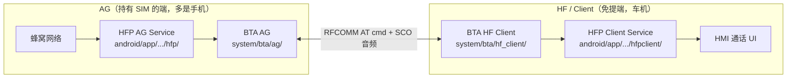
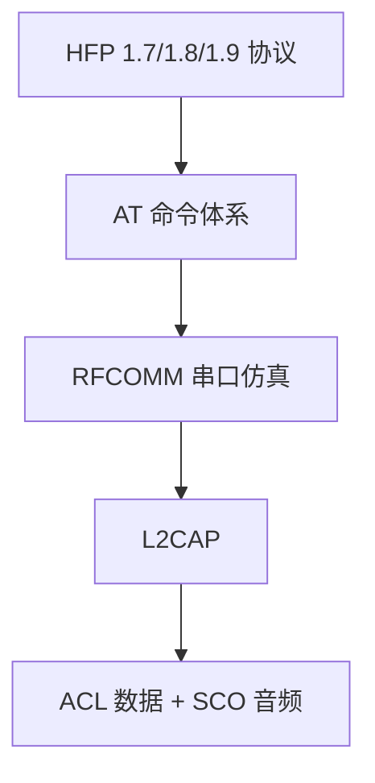

# 07.1 HFP 角色：AG vs HF / Client

> 速通摘要：HFP（Hands-Free Profile）= **蓝牙免提通话**。**两个角色**：**Audio Gateway (AG)** 是音频网关（持有 SIM 的端，通常是手机）；**Hands-Free (HF)** / Android 叫 **Client** 是免提端（通常是车机）。两端通过 **RFCOMM 通道 + AT 命令**协商，通话音频走 **SCO 链路**（独立于 ACL）。

源码：
- AG（手机角色）：`android/app/src/com/android/bluetooth/hfp/`、`system/bta/ag/`
- Client（车机角色）：`android/app/src/com/android/bluetooth/hfpclient/`、`system/bta/hf_client/`

---

## 1. 学习目标

读完本节，你应该能：

1. 区分 AG / HF / Client 三个名词（Client = HF 的 Android 命名）。
2. 列出本仓中 HFP AG 与 HFP Client 各自的 Java/Native 文件。
3. 看懂 HFP 协议栈 5 层（HFP / AT / RFCOMM / L2CAP / ACL+SCO）。
4. 知道为什么车机做 Client 是常态。

---

## 2. 前置知识

- 已读 00.3（术语速查）。
- 知道 RFCOMM = 在 L2CAP 上模拟串口（详 05.8 章）。

---

## 3. 场景故事：有人打你电话

```
[手机] 来电 → AG 端发 AT 命令 "+RING" / "+CIEV:call,1" 通过 RFCOMM 给车机
                ↓
[车机] HF Client 收到 → HFP State Machine → 通知 HMI → 来电显示
                ↓
[车机] HMI 接听 → HF Client 发 "ATA"
                ↓
双方建立 SCO 链路（HCI Set_SCO_Connection / 等价 cmd）
                ↓
通话音频 = CVSD（窄带）或 mSBC（宽带）通过 SCO
                ↓
通话结束 → AT "+CHUP" / "+CIEV:call,0"
                ↓
SCO 释放
```

---

## 4. AG vs HF 一图



| 维度 | AG | HF / Client |
|------|----|--------------|
| 谁拥有 SIM | 是 | 否 |
| 谁发 RING | 是 | 否 |
| 谁发 ATA / AT+CHUP | 否 | 是 |
| 谁建 SCO（mostly） | 是 | 触发 |
| 车机典型 | 否 | **是** |
| Java Service | `HeadsetService` | `HeadsetClientService` |
| BTA | `bta_ag_*` | `bta_hf_client_*` |
| BluetoothProfile 编号 | `HEADSET = 1` | `HEADSET_CLIENT = 16` |

---

## 5. 协议栈 5 层



- **HFP 协议层**：定义"语义"——通话状态、音量调整、通话保持等。
- **AT 命令层**：传输形式——`AT+CIND?` / `+CIEV: 2,1` / `+RING` 等。
- **RFCOMM**：底层串口仿真（详 05.8）。
- **L2CAP**：通道复用（详 05.6）。
- **ACL + SCO**：物理承载。

**关键事实**：HFP 同时占用 **ACL（AT 命令）+ SCO（音频）** 两条物理链路。

---

## 6. HFP 版本演进

| 版本 | 关键能力 |
|------|---------|
| 1.5 | 基础免提 |
| 1.6 | **mSBC 宽带语音**（16 kHz 取代窄带 CVSD 8 kHz） |
| 1.7 | 增强电话簿、SWB（Super Wideband） |
| 1.8 | 增强语音识别（eVoice）、远端音量同步 |
| 1.9 | aptX SWB voice、LC3 voice 等可选 codec |

车机声明 1.7+ 是基线；mSBC 是用户感知最大的能力点（通话不糊）。

---

## 7. AT 命令体系简介

AT 命令是"ASCII 文本"通过 RFCOMM 双向传输。一些常见的：

| 命令 | 方向 | 含义 |
|------|------|------|
| `AT+BRSF=<feat>` | HF→AG | 双方支持特性协商 |
| `+BRSF: <feat>` | AG→HF | AG 自报支持 |
| `AT+CIND=?` / `AT+CIND?` | HF→AG | 查询/获取状态指示符（电池、信号、通话状态） |
| `+CIND: ...` | AG→HF | 返回指示符 |
| `+CIEV: <idx>,<val>` | AG→HF unsolicited | 指示符值变化 |
| `+RING` | AG→HF | 来电铃 |
| `+CLIP: ...` | AG→HF | 来电号码 |
| `ATA` | HF→AG | 接听 |
| `AT+CHUP` | HF→AG | 挂断 |
| `AT+CHLD=<n>` | HF→AG | 通话控制（保持/切换） |
| `+VGS=<n>` | 双向 | 扬声器音量 0..15 |
| `+VGM=<n>` | 双向 | 麦克风音量 0..15 |
| `AT+BCS=<codec>` | HF→AG | codec 选择 |

完整列表见 HFP Spec 与 `system/bta/ag/bta_ag_cmd.cc` / `system/bta/hf_client/bta_hf_client_at.cc`。

---

## 8. 关键源码速查

### AG 侧（手机角色，本仓车机一般不主用）
| 文件 | 角色 |
|------|------|
| `HeadsetService.java` | Service |
| `HeadsetStateMachine.java` | per-device 状态机 |
| `HeadsetNativeInterface.java` | JNI Java 端 |
| `HeadsetSystemInterface.java` | 系统电话能力对接 |
| `HeadsetPhoneState.java` | 电话状态映射 |
| `AtPhonebook.java` | AT+CPBR 电话簿支持 |
| `system/bta/ag/bta_ag_main.cc` | BTA 状态机 |
| `system/bta/ag/bta_ag_at.cc` | AT 命令解析 |
| `system/bta/ag/bta_ag_cmd.cc` | AT 命令处理 |
| `system/bta/ag/bta_ag_sco.cc` | SCO |
| `system/bta/ag/bta_ag_swb_aptx.cc` | aptX SWB voice |
| `android/app/jni/com_android_bluetooth_hfp.cpp` | JNI C |

### Client 侧（HF，车机主用）
| 文件 | 角色 |
|------|------|
| `HeadsetClientService.java` | Service |
| `HeadsetClientStateMachine.java` | per-device 状态机 |
| `HeadsetClientNativeInterface.java` | JNI Java 端 |
| `HfpClientCall.java` | 通话对象 |
| `HfpClientConnection.java` | telecom Connection |
| `HfpClientConference.java` | 三方通话 |
| `HfpClientConnectionService.java` | Android Telecom 框架接入 |
| `HfpClientDeviceBlock.java` | per-device 状态 |
| `VendorCommandResponseProcessor.java` | 车厂私有 AT 命令 |
| `system/bta/hf_client/bta_hf_client_main.cc` | BTA 状态机 |
| `system/bta/hf_client/bta_hf_client_at.cc` | AT 命令解析 |
| `system/bta/hf_client/bta_hf_client_sco.cc` | SCO |
| `android/app/jni/com_android_bluetooth_hfpclient.cpp` | JNI C |

---

## 9. `HfpClientConnectionService`：Telecom 框架的接入点

车机 HMI 不直接调 `HeadsetClientService`，而是通过 Android **Telecom** 框架（`android.telecom.*`）拿到一个抽象的"通话"——这个通话由 `HfpClientConnectionService` 提供给 Telecom。


这样的好处：车机 HMI 用统一 Telecom API，背后是 HFP 还是 SIM 通话对它透明。

---

## 10. 调试方法

| 想看 | 方法 |
|------|------|
| HFP 连接状态 | `dumpsys bluetooth_manager` → `HeadsetClientService` 段 |
| 通话状态 | `dumpsys telecom` |
| AT 命令时序 | `logcat -s bt_btif_hf_client bt_bta_hf_client BluetoothHeadsetClientStateMachine` |
| BTSnoop 看 RFCOMM | 过滤 `btrfcomm.frame_type == 0xEF`（UIH） |
| 看 mSBC / CVSD 选了哪个 | logcat 搜 `BCS` 或 `Selected codec` |

---

## 11. FAQ

**Q1：车机是 AG 还是 HF？**
A：99% 车机做 **HF / Client**——免提端。少数手机互联场景车机做 AG（很少）。

**Q2：HEADSET 和 HFP 是不是一回事？**
A：HEADSET = "headset profile（HSP）" 旧的简化版；HFP 是它的升级。AOSP 把两者合并成 `HEADSET` Profile 一起处理，本仓主要是 HFP 1.7+。

**Q3：HFP 连上但没声音？**
A：通常是 **SCO 没建**。详 07.3。

**Q4：通话时不显示来电号码？**
A：`+CLIP` 是 unsolicited，需要 HF 先 `AT+CLIP=1` 启用。看 logcat 是否发了。

**Q5：通话期间 A2DP 卡？**
A：详 06.5 + 07.5。SCO 抢射频，A2DP 被栈侧 Suspend 是正常的。

---

## 12. 上路任务

### 任务 A：识别 Profile
```bash
adb shell dumpsys bluetooth_manager | grep -A 5 -E "HeadsetClient|Headset Service"
```
你的车机是 HF 还是 AG？

### 任务 B：抓一次 AT 时序
做一次"来电+接听+挂断"，logcat 看 `bt_bta_hf_client`，记下 RING/ATA/+CHUP 三条关键命令。

### 任务 C：阅读 HfpClientConnectionService
打开 `android/app/src/com/android/bluetooth/hfpclient/HfpClientConnectionService.java`，找它如何把 HFP 通话映射到 Telecom Connection。

---

## 13. 本节小结（速记卡）

```
HFP = 蓝牙免提
两端：AG（手机持 SIM）/ HF / Client（车机）
车机典型：HF / Client（HEADSET_CLIENT=16）
协议栈 5 层：HFP / AT / RFCOMM / L2CAP / ACL+SCO
关键命令：BRSF / CIND / CIEV / RING / ATA / CHUP / CHLD / VGS / VGM / BCS
版本：1.6+ 才有 mSBC（宽带）；1.9 开始可选 LC3
关键 Java：HeadsetClientService + HeadsetClientStateMachine
         + HfpClientConnectionService（Telecom 接入）
关键 Native：system/bta/hf_client/ + system/bta/ag/
```
