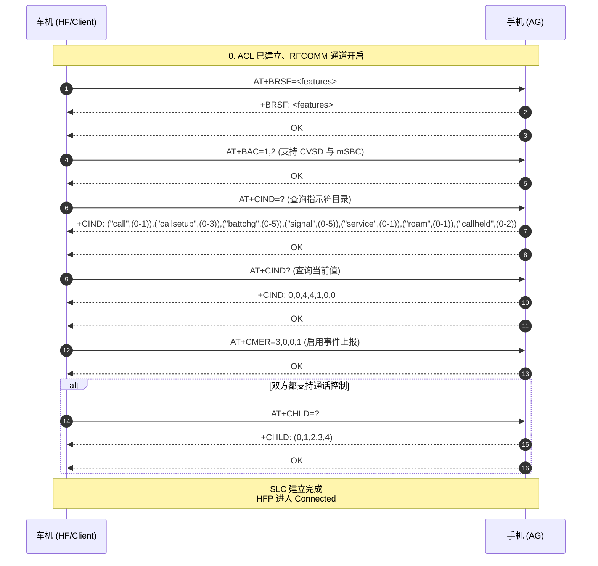
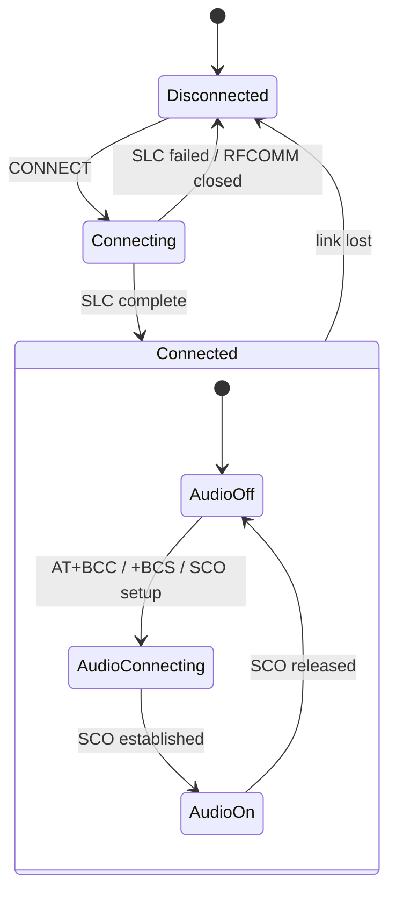

# 07.2 HFP 连接与 AT 命令体系

> 速通摘要：HFP 连接 = **RFCOMM 通道建立 + SLC（Service Level Connection）协商**。SLC 流程靠十几条 AT 命令依次往返：`BRSF`（特性）→ `BAC`（codec 列表）→ `CIND`（指示符列表）→ `CMER`（启用事件上报）→ `CHLD`（通话控制能力）→ 完成。完成后双方都进入"可控制通话"状态。本节按时序拆 AT 命令链。

源码：
- 车机 Client 状态机：`android/app/src/com/android/bluetooth/hfpclient/HeadsetClientStateMachine.java`
- AT 命令处理：`system/bta/hf_client/bta_hf_client_at.cc`、`bta_hf_client_at.h`

---

## 1. 学习目标

读完本节，你应该能：

1. 默写 SLC 建立的 5 步 AT 命令链。
2. 看懂 `CIND` / `CIEV` 指示符的含义与车机最关注的 4 个字段。
3. 排查"HFP 连不上"的常见 3 种 SLC 失败现象。
4. 找出本仓 AT 命令解析与发送的代码入口。

---

## 2. 前置知识

- 已读 07.1。
- 知道 RFCOMM 是 L2CAP 上的串口仿真（详 05.8）。

---

## 3. 场景故事：车机与手机 HFP SLC 协商



---

## 4. SLC 5 步详解

### 4.1 `AT+BRSF` 特性协商
- HF 发自己的 features bitmap。
- AG 回自己的 features bitmap。
- 决定后续行为（如 mSBC 是否启用、ECNR 是否使用）。

车机 HF 常见特性位（参考 `HeadsetClientHalConstants.java`）：
- ECNR（车机做回声/降噪）
- 3-way calling（三方通话）
- CLI Presentation（来电显示）
- Voice Recognition（按方向盘唤醒 Siri / Bixby / Voice Assistant）
- Remote volume control
- Codec Negotiation（mSBC 等）

### 4.2 `AT+BAC` 可用 codec 列表
- 仅当 HFP 1.6+ + 双方都支持 codec negotiation 才有。
- 车机声明 `1, 2` 表示 CVSD + mSBC。
- 1.9 引入 `3` (aptX SWB) 等。

### 4.3 `AT+CIND=?` 与 `AT+CIND?`
**CIND 指示符**是 AG 端的"状态变量列表"，车机最关注：

| 指示符 | 含义 | 取值 |
|--------|------|------|
| `call` | 当前是否有"已建立"通话 | 0=无, 1=有 |
| `callsetup` | 正在 setup 的通话 | 0=无, 1=来电, 2=去电拨号中, 3=去电对方响铃中 |
| `callheld` | 通话保持状态 | 0=无, 1=保持+激活, 2=只有保持 |
| `signal` | 信号强度 | 0..5 |
| `battchg` | 电池电量 | 0..5 |
| `service` | 是否有蜂窝服务 | 0/1 |
| `roam` | 漫游 | 0/1 |

### 4.4 `AT+CMER=3,0,0,1`
让 AG 启用 `+CIEV` unsolicited 上报：以后状态变化都会主动发 `+CIEV: <idx>,<val>` 给 HF。

### 4.5 `AT+CHLD=?`
查 AG 支持哪些通话控制（保持/恢复/合并三方等）。

---

## 5. 完整 AT 命令分类

| 类别 | 命令 |
|------|------|
| **能力协商** | `BRSF`、`BAC`、`BIND`、`CHLD` |
| **状态查询** | `CIND` (= ? / ?)、`CLCC`、`CNUM`、`COPS` |
| **通话操作** | `ATA`、`AT+CHUP`、`AT+CHLD=<n>`、`ATD<n>` |
| **通话事件** | `+RING`、`+CLIP`、`+CCWA`、`+CIEV` |
| **音量/codec** | `+VGS`、`+VGM`、`+BCS` / `AT+BCC` |
| **语音识别** | `AT+BVRA=<n>` |
| **电话簿** | `AT+CPBR` |
| **错误响应** | `+CME ERROR: <code>` |

---

## 6. 关键源码点

| 文件 | 角色 |
|------|------|
| `system/bta/hf_client/bta_hf_client_at.cc` | HF 端解析 AT 响应、构造 AT 命令 |
| `system/bta/hf_client/bta_hf_client_main.cc` | HF 状态机 |
| `system/bta/hf_client/bta_hf_client_rfc.cc` | RFCOMM 通道管理 |
| `system/bta/hf_client/bta_hf_client_sdp.cc` | SDP 服务记录 |
| `system/bta/ag/bta_ag_at.cc` | AG 端解析 AT 命令、构造响应 |
| `system/bta/ag/bta_ag_cmd.cc` | AG AT 命令业务处理 |
| `android/app/src/com/android/bluetooth/hfpclient/HeadsetClientStateMachine.java` | Java 状态机 |
| `android/app/src/com/android/bluetooth/hfp/HeadsetStateMachine.java` | Java AG 状态机 |
| `android/app/src/com/android/bluetooth/hfp/AtPhonebook.java` | PBAP-as-AT 电话簿支持 |
| `android/app/src/com/android/bluetooth/hfpclient/VendorCommandResponseProcessor.java` | 车厂私有 AT |

---

## 7. `HeadsetClientStateMachine` 状态



车机做 HF 时，"通话音频开关"对应内嵌的 AudioOn/AudioOff 子状态机。

---

## 8. 简化代码片段：构造 AT 命令

```cpp
// system/bta/hf_client/bta_hf_client_at.cc 思路图
void bta_hf_client_send_at_cmd(tBTA_HF_CLIENT_CB* client_cb,
                               tBTA_HF_CLIENT_AT_CMD cmd,
                               const char* p_arg) {
    char buf[BTA_HF_CLIENT_AT_MAX_LEN];
    // 拼出 "AT+CIND?\r" 之类
    int len = snprintf(buf, sizeof(buf), "%s%s\r", cmd_string, p_arg ?: "");
    bta_hf_client_send_at(client_cb, buf, len);    // → RFCOMM
}
```

接到 AG 响应（如 `+CIND: 0,0,4,4,1,0,0\r\nOK\r\n`），`bta_hf_client_at_parse_*` 解析后投递事件给状态机。

---

## 9. AG 端的 AT 解析

`system/bta/ag/bta_ag_at.cc` 是 AG 端的"AT 命令分发器"。它收到字符串后用查表（命令字符串 ↔ enum），把每条 AT 抽象成事件交给 `bta_ag_cmd.cc` 处理。

---

## 10. 调试方法

| 想看 | 方法 |
|------|------|
| SLC 是否完成 | `dumpsys bluetooth_manager` HFP 段；或 logcat 搜 `SLC` 关键字 |
| AT 命令时序 | `logcat -s bt_bta_hf_client bt_bta_ag` |
| BTSnoop RFCOMM | 过滤 `btrfcomm` |
| AT 错误 | 看 logcat 中 `+CME ERROR` |
| `+CIEV` 事件 | 同上，搜 `CIEV` |

---

## 11. FAQ

**Q1：SLC 卡住的常见原因？**
A：① BRSF 协商不匹配（一方声称支持但实际不支持）；② AG 不回 CIND；③ RFCOMM 通道断了；④ 双方版本太旧（< 1.5）。

**Q2：mSBC 怎么协商？**
A：双方都声明 `Codec Negotiation` 特性 + `BAC=1,2`（CVSD 与 mSBC）。详 07.3。

**Q3：CIND 字段顺序是固定的吗？**
A：**不是**——是 AG 自己决定。车机必须按 `+CIND: (xxx,(...)),(yyy,(...))` 字符串解析顺序映射到自己的 enum。这是经典 bug 源。

**Q4：能不能发车厂私有 AT 命令？**
A：能。`VendorCommandResponseProcessor.java` + `BluetoothHeadsetClient.sendVendorAtCommand(...)`。但要双端协议匹配。

**Q5：HFP 与 PBAP 关系？**
A：HFP 提供有限的 `AT+CPBR` 电话簿；完整电话簿同步走 PBAP（独立 Profile，详 09 章车机互联）。车机一般用 PBAP，HFP CPBR 仅作兜底。

---

## 12. 上路任务

### 任务 A：抓一次 SLC 全流程
连一次 HFP，logcat 找 `BRSF` / `BAC` / `CIND` / `CMER` / `CHLD` 这 5 个关键字依次出现。

### 任务 B：解析 CIND 字段顺序
找一次 `+CIND: (...)` 的回复，把字段映射写下来。和 `HeadsetClientHalConstants.java` / `bta_hf_client_at.h` 内的 enum 对照——是按字符串匹配还是按位置？

### 任务 C：构造一个 vendor AT 命令
用 `BluetoothHeadsetClient.sendVendorAtCommand(device, "AT+XAPL=1234")`（具体看 vendor 协议）。看 logcat 是否真的发出去。

---

## 13. 本节小结（速记卡）

```
HFP 连接 = RFCOMM 通道 + SLC（Service Level Connection）
SLC 5 步：BRSF → BAC → CIND=? → CIND? + CMER → CHLD=?
关键指示符（CIND/CIEV）：
  call / callsetup / callheld / signal / battchg / service / roam
完整 AT 分类：能力 / 状态 / 通话 / 事件 / 音量 / 语音识别 / 电话簿
关键源码：
  Java：HeadsetClientStateMachine.java（HF）/ HeadsetStateMachine.java（AG）
  Native：system/bta/hf_client/bta_hf_client_at.cc（HF）
        + system/bta/ag/bta_ag_at.cc（AG）
车厂私有：VendorCommandResponseProcessor.java
```
