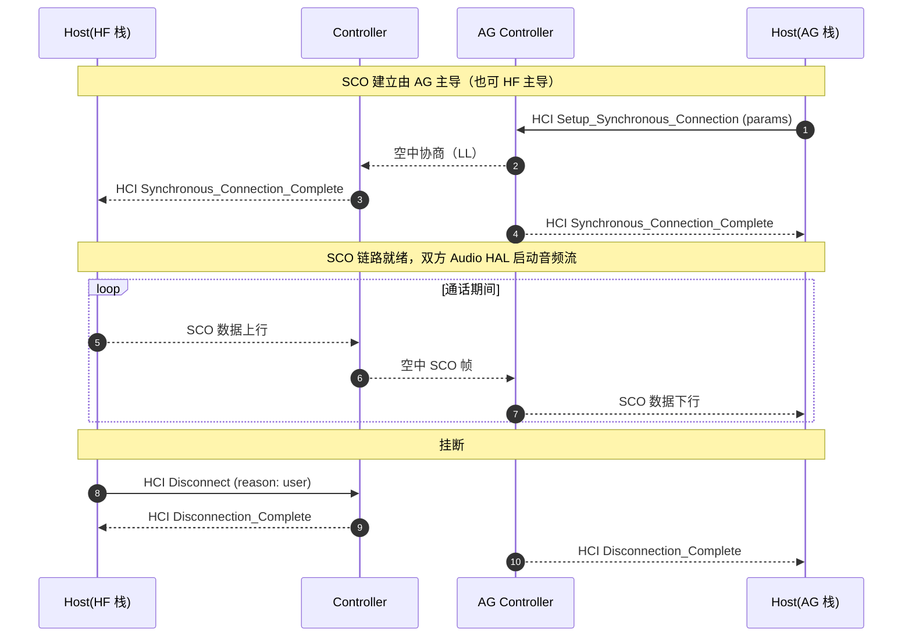
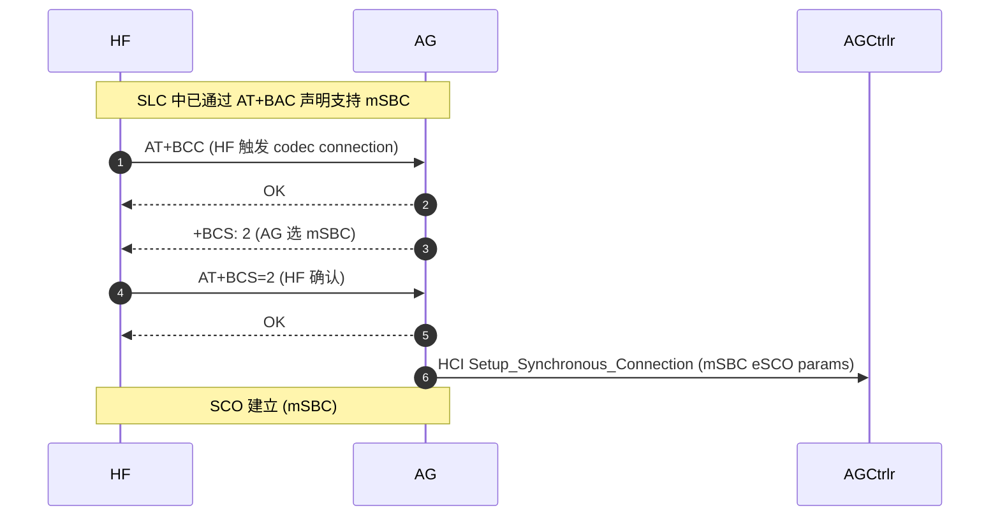

# 07.3 SCO 音频建立、释放与 CVSD / mSBC

> 速通摘要：SCO（Synchronous Connection-Oriented）是**蓝牙语音通道**，独立于 ACL；它用固定时隙、低延迟、**容忍丢包**（不重传）。HFP 通话音频走 SCO；普通编码 **CVSD（8 kHz）= 窄带**，HFP 1.6+ 引入 **mSBC（16 kHz）= 宽带**。本节拆 SCO 建立 / 释放 / codec 协商。

源码：
- HF 侧：`system/bta/hf_client/bta_hf_client_sco.cc`
- AG 侧：`system/bta/ag/bta_ag_sco.cc`
- BTM SCO：`system/stack/btm/btm_sco*.cc`
- Java：`HeadsetClientStateMachine.java`（AudioOn/Off 子态）、`HeadsetStateMachine.java`

---

## 1. 学习目标

读完本节，你应该能：

1. 区分 SCO / eSCO / mSBC / CVSD 四个相关概念。
2. 看懂 SCO 建立的 4 步 HCI 时序。
3. 默写 mSBC 协商的 3 个 AT 命令（`+BCS` / `AT+BCC` / `BAC`）。
4. 排查"打电话没声/单向哑"类问题。

---

## 2. 前置知识

- 已读 07.1、07.2。
- 知道 ACL vs SCO 区别（00.3 章）。

---

## 3. 场景故事：接听一通电话

```
[来电]
  ↓
AG 发 +RING / +CIEV: callsetup,1
  ↓
HF (车机) 收到 → HMI 弹来电
  ↓
[用户按"接听"]
  ↓
HF 发 ATA → AG 接听
  ↓
HF 发 AT+BCC（或 AG 主动）触发 codec 协商：
  AG → HF: +BCS: 2  (用 mSBC)
  HF → AG: AT+BCS=2
  ↓
AG 端发 HCI Setup_Synchronous_Connection
  ↓
双方 controller 建立 SCO/eSCO 物理链路
  ↓
HCI Synchronous_Connection_Complete → 双方栈 + Audio HAL 接通话音频通路
  ↓
通话期间：SCO 双向音频流（mSBC 编码包，每包 ~3.75 ms）
  ↓
挂断：AT+CHUP / +CIEV: call,0
  ↓
SCO 释放 → HCI Disconnect_Complete
```

---

## 4. SCO vs eSCO

| 维度 | SCO | eSCO |
|------|-----|------|
| 引入 | Bluetooth 1.x | Bluetooth 1.2 |
| 重传 | 无 | 可选 |
| 数据率 | 64 kbps | 64 kbps（仍是窄带）/ 128 kbps（宽带 EDR） |
| 时隙 | 固定 | 可重传时隙 |
| 是否兼容 mSBC | 不（mSBC 必走 eSCO） | 是 |

**实际操作中 HCI 命令叫 `Setup_Synchronous_Connection`，参数决定走 SCO 还是 eSCO**。Android 默认尝试 eSCO（更稳）。

---

## 5. CVSD vs mSBC

| 维度 | CVSD（Continuously Variable Slope Delta） | mSBC（modified SBC） |
|------|--------------------------------------------|---------------------|
| 编码方式 | 增量调制（ADPCM-like） | 子带编码 |
| 采样率 | 8 kHz | 16 kHz |
| 听感 | 窄带、"电话音质" | 宽带、清晰 |
| 要求 | 任意 HFP | 1.6+ 双方都支持 |
| HCI 链路 | SCO 或 eSCO | **必须 eSCO** |
| 编码软件位置 | `system/embdrv/sbc/`、`system/embdrv/cvsd/`（如有） | `system/embdrv/sbc/` |

车机常见问题："打电话音质差" = 协商失败降级到 CVSD。

---

## 6. SCO 建立 4 步 HCI 时序



参数包括：`Transmit_Bandwidth`、`Receive_Bandwidth`、`Max_Latency`、`Voice_Setting`、`Retransmission_Effort`、`Packet_Type`（HV1/2/3、EV3/4/5、2-EV3/3-EV3 等）。

---

## 7. mSBC 协商时序



如果 HF 不响应 `+BCS: 2` 或回 `+BCS=1`，AG 会用 CVSD 重试。

---

## 8. 关键源码点

| 文件 | 角色 |
|------|------|
| `system/bta/hf_client/bta_hf_client_sco.cc` | HF 侧 SCO 建立 / 维护 |
| `system/bta/ag/bta_ag_sco.cc` | AG 侧 SCO |
| `system/stack/btm/btm_sco.cc` 与同名头 | BTM SCO 通用 |
| `system/stack/btm/btm_sco_hci.cc`（如有） | SCO over HCI 数据通路 |
| `system/embdrv/sbc/` | mSBC 编码（软件路径） |
| `system/audio_hal_interface/hfp_client_interface.cc` | HFP Audio HAL 对接（Offload） |
| `android/app/src/com/android/bluetooth/hfpclient/HeadsetClientStateMachine.java` | AudioOn/Off 子态机 |

---

## 9. Software 路径 vs Offload 路径

| 路径 | SCO 数据走哪 | Audio HAL |
|------|------------|----------|
| **Software** | HCI 数据通道（SCO over HCI），主 CPU 收 PCM/mSBC 后送 AudioFlinger | `hfp_client_interface_host.cc` |
| **Offload** | 芯片 DSP 直接接到 Audio HAL（不经主 CPU） | `hfp_client_interface.cc` AIDL |

Offload 路径省 CPU、低延迟，但**调试不便**——抓 BTSnoop 看不到 SCO 数据帧（HCI 链路上没数据）。

---

## 10. 调试方法

| 想看 | 方法 |
|------|------|
| SCO 是否建立 | `dumpsys bluetooth_manager` 找 `audio state` / `Synchronous Connection` |
| 选了 CVSD 还是 mSBC | logcat 搜 `BCS` 或 `Selected codec`，或看 `+BCS` AT |
| HCI Setup_Synchronous_Connection 参数 | BTSnoop（Wireshark `hci_cmd.opcode == 0x0028`） |
| SCO 数据通道 | 看 HCI ACL/SCO 数据帧分布 |
| 路由 | `dumpsys audio` 看 `STREAM_BLUETOOTH_SCO` |
| Offload 是否启用 | `getprop persist.bluetooth.hfp.swb` / `persist.bluetooth.bluetooth_audio_hal.disabled` |

---

## 11. FAQ

**Q1：通话开始没声音，几秒后突然有？**
A：CVSD 与 mSBC 协商失败后退到 CVSD，SCO 重建。期间有 1-3 秒空白。

**Q2：双向单哑（你能听对方，对方听不到你）？**
A：常见原因：① 麦克风路由错（车机 HMI）；② SCO 上行参数 `Transmit_Bandwidth=0`；③ 编码方向只有一边软件、另一边 Offload。

**Q3：来电铃声没响但通话能接？**
A：`+RING` 没到 HMI，可能 `BluetoothHeadsetClient.ACTION_AG_EVENT` 没被监听，或 Telecom 框架没起来。

**Q4：SCO 抢射频导致 Wi-Fi 卡？**
A：是。SCO 占用固定时隙，CoEx 算法只能限 Wi-Fi。建议关 2.4 GHz Wi-Fi 或排队。

**Q5：能不能强制走 CVSD？**
A：`setprop persist.bluetooth.hfp.swb false`（或类似 flag）+ 不 BAC mSBC。但**音质会差**，仅做兼容回退。

---

## 12. 上路任务

### 任务 A：抓 SCO 建立
做一次完整电话：
1. logcat 找 `Setup_Synchronous_Connection` 或 `Synchronous_Connection_Complete`。
2. BTSnoop 找 HCI opcode 0x0028。
3. 确认是 SCO 还是 eSCO（Packet_Type 字段）。

### 任务 B：mSBC 还是 CVSD
对同一台手机做两次通话，对比 logcat 中 `Selected codec` —— 同一台手机有时会 mSBC 有时 CVSD（取决于 SCO 协商）。

### 任务 C：阅读 bta_hf_client_sco.cc
找 SCO 建立的入口函数（搜 `bta_hf_client_sco_create`），梳理它怎么调 BTM。

---

## 13. 本节小结（速记卡）

```
SCO = 蓝牙语音独立链路（不重传）
eSCO = SCO 增强版（可重传）；mSBC 必须 eSCO
codec：
  - CVSD 8 kHz 窄带（HFP 1.5）
  - mSBC 16 kHz 宽带（HFP 1.6+）
  - LC3/aptX SWB（HFP 1.9+ 可选）
建立时机：通话被接听后；由 AG 主动 Setup_Synchronous_Connection
关键 AT：AT+BAC (能力) → AT+BCC → +BCS → AT+BCS=
关键 HCI：opcode 0x0028 Setup_Synchronous_Connection
路径：Software（SCO over HCI）/ Offload（DSP 直连 Audio HAL）
关键源码：
  system/bta/hf_client/bta_hf_client_sco.cc
  system/bta/ag/bta_ag_sco.cc
  system/stack/btm/btm_sco.cc
  system/audio_hal_interface/hfp_client_interface.cc
```
