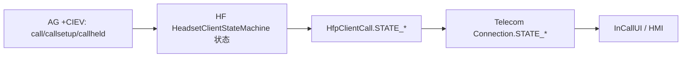
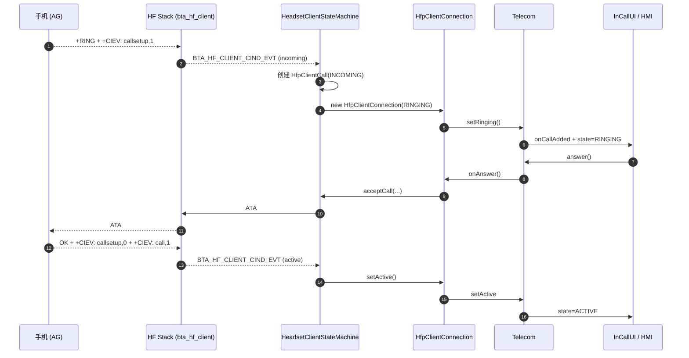

# 07.4 通话状态同步与车机 UI 联动

> 速通摘要：车机 HMI 显示来电、接听、挂断、保持，**靠的是 HFP `+CIEV` 事件 + Android Telecom 框架 + `HfpClientConnectionService`** 三段联动。HFP 的 `+CIEV: call,1` 经 BTA HF → JNI 回调 → `HeadsetClientStateMachine` → 转成 Telecom `Connection` 状态 → HMI 通过 `TelecomManager` / `MediaSession` 监听。本节描述这条"通话状态广播链"。

---

## 1. 学习目标

读完本节，你应该能：

1. 默写一次"来电 → 接听 → 挂断"过程中 HMI 看到的 Telecom 事件序列。
2. 区分 HFP "通话状态"（`call/callsetup/callheld`）与 Android Telecom `Connection.STATE_*`。
3. 找到本仓 HFP Client → Telecom 的桥接点（`HfpClientConnectionService.java`）。
4. 排查 HMI "通话状态显示不对" 类问题。

---

## 2. 前置知识

- 已读 07.1、07.2。
- 知道 Android Telecom 框架（`android.telecom.ConnectionService` / `Connection`）。

---

## 3. 场景故事：来电界面是怎么弹出来的

```
[手机来电]
    ↓
AG 发 +RING + +CIEV: callsetup,1
    ↓
HF Client RFCOMM 解析
    ↓
HeadsetClientStateMachine 收到事件 → 更新 HfpClientCall 状态为 INCOMING
    ↓
通过 HfpClientConnectionService 通知 Android Telecom
    ↓
Telecom 拉起 InCallUI（或车机自己的 InCallUI）
    ↓
HMI 弹出来电
    ↓
[用户按"接听"] → InCallUI → Telecom → HfpClientConnectionService → HeadsetClientService.acceptCall(...)
    ↓
状态机发 ATA
    ↓
AG 回 OK + +CIEV: callsetup,0 + +CIEV: call,1
    ↓
HF Client 状态 → ACTIVE → 通过 Telecom 通知 InCallUI
```

---

## 4. 三层状态映射



### HFP CIEV 状态机（手机 → 车机）
| `+CIEV` | 含义 |
|---------|------|
| `call,0` | 无通话 |
| `call,1` | 有通话已建立 |
| `callsetup,0` | 无 setup |
| `callsetup,1` | 来电 |
| `callsetup,2` | 去电拨号 |
| `callsetup,3` | 去电响铃 |
| `callheld,0` | 无保持 |
| `callheld,1` | 有保持 + 有激活 |
| `callheld,2` | 仅保持 |

### `HfpClientCall.STATE_*`（Java 抽象）
- `CALL_STATE_INCOMING`
- `CALL_STATE_DIALING`
- `CALL_STATE_ALERTING`
- `CALL_STATE_ACTIVE`
- `CALL_STATE_HELD`
- `CALL_STATE_TERMINATED`

### Telecom `Connection.STATE_*`
- `STATE_NEW`
- `STATE_RINGING`
- `STATE_DIALING`
- `STATE_ACTIVE`
- `STATE_HOLDING`
- `STATE_DISCONNECTED`

车机定制重点：把 `HfpClientCall.STATE_*` 翻译成 Telecom 状态时**不能丢精度**（如 ALERTING vs DIALING 在 HMI 显示文案不同）。

---

## 5. Telecom 接入

`HfpClientConnectionService.java` 继承 `ConnectionService`。当 HFP 有通话状态变化时，它：
1. 创建/更新 `HfpClientConnection`（继承 `Connection`）。
2. 调 `Connection.setActive() / setRinging() / setOnHold() / setDisconnected(...)` 等。
3. Telecom 自动把状态广播给 InCallUI。

车机 HMI 通常做法：
1. 实现自己的 `InCallService`（继承 `InCallService`）。
2. `onCallAdded(Call call)` 时把 UI 拉起来。
3. 通过 `Call.getDetails().getCallerDisplayName()` / `Call.Details.PROPERTY_GENERIC_CONFERENCE` 等取通话信息。

---

## 6. 关键源码点

| 文件 | 角色 |
|------|------|
| `android/app/src/com/android/bluetooth/hfpclient/HeadsetClientStateMachine.java` | per-device 状态机，处理 CIEV |
| `android/app/src/com/android/bluetooth/hfpclient/HfpClientCall.java` | 单个通话抽象 |
| `android/app/src/com/android/bluetooth/hfpclient/HfpClientConference.java` | 多通话/合并 |
| `android/app/src/com/android/bluetooth/hfpclient/HfpClientConnection.java` | Telecom Connection 实现 |
| `android/app/src/com/android/bluetooth/hfpclient/HfpClientConnectionService.java` | Telecom ConnectionService |
| `android/app/src/com/android/bluetooth/hfpclient/HfpClientDeviceBlock.java` | per-device 与 Telecom 的桥 |
| `system/bta/hf_client/bta_hf_client_at.cc` | CIEV 解析 |

---

## 7. Mermaid：完整状态联动



---

## 8. 调试方法

| 想看 | 方法 |
|------|------|
| Telecom 当前通话 | `adb shell dumpsys telecom` |
| HFP CIEV 解析 | `logcat -s bt_bta_hf_client BluetoothHeadsetClientStateMachine` |
| Telecom Connection 状态 | logcat 搜 `HfpClientConnection` |
| HMI 端 InCallService 是否收到 | `adb shell dumpsys telecom \| grep InCallService` |

---

## 9. FAQ

**Q1：HMI 显示"未知号码"？**
A：`+CLIP` 没发或未启用。HF 需先 `AT+CLIP=1`。

**Q2：通话保持后切回，HMI 状态不对？**
A：`+CIEV: callheld,N` 与 `call,1` 的组合解析有歧义；车机 HMI 必须按"激活+保持"两通话单独维护。看 `HfpClientStateMachine` 的 multi-call 处理。

**Q3：三方通话怎么处理？**
A：`HfpClientConference` 把多个 `HfpClientConnection` 合并暴露给 Telecom。

**Q4：通话期间手机锁屏，车机为什么也跟着锁了/不锁？**
A：那是车机自身电源 / 锁屏策略，跟蓝牙无关——但 HMI 团队常把锅扔给蓝牙。

**Q5：去电拨号"+CIEV: callsetup,2/3"和"+CIEV: call,1"时序错乱？**
A：少数手机实现不规范。车机 HMI 应做**双事件确认**才转 ACTIVE，避免误判。

---

## 10. 上路任务

### 任务 A：跟踪一次完整来电
```bash
adb logcat -c
# 制造一次来电 + 接听 + 挂断
adb logcat -d | grep -E "CIEV|HfpClient|Telecom|InCall"
```
对照本节 §7 时序图勾选每一步。

### 任务 B：读 HfpClientConnection
打开 `android/app/src/com/android/bluetooth/hfpclient/HfpClientConnection.java`，找：
1. 它如何把 `HfpClientCall.STATE_*` 翻译到 `Connection.STATE_*`。
2. 它如何响应 `onAnswer()` / `onReject()` / `onHold()`。

### 任务 C：写一个最小 InCallService
继承 `InCallService`，`onCallAdded` 时打印通话信息。装到测试机上看是否能收到 HFP 通话事件。

---

## 11. 本节小结（速记卡）

```
通话状态链：
  AG +CIEV → bta_hf_client → HeadsetClientStateMachine
  → HfpClientCall → HfpClientConnection → Telecom Connection → InCallUI

三套状态：
  HFP CIEV：call/callsetup/callheld 三向量
  HfpClientCall.STATE_*：INCOMING/DIALING/ALERTING/ACTIVE/HELD/TERMINATED
  Telecom Connection.STATE_*：NEW/RINGING/DIALING/ACTIVE/HOLDING/DISCONNECTED

HMI 接入：自定义 InCallService + InCallUI
桥梁：HfpClientConnectionService / HfpClientConnection / HfpClientConference
```
