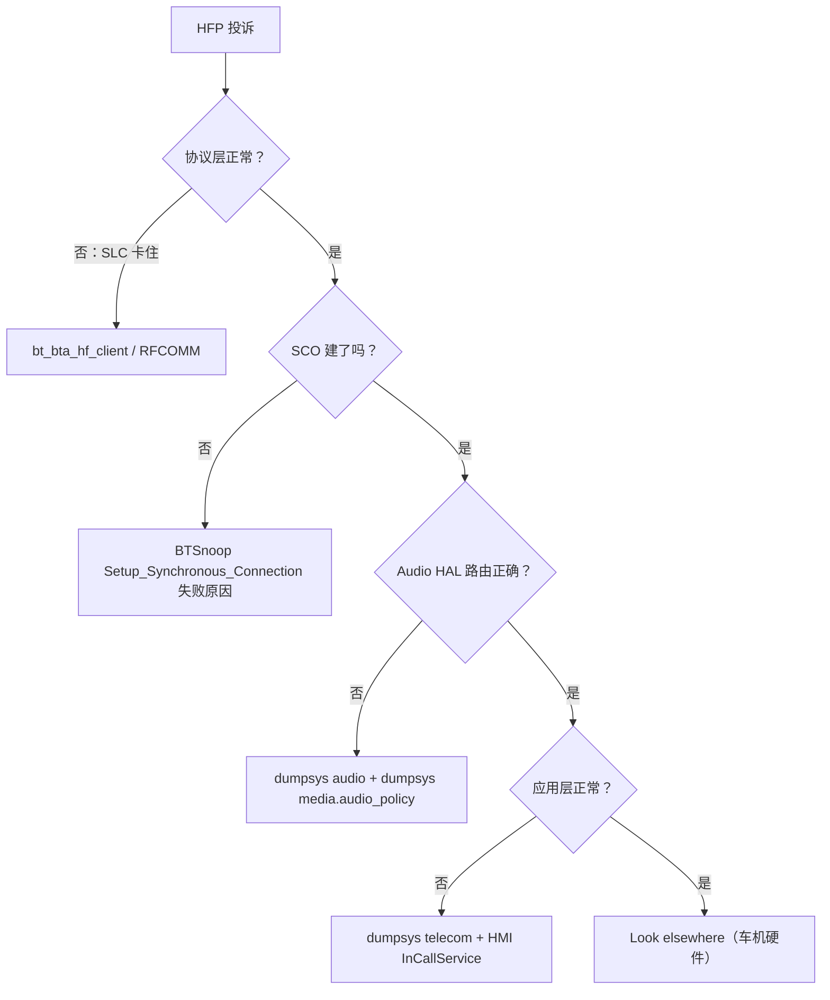

# 07.5 HFP 常见问题排查

> 速通摘要：HFP 投诉 = 通话相关。**前 5 大问题**：① 来电没响 ② 接听没声 ③ 单向哑 ④ 通话音质差 ⑤ 挂断后 A2DP 不恢复。本节给每个问题"两分钟定位 + 修复方向"。

---

## 1. 学习目标

读完本节，你应该能：

1. 拿到一个 HFP 投诉用 5 分钟说出"先看哪里"。
2. 区分"协议问题"（栈）与"路由问题"（Audio HAL）。
3. 知道 5 个最常用的车机端 fix 方向。

---

## 2. 前置知识

- 已读 07.1 ~ 07.4。
- 已读 01.2、06.5（排查流程参考）。

---

## 3. 排查清单：5 大问题

### 3.1 问题 A：来电没响（HMI 不弹来电）

可能原因：
1. HFP SLC 没建立 → dumpsys 看 HeadsetClient 是否 Connected。
2. `+CIEV: callsetup,1` 没收到 → logcat `bt_bta_hf_client`。
3. `HfpClientConnectionService` 没注册 → `dumpsys telecom \| grep HfpClient`。
4. 车机 InCallService 没接到 onCallAdded → 看 HMI 端 log。
5. CIEV 字段顺序解析错 → 看 `HeadsetClientStateMachine` 的字段 mapping。

修法（按顺序排除）：
```bash
adb shell dumpsys bluetooth_manager | grep -A 30 HeadsetClient
adb shell dumpsys telecom
adb logcat -s bt_bta_hf_client BluetoothHeadsetClientStateMachine HfpClientConnectionService
```

### 3.2 问题 B：接听没声音

可能原因：
1. **SCO 没建立** → BTSnoop 查 `HCI Synchronous_Connection_Complete`。
2. **Audio Route 没切到 SCO** → `dumpsys audio`，看 `STREAM_BLUETOOTH_SCO` 是否 active。
3. **AudioFocus 没拿到** → InCallUI 没调 `setAudioRoute(...)`。
4. **Offload 路径没建好** → 临时关 Offload 看。

修法核心：定位是"建立失败"还是"建立了但没路由"。`dumpsys audio` 一句话能区分。

### 3.3 问题 C：单向哑

通常是：
- 你能听对方，对方听不到你 → 麦克风通路（HMI 没打开 mic / Audio HAL 上行错）。
- 对方能听你，你听不到 → 扬声器通路。

排查：
1. `dumpsys media.audio_policy` 看 mic 路由。
2. logcat audio_hal_interface 看 SCO 上/下行是否都有数据。
3. BTSnoop 看 HCI SCO 数据帧方向。

### 3.4 问题 D：通话音质差

通常是 **CVSD 降级**。看 §7.3：
1. mSBC 协商失败 → 看 `+BCS` AT。
2. SCO 重传配置太弱 → `Retransmission_Effort` 参数。
3. RF 干扰严重 → 看 BTSnoop `LMP` 段。

修法：
- 确认双方都声明 `BAC=1,2`。
- 增大 `Retransmission_Effort` 到 `ALL`。
- 远离 Wi-Fi 2.4 GHz。

### 3.5 问题 E：挂断后 A2DP 不恢复

栈侧顺序应该：
1. SCO 释放（HCI Disconnect for SCO handle）。
2. A2DP Source 端发 `AVDTP_Start` 恢复。
3. 车机 HMI 不再显示通话 UI。

常见挂掉：
- A2DP 在 SCO 期间被 Source **完全断开**（不是 Suspend）→ 重连慢。
- AudioFocus 没释放 → 车机继续认为通话进行。
- ActiveDeviceManager 没切回 A2DP。

修法：
- 检查对端是否仅 Suspend 而不 Close。
- 看 logcat `setActiveDevice` 调用顺序。

---

## 4. 通用排查路径



---

## 5. 常用工具组合

| 阶段 | 工具 |
|------|------|
| 连接级 | `dumpsys bluetooth_manager` |
| RFCOMM/AT | logcat `bt_bta_hf_client` + BTSnoop `btrfcomm` |
| SCO | BTSnoop `hci_cmd.opcode == 0x0028` / Synchronous_Connection_Complete |
| 音频路由 | `dumpsys audio`、`dumpsys media.audio_policy` |
| Telecom 层 | `dumpsys telecom` |
| HMI 层 | 车厂 HMI log |

---

## 6. 实战 Case：通话结束后扬声器仍出当前播放器声音几秒

观察：用户挂断后 1-2 秒还能听到 SCO 残留音频，然后才切回 A2DP。

分析：
1. `dumpsys audio` 显示 STREAM_BLUETOOTH_SCO 比预期晚 1-2 秒 deactivate。
2. BTSnoop 显示 HCI Disconnect 立即下发，对端立即 ACK。
3. 但 `setActiveDevice(null, PROFILE_HEADSET)` 没及时回调，AudioFlinger 没及时切。

修法：在 `HeadsetClientService.onAudioStateChanged(AUDIO_STATE_DISCONNECTED)` 时立刻通知 ActiveDeviceManager 切。

---

## 7. FAQ

**Q1：dumpsys 看到 Connected 但通话不工作？**
A：是 SLC 没完成（Connected 是 RFCOMM 通道开启，不是 SLC 完成）。看是否 `+CIEV` 启用。

**Q2：能不能让车机一直保持 SCO？**
A：不能。SCO 占用射频，平时是不活动的。HFP 1.7 引入 `Audio Connection Set-Up by AG` 机制让 SCO 可"先建后用"，但仍需短期。

**Q3：iPhone 的 HFP 有什么特别？**
A：iPhone 用 Apple-specific 私有 AT（`AT+XAPL`、`AT+IPHONEACCEV` 等）。`HeadsetClientStateMachine` 与 `VendorCommandResponseProcessor` 处理。

**Q4：通话时按下方向盘"挂断"无效？**
A：HMI → MediaSession → Telecom → HeadsetClientService.terminateCall 路径未通。最常见是 HMI 把按键映射到了 `KEYCODE_HEADSETHOOK` 但没注册 `MediaSession.Callback#onMediaButtonEvent`。

**Q5：HFP 蓝牙耳机听音乐有什么问题？**
A：HFP 是窄带（CVSD 8k）。普通蓝牙音乐应该走 A2DP（立体声）。如果用户感觉"音质骤降"，往往是 HFP 抢占了路由。

---

## 8. 上路任务

### 任务 A：写一个 HFP 健康检查脚本
依据 §4 流程图自动跑 dumpsys + logcat 关键字 + 简单判断"问题在哪一层"。

### 任务 B：模拟一次 CVSD 降级
强制把 `BAC=1`（仅 CVSD）+ 重启蓝牙；做通话，验证 codec 退化。

### 任务 C：复盘
回想你过去最近的一个 HFP 投诉，对照本节方法重新走一遍。

---

## 9. 本节小结（速记卡）

```
HFP 5 大问题：
  A 来电没响 → SLC + Telecom 接入
  B 接听没声 → SCO 建立 + Audio Route
  C 单向哑   → MIC / 扬声器某一向 + Audio HAL
  D 音质差   → mSBC 降级 / 干扰
  E 挂断后 A2DP 不回 → ActiveDeviceManager 切换 + AudioFocus

四层排查：协议 → SCO → Audio HAL → Telecom/HMI
工具：dumpsys bluetooth_manager / dumpsys audio / dumpsys telecom + logcat + BTSnoop
最终修在：
  HeadsetClientStateMachine（事件解析）
  HfpClientConnectionService（Telecom 接入）
  Audio HAL（路由）
  ActiveDeviceManager（多 Profile 切换）
```

至此 07 章 HFP 全部完成。下一站：**08 BLE / GATT** — 车机 BLE 外设全链路。
