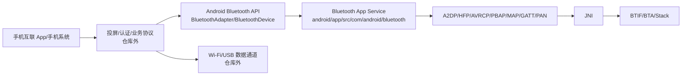

# 08. 手机互联：蓝牙在 HiCar/CarLink/CarPlay 类方案中的支撑角色

## 1. 学习目标

手机互联方案通常由投屏、认证、Wi-Fi/USB 数据通道、音频、电话、消息和车辆能力接口共同组成。当前仓库是 Android Bluetooth 模块源码，不包含 HiCar、CarLink、CarPlay 等厂商私有协议的完整实现，所以本章只讲蓝牙侧可以确认的边界和源码观察点。

读完本章后，你应该能判断：

- 一个互联问题该归到配对、Profile 连接、音频活跃设备、电话、媒体控制、PBAP/MAP、BLE 辅助通道还是外部互联协议。
- 当前仓库能验证哪些蓝牙行为，哪些只能标注为外部依赖。
- 手机互联“连上但没声音/电话不可用/联系人不同步/互联认证失败”分别从哪里开始看。

## 2. 互联方案中的蓝牙角色

| 互联能力 | 蓝牙侧常见角色 | 当前仓库观察入口 |
| --- | --- | --- |
| 首次发现/配对 | Classic discovery、BLE scan、bond | `BluetoothAdapter.startDiscovery()`、`BluetoothDevice.createBond()`、`ScanController.startScan()` |
| 设备身份/认证辅助 | BLE GATT、自定义 service、厂商 app 协议 | `BluetoothDevice.connectGatt()`、`GattService` |
| 音乐播放 | A2DP + AVRCP | `A2dpService`、`AvrcpControllerService`、`AvrcpTargetService` |
| 电话 | HFP Client 或 HFP AG | `HeadsetClientService`、`android/app/src/com/android/bluetooth/hfp` |
| 联系人/通话记录 | PBAP Client | `PbapClientService`、`PbapClientObexClient` |
| 短信/消息 | MAP Client | `MapClientService`、`MasClient` |
| 网络共享/特殊通道 | PAN 或 Socket/RFCOMM/L2CAP | `PanService`、socket/JV 相关 native |

不要把“互联 App 已连接”直接等同于“蓝牙 Profile 全部正常”。互联方案可能 USB/Wi-Fi 通道已通，但 A2DP/HFP/PBAP 某个 Profile 失败。

## 3. 总体边界图



当前仓库能完整追踪的是 `BTAPI -> BtService -> JNI -> Native`。投屏协议、认证协议、车厂策略和手机端实现通常不在这里。

## 4. Framework API 入口

互联 App 或系统组件常从 `BluetoothAdapter`、`BluetoothDevice` 进入蓝牙模块。

```java
// framework/java/android/bluetooth/BluetoothAdapter.java
1988    public boolean startDiscovery() {
1992        return callServiceIfEnabled(s -> s.startDiscovery(mAttributionSource), false);

// framework/java/android/bluetooth/BluetoothDevice.java
2073    public boolean createBond(int transport) {
2083                return service.createBond(this, transport, mAttributionSource);
2208    public boolean removeBond() {
2222                return service.removeBond(this, mAttributionSource);
2399    public @ConnectionReturnValues int connect() {
2436    public @ConnectionReturnValues int disconnect() {
3241    public BluetoothGatt connectGatt(
3380        gatt.connect(autoConnect, callback, handler);
```

判断边界时可以这样分：

- 设备搜不到：先看 Classic discovery 或 BLE scan。
- 配对弹窗/密钥失败：看 `createBond()`、`BondStateMachine`、BTIF DM。
- GATT 认证辅助失败：看 `connectGatt()` 后是否进入 `GattService`。
- Profile 连接失败：看具体 Profile Service，不要只看 `BluetoothDevice.connect()`。

## 5. 音频与电话：互联体验最敏感的两条链路

音乐通常走 A2DP/AVRCP：

```java
// android/app/src/com/android/bluetooth/a2dp/A2dpService.java
182     public boolean connect(BluetoothDevice device) {
239     public boolean disconnect(BluetoothDevice device) {
460     public boolean setActiveDevice(@NonNull BluetoothDevice device) {
596     public void setAvrcpAbsoluteVolume(int volume) {
820     void messageFromNative(A2dpStackEvent stackEvent) {
```

电话通常看 HFP Client：

```java
// android/app/src/com/android/bluetooth/hfpclient/HeadsetClientService.java
304     public boolean connect(BluetoothDevice device) {
331     public boolean disconnect(BluetoothDevice device) {
535     boolean connectAudio(BluetoothDevice device) {
553     boolean disconnectAudio(BluetoothDevice device) {
674     HfpClientCall dial(BluetoothDevice device, String number) {
822     void messageFromNative(StackEvent stackEvent) {
```

互联场景里“手机在播放但车机无声”，通常要同时看：

- A2DP 是否 connected。
- A2DP active device 是否是当前手机。
- AVRCP 媒体状态是否更新。
- Audio Framework 是否把音频路由到蓝牙。
- 如果同时存在 LE Audio/有线设备，`ActiveDeviceManager` 是否切走了活跃设备。

## 6. ActiveDeviceManager：多音频设备仲裁

`ActiveDeviceManager` 是车机场景很重要的协调点。互联过程中如果手机、耳机、LE Audio、有线音频同时存在，活跃设备切换会直接影响声音和通话。

```java
// android/app/src/com/android/bluetooth/btservice/ActiveDeviceManager.java
291     public void profileConnectionStateChanged(
379                     boolean a2dpMadeActive = setA2dpActiveDevice(device);
380                     boolean hfpMadeActive = setHfpActiveDevice(device);
1044    private boolean setA2dpActiveDevice(
1081    private boolean setHfpActiveDevice(BluetoothDevice device) {
1152    private boolean setLeAudioActiveDevice(
1480    void wiredAudioDeviceConnected() {
1482        setA2dpActiveDevice(null, true);
1483        setHfpActiveDevice(null);
1485        setLeAudioActiveDevice(null, true);
```

如果互联刚连上声音正常，插入有线设备或切换 LE Audio 后无声，优先看这里的状态迁移。

## 7. 联系人、消息与网络

PBAP Client：

```java
// android/app/src/com/android/bluetooth/pbapclient/PbapClientService.java
387     public boolean connect(BluetoothDevice device) {
409     public boolean disconnect(BluetoothDevice device) {

// android/app/src/com/android/bluetooth/pbapclient/obex/PbapClientObexClient.java
253         connect(TRANSPORT_L2CAP, psm);
263         connect(TRANSPORT_RFCOMM, channel);
492                 socket.connect();
526             HeaderSet responseHeaders = obexSession.connect(headers);
```

MAP Client：

```java
// android/app/src/com/android/bluetooth/mapclient/MapClientService.java
106     public synchronized boolean connect(BluetoothDevice device) {
178     public synchronized boolean disconnect(BluetoothDevice device) {

// android/app/src/com/android/bluetooth/mapclient/MasClient.java
117     private void connect() {
132             mSocket.connect();
144             headerset = mSession.connect(headerset);
```

PAN：

```java
// android/app/src/com/android/bluetooth/pan/PanService.java
245     public boolean connect(BluetoothDevice device) {
260     public boolean disconnect(BluetoothDevice device) {
```

联系人或短信不同步时，不要只看 A2DP/HFP。PBAP/MAP 多走 OBEX/RFCOMM/L2CAP，问题形态更像 socket、SDP、权限、对端授权或手机端策略。

## 8. 互联问题观察表

| 现象 | 先看蓝牙侧 | 再看外部侧 |
| --- | --- | --- |
| 互联入口搜不到手机 | Classic discovery、BLE scan、权限、过滤 | 手机互联 App 广播/发现策略 |
| 配对失败 | `BluetoothDevice.createBond()`、`BondStateMachine`、BTIF DM、SMP/SSP | 手机端弹窗、用户拒绝、厂商认证 |
| 投屏已连但无音乐 | `A2dpService.connect()`、`setActiveDevice()`、AVRCP 状态 | 投屏音频路由、Wi-Fi/USB 音频策略 |
| 电话不可用 | `HeadsetClientService.connect()`、`connectAudio()`、SCO | 手机电话权限、互联 App 电话代理 |
| 联系人空 | `PbapClientService`、OBEX connect、手机授权 | 手机通讯录权限/隐私设置 |
| 短信不同步 | `MapClientService`、`MasClient` | 手机短信授权、互联协议策略 |
| BLE 认证失败 | `connectGatt()`、`GattService`、读写/notify | 厂商私有认证、密钥、云端状态 |

## 9. 建议练习

1. 模拟“互联无声”，按 `A2dpService -> ActiveDeviceManager -> AVRCP -> Native A2DP` 画出自己的排查路径。
2. 模拟“联系人不同步”，从 `PbapClientService.connect()` 追到 `PbapClientObexClient.connect()`。
3. 对一个车机互联 bug 单写一列“当前仓库能验证”和一列“外部依赖”，避免把所有问题都归咎于蓝牙栈。

### 9.1 参考答案与讨论

练习 1：互联无声要先拆成蓝牙音乐链路和外部投屏/音频路由链路。

参考排查路径：

1. `A2dpService.connect(device)`：确认 A2DP 是否 connected。
2. `ActiveDeviceManager.profileConnectionStateChanged(...)`：确认连接后是否把目标手机设为 active device。
3. `A2dpService.setActiveDevice(...)`：确认 native active device 设置是否成功。
4. AVRCP service/controller：确认媒体状态、播放状态和音量是否同步。
5. `com_android_bluetooth_a2dp.cpp`、`btif_av.cc`：确认 Native A2DP 是否进入 started。
6. 外部音频路由：如果蓝牙侧都正常，但仍无声，就要看 Audio Framework、投屏协议或车厂音频策略。

讨论要点：互联“已连接”可能只是投屏通道已连，不代表 A2DP active 和媒体流已通。

练习 2：联系人不同步主要看 PBAP/OBEX，不要误查 A2DP/HFP。

参考路线：

- `PbapClientService.connect(device)`：服务侧发起 PBAP 连接。
- `PbapClientStateMachine.connect()`：状态机驱动连接流程。
- `PbapClientObexClient.connect(...)`：选择 L2CAP 或 RFCOMM transport。
- `BluetoothSocket.connect()`：底层 socket 建立。
- `obexSession.connect(headers)`：OBEX session 建立。

判断点：

- socket 是否成功。
- OBEX connect 是否成功。
- 手机端是否弹出并允许通讯录访问。
- SDP 记录和 channel/PSM 是否正确。

讨论要点：联系人为空常常是手机授权或 OBEX session 问题，不一定是互联主协议或 HFP 问题。

练习 3：互联 bug 必须拆成“仓库能验证”和“外部依赖”。

示例：

| 问题 | 当前仓库能验证 | 外部依赖 |
| --- | --- | --- |
| 投屏已连但无声 | A2DP 连接、active device、AVRCP 状态、Native A2DP started | 投屏音频策略、车厂 AudioPolicy、手机端投屏协议 |
| 互联认证失败 | BLE scan/GATT connect/read/write/notify 是否正常 | 厂商认证算法、密钥、云端状态、手机 App |
| 联系人不同步 | PBAP socket、OBEX session、MAP/PBAP service 状态 | 手机隐私授权、手机 ROM 策略 |

讨论要点：这样拆分可以避免“蓝牙背锅”。当前仓库能证明蓝牙侧有没有把通道打通，但不能证明厂商私有认证逻辑一定正确。
