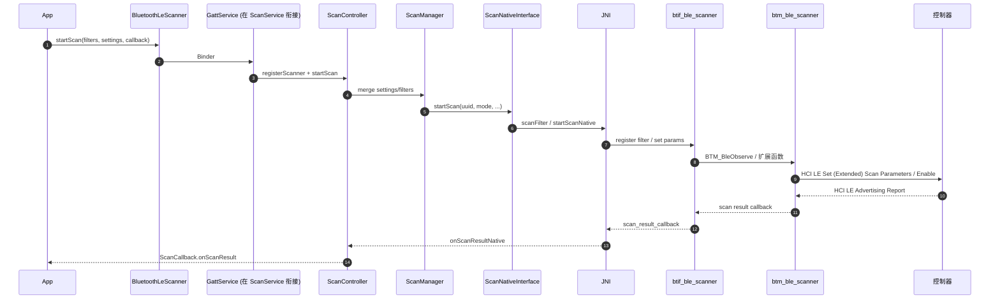

# 08.1 BLE 扫描：legacy 与 extended scan

> 速通摘要：BLE 扫描 = "听广告"。**Legacy Scan**（蓝牙 4.0）听 1M PHY 上的 3 个通道；**Extended Scan**（蓝牙 5.0+）能听 Coded PHY、2M PHY、扩展广告。Android 用 `BluetoothLeScanner` API + `ScanFilter` + `ScanSettings` 暴露给 App；底层走 `ScanManager` → `ScanNativeInterface` → JNI → `btif_ble_scanner` → BTM → HCI `LE Set Extended Scan Enable`。本节拆解扫描的"5 个层 + 4 种模式 + 3 种过滤"。

源码：
- App 接入：`framework/java/android/bluetooth/le/BluetoothLeScanner.java`、`ScanFilter.java`、`ScanSettings.java`
- 蓝牙 App：`android/app/src/com/android/bluetooth/le_scan/`
- Native：`system/stack/btm/btm_ble_scanner.cc`、`system/btif/src/btif_ble_scanner.cc`

---

## 1. 学习目标

读完本节，你应该能：

1. 区分 Legacy / Extended Scan、4 种 ScanMode、3 种 ScanFilter。
2. 默写 `BluetoothLeScanner.startScan(filters, settings, callback)` 的完整下钻路径。
3. 知道 BLE 广播包结构（AD type / value）。
4. 排查"扫不到 BLE 设备"的 7 种原因。

---

## 2. 前置知识

- 已读 03.2（设备扫描总览）。
- 知道 BLE 广播是 Peripheral 主动周期性发的（00.3 章）。

---

## 3. 场景故事：车机扫描胎压监测器

```java
BluetoothLeScanner scanner = adapter.getBluetoothLeScanner();
List<ScanFilter> filters = List.of(
    new ScanFilter.Builder()
        .setServiceUuid(new ParcelUuid(TPMS_SERVICE_UUID))
        .build());
ScanSettings settings = new ScanSettings.Builder()
    .setScanMode(ScanSettings.SCAN_MODE_LOW_LATENCY)
    .setCallbackType(ScanSettings.CALLBACK_TYPE_ALL_MATCHES)
    .build();
scanner.startScan(filters, settings, scanCallback);
```

幕后：
1. `BluetoothLeScanner` → `IBluetoothGatt.startScan(...)` Binder。
2. `GattService` → `ScanController` → `ScanManager`。
3. `ScanManager` 把所有 client 的 filter 合并、协商最优参数。
4. `ScanNativeInterface.startScanNative(...)` → JNI → BTIF。
5. BTIF → BTM `btm_ble_start_inquiry/btm_ble_scanner` → HCI 命令。
6. 控制器开始听广告 → 收到广播包 → 反向 callback 到 App `ScanCallback.onScanResult`。

---

## 4. Legacy vs Extended

| 维度 | Legacy Scan (BLE 4.x) | Extended Scan (BLE 5+) |
|------|----------------------|------------------------|
| PHY | 1M | 1M / 2M / Coded |
| 通道 | 3 个广播通道（37/38/39） | 同上 |
| 广播包大小 | 31 字节 | 最长 254 字节 + Auxiliary Channel |
| HCI 命令 | `HCI_LE_Set_Scan_Parameters` + `Set_Scan_Enable` | `HCI_LE_Set_Extended_Scan_Parameters` + `Set_Extended_Scan_Enable` |
| Android 入口 | 同一个 `BluetoothLeScanner` API（自动选） | 同上 |

控制器支持哪些由 HCI `Read_Local_Supported_Features` 决定。

---

## 5. 四种 ScanMode

来自 `android.bluetooth.le.ScanSettings`：

| Mode | 用例 | 占空比典型 |
|------|------|----------|
| `SCAN_MODE_OPPORTUNISTIC` | 蹭别人扫的结果 | 0%（不主动扫） |
| `SCAN_MODE_LOW_POWER` | 后台、省电 | ≈ 10% |
| `SCAN_MODE_BALANCED` | 平衡 | ≈ 25% |
| `SCAN_MODE_LOW_LATENCY` | 前台、求快 | 接近 100% |

车机调试要点：**LOW_LATENCY 会显著影响 A2DP/HFP 共存**——扫描期间 ACL 数据吞吐降。

---

## 6. 三种过滤模式

| 过滤类型 | 在哪过滤 | 适用场景 |
|---------|---------|--------|
| **App-level filter**（Java） | 蓝牙 App 进程内 `ScanFilterQueue` | 任意条件 |
| **Hardware Offload filter** | 控制器（如果支持） | 大量过滤、省电 |
| **MSFT Offload filter** | Microsoft 扩展（部分芯片支持） | 高级过滤 |

源码：`ScanFilterQueue.java`、`MsftAdvMonitor.java`。

---

## 7. BLE 广播包结构

```
| Preamble | Access Address | PDU Header | PDU Payload (max 31 / 254 bytes) | CRC |
                                   ↓ PDU Payload 拆开
              | AD #1 length | AD #1 type | AD #1 data | AD #2 length | ... |
```

常见 AD type：
- `0x01` Flags
- `0x02/0x03` Incomplete/Complete List of 16-bit Service UUIDs
- `0x06/0x07` Incomplete/Complete List of 128-bit Service UUIDs
- `0x08/0x09` Shortened/Complete Local Name
- `0x16` Service Data - 16-bit UUID
- `0xFF` Manufacturer Specific Data

车机解析广播：`ScanRecord` 类（`framework/java/android/bluetooth/le/ScanRecord.java`）。

---

## 8. 关键源码点

| 文件 | 角色 |
|------|------|
| `framework/java/android/bluetooth/le/BluetoothLeScanner.java` | App 入口 |
| `framework/java/android/bluetooth/le/ScanFilter.java` | filter |
| `framework/java/android/bluetooth/le/ScanSettings.java` | mode |
| `framework/java/android/bluetooth/le/ScanCallback.java` | 回调 |
| `framework/java/android/bluetooth/le/ScanRecord.java` | 广播包解析 |
| `android/app/src/com/android/bluetooth/le_scan/ScanController.java` | 控制器 |
| `…/le_scan/ScanManager.java` | 合并各 client 设置 |
| `…/le_scan/ScanNativeInterface.java` | JNI Java 端 |
| `…/le_scan/ScanFilterQueue.java` | filter offload 决策 |
| `…/le_scan/MsftAdvMonitor.java` | MSFT 扩展 |
| `…/le_scan/PeriodicScanManager.java` | 周期扫描（synchronization） |
| `android/app/jni/com_android_bluetooth_scan.cpp` | JNI C |
| `system/btif/src/btif_ble_scanner.cc` | BTIF |
| `system/stack/btm/btm_ble_scanner.cc` | BTM |

---

## 9. Mermaid：扫描全链路



---

## 10. 调试方法

| 想看 | 方法 |
|------|------|
| 当前所有扫描 client | `dumpsys bluetooth_manager` → `Scan Stats` / `AppScanStats` |
| 扫描占空比 | dumpsys 同上看 `Duty Cycle` |
| HCI 扫描参数 | btsnoop 看 `LE Set Scan Parameters`、`LE Set Extended Scan Parameters` |
| Advertising Report 真实速率 | btsnoop 内 `LE Advertising Report` 频率 |
| filter offload 是否生效 | logcat `bt_btif_ble_scanner` |
| MSFT 扩展 | logcat `MsftAdvMonitor` |

---

## 11. FAQ

**Q1：扫不到设备 7 大原因**
A：①对端没广播 ②filter 太严 ③ScanMode 太省电 ④缺权限（BLUETOOTH_SCAN + ACCESS_FINE_LOCATION 旧 SDK）⑤蓝牙没开（只 BLE-only？）⑥前台/后台限制（Android O+ 后台默认 OPPORTUNISTIC）⑦控制器在做其它事（Inquiry 进行中）。

**Q2：startScan 返回 true 但没 callback？**
A：通常是 filter 不匹配或扫描线程被节流（Android 7+ 每 30s 限制 5 次扫描启动）。看 logcat `Reset scan throttling`。

**Q3：能否扫到自己？**
A：不能。Android 蓝牙堆栈过滤本机地址。

**Q4：RPA（随机解析地址）怎么处理？**
A：BLE 设备会周期性变 RPA。如果你有 IRK，蓝牙栈自动解析；否则要按 `ScanRecord` 内的服务 UUID 或厂商数据匹配。

**Q5：扫描多久会触发"5 次 30 秒"限制？**
A：Android 7+ 同一个 App 30 秒内 startScan/stopScan 超过 5 次会被节流。规避：长扫一次，App 自己周期判断。

---

## 12. 上路任务

### 任务 A：写一个 BLE 扫描器
照 §3 写一段 App，扫所有 BLE 设备，打印 RSSI、name、UUID 列表。

### 任务 B：观察 HCI 参数差异
分别用 LOW_POWER / BALANCED / LOW_LATENCY 抓 BTSnoop，记录 HCI `LE Set Extended Scan Parameters` 的 `Scan_Interval` / `Scan_Window` 字段差异。

### 任务 C：找出本仓 ScanManager 合并逻辑
读 `ScanManager.java`，理解多个 App 同时扫描时如何"合并出最严格参数"。

---

## 13. 本节小结（速记卡）

```
BLE 扫描双套：Legacy (4.x) / Extended (5+)
四模式：OPPORTUNISTIC / LOW_POWER / BALANCED / LOW_LATENCY
三过滤：App-level / Hardware Offload / MSFT
广播包：AD type/value 编码（最长 31 / 254 字节）
Java 入口：BluetoothLeScanner.startScan(filters, settings, callback)
下钻：ScanController → ScanManager → ScanNativeInterface
        → JNI → btif_ble_scanner → btm_ble_scanner → HCI
广播 AD type 常见：0x01 Flags / 0x09 Name / 0x07 UUIDs / 0xFF Manufacturer
30s 限 5 次：Android 7+ 节流
```
