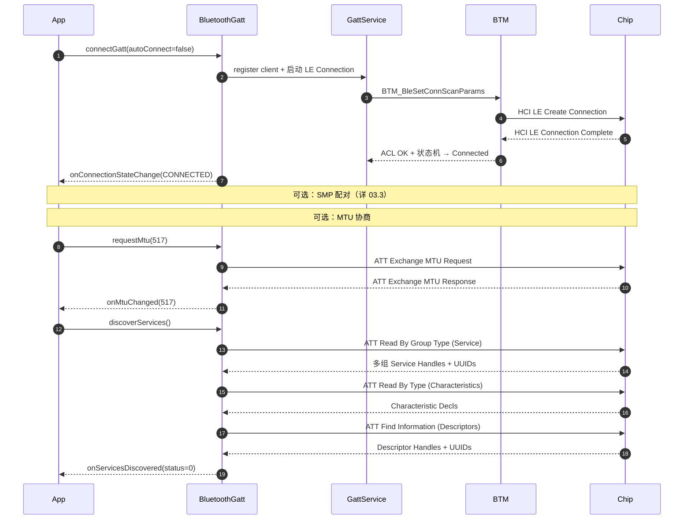

# 08.2 GATT 连接与服务发现

> 速通摘要：BLE 连上之后第一件大事是**服务发现**——客户端读对端的 ATT Database，列出所有 Service + Characteristic + Descriptor，建立 handle 与 UUID 的映射。Android 用 `BluetoothGatt.discoverServices()` 触发，回 `onServicesDiscovered(...)`。底层走 ATT `Read By Group Type` + `Read By Type` + `Find Information` 三组 ATT 命令。

源码：
- App API：`framework/java/android/bluetooth/BluetoothGatt.java`
- 蓝牙 App Service：`android/app/src/com/android/bluetooth/gatt/GattService.java`
- BTA：`system/bta/gatt/bta_gattc_*.cc`
- Stack：`system/stack/gatt/gatt_main.cc`、`gatt_cl.cc`、`gatt_db.cc`

---

## 1. 学习目标

读完本节，你应该能：

1. 默写 GATT 连接 5 步（connect → ACL+SMP → MTU → ServiceDiscovery → Notify）。
2. 区分 ATT / GATT / EATT 三层关系。
3. 知道 Android GATT 服务发现的内部缓存（per-bonded-device）。
4. 排查"`onServicesDiscovered` 没回 / status 错"类问题。

---

## 2. 前置知识

- 已读 02.3 BluetoothProfile。
- 已读 08.1 BLE 扫描。

---

## 3. 场景故事：车机连上钥匙后读取它

```java
BluetoothGatt gatt = device.connectGatt(context, false /*autoConnect*/, new BluetoothGattCallback() {
    @Override public void onConnectionStateChange(BluetoothGatt g, int status, int newState) {
        if (newState == BluetoothProfile.STATE_CONNECTED) {
            g.discoverServices();        // ① 触发服务发现
        }
    }
    @Override public void onServicesDiscovered(BluetoothGatt g, int status) {
        BluetoothGattService svc = g.getService(KEY_SVC_UUID);
        BluetoothGattCharacteristic ch = svc.getCharacteristic(KEY_CMD_UUID);
        g.setCharacteristicNotification(ch, true);    // ② 订阅 Notify
        BluetoothGattDescriptor cccd = ch.getDescriptor(CCCD_UUID);
        cccd.setValue(BluetoothGattDescriptor.ENABLE_NOTIFICATION_VALUE);
        g.writeDescriptor(cccd);                       // ③ 真正订阅靠写 CCCD
    }
    @Override public void onCharacteristicChanged(...) { /* 钥匙发数据来了 */ }
});
```

---

## 4. GATT 连接 5 步



---

## 5. ATT / GATT / EATT

| 层 | 全称 | 角色 |
|----|------|------|
| **ATT** | Attribute Protocol | 最底层"属性读/写" — `system/stack/gatt/` 内的 `att_protocol.cc`、`gatt_cl.cc`（client）、`gatt_sr.cc`（server） |
| **GATT** | Generic Attribute Profile | ATT 之上的"语义" — Service / Characteristic / Descriptor，UUID 层级 |
| **EATT** | Enhanced ATT | Android 12+，多 ATT bearer 并发，提升吞吐 — `system/stack/eatt/` |

车机 BLE 调试主要关注 GATT 层语义，EATT 是底层优化对 App 透明。

---

## 6. BluetoothGattCallback 关键回调

| 回调 | 何时触发 | 你要做什么 |
|------|---------|-----------|
| `onConnectionStateChange(g, status, newState)` | 连接状态变 | CONNECTED → 调 discoverServices() |
| `onMtuChanged(g, mtu, status)` | MTU 协商完 | 决定单次写多大 |
| `onServicesDiscovered(g, status)` | 服务发现完 | 取 Service / Characteristic |
| `onCharacteristicRead(g, ch, status)` | 读到了 | 取 value |
| `onCharacteristicWrite(g, ch, status)` | 写完成 | 失败处理 |
| `onCharacteristicChanged(g, ch)` | Notify/Indicate 到 | 处理数据 |
| `onDescriptorWrite(g, desc, status)` | CCCD 写完成 | Notify 订阅成功 |
| `onReadRemoteRssi(g, rssi, status)` | 读到 RSSI | |
| `onPhyUpdate(g, txPhy, rxPhy, status)` | PHY 切换完 | |

---

## 7. 服务发现内部缓存

Android 把每台 bonded 设备的服务结构**缓存到本地**（避免重连每次都发现一遍）。
- 缓存位置：内存中由 `GattService` 维护；落盘到 `/data/misc/bluedroid/`。
- 触发刷新：对端发出 **Service Changed Indication**（标准 GATT 1.x）。
- 强制刷新：`BluetoothGatt.refresh()`（hidden API，App 通常用反射）。

源码：`system/bta/gatt/bta_gattc_cache.cc`、`bta_gattc_db_storage.cc`。

---

## 8. 关键源码点

| 文件 | 角色 |
|------|------|
| `framework/java/android/bluetooth/BluetoothGatt.java` | Client 代理 |
| `framework/java/android/bluetooth/BluetoothGattServer.java` | Server 代理 |
| `framework/java/android/bluetooth/BluetoothGattService.java` | Service 抽象 |
| `framework/java/android/bluetooth/BluetoothGattCharacteristic.java` | Characteristic |
| `framework/java/android/bluetooth/BluetoothGattDescriptor.java` | Descriptor |
| `framework/java/android/bluetooth/BluetoothGattCallback.java` | 回调接口 |
| `android/app/src/com/android/bluetooth/gatt/GattService.java` | 蓝牙 App 端 Service |
| `android/app/src/com/android/bluetooth/gatt/GattNativeInterface.java` | JNI Java 端 |
| `android/app/src/com/android/bluetooth/gatt/ContextMap.java` | 多 client 管理 |
| `android/app/src/com/android/bluetooth/gatt/HandleMap.java` | handle ↔ UUID |
| `android/app/jni/com_android_bluetooth_gatt.cpp` | JNI C |
| `system/bta/gatt/bta_gattc_*.cc` | BTA Client |
| `system/bta/gatt/bta_gatts_*.cc` | BTA Server |
| `system/stack/gatt/gatt_main.cc` | GATT 主入口 |
| `system/stack/gatt/gatt_cl.cc` | Client 流程 |
| `system/stack/gatt/gatt_sr.cc` | Server 流程 |
| `system/stack/gatt/gatt_db.cc` | 本端服务库 |
| `system/stack/gatt/att_protocol.cc` | ATT 协议 |
| `system/stack/eatt/` | EATT |

---

## 9. autoConnect 真相

`device.connectGatt(ctx, autoConnect, callback)`：
- `autoConnect=false`：**直接发起 LE Create Connection**，立即等待对端响应；适合**前台用例**（用户刚扫到要连）。
- `autoConnect=true`：把设备加入"待连接列表"，**等对端广播**才触发连接；适合**后台自动重连**。

车机现实：钥匙、胎压等"近距离就连"用 `autoConnect=true`。

---

## 10. 调试方法

| 想看 | 方法 |
|------|------|
| GATT client 注册 | `dumpsys bluetooth_manager` → `GattService` 段 |
| 服务发现结果 | logcat `BluetoothGattService bt_btif_gattc bt_bta_gattc` |
| 抓 ATT 包 | btsnoop 过滤 `btatt` |
| MTU 协商 | btsnoop 看 `ATT Exchange MTU` |
| 缓存目录 | `/data/misc/bluedroid/gatt_cache_*`（root） |

---

## 11. FAQ

**Q1：discoverServices 没回？**
A：① 链路被 supervision timeout 断了 ② 对端 ATT 不响应 ③ 客户端 client 没注册（看 `GattService` 段） ④ 你设了 autoConnect=true 但没广播。

**Q2：onCharacteristicChanged 收不到？**
A：必须先写 CCCD `ENABLE_NOTIFICATION_VALUE`（或 INDICATION）。仅 `setCharacteristicNotification(true)` 不够——那只是本地标志。

**Q3：MTU 是不是越大越好？**
A：大 MTU 减少分包次数提升吞吐；但每包 RF 占用时间更长，丢包后重传代价大。默认 23 安全；可调 247（BLE 4.2 LL 长包）；最大 517。

**Q4：能不能并发多设备 GATT 连接？**
A：能，受限于控制器 LE link 数（通常 7-10 个）。`dumpsys` 看 `ACL Stats`。

**Q5：GATT Server 写一次怎么写？**
A：` BluetoothGattServerCallback` + `BluetoothManager#openGattServer(ctx, callback)`。详 `BluetoothGattServer.java`。

---

## 12. 上路任务

### 任务 A：写一个最小 BLE 客户端
扫描 + 连接 + 服务发现 + 读取某个 Characteristic + 订阅 Notify。跑通一遍。

### 任务 B：抓 ATT 时序
连一次 BLE 设备，BTSnoop 过滤 `btatt`，找：
1. `Exchange MTU Request/Response`
2. `Read By Group Type Request`（Service Discovery）
3. `Read By Type Request`（Characteristic）
4. `Find Information Request`（Descriptor）
5. `Write Request`（CCCD）
6. `Handle Value Notification`

### 任务 C：理解服务缓存
找一台 bonded BLE 设备，第一次连接计时 discoverServices 用时；断开重连第二次计时。差几秒？

---

## 13. 本节小结（速记卡）

```
GATT 连接 5 步：connect → SMP（可选）→ MTU → discoverServices → CCCD 订阅 Notify
三层：ATT（属性读写）/ GATT（语义）/ EATT（多 bearer 提速）
关键 ATT 命令：Exchange MTU / Read By Group Type / Read By Type / Find Information / Write
关键回调：
  onConnectionStateChange / onMtuChanged / onServicesDiscovered
  onCharacteristicRead/Write/Changed / onDescriptorWrite
缓存：bonded 设备服务结构本地缓存；Service Changed 刷新
autoConnect：true=后台等广告 / false=立即连
关键源码：
  framework BluetoothGatt + BluetoothGattCallback
  android/app/.../gatt/GattService.java
  system/bta/gatt/bta_gattc_*.cc
  system/stack/gatt/gatt_main.cc / gatt_cl.cc / gatt_sr.cc
```
