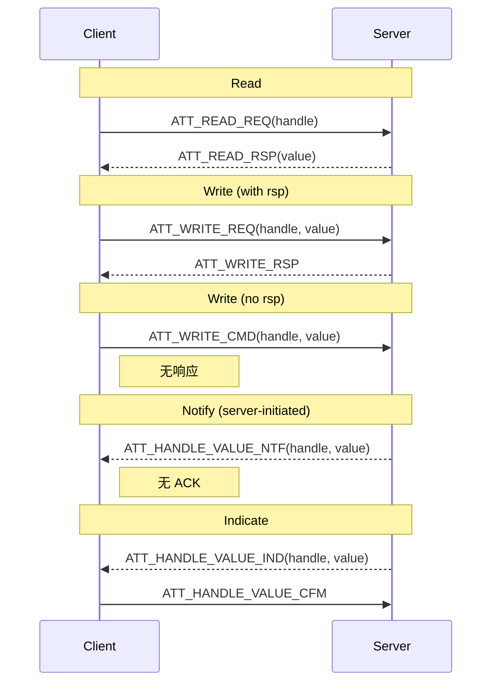

# 08.3 Characteristic 读写、Notify / Indicate

> 速通摘要：GATT 数据交互 = **Read / Write / Notify / Indicate** 四种基本操作。Read/Write 是 client 主动；Notify/Indicate 是 server 主动推（Notify 无 ACK、Indicate 有 ACK）。每个 Characteristic 有 **Properties** 决定允许哪些操作；订阅 Notify/Indicate 要写它的 **CCCD**（0x2902 描述符）。本节给出每种操作的 ATT 时序、API 用法和高频坑。

---

## 1. 学习目标

读完本节，你应该能：

1. 区分 4 种操作的 ATT PDU、API 与回调。
2. 看懂 Characteristic Properties 位掩码（READ/WRITE/NOTIFY/INDICATE 等）。
3. 默写 CCCD 三种值（DISABLE/NOTIFY/INDICATE）。
4. 排查"Write 没回 / Notify 收不到 / MTU 不够"类问题。

---

## 2. 前置知识

- 已读 08.2。
- 知道 Characteristic 由 Declaration、Value、可选 Descriptors 组成。

---

## 3. 四种基本操作一图

```mermaid
flowchart TD
    subgraph Client["Client (车机)"]
        C1[BluetoothGatt.readCharacteristic]
        C2[BluetoothGatt.writeCharacteristic]
        C3[setCharacteristicNotification + 写 CCCD]
    end
    subgraph Server["Server (BLE 外设)"]
        S1[ATT_READ_REQ → ATT_READ_RSP]
        S2[ATT_WRITE_REQ → ATT_WRITE_RSP<br/>或 ATT_WRITE_CMD（无 ACK）]
        S3[Notify: ATT_HANDLE_VALUE_NTF (无 ACK)<br/>Indicate: ATT_HANDLE_VALUE_IND (需 ACK)]
    end
    C1 --> S1
    C2 --> S2
    C3 --> S3
```

---

## 4. Read

### 4.1 API

```java
gatt.readCharacteristic(ch);   // ① 触发，立即返回 boolean
// ② 等回调
@Override public void onCharacteristicRead(BluetoothGatt g,
                                          BluetoothGattCharacteristic ch,
                                          byte[] value, int status) {
    if (status == GATT_SUCCESS) processValue(value);
}
```

### 4.2 ATT PDU
- 短读：`ATT_READ_REQ(handle)` → `ATT_READ_RSP(value <= MTU-1)`
- 长读：`ATT_READ_BLOB_REQ(handle, offset)` → `ATT_READ_BLOB_RSP(value)` 反复直到读完

### 4.3 注意点
- **每次 Read 是同步操作**（前一个未回调不能发下一个）。
- value 长度受 MTU 限制；MTU=23 默认下单次最多 22 字节。

---

## 5. Write

### 5.1 两种类型

| 类型 | API | ATT PDU | 是否 ACK |
|------|-----|---------|--------|
| **Write With Response**（默认） | `setWriteType(WRITE_TYPE_DEFAULT)` | `WRITE_REQ` → `WRITE_RSP` | 是 |
| **Write Without Response** | `WRITE_TYPE_NO_RESPONSE` | `WRITE_CMD` | 否 |
| **Reliable Write**（极少用） | `beginReliableWrite() / executeReliableWrite()` | `PREPARE_WRITE_REQ` + `EXECUTE_WRITE_REQ` | 是 |

```java
ch.setWriteType(BluetoothGattCharacteristic.WRITE_TYPE_NO_RESPONSE);  // 高吞吐
ch.setValue(data);
gatt.writeCharacteristic(ch);
```

### 5.2 注意点
- **没回调就发下一个 Write**：仅 `WRITE_CMD` 可以；带响应必须等 `onCharacteristicWrite`。
- 长 Write（> MTU-3）由 stack 自动拆 `Prepare_Write` + `Execute_Write`。

---

## 6. Notify / Indicate

### 6.1 区别

| | Notify | Indicate |
|--|--------|---------|
| ATT PDU | `HANDLE_VALUE_NTF` | `HANDLE_VALUE_IND` |
| Client 回 ACK | 否 | 是 `HANDLE_VALUE_CFM` |
| 吞吐 | 高 | 低 |
| 适用 | 高频传感器（心率、计步） | 关键事件（电梯到达层） |
| CCCD 值 | `0x0001` `ENABLE_NOTIFICATION_VALUE` | `0x0002` `ENABLE_INDICATION_VALUE` |

### 6.2 订阅流程（Notify 例）

```java
// ① 本地标志：让 BluetoothGatt 收到 NTF 时分发到 onCharacteristicChanged
gatt.setCharacteristicNotification(ch, true);

// ② 真订阅：写 CCCD
BluetoothGattDescriptor cccd = ch.getDescriptor(CCCD_UUID);
// CCCD_UUID = UUID.fromString("00002902-0000-1000-8000-00805f9b34fb")
cccd.setValue(BluetoothGattDescriptor.ENABLE_NOTIFICATION_VALUE);
gatt.writeDescriptor(cccd);

// ③ 收到对端推送
@Override public void onCharacteristicChanged(BluetoothGatt g, BluetoothGattCharacteristic ch,
                                              byte[] value) {
    processSensor(value);
}
```

**漏 ② 是最常见错误**——许多新手只调 `setCharacteristicNotification(true)`，不写 CCCD，结果对端永远不会推。

---

## 7. Characteristic Properties

```java
// BluetoothGattCharacteristic 内常量
PROPERTY_BROADCAST       = 0x01
PROPERTY_READ            = 0x02
PROPERTY_WRITE_NO_RESPONSE = 0x04
PROPERTY_WRITE           = 0x08
PROPERTY_NOTIFY          = 0x10
PROPERTY_INDICATE        = 0x20
PROPERTY_SIGNED_WRITE    = 0x40
PROPERTY_EXTENDED_PROPS  = 0x80
```

读 properties：`ch.getProperties() & PROPERTY_NOTIFY != 0`。**先检查再调用**——不支持 Notify 还订阅就是浪费。

---

## 8. MTU 协商

```java
gatt.requestMtu(512);    // 请求
@Override public void onMtuChanged(BluetoothGatt g, int mtu, int status) {
    if (status == GATT_SUCCESS) Log.i(TAG, "Effective MTU: " + mtu);
}
```

- 默认 23（仅 20 字节有效 payload）。
- BLE 4.2 链路层支持最大 251 字节 PDU → ATT MTU 247。
- BLE 5 链路层支持最大 257 字节 → ATT MTU 253。
- Android 上限 517。
- **双方取较小值**。

车机连胎压外设：通常协商 **MTU 23**（外设算力差）；连大文件 OTA 设备协商 **247**。

---

## 9. ATT 时序速查



---

## 10. 关键源码点

| 文件 | 角色 |
|------|------|
| `framework/java/android/bluetooth/BluetoothGatt.java` | 客户端 API |
| `framework/java/android/bluetooth/BluetoothGattCharacteristic.java` | Char + Properties |
| `framework/java/android/bluetooth/BluetoothGattDescriptor.java` | Desc + CCCD 常量 |
| `framework/java/android/bluetooth/BluetoothGattCallback.java` | 回调 |
| `android/app/src/com/android/bluetooth/gatt/GattService.java` | Service 层（搜 `readCharacteristic` / `writeCharacteristic` / `setCharacteristicNotification` 等方法） |
| `system/bta/gatt/bta_gattc_act.cc` | BTA Client 动作 |
| `system/stack/gatt/gatt_cl.cc` | Stack 客户端 |
| `system/stack/gatt/att_protocol.cc` | ATT PDU 构造 |

---

## 11. 调试方法

| 想看 | 方法 |
|------|------|
| Read/Write 时序 | btsnoop 过滤 `btatt.opcode in (0x0a, 0x12, 0x52, 0x1b, 0x1d)` |
| MTU | btsnoop 过滤 `btatt.opcode == 0x02`（Exchange MTU Req） |
| CCCD 写 | btsnoop 看 `Handle: 0x002a Value: 0100`（典型 CCCD handle + ENABLE_NOTIFY） |
| Notify 频率 | btsnoop 数 `HANDLE_VALUE_NTF` 数量 |
| 写失败原因 | `onCharacteristicWrite status`，常见错误码：`GATT_AUTHENTICATION` / `GATT_INVALID_ATTR_LEN` / `GATT_INSUFFICIENT_AUTHORIZATION` |

---

## 12. FAQ

**Q1：写大数据怎么分包？**
A：BluetoothGatt 自动按 MTU-3 拆。但 NO_RESPONSE write 必须控制速率（控制器有 LL 队列上限），否则 `onCharacteristicWrite` 不回也不报错——丢包。

**Q2：Notify 间隔能控制吗？**
A：Client 不能；由 Server 决定。Server 在自身实现里控制 push 频率。

**Q3：能不能并发对多 Characteristic 操作？**
A：单 GATT 连接的 ATT 是**串行的**（一时一 op）。EATT 引入多 bearer 改善。

**Q4：CCCD 写完没回 `onDescriptorWrite`？**
A：检查 GATT_SUCCESS；可能是 Insufficient Authentication（要先配对），看 status。

**Q5：Notify 数据丢？**
A：① RF 弱（Notify 无重传） ② Indicate 替代关键数据 ③ App 处理慢导致控制器侧累积溢出。

---

## 13. 上路任务

### 任务 A：Notify 订阅完整流程
读懂 §6.2 三步，并把 BTSnoop 抓出来对照：①CCCD 写 ②对端发 Notify ③本地收到。

### 任务 B：测 MTU 影响吞吐
对同一外设分别用 MTU=23 / 247 写 1KB 数据，记录耗时。

### 任务 C：写一个 GATT Server
用 `BluetoothManager.openGattServer(...)` + `BluetoothGattServer.addService(...)`，让对方能从你身上 Read 一个 Characteristic。

---

## 14. 本节小结（速记卡）

```
四操作：
  Read  → ATT_READ_REQ / RSP → onCharacteristicRead
  Write → WRITE_REQ/CMD → onCharacteristicWrite (cmd 无回)
  Notify → HANDLE_VALUE_NTF（无 ACK）
  Indicate → HANDLE_VALUE_IND + CFM（有 ACK）
Properties 位：BROADCAST/READ/WRITE_NO_RESP/WRITE/NOTIFY/INDICATE/SIGNED/EXTENDED
订阅 Notify 三步：
  ① setCharacteristicNotification(ch, true)
  ② 拿 CCCD（UUID 00002902）
  ③ 写 ENABLE_NOTIFICATION_VALUE / INDICATION_VALUE
MTU：默认 23，可协商到 517；连胎压/钥匙常用 23
ATT 是串行；EATT 提供多 bearer
```
