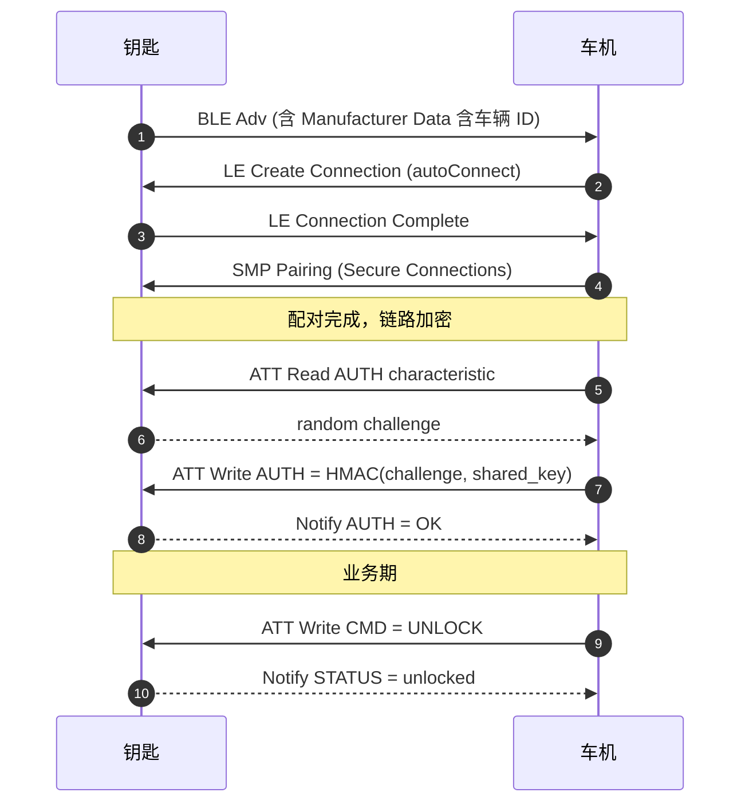
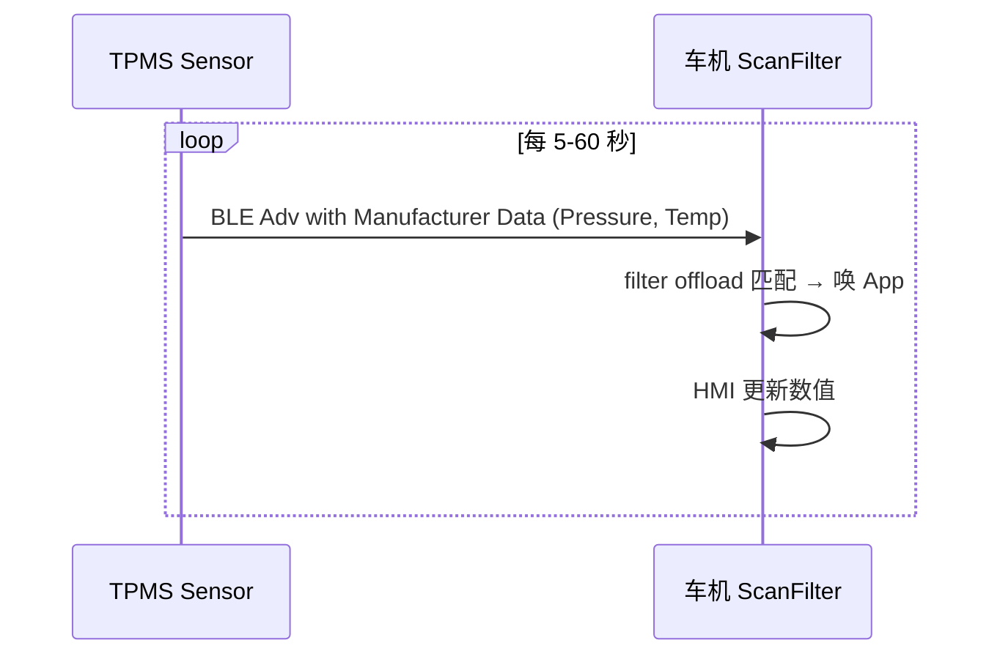
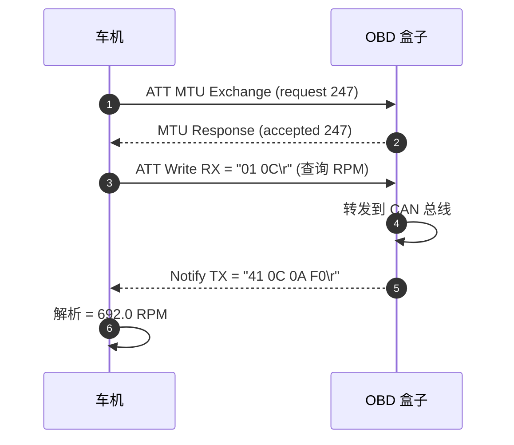

# 08.4 车载 AIoT 外设案例（钥匙、胎压、OBD）

> 速通摘要：车载 BLE 外设 = **少量数据 + 长期常驻 + 严格功耗**。三类典型：**蓝牙钥匙**（解锁/启动）、**胎压监测**（4 路 BLE 数据上报）、**OBD 诊断**（车辆诊断数据透传）。本节用三个真实案例展示 BLE 协议层在车机上的实际形态。

---

## 1. 学习目标

读完本节，你应该能：

1. 给一个 BLE 外设需求，识别它适合用哪种 GATT 模式（Read / Notify / OTA / 自定义协议）。
2. 看懂"加密/认证/UUID 私有"三种业务安全方案。
3. 知道车机做"长期 BLE 连接"时的常见功耗与稳定性陷阱。

---

## 2. 前置知识

- 已读 08.1 ~ 08.3。

---

## 3. 案例 1：蓝牙钥匙

### 业务需求
- 钥匙近车机 5m 内：自动唤醒车机蓝牙。
- 钥匙触发解锁 / 启动 → 通过 BLE 命令通道下发。
- 安全要求：双向认证 + 加密通信 + 防中继攻击。

### 协议设计
| 元素 | 设计 |
|------|------|
| 角色 | 钥匙 = Peripheral，车机 = Central |
| 发现 | 钥匙周期 BLE 广播（low duty） |
| 连接 | 车机 `autoConnect=true` 等待 |
| 安全 | BLE Secure Connections + LE Privacy（RPA） + 应用层 challenge-response |
| 数据 | 自定义 Service + 多个 Characteristic：CMD(write)、STATUS(notify)、AUTH(write/notify) |

### 协议时序


### 工程难点
- 中继攻击：要量距（RSSI / Channel Sounding）。
- 多车机一钥匙：身份管理与撤销。
- 低延迟：广告间隔 30-50 ms（耗电）vs 长间隔（200+ ms）的取舍。

---

## 4. 案例 2：胎压监测（TPMS）

### 业务需求
- 4 个胎压传感器周期性上报压力、温度。
- 车机 HMI 实时显示。
- 电池供电 5+ 年 → 极致省电。

### 协议设计
| 元素 | 设计 |
|------|------|
| 角色 | 传感器 = Peripheral，车机 = Central |
| 数据方向 | 单向 Peripheral → Central |
| 上报频率 | 行驶时 5s/次，静止时 60s/次 |
| 连接策略 | **不连**——用 **Adv 广播**直接载数据 |
| 协议形态 | Manufacturer Specific Data in BLE Adv |

### 优化点
- 用 **BLE 广播携带数据**而不是建立 GATT 连接 → 省电。
- 车机用 `ScanFilter` 仅匹配本车 4 个 sensor 的 MAC，offload 到控制器 → CPU 不被唤醒。
- 用 `SCAN_MODE_LOW_POWER` 大间隔扫描，平衡延迟与省电。

### 协议时序


### 工程难点
- 多车干扰：附近车辆传感器广播也会进，靠厂商 ID + 车辆唯一标识区分。
- 滚动加密：防回放（每次广播带递增 nonce + HMAC）。

---

## 5. 案例 3：OBD 蓝牙诊断盒

### 业务需求
- 车机透传 OBD-II 协议命令到外设。
- 外设接到车辆 OBD 端口，转发命令到 CAN 总线，获取车辆数据。
- 数据量中等（kB 级），偶尔会有大块（10kB OTA）。

### 协议设计
| 元素 | 设计 |
|------|------|
| 角色 | 盒子 = Peripheral，车机 = Central |
| 数据方向 | 双向 |
| MTU | 247（高吞吐） |
| Profile | 自定义 Service：TX(notify)、RX(write_no_response) |
| 协议层 | 在 ATT 之上跑"串口仿真"：每条命令分 N 个 chunk，TX 端发 chunk start + chunks + end |

### 协议时序


### 工程难点
- 长会话内丢包重传：要在 App 层做帧编号 + 重传窗口。
- OBD 标准多变：UDS / KWP / J1939，要识别协议。

---

## 6. 三类外设对比

| 维度 | 钥匙 | 胎压 | OBD |
|------|------|------|-----|
| 连接？ | 是 | 否（广告） | 是 |
| 数据量 | 极小 | 极小 | 中-大 |
| 频率 | 偶发 | 周期 | 实时 |
| 配对/加密 | 必须 | 不需要（应用层签名） | 可选 |
| 难点 | 防中继 | 省电 + 多车干扰 | 大数据吞吐 |

---

## 7. 实战经验

### 7.1 车机做"长期连接"的稳定性
- BLE 连接超时（Supervision Timeout）默认 ~20 秒，可在 `BTM_BleSetConnPrefMode` 调高。
- 长期连接要写 keep-alive 心跳（业务层），避免对端控制器静态超时。
- 蓝牙重启时所有 GATT 连接断 → 业务层须能自动重连。

### 7.2 多设备并发
- 控制器 LE link 数 7-10 个上限。
- 多个 GATT 连接共享 RF 时段，每个连接的实际吞吐降。
- 优先级：钥匙 > OBD > 胎压（胎压走 Adv 无连接负担）。

### 7.3 OTA 升级
- 用 Write Without Response + MTU 247 + L2CAP CoC 提高吞吐。
- BLE 实际峰值在车机控制器上常见 30-60 KB/s。
- 1 MB 固件 ≈ 20-40 秒，期间禁止其他操作。

---

## 8. 关键源码点（车机端）

| 文件 | 角色 |
|------|------|
| `framework/java/android/bluetooth/le/AdvertisingSetParameters.java` | 自身广告参数 |
| `framework/java/android/bluetooth/le/AdvertiseData.java` / `ScanFilter.java` | 数据封装 |
| `android/app/src/com/android/bluetooth/gatt/AdvertiseManager.java` | 自身广告管理（GATT Server 用） |
| `android/app/src/com/android/bluetooth/le_scan/ScanFilterQueue.java` | filter offload |
| `system/stack/btm/btm_ble_*.cc` | BTM BLE 系列 |
| `system/stack/btm/btm_ble_privacy.cc` | LE Privacy (RPA) |

---

## 9. 调试方法

| 想看 | 方法 |
|------|------|
| Adv 包内容 | 用 nRF Connect 或 hcitool 抓 |
| RSSI 与距离 | `BluetoothGatt.readRemoteRssi()` |
| 连接参数 | btsnoop `HCI LE Connection Update` |
| MTU 最终值 | `onMtuChanged` 回调或 btsnoop |
| 长期连接是否稳定 | 自己写 keep-alive 计数器记录断开次数 |

---

## 10. FAQ

**Q1：钥匙能否被中继攻击？怎么防？**
A：可以。防中继思路：① 测距（RSSI / Channel Sounding / UWB） ② TOF 测时 ③ 多链路（蓝牙 + UWB 协同）。本仓有 `DistanceMeasurementManager` 框架。

**Q2：胎压用广告不用连接，传感器电池能撑多久？**
A：60s 间隔的低占空比广告 + 1 节 CR2032 电池能撑 4-7 年。

**Q3：OBD 大数据慢？**
A：MTU 调到 247 + Data Length Extension（DLE）+ 2M PHY（BLE 5.0）。理论 ≈ 800 kbps，实际 200-400 kbps。

**Q4：车机扫不到自家的 BLE 外设？**
A：① 广告周期太长（>1s 几乎扫不到）② filter 错 ③ 外设广告地址类型用 RPA 而 IRK 没同步。

**Q5：能不能用 L2CAP CoC 替代 GATT？**
A：可以。`BluetoothDevice.createL2capChannel(int psm)`。适合高吞吐自定义协议，但失去 GATT 标准化优势。

---

## 11. 上路任务

### 任务 A：选型设计
给你一个新需求"BLE 雨刷"（手持遥控发"清洁前挡风"指令），决定：
1. 用 Adv 还是 Connection？
2. 加密用 SMP 还是应用层？
3. MTU 多少？

### 任务 B：抓一次胎压广告
车上启用一次 BLE 扫描，用 nRF Connect 旁观抓本车 4 个胎压传感器的 Adv，看 Manufacturer Specific Data 字段。

### 任务 C：阅读 DistanceMeasurementManager
打开 `android/app/src/com/android/bluetooth/gatt/DistanceMeasurementManager.java`，理解其框架。这是车机防中继攻击的标准 API 切入点。

---

## 12. 本节小结（速记卡）

```
车载 BLE 外设三典型：
  钥匙 → 短连接 + SMP 加密 + 应用层挑战 + 防中继（测距）
  胎压 → 不连接 + Adv 载数据 + filter offload + 滚动签名
  OBD  → 长连接 + 大 MTU + Notify/Write 双向 + 应用层分帧
通用难点：长期连接稳定性 / 多设备共存 / RF 受 Wi-Fi 干扰 / 升级 OTA 慢
关键车机源码：AdvertiseManager / ScanFilterQueue / DistanceMeasurementManager
省电核心：低占空比 Adv + 控制器侧 filter offload + 大连接间隔
```
