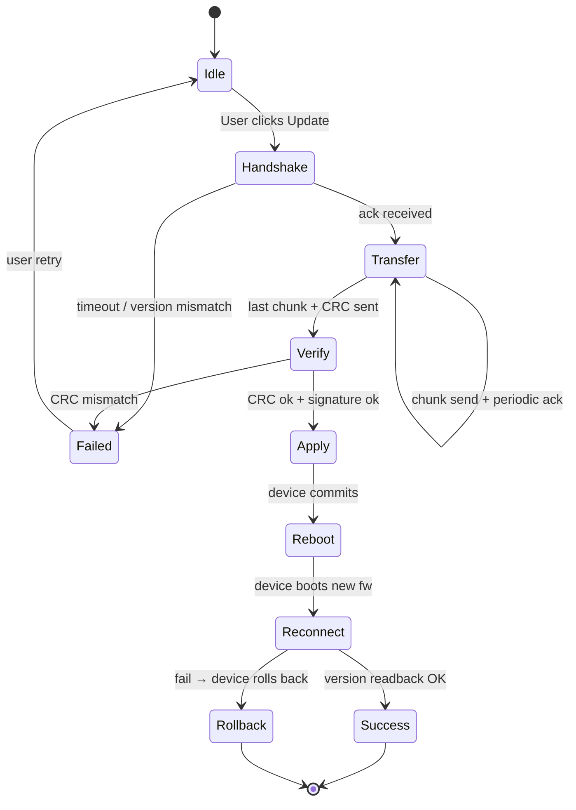

# 08.5 OTA 升级思路与坑点

> 速通摘要：BLE OTA = "通过 BLE 通道把对端固件刷新一次"。工程要素 5 个：**分块协议、可恢复、签名校验、断电安全、回滚机制**。车机做"OTA 推送者"时关键不是栈代码，而是**应用层协议**（分包、流控、CRC）。本节给一份"少走 80% 弯路"的设计模板。

---

## 1. 学习目标

读完本节，你应该能：

1. 设计一个最简单的 BLE OTA 协议（含分包、握手、确认、完成）。
2. 知道为什么不能用 GATT 默认 Write 直接传固件。
3. 列出车机端 OTA 推送的 3 个"必做"和 4 个"避免"。

---

## 2. 前置知识

- 已读 08.3（Write / Notify）。
- 知道车机做 Central 推 OTA 到外设是典型场景。

---

## 3. 场景故事：车机给 BLE 钥匙固件升级

```
[车机]                                       [钥匙]
  │ start OTA (cmd, fw_size, crc, version)→   │
  │ ←ack: chunk_size=128, MTU=247             │
  │ chunk #0 (128B) →                          │
  │ chunk #1 (128B) →                          │
  │ chunk #2 (128B) →                          │
  │   ...                                      │
  │ ←ack 每 N 个 chunk (流控)                  │
  │   ...                                      │
  │ end + CRC →                                │
  │ ←ack: ok                                   │
  │ apply (reboot) →                           │
  │                       钥匙重启加载新固件
  │ ←re-connect 后 version=X.Y.Z 验证           │
```

---

## 4. 协议设计 5 要素

### 4.1 分块协议
GATT 默认 MTU 23 不够。BLE 5 + DLE + MTU 247 → 单包 244 字节有效。**自定义协议必须分包+重组**。

**典型帧格式**：
```
| chunk_id (2B) | chunk_total (2B) | payload (≤MTU-3) | optional CRC |
```

### 4.2 流控
不能"无脑全速发"——对端 RX 队列会溢出。两种做法：
- **Acknowledged**：每 N（如 16）块对方 Notify 一次 `ack`。
- **Credit-based**：开始时对方给信用，每收一块扣 1，定期回信用。

### 4.3 签名校验
固件下载完不能立刻刷——必须验证 CRC + 数字签名（防中间人篡改）。固件包应在工厂出货时**预签名**（密钥本不在 BLE 通道里）。

### 4.4 断电安全
分两个固件槽位（A/B）：
- 写入到 B 槽位。
- 写完且校验通过才更新引导指针。
- 任何中断都安全（仍在 A 槽位跑）。

### 4.5 回滚机制
- 启动后 N 秒内若上层服务没成功握手 → 回滚到 A 槽位。
- 至少保留前一版本固件，遇到崩溃可手动降级。

---

## 5. 关键技术点：吞吐优化

| 技术 | 提升 |
|------|------|
| MTU 247（DLE） | 单包 244 字节 vs 默认 20 字节 → 12× |
| Write Without Response | 不等响应 → 减少 round-trip |
| 2M PHY（BLE 5） | 数据率翻倍 |
| Connection Interval 缩短到 7.5 ms | 每 interval 多发包 |
| L2CAP CoC（PSM 自定义） | 绕过 ATT 的 1 op 串行限制 |

车机端实际经验：MTU 247 + 2M PHY + NO_RESPONSE + Interval 15 ms → 实际 200-400 kbps。

---

## 6. 车机推送端的 3 必做

1. **进度回调到 HMI**：用户必须看到 "升级中 35%" 之类。
2. **失败重试策略**：网络弱/链路断 → 续传机制（chunk_id 从断点继续）。
3. **完成验证**：升级完成后重新建立连接 + 读取版本号，确认确实是新版本。

---

## 7. 车机推送端的 4 避免

1. **避免**长 OTA 期间允许新蓝牙业务（如配对其它设备）—— RF 抢占导致 OTA 超慢。
2. **避免**用 default WRITE_WITH_RESPONSE：太慢。但也别极端 NO_RESPONSE 把 LL 队列冲爆。
3. **避免**App 进程被杀（前台 Service 保活）。
4. **避免**没有"取消"按钮 / 没有"等待用户" — 用户在 OTA 中如果熄火离车你怎么办？

---

## 8. 关键源码点

OTA 协议是**应用层**，AOSP 蓝牙模块本身**不实现 OTA**。但本仓的几处底层支持很重要：

| 文件 | 角色 |
|------|------|
| `framework/java/android/bluetooth/BluetoothGatt.java` | `setPreferredPhy`、`requestMtu`、`requestConnectionPriority` |
| `framework/java/android/bluetooth/le/AdvertisingSetParameters.java` | 2M / Coded PHY 广告 |
| `system/stack/btm/btm_ble_*.cc` | LL 参数 |
| `system/stack/l2cap/` | L2CAP CoC（如果走 CoC 协议） |

车厂 OTA 多以**独立 SystemApp** 形式实现，调上述 framework API。

---

## 9. Mermaid：完整 OTA 流程



---

## 10. 调试方法

| 想看 | 方法 |
|------|------|
| 吞吐 | 测 "X 字节 / Y 秒"，对比理论值 |
| MTU 协商 | btsnoop `Exchange MTU` |
| PHY 切换 | btsnoop `LE Set PHY Command` |
| 链路质量 | `BluetoothGatt.readRemoteRssi()` 监控变化 |
| OTA 状态 | 自己日志 + HMI |
| 失败抓包 | 在出错那一刻保留 btsnoop full |

---

## 11. FAQ

**Q1：必须用 L2CAP CoC 吗？**
A：不一定。GATT NO_RESPONSE + MTU 247 多数能满足。CoC 适合超大固件或需要更精细流控。

**Q2：OTA 时 A2DP 还能听吗？**
A：物理上能，但 RF 时段会被 OTA 抢占大半 → 音乐卡顿。建议 OTA 时弹"暂停音乐"提示。

**Q3：升级中断怎么续传？**
A：协议设计阶段就要支持"resume from chunk_id"。开始 OTA 时对端报告"我已经收到了第 N 个 chunk，从 N+1 重传"。

**Q4：固件包多大合理？**
A：取决于带宽。1 MB 在车机 BLE OTA ≈ 20-30 秒（合理）；10 MB ≈ 3-5 分钟（用户耐心阈值）；更大要分段或转用 Wi-Fi。

**Q5：能否用 BLE 5.4 ISO Channel 加速 OTA？**
A：ISO 主要做实时音频；OTA 不合适。

---

## 12. 上路任务

### 任务 A：设计一个 OTA 协议
照 §4 写出 PDF / Markdown 协议规范，包含：
1. Service / Characteristic UUID。
2. 帧格式。
3. 4 个状态（Handshake / Transfer / Verify / Apply）。
4. 失败处理。

### 任务 B：测吞吐
找一个 BLE 外设支持 Write NO_RESPONSE，写 100KB 数据，记录耗时。算出 kbps。

### 任务 C：模拟掉电恢复
在 OTA 进行到 50% 时主动断开 BLE。重连后看你的协议能不能 resume。

---

## 13. 本节小结（速记卡）

```
OTA 五要素：分块 / 流控 / 签名 / 断电安全（A/B 槽）/ 回滚

吞吐优化栈：
  ① MTU 247（DLE）
  ② Write Without Response
  ③ 2M PHY (BLE 5)
  ④ 短 Connection Interval (7.5 ~ 15 ms)
  ⑤ L2CAP CoC（如必要）

车机推送端 3 必做：
  - HMI 进度
  - 断点续传
  - 完成校验

4 避免：
  - 期间允新蓝牙业务
  - WRITE_WITH_RESPONSE 滥用
  - App 被杀
  - 无取消按钮

实际典型：1MB 固件 ≈ 20-30 秒
```

至此 08 章 BLE / GATT 全部完成。下一站：**05 Native 栈基础**（P2）。
