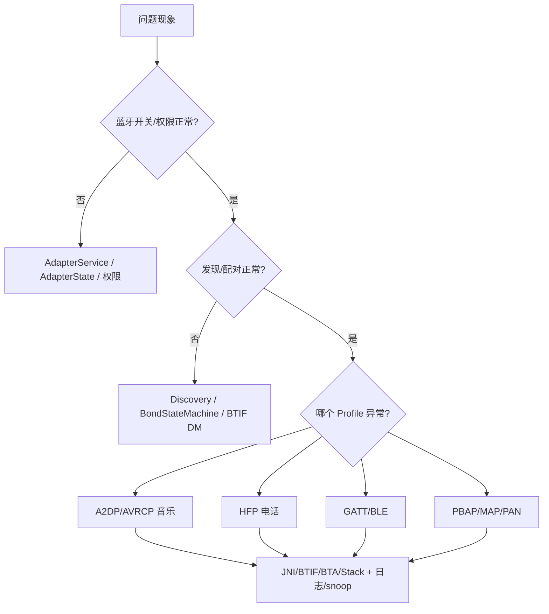

# 10. 故障排查手册：按现象定位 Android 车载蓝牙问题

## 1. 使用方法

这份手册按“现象 -> 先看什么 -> 源码入口 -> 常见原因”组织。排查时先不要急着猜底层协议栈，先确认问题落在哪一层：



## 2. 蓝牙打不开

| 观察项 | 入口 |
| --- | --- |
| Framework API 是否调用成功 | `BluetoothAdapter.enable()`，见 `framework/java/android/bluetooth/BluetoothAdapter.java` |
| Service 是否启动 | `AdapterService`、`AdapterState` |
| JNI 是否进入 | `android/app/jni/com_android_bluetooth_btservice_AdapterService.cpp` |
| Native 栈是否 up | `system/btif/src/stack_manager.cc`、`system/btif/src/bluetooth.cc` |

常见原因：

- 蓝牙进程未启动或 crash。
- 权限/用户状态不允许。
- Native 栈初始化失败。
- HCI HAL/controller bring-up 失败。

建议命令：

```bash
adb shell dumpsys bluetooth_manager
adb shell dumpsys bluetooth
adb logcat -b all | grep -i "AdapterService\|AdapterState\|bt_stack\|btif\|stack_manager"
```

## 3. 搜不到设备

Classic inquiry 看基础链路：

- `BluetoothAdapter.startDiscovery()`：`framework/java/android/bluetooth/BluetoothAdapter.java:1988`
- `system/btif/src/bluetooth.cc`：`start_discovery()`、`do_in_main_thread(btif_dm_start_discovery)`
- `system/btif/src/btif_dm.cc`：`btif_dm_start_discovery()`、`BTA_DmSearch(...)`

BLE scan 看第 7 章链路：

- `ScanController.startScan()`
- `ScanManager.startRegularScan()` / `startBatchScan()`
- `ScanNativeInterface`
- `com_android_bluetooth_scan.cpp`
- `BleScannerHciInterface`

常见原因：

- Classic 和 BLE 扫描类型混淆。
- 权限、定位、后台扫描限制。
- filter 过窄。
- 外设处于不可发现/不可连接状态。
- Controller 没有上报 inquiry result 或 advertising report。

## 4. 配对失败

| 入口 | 说明 |
| --- | --- |
| `BluetoothDevice.createBond()` | Framework 配对 API |
| `AdapterService.createBond()` | 检查蓝牙状态、调用方、transport |
| `BondStateMachine` | Java 配对状态机 |
| `AdapterNativeInterface.createBondNative()` | Java 到 JNI |
| `system/btif/src/bluetooth.cc:create_bond()` | BTIF 接口入口 |
| `system/btif/src/btif_dm.cc:btif_dm_create_bond()` | DM 配对入口 |
| `system/stack/smp` | BLE pairing/SMP |

优先确认：

- 配对前是否正在 discovery。
- transport 是 BR/EDR、LE 还是 AUTO。
- 对端是否已经保存旧 bond。
- 用户是否拒绝弹窗。
- SSP/SMP 失败 reason 是什么。

## 5. A2DP 已连但无声

| 观察项 | 入口 |
| --- | --- |
| Profile 是否 connected | `A2dpService.connect()`、`A2dpStateMachine` |
| 是否 active device | `A2dpService.setActiveDevice()`、`ActiveDeviceManager` |
| Native 是否 started | `btif_av_source_connect()`、`BtifAvStateMachine` |
| AVRCP 状态是否正常 | `AvrcpTargetService`、`AvrcpControllerService` |
| Audio 路由是否切到蓝牙 | `BluetoothProfileConnectionInfo` 相关调用点 |

常见原因：

- A2DP 连接成功但未设为 active。
- AVRCP 状态正常但 A2DP media channel 未 started。
- codec 协商异常。
- 远端 pause/suspend。
- 车机同时连接多个音频设备，活跃设备被切走。

## 6. 蓝牙电话无声或无法接打

| 现象 | 入口 |
| --- | --- |
| HFP 连不上 | `HeadsetClientService.connect()`、`btif_hf_client.cc` |
| SCO 建不起来 | `HeadsetClientService.connectAudio()`、`connect_audio` native |
| 拨号失败 | `HeadsetClientService.dial()`、`HeadsetClientStateMachine` |
| 来电状态不同步 | `messageFromNative()`、HFP Client callbacks |

常见原因：

- SLC 没建立。
- SCO codec/路由失败。
- 手机端电话权限或通话状态不允许。
- 车机同时存在 LE Audio/HFP handover，活跃设备切换异常。

## 7. BLE/GATT 失败

| 现象 | 入口 | 常见原因 |
| --- | --- | --- |
| 扫不到 | `ScanController`、`ScanManager` | filter、权限、地址类型、广播周期 |
| 连不上 | `GattService.clientConnect()`、`BTA_GATTC_Open()`、`GATT_Connect()` | 外设不可连接、地址类型、超时 |
| 服务发现空 | `discoverServices()`、`BTA_GATTC_ServiceSearch*()` | 外设未准备、UUID 过滤错误 |
| 读失败 | `readCharacteristic()`、`GATTC_Read()` | handle 错、权限/加密 |
| 写失败/busy | `writeCharacteristic()`、`GATTC_Write()` | 分包过快、未等回调、链路拥塞 |
| notify 收不到 | `registerForNotifications()`、CCCD descriptor | CCCD 未写、handle 错、外设未上报 |

OTA 类问题优先看 MTU、分包长度、write type、ack/notify 节奏。

## 8. 联系人/短信不同步

PBAP：

- `PbapClientService.connect()`
- `PbapClientStateMachine`
- `PbapClientObexClient.connect()`
- `BluetoothSocket.connect()`
- OBEX session connect

MAP：

- `MapClientService.connect()`
- `MceStateMachine`
- `MasClient.connect()`
- OBEX session connect

常见原因：

- 手机端未授权联系人/短信。
- SDP 记录缺失或端口变化。
- RFCOMM/L2CAP socket 失败。
- 对端主动断开 OBEX session。

## 9. 最小排查闭环

每个问题至少记录：

1. 设备地址、手机型号、Android 版本、是否首次配对。
2. 复现步骤和时间点。
3. `dumpsys bluetooth_manager`、`dumpsys bluetooth`。
4. 关键 logcat tag。
5. HCI snoop 是否包含对应链路事件。
6. 问题落在 Java、JNI、BTIF、BTA、Stack、Controller 还是外部 App。

## 10. 常用搜索命令

```bash
rg -n "connectA2dpNative|btif_av_source_connect|BTA_AvOpen" android system
rg -n "HeadsetClientService|connectAudio|btif_hf_client" android system
rg -n "clientConnect|gattClientConnectNative|BTA_GATTC_Open|GATT_Connect" android system
rg -n "createBond|BondStateMachine|btif_dm_create_bond|BTA_DmBond" android system
rg -n "PbapClientService|MapClientService|BluetoothSocket.connect" android/app/src
```

