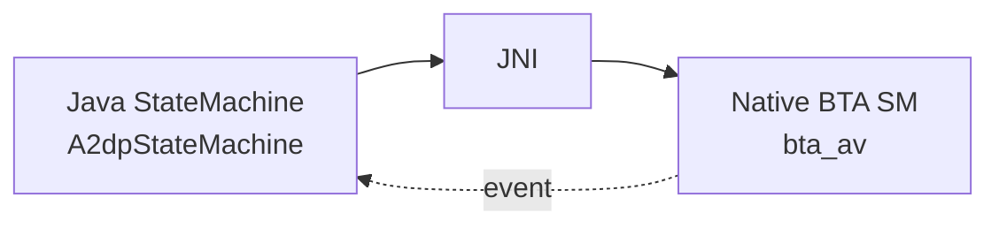

# 10.5 状态机模式（含 Android `StateMachine` 对照）

> 速通摘要：蓝牙系统**到处是状态机**。Java 端用 Android `com.android.internal.util.StateMachine`（层级、消息队列、`processMessage`）；Native 端用 BTA 风格"查表式状态机"或 C++ class-based 状态机。两者解决的都是**"事件 + 状态 → 动作 + 下一状态"**问题。

---

## 1. 学习目标

读完本节，你应该能：

1. 默写状态机模式的核心三要素（状态、事件、转换）。
2. 看懂 Android `StateMachine` 的 4 大概念（State / Message / processMessage / transitionTo）。
3. 看懂 BTA 查表式状态机的代码骨架。
4. 知道两套状态机如何在蓝牙业务中协作。

---

## 2. 前置知识

- 已读 03 章（核心流程里的 BondStateMachine / A2dpStateMachine）。
- 已读 05.2 BTA 状态机模式。

---

## 3. 状态机三要素

| 要素 | 含义 |
|------|------|
| **状态** | 系统当前的"模式"（如 BOND_NONE / BOND_BONDING / BOND_BONDED） |
| **事件** | 外部输入（用户操作、协议帧、定时器） |
| **转换** | 在状态 X 收到事件 Y → 做动作 + 进入状态 Z |

---

## 4. Android `StateMachine`

来源：`com.android.internal.util.StateMachine`（hidden API，但本仓子类 `BondStateMachine`、`A2dpStateMachine`、`AdapterState` 等都继承它）。

### 核心 API
```java
class MyStateMachine extends StateMachine {
    private final State mStateA = new StateA();
    private final State mStateB = new StateB();

    MyStateMachine(Looper looper) {
        super("MyStateMachine", looper);
        addState(mStateA);            // 加状态
        addState(mStateB, mStateA);   // 加子状态（层级）
        setInitialState(mStateA);
        start();
    }

    class StateA extends State {
        @Override public void enter()        { /* 进入状态 */ }
        @Override public void exit()         { /* 离开状态 */ }
        @Override public boolean processMessage(Message msg) {
            if (msg.what == EVENT_X) {
                transitionTo(mStateB);
                return HANDLED;
            }
            return NOT_HANDLED;   // 父状态处理
        }
    }
}
```

### 特性
- **层级状态机**：子状态没处理 → 父状态处理。
- **消息队列**：内部 Looper 串行处理 message，无线程安全担忧。
- **deferMessage()**：当前状态暂不处理，留给下一状态。

---

## 5. 蓝牙 Java 状态机实例

| 状态机 | 状态数 | 用途 |
|--------|--------|------|
| `AdapterState` | 7 子态 | 蓝牙开关（详 03.1） |
| `BondStateMachine` | 2 子态 (Stable / Pending) | 配对（详 03.3） |
| `A2dpStateMachine` | 4 (Disconnected / Connecting / Connected / Disconnecting) per device | A2DP 连接 |
| `HeadsetStateMachine` / `HeadsetClientStateMachine` | 多态 | HFP |
| `AvrcpControllerStateMachine` | 多态 | AVRCP Controller |
| `HidHostStateMachine` | 多态 | HID Host |

---

## 6. BTA 查表式状态机（C++）

回顾 05.2：
```cpp
// 状态 × 事件 → 动作 数组
static const tBTA_AV_SACT bta_av_st_init[][BTA_AV_NUM_ACTIONS] = {
    /* INIT state */
    /* API_OPEN_EVT */ { BTA_AV_DO_OPEN, ... },
    /* DISCONNECT_EVT */ { BTA_AV_DISCONNECT, ... },
};

void bta_av_sm_execute(tBTA_AV_SCB* scb, EVT event, DATA* data) {
    uint8_t* action_list = bta_av_st_<state>[event];
    while (*action_list != BTA_AV_IGNORE) {
        bta_av_actions[*action_list](scb, data);
        action_list++;
    }
    scb->state = bta_av_next_state[state][event];
}
```

**优点**：状态机定义一目了然（表格化）。
**缺点**：新增事件需要改表；不能轻易做层级状态。

---

## 7. 现代 C++ class-based 状态机

GD 框架内部更多用 C++ class 风格：
```cpp
class State {
public:
    virtual void Enter() {}
    virtual void Exit() {}
    virtual std::unique_ptr<State> HandleEvent(Event e) = 0;
};

class Disconnected : public State {
public:
    std::unique_ptr<State> HandleEvent(Event e) override {
        if (e.type == EventType::Connect) {
            return std::make_unique<Connecting>();
        }
        return nullptr;  // 不转换
    }
};
```

---

## 8. Java 与 C++ 状态机互译

| Java StateMachine | C++ BTA 查表 | C++ class-based |
|-------------------|--------------|----------------|
| `class StateA extends State` | `BTA_AV_INIT_ST` 枚举 | `class StateA : public State` |
| `processMessage(Message msg)` | 数组查 `bta_av_actions` | `HandleEvent(Event)` 虚函数 |
| `transitionTo(mStateB)` | `scb->state = NEXT` | `return std::make_unique<StateB>()` |
| `enter()` / `exit()` | `bta_av_actions[ENTER_EXIT]` | `Enter()` / `Exit()` |
| 内部 Looper | main_thread + `do_in_main_thread` | Handler/Reactor |

---

## 9. 蓝牙状态机协作



例：A2DP 连接，Java 状态机收 CONNECT 事件 → 调 native → BTA 状态机收到 `BTA_AV_API_OPEN_EVT` → ... → 最终回 Java 状态机 `A2DP_OPENED` 完成上一步转换。

---

## 10. 上路任务

### 任务 A：默写 Android StateMachine 4 大要素
不看本节，回答：State / Message / processMessage / transitionTo 分别干什么。

### 任务 B：读 BondStateMachine
打开 `android/app/src/com/android/bluetooth/btservice/BondStateMachine.java:65`，看 StableState 与 PendingCommandState 怎么 processMessage。

### 任务 C：在本仓找 BTA 状态机表
```bash
grep -rn "bta_av_st_\|state_table\|next_state_table" system/bta/ | head -10
```
任选一个状态机的表，画出"状态×事件"矩阵。

---

## 11. 本节小结（速记卡）

```
状态机三要素：State / Event / Transition
Java 端：Android StateMachine（层级、Looper、defer）
  - 4 大概念：State / Message / processMessage / transitionTo
  - 内部串行（线程安全自带）
Native 端两种风格：
  - BTA 查表式：state × event → action[]
  - GD class-based：virtual HandleEvent
两边协作：Java SM 调 native → BTA SM → callback 回 Java SM
本仓重要 Java SM：
  AdapterState / BondStateMachine / A2dpStateMachine
  HeadsetStateMachine / HeadsetClientStateMachine
  AvrcpControllerStateMachine
```
