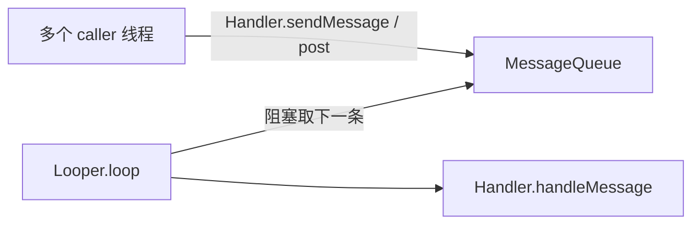

# 10.6 消息循环 / Looper / event loop（含 Android Handler 对照）

> 速通摘要：蓝牙是高度异步系统——所有业务跑在**单线程消息循环**（Java 端 `Looper + Handler` / Native 端 `main_thread + do_in_main_thread`）。理解事件循环 = 理解为什么蓝牙代码大量见到"投递任务"、`base::BindOnce`、`postDelayed`。

---

## 1. 学习目标

读完本节，你应该能：

1. 说清"事件循环"的本质。
2. 看懂 Android `Looper/Handler/MessageQueue` 三件套。
3. 看懂蓝牙 Native `do_in_main_thread` 与它的实现。
4. 在两边代码之间互译。

---

## 2. 前置知识

- 已读 10.1-10.5。
- 知道 Android `Handler.post(Runnable)`。

---

## 3. 事件循环的本质

```cpp
while (running) {
    Task task = queue.take();   // 阻塞取下一个任务
    task.run();                 // 执行
}
```

所有"消息循环"都是这五行代码的变体。**单线程顺序执行任务 → 无锁、可预测**。

---

## 4. Android 端：Looper / Handler / MessageQueue



| 类 | 角色 |
|----|------|
| `Looper` | 拥有线程的事件循环 |
| `MessageQueue` | FIFO 消息队列 |
| `Handler` | 给特定 Looper 投递消息 / 处理消息 |
| `Message` | 一条消息 |
| `HandlerThread` | 一个含 Looper 的线程 |

主线程默认有 Looper；其他线程要自己 `Looper.prepare() + Looper.loop()`。

```java
HandlerThread ht = new HandlerThread("BluetoothWorker");
ht.start();
Handler handler = new Handler(ht.getLooper()) {
    @Override public void handleMessage(Message msg) { ... }
};
handler.post(() -> doWork());
handler.sendMessageDelayed(msg, 5000);
```

---

## 5. 蓝牙 Java 端 Looper 使用

每个状态机都有自己的 Looper：
```java
// BondStateMachine.java
super("BondStateMachine:", looper);    // 用传入的 Looper
addState(mStableState);
...
start(false);   // 内部启动 Looper
```

`AdapterService` 内部维护多个 HandlerThread：
- 状态机 Looper
- AdapterProperties Looper
- 后台任务 Looper

---

## 6. Native 端：`main_thread` + `do_in_main_thread`

蓝牙 Native 有一个"主线程"承担 BTIF/BTA/Stack 业务。多线程访问要 post 到 main_thread：

```cpp
bt_status_t do_in_main_thread(base::OnceClosure closure);
bt_status_t do_in_main_thread_delayed(base::OnceClosure closure,
                                      std::chrono::microseconds delay);
```

底层实现：基于 GD `Handler` 或 chromium `base::SingleThreadTaskRunner`。

蓝牙真实例（思路图）：
```cpp
void btif_dm_create_bond(const RawAddress bd_addr, tBT_TRANSPORT transport) {
    do_in_main_thread(base::BindOnce(&bta_dm_bond,
                                     bd_addr, transport));
}
```

任何"业务"必须 post 到 main_thread。直接调（非 main_thread）= 数据竞争。

---

## 7. C++ vs Java 翻译表

| C++ Native | Java Android |
|-----------|------------|
| `do_in_main_thread(BindOnce(fn, args))` | `handler.post(() -> fn(args))` |
| `do_in_main_thread_delayed(closure, 5s)` | `handler.postDelayed(r, 5000)` |
| `main_thread_start_up()` | `Looper.prepare(); Looper.loop();` |
| `alarm_set(alarm, 1000, cb, data)` | `handler.sendMessageDelayed(...)` |
| `Module Handler` (GD) | `HandlerThread + Handler` |

---

## 8. 单线程模型的优势

- **无锁**：状态机内的所有数据不需要同步。
- **可预测**：每条消息原子处理。
- **易调试**：栈追踪线性、不会有跨线程死锁。

代价：长耗时任务会阻塞队列 → 不能在事件循环里做 IO / 大计算。蓝牙的解决：
- IO 投递到专用线程（A2DP 编解码、HCI 发送）。
- main_thread 只做控制流。

---

## 9. 蓝牙线程总览

```mermaid
flowchart TD
    Bin[Binder 线程<br/>(来自 system_server / App)]
    JNI[JNI 入口<br/>(蓝牙 App 进程)]
    Main[main_thread<br/>BTA/BTIF/Stack 业务]
    Hci[HCI 线程<br/>GD HciLayer]
    Hal[HAL 通信线程]
    A2dp[A2DP 编/解码线程]
    Sco[SCO 数据线程<br/>(若 SCO over HCI)]
    JLoop[Java 状态机 Looper×N]

    Bin --> JNI
    JNI --> JLoop
    JNI -->|do_in_main_thread| Main
    Main --> Hci --> Hal
    Main --> A2dp
    Main --> Sco
    JLoop -.JNI 反向回调.- JNI
```

---

## 10. 调试方法

| 想看 | 方法 |
|------|------|
| 主线程是否堵 | logcat 中 `do_in_main_thread` 报警 |
| Looper Backlog | 自己加 `MessageQueue.getMessages` |
| 状态机消息 | `dumpsys bluetooth_manager` → 各 SM 段最近 N 条 |
| 异步泄漏 | 看 `Handler` 数量、Message 数量 |

---

## 11. FAQ

**Q1：为什么不能在 main_thread 阻塞？**
A：会让所有蓝牙事件停摆——A2DP 不响应、HCI 命令排队、设备状态不更新。

**Q2：能否把蓝牙业务多线程化？**
A：理论可以，但牵涉大量数据保护重写。AOSP 设计就是单 main_thread。

**Q3：Handler 的 Looper 跟 main_thread 一样吗？**
A：每个 Looper 一条线程。蓝牙 Java 有多个 Looper（每个状态机/Service 自己一个）。

**Q4：`alarm` 与 `Handler.postDelayed` 同吗？**
A：思想同——都是延时调度。Native 的 `alarm` (`system/osi/alarm.cc`) 是 native 实现。

**Q5：Looper 退出怎么办？**
A：调 `Looper.quitSafely()` 让队列处理完再退；不要直接 `quit()`，会丢消息。

---

## 12. 上路任务

### 任务 A：找 do_in_main_thread 用例
```bash
grep -rn "do_in_main_thread" system/btif/ system/bta/ | head -10
```
任挑一个，理解"为何要 post"。

### 任务 B：写一个最小 HandlerThread
Java：开 HandlerThread + Handler + post 5 个延时任务，确认串行执行。

### 任务 C：阅读 system/btif/src/btif_core.cc
找 main_thread 启动函数（`main_thread_start_up` 或类似）。

---

## 13. 本节小结（速记卡）

```
事件循环本质：while(true) queue.take().run()
Android Java：Looper + MessageQueue + Handler
Native：main_thread + do_in_main_thread(base::OnceClosure)
单线程模型优势：无锁 / 可预测 / 易调试
代价：耗时任务必须移到专用线程（A2DP 编解码、HCI 发送、SCO 数据）

互译：
  do_in_main_thread(BindOnce(fn, arg))  ≈  handler.post(() -> fn(arg))
  do_in_main_thread_delayed             ≈  handler.postDelayed
  alarm_set                              ≈  handler.sendMessageDelayed

蓝牙线程：
  Binder → JNI → main_thread (业务)
                 + HCI 线程 + HAL 线程 + A2DP 编码线程 + SCO 线程
                 + 各 Java 状态机 Looper
```

至此 10 章 C++ 补课附录全部完成。下一站：**11 故障排查手册**。
