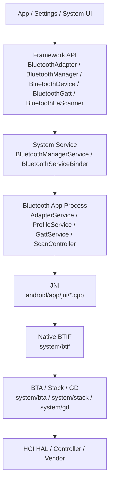
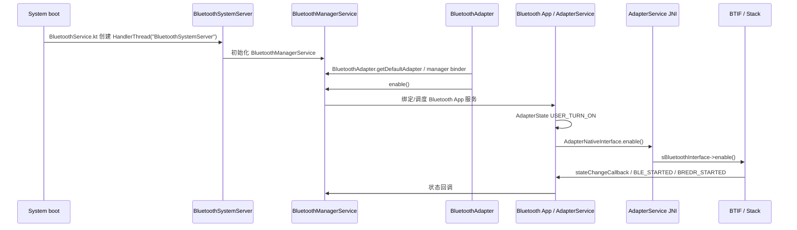
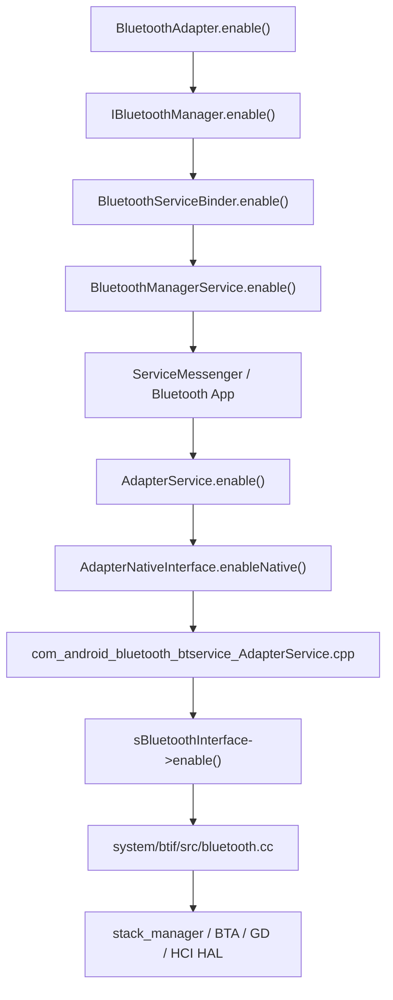
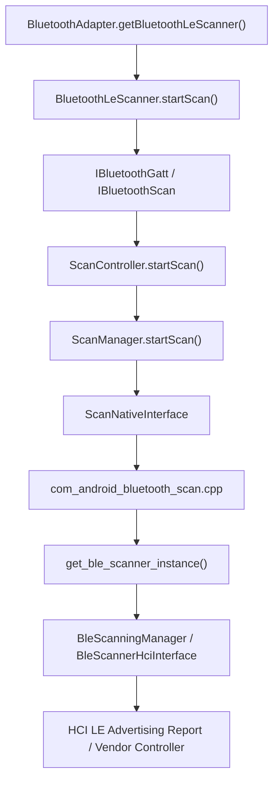
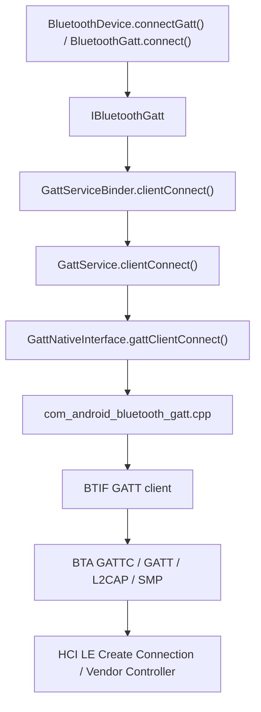
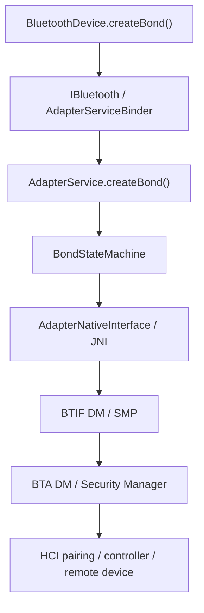
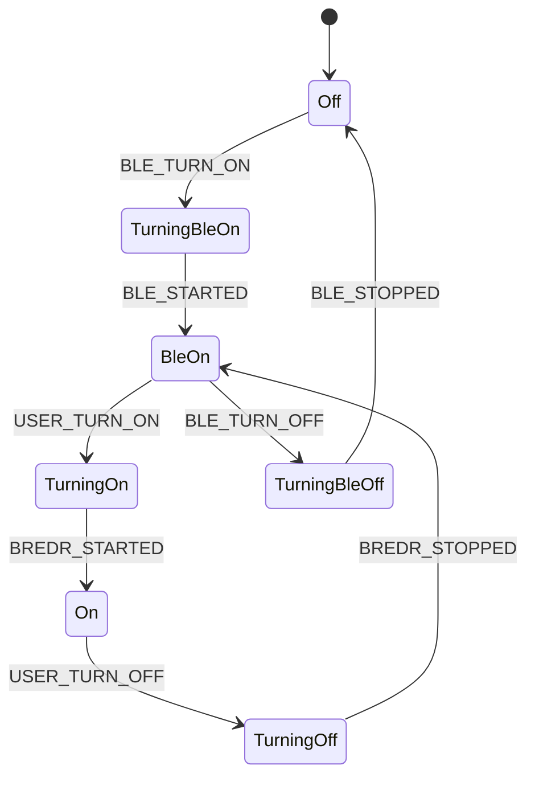
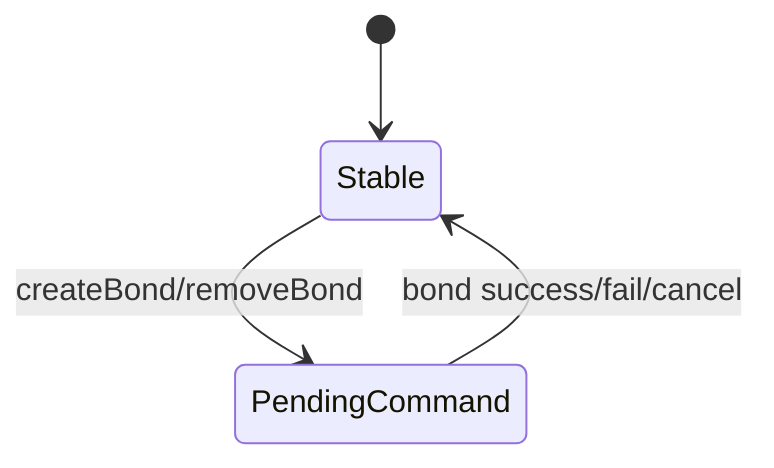
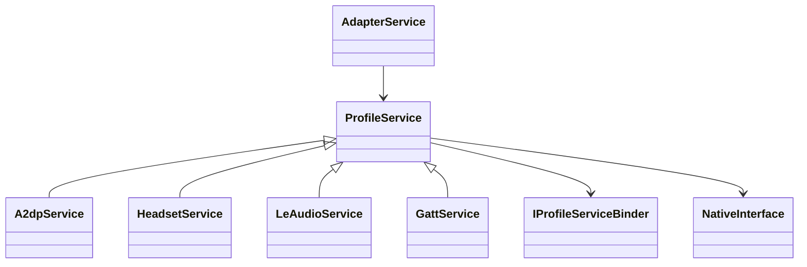

# 11-蓝牙 Framework 架构地图

## 1. 学习目标

读完本章后，你要能把一个蓝牙问题放到正确层级：是 App API 没拿到代理，还是 Framework 权限/Binder 边界被挡住，还是 Bluetooth 进程里的 Service/状态机没走到，还是 JNI/Native/HCI/Vendor 边界无响应。

本章是后续定向代码阅读报告的总地图，只做坐标系，不展开每个函数的全部细节。

## 2. 总分层地图



核心源码入口：

| 层级 | 关键路径 | 作用 |
| --- | --- | --- |
| App API | `framework/java/android/bluetooth/BluetoothAdapter.java` | 蓝牙开关、扫描入口、Profile 代理、`getBluetoothGatt()` |
| App API | `framework/java/android/bluetooth/BluetoothManager.java` | App 获取 `BluetoothAdapter`、打开 GATT Server |
| System Service | `service/src/com/android/server/bluetooth/BluetoothManagerService.java` | 管理 enable/disable、状态、active logs、dump |
| System Service Binder | `service/src/com/android/server/bluetooth/BluetoothServiceBinder.java` | Binder 入口，转到 `BluetoothSystemServer` 线程 |
| Bluetooth App | `android/app/src/com/android/bluetooth/btservice/AdapterService.java` | 蓝牙进程主服务，承接 Adapter、Profile、dumpsys |
| Bluetooth App | `android/app/src/com/android/bluetooth/btservice/AdapterState.java` | Adapter enable/disable 状态机 |
| GATT/Scan | `android/app/src/com/android/bluetooth/gatt/GattService.java`、`android/app/src/com/android/bluetooth/le_scan/ScanController.java` | BLE/GATT 主入口 |
| JNI | `android/app/jni/com_android_bluetooth_btservice_AdapterService.cpp`、`com_android_bluetooth_gatt.cpp`、`com_android_bluetooth_scan.cpp` | Java 与 Native 接口桥 |
| Native | `system/btif/src/bluetooth.cc`、`system/btif/src/btif_gatt.cc`、`system/btif/src/btif_ble_scanner.cc` | HAL 接口表、BTIF 分发 |
| Stack | `system/bta`、`system/stack`、`system/gd` | Profile、GATT、L2CAP、SMP、HCI 管理 |

## 3. 从开机到 BluetoothAdapter 可用

这里要区分四个状态：

- Framework 类可用：App 可以加载 `BluetoothAdapter`。
- Manager Binder 可用：`BluetoothAdapter` 能通过 manager service 发起请求。
- Bluetooth 进程服务可用：`AdapterService`、Profile、GATT 等已启动/绑定。
- Native stack 可用：`enableNative()` 到 `sBluetoothInterface->enable()` 之后，底层协议栈真正起来。



源码锚点：

- `service/src/BluetoothService.kt` 创建 `HandlerThread("BluetoothSystemServer")`。
- `service/src/com/android/server/bluetooth/BluetoothServiceBinder.java` 用 `postFromBinder(...)` 把 Binder 调用转到该线程。
- `framework/java/android/bluetooth/BluetoothAdapter.java` 的 `enable()` 调 `mManagerService.enable(...)`，`disable()` 调 `mManagerService.disable(...)`。
- `service/src/com/android/server/bluetooth/BluetoothManagerService.java` 的 `enable(...)`、`disable(...)` 是系统服务侧主入口。
- `android/app/src/com/android/bluetooth/btservice/AdapterService.java` 的 `enable()` 调 `mNativeInterface.enable()`，`disable()` 调 `mNativeInterface.disable()`。
- `android/app/src/com/android/bluetooth/btservice/AdapterNativeInterface.java` 的 `enableNative()`、`disableNative()` 映射到 JNI。
- `android/app/jni/com_android_bluetooth_btservice_AdapterService.cpp` 的 `enableNative()` 调 `sBluetoothInterface->enable()`，`disableNative()` 调 `sBluetoothInterface->disable()`。
- `system/btif/src/bluetooth.cc` 的 `enable()`、`disable()` 是 Native HAL interface 对外入口。

最容易踩的坑：

- `BluetoothAdapter` 对象存在，不代表蓝牙已开机。
- `isEnabled()` 返回 true，不代表某个 Profile 已启动完成。
- BLE only 状态和 BR/EDR fully on 状态不同，`AdapterState.java` 里有 `BLE_STARTED`、`BREDR_STARTED` 两阶段。
- Settings UI 的开关结果可能只是触发了请求，真正失败点可能在 Bluetooth 进程或 Native stack。

## 4. App API 到 Vendor 的完整调用路径

### 4.1 Adapter 开关路径



### 4.2 BLE Scan 路径



关键源码：

- `framework/java/android/bluetooth/BluetoothAdapter.java`：`getBluetoothLeScanner()`、`getBluetoothGatt()`。
- `framework/java/android/bluetooth/le/BluetoothLeScanner.java`：`startScan(...)`。
- `android/app/src/com/android/bluetooth/le_scan/ScanController.java`：`startScan(...)`、`stopScan(...)`、`forceRunSyncOnScanThread(...)`。
- `android/app/src/com/android/bluetooth/le_scan/ScanManager.java`：`startScan(...)`、`stopScan(...)`。
- `android/app/jni/com_android_bluetooth_scan.cpp`：`scanInitializeNative()` 获取 scanner interface。
- `system/btif/src/btif_ble_scanner.cc`：`get_ble_scanner_instance()`。
- `system/stack/btm/btm_ble_scanner.cc`：`BleScanningManager::Initialize(...)`。
- `system/stack/btm/ble_scanner_hci_interface.cc`：`BleScannerHciInterface::Initialize()`。

### 4.3 BLE Connect / GATT Client 路径



关键源码：

- `framework/java/android/bluetooth/BluetoothGatt.java`：GATT Client API 与 callback。
- `android/app/src/com/android/bluetooth/gatt/GattServiceBinder.java`：`clientConnect(...)`、`discoverServices(...)`、`readCharacteristic(...)`、`writeCharacteristic(...)`、`registerForNotification(...)`。
- `android/app/src/com/android/bluetooth/gatt/GattService.java`：`clientConnect(...)`、`discoverServices(...)`、`readCharacteristic(...)`、`writeCharacteristic(...)`、`registerForNotification(...)`。
- `android/app/src/com/android/bluetooth/gatt/GattNativeInterface.java`：Native GATT client/server 调用。
- `android/app/jni/com_android_bluetooth_gatt.cpp`：GATT JNI。
- `system/btif/src/btif_gatt.cc`：BTIF GATT 接口初始化。

### 4.4 Pairing / Bonding 路径



关键源码：

- `framework/java/android/bluetooth/BluetoothDevice.java`：`createBond()`、`removeBond()` 等 App API。
- `android/app/src/com/android/bluetooth/btservice/AdapterServiceBinder.java`：Adapter Binder 入口。
- `android/app/src/com/android/bluetooth/btservice/AdapterService.java`：配对相关服务逻辑。
- `android/app/src/com/android/bluetooth/btservice/BondStateMachine.java`：稳定态和配对中状态。
- `system/btif/src/btif_dm.cc`：设备管理、安全、bond event dump。
- `system/stack/smp`：LE SMP 相关逻辑。

## 5. 关键类图和状态机

### 5.1 Adapter 状态机

`AdapterState.java` 是理解开关机最重要的入口。典型状态和事件：



源码锚点：

- `android/app/src/com/android/bluetooth/btservice/AdapterState.java` 定义 `USER_TURN_ON`、`BLE_TURN_ON`、`BREDR_STARTED`、`BLE_STARTED`、`BREDR_STOPPED`、`BLE_STOPPED`。
- `TurningOnState` 收到 `BREDR_STARTED` 后进入 `OnState`。
- `TurningOffState` 收到 `BREDR_STOPPED` 后回到 `BleOnState`。

### 5.2 BLE Scan 模块

```mermaid
classDiagram
    BluetoothLeScanner --> IBluetoothGatt
    IBluetoothGatt --> ScanController
    ScanController --> ScannerMap
    ScanController --> ScanManager
    ScanManager --> ScanNativeInterface
    ScanNativeInterface --> "com_android_bluetooth_scan.cpp"
```

重点对象：

- `BluetoothLeScanner`：App 侧 API，负责封装 callback、PendingIntent、ScanSettings。
- `ScanController`：Bluetooth 进程内的扫描协调器，管理 scanner id、队列、PendingIntent scan。
- `ScanManager`：真正调度 start/stop regular/batch scan。
- `ScannerMap`、`AppScanStats`：dumpsys 中定位 App 扫描行为的关键对象。
- `ScanNativeInterface`、`com_android_bluetooth_scan.cpp`：JNI 边界。

最容易踩的坑：

- App 收不到结果，不等于控制器没有收到广播；可能是权限、过滤器、后台节流、scanner 注册失败或 callback 分发失败。
- `startScan()` 返回前的注册成功和后续 HCI advertising report 是两回事。
- PendingIntent scan 和 callback scan 在生命周期与重复注册判断上不同。

### 5.3 BLE Connect / GATT Client 模块

```mermaid
classDiagram
    BluetoothGatt --> IBluetoothGatt
    IBluetoothGatt --> GattServiceBinder
    GattServiceBinder --> GattService
    GattService --> ContextMap
    GattService --> HandleMap
    GattService --> GattNativeInterface
    GattNativeInterface --> "com_android_bluetooth_gatt.cpp"
```

重点对象：

- `BluetoothGatt`：App 侧连接、发现服务、读写、MTU、notify API。
- `GattServiceBinder`：Binder 权限和参数边界。
- `GattService`：连接、服务发现、读写、notify 注册的主入口。
- `ContextMap`：client/server callback 与连接上下文。
- `HandleMap`：服务、特征、描述符 handle 映射。
- `GattNativeInterface`：JNI 调用入口。

最容易踩的坑：

- `onConnectionStateChange(CONNECTED)` 不代表服务发现完成。
- `registerForNotification()` 不等于远端 CCCD 写成功。
- `writeCharacteristic()` 里存在每设备串行写保护，OTA 高频写容易被 permit、busy 或 ATT flow control 卡住。
- `GATT_SUCCESS` 只是当前操作状态，不能替代业务协议层确认。

### 5.4 Pairing / Bonding 模块



源码锚点：

- `BondStateMachine.java` 继承 `StateMachine`，包含 `StableState` 和处理配对命令的状态。
- `AdapterService` 负责与 `BondStateMachine`、`RemoteDevices`、Native DM 交互。
- `btif_dm.cc` 负责 Native 设备管理和 bond event dump。

最容易踩的坑：

- `BOND_BONDED` 不代表 Profile 一定能连接。
- 删除配对可能清掉 link key，但远端设备仍保留旧 bond，会导致下一次回连异常。
- 车机多用户、隐私地址、LE/BR 双模设备会让“同一个设备”的判断变复杂。

### 5.5 Profile Service 模块



常见模式：

- Profile Binder 做权限和 AttributionSource 检查。
- Profile Service 做策略、设备状态、数据库、广播和 Native 调用。
- Profile StateMachine 处理连接状态，典型状态是 `Disconnected`、`Connecting`、`Connected`、`Disconnecting`。
- Native callback 进入 `messageFromNative(...)`，再投递给对应状态机。

源码例子：

- `android/app/src/com/android/bluetooth/btservice/ProfileService.java`：统一 dump 和 Profile 基类。
- `android/app/src/com/android/bluetooth/a2dp/A2dpService.java`、`A2dpStateMachine.java`：A2DP 连接状态和 dump。
- `android/app/src/com/android/bluetooth/hfp/HeadsetService.java`、`HeadsetStateMachine.java`：HFP AG。
- `android/app/src/com/android/bluetooth/hfpclient/HeadsetClientService.java`、`HeadsetClientStateMachine.java`：HFP Client。
- `android/app/src/com/android/bluetooth/le_audio/LeAudioService.java`、`LeAudioStateMachine.java`：LE Audio 设备/组状态。

最容易踩的坑：

- Profile connected 不等于业务可用，例如 A2DP connected 不代表 audio active，HFP connected 不代表 SCO open。
- Active device 可能被 A2DP、HFP、LeAudio、AudioManager、策略层共同影响。
- StateMachine 日志通常比单条 broadcast 更可靠。

## 6. 线程模型

| 线程/执行环境 | 关键源码 | 作用 | 排查关注 |
| --- | --- | --- | --- |
| Binder 线程池 | AIDL/Stub 调用入口 | 接收跨进程调用 | 不要在 Binder 线程做重活，确认是否转发 |
| `BluetoothSystemServer` | `service/src/BluetoothService.kt`、`BluetoothServiceBinder.java` | system server 侧蓝牙管理线程 | enable/disable、dump、active logs |
| Adapter 状态机线程 | `AdapterState.java` | Adapter on/off 状态迁移 | `BLE_STARTED`、`BREDR_STARTED` 是否到达 |
| GATT HandlerThread | `GattService.java` 的 `HandlerThread("Bluetooth LE")` | GATT client/server 连接和操作 | 连接上下文、写串行、callbackToApp |
| Scan HandlerThread | `ScanController.java` 的 `HandlerThread("BluetoothScanManager")` | BLE scan 注册、启动、停止、dump | scan queue、scanner id、AppScanStats |
| Profile StateMachine 线程 | A2DP/HFP/LeAudio 等 Service | Profile 连接状态 | per-device 状态机是否存在 |
| JNI callback 线程 | `do_in_jni_thread(...)`、各 JNI callback | Native 回调 Java | callback 对象是否还有效 |
| Native main thread | `do_in_main_thread(...)`、BTIF/BTA | Native 内部串行化调度 | 操作是否投递到主线程 |
| HCI/GD 线程 | `system/gd`、HCI layer | Controller 事件收发 | snoop 与 stack log 对齐 |

关键锁和同步点：

- `BluetoothServiceBinder.postFromBinder(...)` 把 Binder 调用同步/异步转给系统蓝牙线程。
- `ScanController.forceRunSyncOnScanThread(...)` 用于在 scan 线程同步执行 dump/清理。
- `GattService` 对每个设备的写操作做串行保护，`writeCharacteristic()` 中会出现 permit 相关日志。
- Profile Service 常见 `synchronized (mStateMachineMap)`、`synchronized (mDeviceStateMap)`，排查死锁或状态丢失时要关注锁粒度。

## 7. dumpsys、log tag 与排查入口

### 7.1 常用命令

```bash
adb shell dumpsys bluetooth_manager
adb shell dumpsys bluetooth
adb logcat -b all | grep -i "Bluetooth"
adb bugreport bugreport.zip
adb shell dumpsys activity services | grep -i bluetooth
```

### 7.2 dump 入口

| dump | 源码入口 | 内容 |
| --- | --- | --- |
| `dumpsys bluetooth_manager` | `BluetoothManagerService.dump(...)` | Manager 状态、active logs、服务连接状态 |
| `dumpsys bluetooth` | `AdapterBinder.dump(...)` -> `AdapterService.dump(...)` | Adapter、Profile、GATT、Scan、Native dump |
| Adapter dump | `AdapterService.dump(...)` | AdapterProperties、RemoteDevices、AdapterState、Profile dumps |
| GATT dump | `GattService.dump(...)` | AdvertiseManager、ClientMap、ServerMap、HandleMap |
| Scan dump | `ScanController.dump(...)`、`ScannerMap.dump(...)`、`AppScanStats.dump(...)` | App scan、scanner id、settings、统计 |
| Native dump | `AdapterNativeInterface.dump(...)` -> `sBluetoothInterface->dump(...)` | BTIF/BTA/GATT/A2DP/connection/native 状态 |

### 7.3 常见 log tag

| 模块 | 常见 tag |
| --- | --- |
| Framework API | `BluetoothAdapter`、`BluetoothDevice`、`BluetoothGatt`、`BluetoothLeScanner` |
| System Service | `BluetoothSystemServer`、`BluetoothManagerService`、`BluetoothServiceBinder` |
| Adapter | `BtAdapterService`、`BtAdapterState`、`BtBondStateMachine`、`BtRemoteDevices` |
| BLE Scan | `BluetoothLeScanner`、`ScanController`、`ScanManager`、`ScannerMap`、`BluetoothScanJni` |
| GATT | `GattService`、`GattServiceBinder`、`GattNativeInterface`、`HandleMap` |
| Profile | `A2dpService`、`A2dpStateMachine`、`HeadsetService`、`HeadsetStateMachine`、`LeAudioService`、`LeAudioStateMachine` |
| Native | `btif_*`、`bta_*`、`btm_*`、`gd_*`、各 JNI `Bluetooth*Jni` |

## 8. 分层排查路径

### 8.1 蓝牙打不开

1. 看 `dumpsys bluetooth_manager`：Manager 是否收到 enable 请求，active logs 是否记录来源。
2. 看 `BluetoothServiceBinder`：Binder 权限或调用方是否被拒。
3. 看 `AdapterState`：是否卡在 `TurningBleOn`、`TurningOn`。
4. 看 `AdapterService`：`mNativeInterface.enable()` 是否调用。
5. 看 JNI/Native：`enableNative()`、`sBluetoothInterface->enable()` 是否成功。
6. 看 HCI/snoop/vendor log：controller 是否上电或初始化失败。

### 8.2 BLE 扫不到

1. 看 App 是否真正调用 `BluetoothLeScanner.startScan()`。
2. 看 `ScanController` 是否注册 scanner id。
3. 看 `ScanManager` 是否启动 regular/batch scan。
4. 看 `BluetoothScanJni` 是否进入 Native scanner。
5. 看 snoop 是否有 LE Advertising Report。
6. 如果 snoop 有、App 没有，回看权限、过滤器、节流、callback 分发。

### 8.3 BLE/GATT 连接失败

1. 看 `BluetoothGatt` 是否注册 client。
2. 看 `GattService.clientConnect()` 是否有 callback/app 上下文。
3. 看 `ContextMap` 是否建立 connection。
4. 看 Native GATT connect 是否发出。
5. 看 SMP/pairing 是否需要加密或 bond。
6. 看 snoop 是否有 LE Create Connection、LL timeout、ATT error。

### 8.4 配对失败或回连异常

1. 看 `BondStateMachine` 是否进入配对中状态。
2. 看 `RemoteDevices` 是否保存地址、类型、alias、bond state。
3. 看 `btif_dm` bond event dump。
4. 看 snoop 中 Pairing Request/Response、Encryption、Key Distribution。
5. 对车机场景，确认远端是否保留旧 bond，是否需要双端删除配对。

## 9. 模块高频坑总表

| 模块 | 最容易踩的坑 | 证据入口 |
| --- | --- | --- |
| Adapter | Framework 可用不等于 Native stack ready | `BluetoothAdapter`、`BluetoothManagerService`、`AdapterState` |
| Enable/Disable | BLE only 与 full on 混淆 | `AdapterState.java` |
| Scan | 注册成功不等于收到广播 | `ScanController.dump()`、snoop |
| Scan | 后台扫描、位置权限、filter 导致 App 无结果 | `BluetoothLeScanner`、`ScanManager`、AppOps |
| GATT Connect | connected 不等于 services discovered | `GattService.clientConnect()`、`discoverServices()` |
| GATT Write | OTA 高频写被串行/ATT busy 卡住 | `GattService.writeCharacteristic()`、snoop |
| Notify | Java 注册不等于 CCCD 写成功 | `registerForNotification()`、ATT Write Request |
| Pairing | bonded 不等于 Profile 可连 | `BondStateMachine`、Profile StateMachine |
| Profile | Profile connected 不等于业务音频/电话可用 | Profile dump、Audio/SCO 状态 |
| dumpsys | 单看 manager dump 容易漏掉 Bluetooth App/native dump | `dumpsys bluetooth_manager` + `dumpsys bluetooth` |
| Vendor | 当前仓库无法证明私有 controller/firmware 行为 | 必须结合 snoop、vendor log、硬件配置 |

## 10. 定制开发切入点

| 目标 | 优先看文件 | 修改思路 | 风险 |
| --- | --- | --- | --- |
| 调整开关策略 | `BluetoothManagerService.java`、`AdapterState.java`、`AdapterService.java` | 明确请求来源、状态迁移、失败回滚 | 影响系统设置、开机自启、BLE only |
| 增加扫描诊断 | `BluetoothLeScanner.java`、`ScanController.java`、`ScanManager.java` | 增加 scanner id、package、filter、throttle 日志 | 日志量过大、隐私信息 |
| 调整 GATT OTA 节奏 | `GattService.java`、App 业务层 | 控制 write 串行、MTU、重试、超时 | 降速、兼容性、功耗 |
| 配对失败增强日志 | `BondStateMachine.java`、`btif_dm.cc` | 打通 Java bond state 与 Native reason | 可能暴露地址/密钥相关敏感信息 |
| Profile 连接策略 | 对应 `*Service.java`、`*StateMachine.java`、`DatabaseManager.java` | 修改连接策略、active 选择、回连顺序 | 多 Profile 互相影响 |
| dumpsys 增强 | `AdapterService.dump()`、Profile `dump()` | 增加状态、计数、最后失败原因 | dump 过长、锁顺序风险 |

## 11. 练习题与参考答案

### 练习 1：画出蓝牙打开主链路

要求：从 `BluetoothAdapter.enable()` 开始，写到 Native `sBluetoothInterface->enable()`。

参考答案：

`BluetoothAdapter.enable()` -> `IBluetoothManager.enable()` -> `BluetoothServiceBinder.enable()` -> `BluetoothManagerService.enable()` -> Bluetooth App/`AdapterService.enable()` -> `AdapterNativeInterface.enableNative()` -> `com_android_bluetooth_btservice_AdapterService.cpp` -> `sBluetoothInterface->enable()` -> `system/btif/src/bluetooth.cc`。

### 练习 2：判断“扫不到设备”应该先看哪个 dump

参考答案：

先组合看 `dumpsys bluetooth` 里的 Scan/ScannerMap/AppScanStats，再看 logcat 的 `BluetoothLeScanner`、`ScanController`、`ScanManager`。如果怀疑底层没有广播，再看 btsnoop 是否有 LE Advertising Report。只看 `dumpsys bluetooth_manager` 不够，因为它更偏系统服务和 enable/disable 状态。

### 练习 3：解释 bonded、connected、业务可用的区别

参考答案：

`bonded` 只说明配对/密钥层完成；`connected` 要看具体 Profile 或 GATT 连接状态；业务可用还需要服务发现、音频路由、SCO、CCCD、ATT 读写等业务条件成立。例如 HFP bonded 且 connected，不代表 SCO audio 已 open；GATT connected 不代表服务发现和 notify 都可用。

### 练习 4：如果要给 BLE OTA 增加诊断日志，优先看哪些文件

参考答案：

优先看 `BluetoothGatt.java`、`GattServiceBinder.java`、`GattService.java`、`GattNativeInterface.java` 和 `com_android_bluetooth_gatt.cpp`。如果问题表现为写入 busy 或吞吐下降，重点看 `GattService.writeCharacteristic()` 的串行写保护、MTU、回调状态、snoop ATT Write Request/Response。

## 12. 下一步阅读

建议按这个顺序读定向报告：

1. `12-定向代码阅读报告-BLE-Scan.md`
2. `13-定向代码阅读报告-BLE-Connect.md`
3. `14-定向代码阅读报告-Pairing-Bonding.md`
4. `15-定向代码阅读报告-GATT-Client.md`
5. `16-定向代码阅读报告-Enable-Disable.md`

读完本章后，不要急着背源码文件。更重要的是形成一个习惯：每个问题都先问“它卡在 App、Binder、Service、JNI、Native、Controller 哪一层”。
