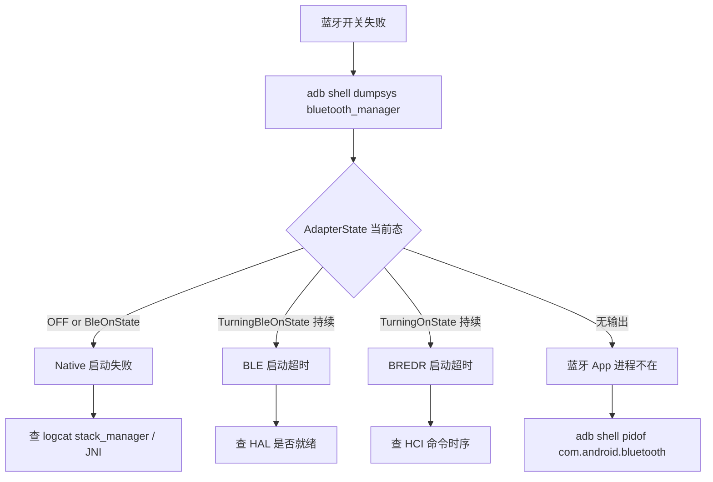

# 11.1 开机不可用 / 开关失败

> 速通摘要：现象：用户点开关，UI 一直 TURNING_ON 不到 ON，或开了立刻自己关。**先查 4 步：dumpsys 状态机 → logcat 启动序列 → BTSnoop HCI Reset → HAL 进程**。本节给一套"五分钟自检表"。

---

## 1. 学习目标

读完本节，你应该能：

1. 5 分钟内确定开关失败是哪一层的事。
2. 知道 4 个典型根因与对应修复。

---

## 2. 现象分类

| 现象 | 暗示哪一层 |
|------|----------|
| UI 一直 TURNING_ON | AdapterState 卡在 TurningBleOnState 或 TurningOnState |
| TURNING_ON → 立即 OFF | Native 启动失败被 BLE_START_TIMEOUT |
| 开了一秒又自动关 | BluetoothManagerService 触发重启策略 |
| 完全无响应 | 蓝牙 App 进程拉不起来 |
| dumpsys 输出空 | system_server 与蓝牙 App Binder 没连上 |

---

## 3. 5 分钟自检流程



---

## 4. 根因 1：HAL 进程没起来

```bash
adb shell ps -A | grep bluetooth-service
# 期望：android.hardware.bluetooth-service.<vendor> 在跑
```

如果没在跑：
- 检查 init.rc 配置（HAL service 启动条件）。
- 检查 selinux deny。
- 联系芯片厂商。

修法（车机现场）：
```bash
adb shell start vendor.bluetooth-1-0
# 或重启系统
```

---

## 5. 根因 2：HCI Reset 没回

抓 BTSnoop，应看到：
```
HCI_Reset Cmd
HCI_Reset Complete Event (status=success)
HCI_Read_Local_Version_Information Cmd
...
```

如果 HCI Reset 没回：
- UART 配线问题。
- 芯片固件挂了（power cycle）。
- HAL 进程 hang。

---

## 6. 根因 3：BLE_START_TIMEOUT / BREDR_START_TIMEOUT

`AdapterState.java` 内：
```java
static final int BLE_START_TIMEOUT_DELAY = 4000 * SystemProperties.getInt("ro.hw_timeout_multiplier", 1);
```

默认 4 秒。timeout 后状态机回 BleOn 或 Off。

修法：
- 排查 native 启动逻辑（看 `stack_manager.cc:198 init_stack_internal` 内卡在哪个 module_start_up）。
- 临时增大 `ro.hw_timeout_multiplier`（仅调试）。

---

## 7. 根因 4：BluetoothManagerService 反复重启

```bash
adb logcat -s BluetoothManagerService BluetoothService BluetoothSupervisor
```

找关键字 `CRASH` / `RESTART` / `Killing bluetooth`。如果反复重启：
- 蓝牙 App 进程在启动时崩溃 → 看 tombstone（`/data/tombstones/`）。
- 配置文件错（`bt_stack.conf`）。
- aconfig flag 冲突。

---

## 8. 调试方法（综合）

```bash
# 1. 状态机
adb shell dumpsys bluetooth_manager | grep -A 10 AdapterState

# 2. 蓝牙 App 进程
adb shell pidof com.android.bluetooth

# 3. HAL 进程
adb shell ps -A | grep bluetooth

# 4. logcat 启动
adb logcat -c
adb shell svc bluetooth disable && sleep 2 && adb shell svc bluetooth enable
adb logcat -d | grep -E "AdapterState|stack_manager|BluetoothService|init_stack|JNI"

# 5. tombstone
adb shell ls /data/tombstones/ | tail -3
```

---

## 9. 上路任务

### 任务 A：自我熟悉自检脚本
按 §3-§8 走一遍正常开关，记录每一步预期输出。下次出问题时对照 diff。

### 任务 B：制造一次失败（仅测试机）
临时改 `bt_stack.conf` 写一个错值，开蓝牙看是否报 init_stack 失败。

### 任务 C：阅读 AdapterState
打开 `android/app/src/com/android/bluetooth/btservice/AdapterState.java`，确认 timeout 处理路径。

---

## 10. 本节小结（速记卡）

```
开关失败 4 大根因：
  ① HAL 进程没起来 → ps -A | grep bluetooth-service
  ② HCI Reset 没回 → btsnoop
  ③ Native 启动超时 → stack_manager / BLE_START_TIMEOUT
  ④ 反复 crash 重启 → tombstone + BluetoothManagerService log
5 分钟自检：dumpsys → logcat → btsnoop → 进程列表
关键命令：dumpsys bluetooth_manager / pidof com.android.bluetooth
```
