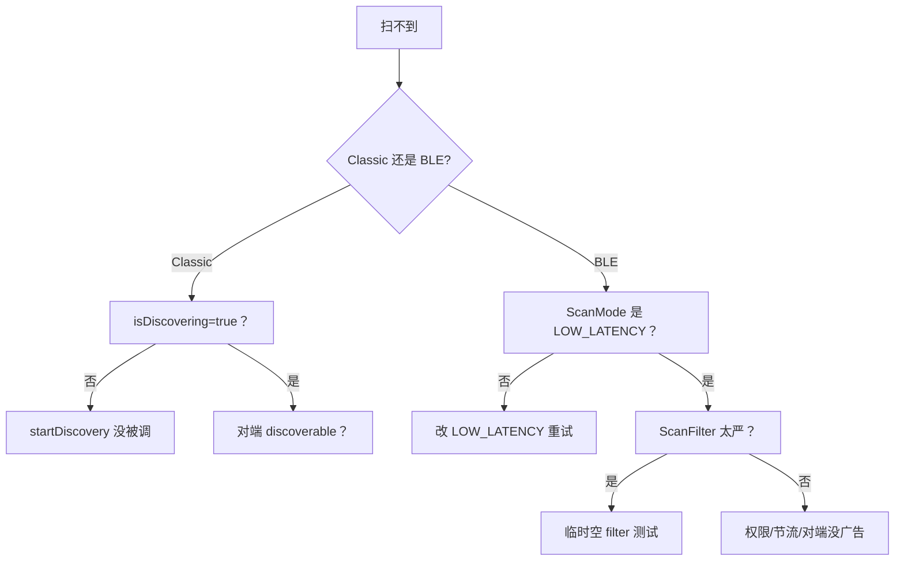

# 11.2 扫描不到设备

> 速通摘要：扫不到分 Classic 和 BLE 两种。Classic 看 `startDiscovery` 是否在跑、对端是否 Discoverable、是否有 RF 干扰。BLE 看 ScanMode、ScanFilter、对端是否在广告、权限。

---

## 1. 学习目标

读完本节，你应该能：

1. 区分"Classic 扫不到"与"BLE 扫不到"两类。
2. 默写 6 种常见根因与对应修法。

---

## 2. Classic 扫不到

### 根因 1：startDiscovery 没调
```bash
adb shell dumpsys bluetooth_manager | grep -i "isDiscovering"
```
确认是 true。

### 根因 2：对端没 Discoverable
对端必须 `setScanMode(SCAN_MODE_CONNECTABLE_DISCOVERABLE)`。手机默认在"蓝牙设置"打开时 discoverable 几分钟。

### 根因 3：Inquiry 周期没结束
Classic Inquiry 物理周期 12 秒。扫到设备会逐个回；中途不能查询"已发现列表"。

### 根因 4：RF 干扰 / 距离
2.4 GHz Wi-Fi 强、蓝牙天线远 → 几乎扫不到。

---

## 3. BLE 扫不到

### 根因 1：对端没广告
用 nRF Connect 旁站验证。

### 根因 2：ScanMode 太省电
`SCAN_MODE_LOW_POWER` 在后台占空比 ~5%，扫到要 ≥ 10 秒。改 `LOW_LATENCY` 测试。

### 根因 3：ScanFilter 太严
临时改空 filter 测试。

### 根因 4：权限缺失
Android 12+ 必须 `BLUETOOTH_SCAN`；旧 SDK 需 `ACCESS_FINE_LOCATION`。

### 根因 5：30s 限 5 次节流
App 30 秒内 startScan/stopScan 超过 5 次会被节流。logcat 搜 `Reset scan throttling`。

### 根因 6：BLE 没启用
蓝牙整体关 / BLE 子系统 Failed。`dumpsys` 看 `AdapterState`。

---

## 4. 排查流程



---

## 5. 工具速查

```bash
# 看正在扫描的 client
adb shell dumpsys bluetooth_manager | grep -A 20 "Scan Stats"

# 看节流情况
adb logcat -s BluetoothLeScanner | grep -i throttl

# nRF Connect 验证对端广告

# 设 LOW_LATENCY 临时改 priority
# 通过 App 接口 setScanMode(LOW_LATENCY)
```

---

## 6. FAQ

**Q1：扫到的 BLE 设备地址每次都不一样？**
A：RPA（Random Resolvable Address）。配对后栈用 IRK 解析；未配对时只能按 UUID/Name/ManufacturerData 匹配。

**Q2：startDiscovery 返回 true 但没回调？**
A：① 蓝牙状态没就绪 ② 节流 ③ 已经在扫描中。

---

## 7. 上路任务

任务 A：分别用 Classic 和 BLE 扫描方式扫同一台手机，对比效果。
任务 B：故意把 ScanFilter 设错（UUID 错一位），看扫不到。
任务 C：写一个"扫描诊断脚本"自动跑 §5 全部命令。

---

## 8. 本节小结

```
Classic 6 根因：未调 / 对端不 discoverable / 周期未到 / RF 干扰
BLE 6 根因：对端没广告 / Mode 过省电 / Filter 太严 / 权限 / 节流 / 蓝牙没开
```
