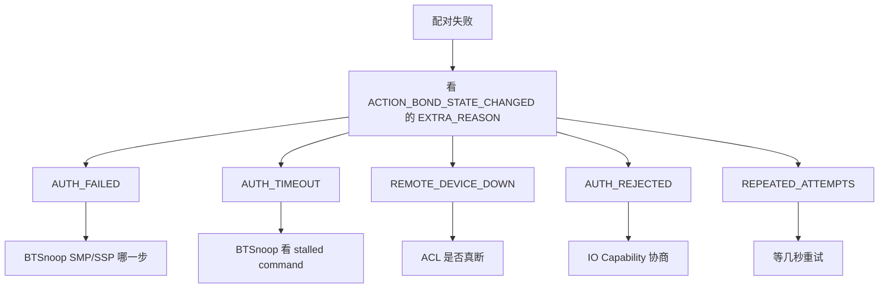

# 11.3 配对失败

> 速通摘要：配对失败 = `ACTION_BOND_STATE_CHANGED` 从 BONDING 回到 NONE，附带 `EXTRA_REASON`。根据 reason 不同分 6 类，每类有对应排查路径。

---

## 1. 学习目标

读完本节，你应该能：

1. 默写 `UNBOND_REASON_*` 5-6 种常见值。
2. 根据 reason 选对排查路径。
3. 在 BTSnoop 中找到 SSP / SMP 失败的具体一步。

---

## 2. UNBOND_REASON 速查

| 常量 | 触发 | 修法方向 |
|------|------|---------|
| `UNBOND_REASON_AUTH_FAILED` | 双方 PIN/Key 不匹配 | 检查 key 派生；清 `bt_config.conf` 重试 |
| `UNBOND_REASON_AUTH_REJECTED` | 一方拒绝 | UI 弹窗用户拒了；或 IO capability 不匹配 |
| `UNBOND_REASON_AUTH_CANCELED` | 用户取消 | 正常路径 |
| `UNBOND_REASON_REMOTE_DEVICE_DOWN` | 对端不可达 | 物理距离 / RF 干扰 |
| `UNBOND_REASON_AUTH_TIMEOUT` | 超时未回 | 看 BTSnoop 哪一步 |
| `UNBOND_REASON_REPEATED_ATTEMPTS` | 短时间多次失败 | 等几秒重试 |
| `UNBOND_REASON_REMOVED` | 主动 removeBond | 正常 |

---

## 3. 排查流程



---

## 4. 排查路径详解

### 4.1 AUTH_FAILED
- BTSnoop 看 SSP 时序：`SSP_Confirmation_Request` → 双方各发 `SSP_Confirmation_Reply`。
- 如果一边 reply 0（拒绝） → IO Capability 协商或用户拒绝。
- BLE 时看 SMP：`Pairing_Request` → `Pairing_Response` → `Pairing_Confirm` → `Pairing_Random` → `Pairing_Failed`（status code 反映原因）。

### 4.2 AUTH_TIMEOUT
- BTSnoop 找最后一条 HCI command；如果 30 秒没下一帧 → 对端不响应。
- 可能：对端蓝牙偶发崩溃；RF 中断。

### 4.3 REMOTE_DEVICE_DOWN
- ACL 直接断了。看 `Disconnect_Complete` 状态码。

### 4.4 AUTH_REJECTED
- IO Capability 不匹配（一方 Display + 一方 NoIO → Just Works，可能不被允许）。
- 看 `bta_dm_cfg.cc` IO Capability 默认设置。

### 4.5 REPEATED_ATTEMPTS
- 连续 N 次失败后栈自我冷却 30 秒。等待后重试。

---

## 5. 工具

```bash
# 1. EXTRA_REASON 查看
# 在 App 里把 BroadcastReceiver 改成：
# Log.i(TAG, "reason = " + intent.getIntExtra(BluetoothDevice.EXTRA_REASON, -1));

# 2. logcat
adb logcat -s BluetoothBondStateMachine bt_btif_dm bt_btm_sec bt_smp

# 3. BTSnoop
# Wireshark 过滤：btsmp.opcode

# 4. bt_config.conf
adb shell cat /data/misc/bluedroid/bt_config.conf  # 看是否残留半成品
```

---

## 6. 上路任务

任务 A：故意输错 PIN，触发 AUTH_FAILED，记录 BTSnoop 时序。
任务 B：找出本仓 `bta_dm_cfg.cc` 内 IO Capability 默认值。
任务 C：写一段"配对失败自动报告"代码，收到 BOND_STATE_CHANGED 时打印完整调试包。

---

## 7. 本节小结

```
配对失败必看：EXTRA_REASON
6 类 reason：AUTH_FAILED / AUTH_TIMEOUT / AUTH_REJECTED / REMOTE_DEVICE_DOWN / REPEATED_ATTEMPTS / AUTH_CANCELED
工具：BondStateMachine log + BTSnoop btsmp / btsspe + bt_config.conf
```
