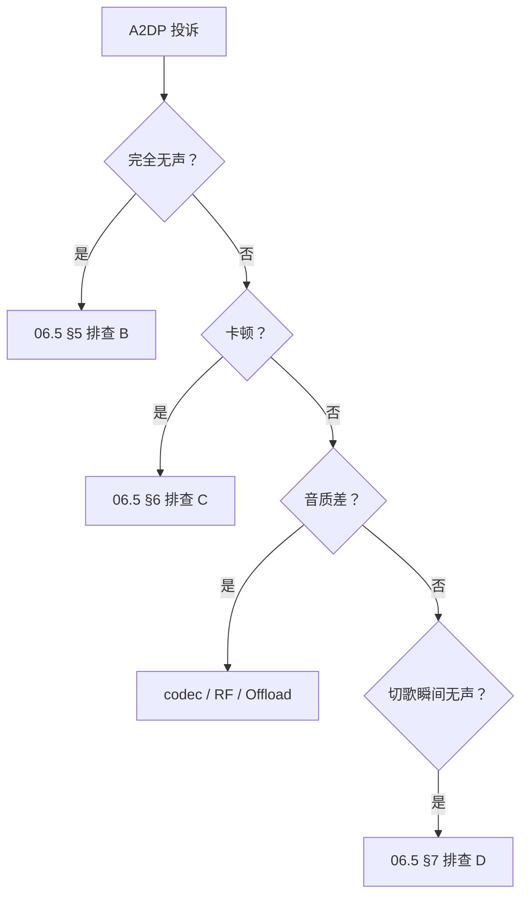

# 11.4 A2DP 无声 / 卡顿

> 速通摘要：复用 06.5 的 4 步路径——dumpsys、btsnoop、logcat、Audio HAL。本节是 06.5 的"故障排查手册版"快速指引。

---

## 1. 学习目标

- 从用户描述（"听不见"/"卡顿"/"音质差"）秒切到具体排查路径。
- 5 个高频 case 直接给修法。

---

## 2. 一键决策树



详见 [06.5 卡顿/无声排查手册](../06_A2DP与AVRCP/06.5_卡顿无声排查手册.md)。本节只给"5 case 快查表"。

---

## 3. 5 case 快查表

| Case | 优先排查 | 典型修法 |
|------|---------|---------|
| 完全无声 | Active device + Audio Route + PLAYING | `setActiveDevice` + `dumpsys audio` |
| 一直卡顿 | ACL 重传率 + codec | 切 SBC + 关 Offload 测 |
| 间歇 1-2s 静音 | RF 干扰 | 关 Wi-Fi 2.4GHz / 远离干扰源 |
| 切歌 100ms 无声 | AVRCP/AVDTP 时序 | PassThrough vs Suspend 时序 |
| 通话后回不来 | ActiveDeviceManager + A2dpService.resume | 看是否调用 setActiveDevice |

---

## 4. 工具速查

```bash
# 一次性诊断
adb shell dumpsys bluetooth_manager > /tmp/bt.txt
adb shell dumpsys audio > /tmp/audio.txt
adb shell dumpsys media.audio_flinger > /tmp/af.txt
adb pull /data/misc/bluetooth/logs/btsnoop_hci.log /tmp/

# logcat 关键 tag
adb logcat -s BluetoothA2dpService bt_btif_av bt_bta_av bt_a2dp bt_avdt audio
```

---

## 5. 上路任务

任务 A：跑一次正常 A2DP，记录"基线"dumpsys；下次出问题 diff。
任务 B：用 `setprop persist.bluetooth.a2dp_offload.disabled true` 切软件路径，对比与 Offload 路径的 dumpsys 差异。
任务 C：归档过去你处理过的所有 A2DP 投诉，按 §3 五类分一遍。

---

## 6. 本节小结

```
A2DP 投诉 5 case 速查：无声 / 卡顿 / 间歇静音 / 切歌静音 / 通话后不回
详细路径见 06.5
工具：dumpsys bluetooth_manager + dumpsys audio + BTSnoop btavdtp + logcat
```
