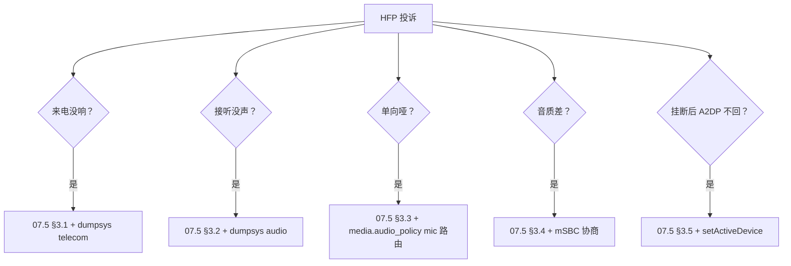

# 11.5 HFP 无声 / SCO 建立失败

> 速通摘要：与 07.5 互补，本节是"故障排查手册"快速指引。优先按 4 步：① SLC 完成？② SCO 建立？③ Audio Route 切了？④ HMI 端 InCallService 收到？

---

## 1. 学习目标

- 5 大 HFP 投诉秒决策路径。
- 知道每类投诉的"第一个查的位置"。

---

## 2. 决策树



详见 [07.5 HFP 常见问题排查](../07_HFP/07.5_HFP常见问题排查.md)。

---

## 3. 一键诊断脚本

```bash
#!/bin/bash
# hfp_diag.sh
adb shell dumpsys bluetooth_manager | grep -A 30 -E "HeadsetClient|Hfp" > /tmp/bm.txt
adb shell dumpsys telecom > /tmp/telecom.txt
adb shell dumpsys audio > /tmp/audio.txt
adb shell dumpsys media.audio_policy > /tmp/audio_policy.txt
adb pull /data/misc/bluetooth/logs/btsnoop_hci.log /tmp/

adb logcat -s BluetoothHeadsetClientStateMachine HfpClientConnectionService \
              bt_bta_hf_client bt_btif_hf_client bt_btm_sco audio \
              > /tmp/hfp_logcat.txt &
echo "现在复现问题，做完按 Ctrl+C"
wait
```

---

## 4. SCO 建立失败状态码

| status | 含义 | 修法 |
|--------|------|------|
| 0x0d | Connection Rejected (limited resource) | 已有 SCO；先释放 |
| 0x1a | Unsupported feature | mSBC 但对端不支持 transparent voice |
| 0x16 | Connection Terminated by Local Host | 主动断了，看上层逻辑 |
| 0x05 | Authentication Failure | 配对错；重新配对 |
| 0x08 | Connection Timeout | RF 弱 |

---

## 5. 上路任务

任务 A：把 §3 脚本完善并跑一次完整通话。
任务 B：找一台手机做 mSBC，看 BTSnoop 中 SCO 建立的 status。
任务 C：模拟 SCO 失败：在 SCO 建立瞬间拔掉天线，看 status code。

---

## 6. 本节小结

```
HFP 5 case 速查表（详见 07.5）：
  来电没响 / 接听没声 / 单向哑 / 音质差 / 挂断 A2DP 不回
SCO status 5 类：0x0d 资源 / 0x1a 不支持 / 0x16 主动 / 0x05 认证 / 0x08 超时
工具：dumpsys bluetooth_manager + telecom + audio + audio_policy + BTSnoop + logcat
```
