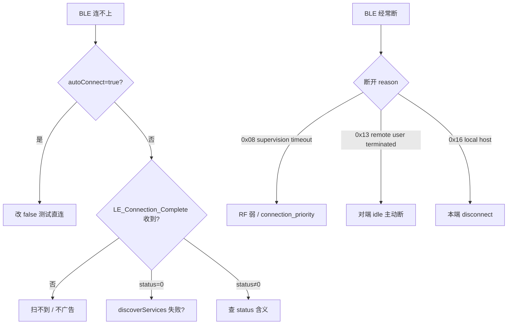

# 11.6 BLE 连不上 / 经常断

> 速通摘要：BLE 连不上 = `onConnectionStateChange` 没回 CONNECTED 或 status 非 0。BLE 经常断 = 短时间内连接超时。每种现象 3 个高频根因 + 修法。

---

## 1. 学习目标

- 区分 BLE 连不上 / 经常断 两类。
- 默写 6 个高频根因。

---

## 2. 连不上：3 大根因

### 根因 1：autoConnect=true 时对端没广告
- `autoConnect=true` 不主动 page，等对端广告。
- 对端不广告 → 永远不连。
- **改 false** 测试一次直连。

### 根因 2：连接被 supervision timeout
- BLE Connection 默认 supervision timeout ~20 秒。
- 弱信号 → 来不及建链。
- 看 BTSnoop `LE_Connection_Complete` status=0x3e（Connection Failed to be Established）。

### 根因 3：对端要求加密但本端没配对
- 部分 BLE 设备 `discoverServices` 时强制加密。
- 没配过对 → 失败。
- 先 `device.createBond(TRANSPORT_LE)`。

---

## 3. 经常断：3 大根因

### 根因 1：Supervision timeout 过短
- `requestConnectionPriority(CONNECTION_PRIORITY_HIGH/BALANCED/LOW_POWER)` 影响 LL 参数。
- 弱信号场景用 BALANCED 或 LOW_POWER。

### 根因 2：对端 idle 超时主动断
- 一些钥匙/胎压设备 N 秒没数据就主动 disconnect。
- 应用层做心跳（每 5-10s notify 一帧）。

### 根因 3：RF 干扰
- 2.4 GHz 拥挤；Wi-Fi / 微波 / USB 3.0。
- 测距离与 RSSI（`BluetoothGatt.readRemoteRssi()`）。

---

## 4. 决策树



---

## 5. 工具

```bash
# logcat
adb logcat -s BluetoothGatt BluetoothGattService bt_btif_gattc bt_bta_gattc bt_gatt bt_btm_ble

# BTSnoop
# Wireshark 过滤：btatt + btsmp + bthci_cmd.opcode == 0x200d (LE_Create_Connection)

# RSSI 监控
# 在 App 里周期调 BluetoothGatt.readRemoteRssi()
```

---

## 6. LE_Connection_Complete status 速查

| status | 含义 |
|--------|------|
| 0x00 | Success |
| 0x02 | Unknown connection identifier |
| 0x05 | Authentication Failure |
| 0x08 | Connection Timeout |
| 0x13 | Remote User Terminated |
| 0x16 | Connection Terminated by Local Host |
| 0x22 | LMP Response Timeout |
| 0x3e | Connection Failed to be Established |

---

## 7. 上路任务

任务 A：测试 autoConnect 两种模式的体感差异。
任务 B：手动改 `connection_priority` 看断开率变化。
任务 C：抓一次 BLE 长连接 1 小时，看断开次数 + reason。

---

## 8. 本节小结

```
连不上 3 根因：autoConnect+对端不广告 / supervision timeout / 加密要求未满足
经常断 3 根因：supervision timeout 太短 / 对端 idle 主动断 / RF 干扰
工具：logcat + BTSnoop + RSSI 监控
disconnect reason 速记：0x08 timeout / 0x13 远端断 / 0x16 本地断 / 0x3e 建链失败
```
