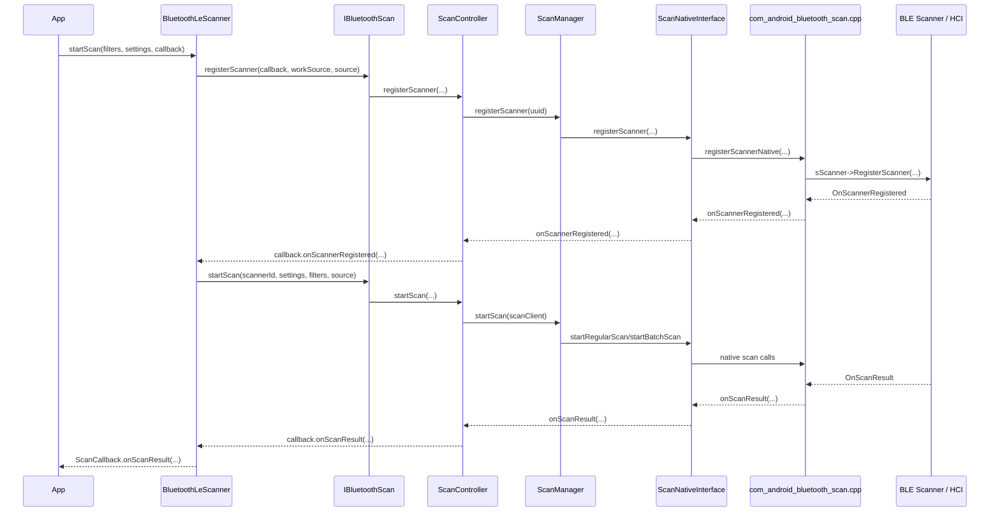
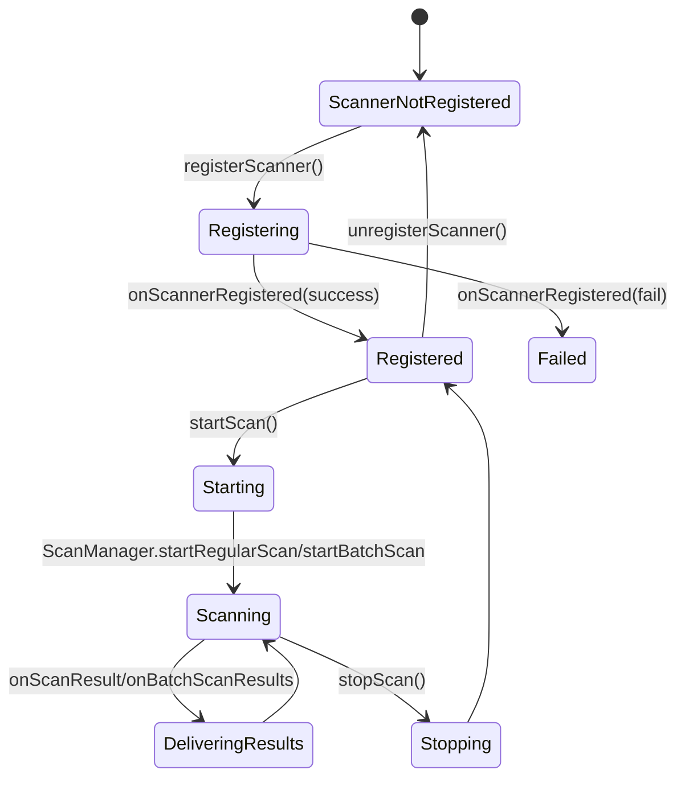
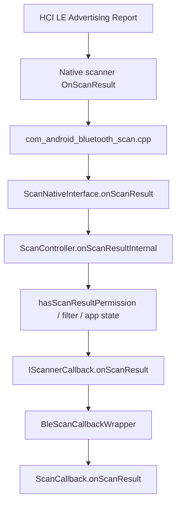
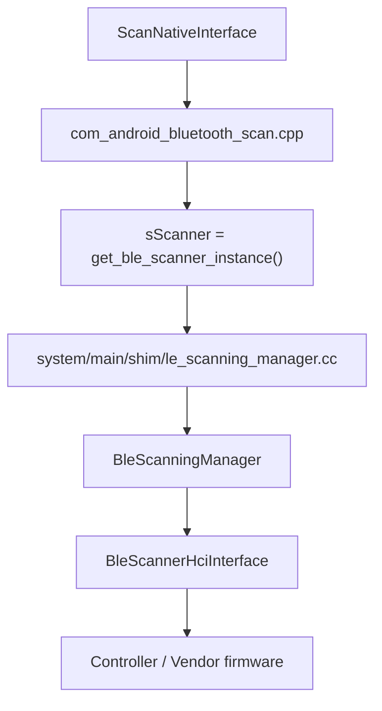

# 12-定向代码阅读报告：BLE Scan

## 1. 阅读目标

本报告解决一个核心问题：App 调用 `BluetoothLeScanner.startScan()` 后，扫描请求如何穿过 Framework、Binder、Bluetooth 进程、JNI、Native scanner，最后变成控制器侧的 LE 扫描；扫描结果又如何回到 App。

读完后要能定位三类问题：

- 扫描没有真正启动。
- 控制器收到广播但 App 没有回调。
- 扫描结果被权限、AppOps、过滤器、节流或线程分发拦住。

## 2. 适用场景

- 车机搜索 BLE 钥匙、手环、胎压、AIoT 外设失败。
- App 偶现 `SCAN_FAILED_*`。
- 后台扫描无结果，前台扫描正常。
- btsnoop 里有 LE Advertising Report，但 App `onScanResult()` 没回调。
- 多 App 同时扫描时，某个 App 拿不到结果或扫描被限频。

## 3. 调用链全景图



## 4. 关键类与源码入口

| 层级 | 源码 | 关键入口 | 作用 |
| --- | --- | --- | --- |
| Framework API | `framework/java/android/bluetooth/BluetoothAdapter.java` | `getBluetoothLeScanner()` | 创建/缓存 `BluetoothLeScanner` |
| Framework API | `framework/java/android/bluetooth/le/BluetoothLeScanner.java` | `startScan(...)`、`stopScan(...)`、`BleScanCallbackWrapper` | App 扫描 API、callback 包装、注册 scanner |
| AIDL | `android/app/aidl/android/bluetooth/IBluetoothScan.aidl` | `registerScanner`、`startScan`、`stopScan`、`registerPiAndStartScan` | Binder 边界 |
| Bluetooth App | `android/app/src/com/android/bluetooth/btservice/AdapterService.java` | `startScanController()`、`getBluetoothScan()`、`dump()` | 创建 ScanController，向 Framework 暴露 scan binder |
| Scan Service | `android/app/src/com/android/bluetooth/le_scan/ScanController.java` | `registerScanner(...)`、`startScan(...)`、`stopScan(...)`、`onScanResult(...)` | 扫描协调、权限/AppOps、结果分发、dump |
| Scan Service | `android/app/src/com/android/bluetooth/le_scan/ScanManager.java` | `registerScanner(...)`、`startScan(...)`、`startRegularScan(...)`、`startBatchScan(...)` | 扫描调度与 native 调用 |
| Scan Native Interface | `android/app/src/com/android/bluetooth/le_scan/ScanNativeInterface.java` | `registerScanner(...)`、`startBatchScan(...)`、`onScannerRegistered(...)`、`onScanResult(...)` | Java 与 JNI 边界 |
| JNI | `android/app/jni/com_android_bluetooth_scan.cpp` | `scanInitializeNative()`、`registerScannerNative()`、`OnScannerRegistered()`、`OnScanResult()` | JNI 注册和 Native callback |
| Native scanner | `system/btif/src/btif_ble_scanner.cc`、`system/main/shim/le_scanning_manager.cc` | `get_ble_scanner_instance()`、`RegisterScanner()`、`OnScanResult()` | BTIF/shim scanner |
| Stack/HCI | `system/stack/btm/btm_ble_scanner.cc`、`system/stack/btm/ble_scanner_hci_interface.cc` | `BleScanningManager::Initialize()`、`BleScannerHciInterface::Initialize()` | BLE scan manager 和 HCI 接口 |

## 5. 状态与生命周期

BLE Scan 不是一个单独的 Android `StateMachine`，但有明确生命周期：



关键点：

- Framework 的 `BluetoothLeScanner.startScan(...)` 会先创建 `BleScanCallbackWrapper`，注册 scanner 成功后再调用远端 `startScan(...)`。
- `BluetoothLeScanner` 用 `mLeScanClients` 保存 `ScanCallback -> BleScanCallbackWrapper`，重复 callback 会触发失败。
- `ScanController` 用 `ScannerMap` 管理 scanner id、App、callback、scan settings。
- `ScanManager` 维护 regular scan、batch scan、opportunistic scan 等队列。
- Adapter 关闭时，`BluetoothAdapter` 会清理 `mBluetoothLeScanner.cleanup()`，`AdapterService.stopScanController()` 会停止 ScanController。

## 6. 线程模型与回调分发

| 执行点 | 线程/机制 | 源码锚点 | 注意事项 |
| --- | --- | --- | --- |
| App 调用 `startScan` | App 调用线程 | `BluetoothLeScanner.startScan(...)` | callback 最终通过 Handler 回 App |
| Binder 调用 | Binder 线程池 | `IBluetoothScan.aidl` | 进入 Bluetooth 进程边界 |
| ScanController | `HandlerThread("BluetoothScanManager")` | `ScanController` 构造函数、`enforceScanThread()` | 大多数 scan 状态操作要求在 scan 线程 |
| ScanManager | scan 线程 | `ScanManager.startScan(...)` | 调度 regular/batch scan |
| JNI callback | JNI 线程投递 | `ScanNativeInterface.onScanResult(...)`、`onScannerRegistered(...)` | 回调会转回 ScanController |
| Framework callback | `BleScanCallbackWrapper` 内部 Handler | `BluetoothLeScanner.BleScanCallbackWrapper` | App 回调不应阻塞 |

结果回调路径：



最关键的线程判断是 `ScanController.enforceScanThread()`。如果你新增 scan 日志或状态字段，优先保证读写发生在 scan 线程，跨线程 dump 使用 `forceRunSyncOnScanThread(...)`。

## 7. 权限检查点与 Binder 边界

### 7.1 Binder 边界

`IBluetoothScan.aidl` 是 scan 专属 Binder 接口，包含：

- `registerScanner(...)`
- `unregisterScanner(...)`
- `startScan(...)`
- `registerPiAndStartScan(...)`
- `stopScan(...)`
- `stopScanForIntent(...)`
- `flushPendingBatchResults(...)`
- periodic advertising 相关接口

`AttributionSource` 会随 Binder 调用传入 Bluetooth 进程，后续用于 AppOps、包名、tag、统计和权限判断。

### 7.2 权限/AppOps 观察点

当前仓库中与 scan 结果分发强相关的检查点：

- `ScanController.startScan(...)` 中通过 `mAppOps.checkPackage(uid, callingPackage)` 校验 uid/package。
- `ScanController.hasScanResultPermission(...)` 决定某个 scan client 是否能收到扫描结果。
- `ScanController.onScanResultInternal(...)` 会对 client 逐个判断权限、过滤器和 callback 类型。
- `ScannerMap`、`AppScanStats` 保存 AttributionSource、uid、package 和扫描统计。

仓库边界说明：

- Android 蓝牙扫描权限还涉及系统权限模型、位置开关、AppOps、后台限制和 Companion Device Manager 等系统模块；当前蓝牙仓库只能确认 Bluetooth 进程内的 scan 检查点，完整授权链路需要结合系统工程和运行时日志。

## 8. JNI / Native / Vendor 边界



关键锚点：

- `com_android_bluetooth_scan.cpp` 的 `scanInitializeNative()` 获取 `bluetooth::shim::get_ble_scanner_instance()`。
- `registerScannerNative()` 调 `sScanner->RegisterScanner(...)`。
- `OnScannerRegistered(...)`、`OnScanResult(...)` 从 Native 回到 Java。
- `system/main/shim/le_scanning_manager.cc` 的 `RegisterScanner(...)` 进入 shim scanning。
- `system/stack/btm/btm_ble_scanner.cc` 的 `BleScanningManager::Initialize(...)` 建立 BLE scan manager。
- `system/stack/btm/ble_scanner_hci_interface.cc` 的 `BleScannerHciInterface::Initialize()` 接近 HCI 边界。

Vendor 边界：

- 当前仓库可以追到 HCI scanner interface，但 controller firmware、射频、厂商过滤策略、硬件 offload 行为属于仓库外。判断这层问题必须结合 btsnoop、vendor log 和硬件配置。

## 9. 可能失败点

| 层级 | 失败点 | 表现 | 观察方式 |
| --- | --- | --- | --- |
| Framework | `BluetoothAdapter.getBluetoothLeScanner()` 返回 null | App 无法发起 scan | App log、`BluetoothAdapter` 状态 |
| Framework | callback 重复注册 | `SCAN_FAILED_ALREADY_STARTED` 类失败 | `BluetoothLeScanner.mLeScanClients` 相关日志 |
| Binder | `IBluetoothScan` 不可用或 Bluetooth 关闭 | start/stop 远端异常 | logcat `BluetoothLeScanner`、binder exception |
| Permission/AppOps | uid/package 不匹配、无 scan 结果权限 | 控制器有广播但 App 无回调 | `ScanController`、AppOps、权限日志 |
| ScanController | scanner 注册失败或限频 | `onScannerRegistered` status 非成功 | `ScanController`、`BluetoothLeScanner` |
| ScanManager | 队列、regular/batch 参数异常 | scan 不启动或结果延迟 | `ScanManager.startScan()`、`configureRegularScanParams()` |
| Native | `sScanner` 未初始化或注册失败 | 无 Native scanner | `BluetoothScanJni`、native log |
| HCI/Vendor | 控制器未返回广告报告 | 所有 App 都无结果 | btsnoop 无 LE Advertising Report |
| 过滤器 | filter 不匹配 | 只有特定设备不回调 | dump scan settings、snoop 原始广播 |
| 后台限制 | 后台/低功耗策略限频 | 前台正常，后台异常 | AppOps、AppScanStats、系统策略日志 |

## 10. dumpsys、logcat、bugreport 观察点

### 10.1 命令

```bash
adb shell dumpsys bluetooth
adb shell dumpsys bluetooth_manager
adb logcat -b all | grep -E "BluetoothLeScanner|ScanController|ScanManager|ScannerMap|AppScanStats|BluetoothScanJni"
adb bugreport bugreport.zip
```

### 10.2 `dumpsys bluetooth` 中重点看

- `AdapterService.dump(...)` 会调用 `scanController.forceRunSyncOnScanThread(() -> scanController.dump(...))`。
- `ScanController.dump(...)` 会输出 scanner map 和 scan manager 相关信息。
- `ScannerMap.dump(...)` 与 `AppScanStats.dump(...)` 用于确认哪个 uid/package 注册过 scan、scan settings 是什么、是否长期扫描。

### 10.3 log tag

| tag | 看什么 |
| --- | --- |
| `BluetoothLeScanner` | Framework start/stop、注册 callback、App 回调 |
| `ScanController` | scanner 注册、start/stop、结果分发、权限过滤 |
| `ScanManager` | regular/batch scan 队列、scan native 调用 |
| `ScannerMap` | scanner id 与 App 绑定 |
| `AppScanStats` | App 扫描统计 |
| `BluetoothScanJni` | JNI scanner 注册和 Native callback |

### 10.4 btsnoop 判断

- 如果 snoop 没有 LE Advertising Report，优先查 controller、扫描参数、硬件 offload、射频环境。
- 如果 snoop 有 LE Advertising Report，但 App 没有回调，优先查 `ScanController.onScanResultInternal(...)` 的权限、filter、callback 分发和 App 状态。

## 11. 定制修改思路

| 目标 | 涉及文件 | 修改思路 | 风险与验证 |
| --- | --- | --- | --- |
| 增加 scan 诊断日志 | `BluetoothLeScanner.java`、`ScanController.java`、`ScanManager.java` | 打印 package、uid、scannerId、settings、filter 数量、失败 status | 注意隐私和日志量；用多 App 并发扫描回归 |
| 定位 App 无回调 | `ScanController.onScanResultInternal(...)` | 在权限、filter、callback 类型判断处增加原因日志或计数 | 避免每个广播都刷屏；建议只在 debug property 开启 |
| 排查限频 | `ScanController.registerScanner(...)`、`AppScanStats.java` | 增加最近注册时间、限频原因、扫描时长统计 | 不改变平台限频策略前先只加观测 |
| 优化 OTA 扫描前置发现 | App 侧 + `ScanSettings` | 调整 scan mode、filter、timeout、前台服务策略 | 高功耗；必须做功耗和后台策略验证 |
| 增强 dumpsys | `ScanController.dump(...)`、`ScannerMap.dump(...)` | 输出最后一次 start/stop 原因、最后一次无权限分发计数 | dump 需在 scan 线程安全读取 |

## 12. 最容易踩的坑

- `startScan()` 调用了，不代表 scanner 注册成功；要看 `onScannerRegistered()`。
- scanner 注册成功，不代表 Native scan 已启动；要看 `ScanManager.startRegularScan()` 或 batch scan 路径。
- Native scan 启动，不代表 App 会收到结果；权限、AppOps、filter、后台限制都可能拦截。
- `PendingIntent` scan 和 callback scan 生命周期不同，重复注册判断也不同。
- btsnoop 有广播但 App 没结果时，不要先怀疑硬件，先查 `hasScanResultPermission()` 和 filter。
- 过滤器写得过窄时，snoop 中设备存在，App 仍然完全无回调。
- 车机项目里常见“前台调试 App 正常、量产后台服务异常”，优先检查权限、后台限制和扫描节流。

## 13. 练习题与参考答案

### 练习 1：写出 BLE Scan 从 App 到 Native 的主链路

参考答案：

`BluetoothLeScanner.startScan()` -> `IBluetoothScan.registerScanner()` -> `ScanController.registerScanner()` -> `ScanManager.registerScanner()` -> `ScanNativeInterface.registerScanner()` -> `com_android_bluetooth_scan.cpp registerScannerNative()` -> `sScanner->RegisterScanner()` -> `system/main/shim/le_scanning_manager.cc` -> `BleScanningManager / BleScannerHciInterface`。

注册成功后再走：

`BluetoothLeScanner.BleScanCallbackWrapper.onScannerRegistered()` -> `IBluetoothScan.startScan()` -> `ScanController.startScan()` -> `ScanManager.startScan()` -> `startRegularScan()` 或 `startBatchScan()` -> Native scanner。

### 练习 2：btsnoop 有广播但 App 没回调，优先看哪三个点

参考答案：

1. `ScanController.onScanResultInternal(...)` 是否把结果分发给该 client。
2. `hasScanResultPermission(...)` 是否返回 false。
3. scan filters、callback type、PendingIntent/callback scan 类型是否匹配。

如果这些都正常，再看 `BleScanCallbackWrapper` 是否还在 `mLeScanClients`，App 进程是否存活，callback Handler 是否阻塞。

### 练习 3：如何判断扫描没有真正启动

参考答案：

先看 `BluetoothLeScanner` 是否收到 `onScannerRegistered(success)`；再看 `ScanController.startScan(...)` 是否生成 `ScanClient` 并进入 `mScanManager.startScan(scanClient)`；然后看 `ScanManager.startRegularScan(...)` 是否有 “start scanNative” 相关日志。若这些都没有，问题在 Framework/Binder/ScanController；若都有但 snoop 无广告报告，问题更靠近 Native/HCI/Vendor。

### 练习 4：要新增“为什么没有回调”的诊断，应该怎么改

参考答案：

优先在 `ScanController.onScanResultInternal(...)` 做按原因计数，而不是每个广播直接打日志。建议统计：权限失败、filter 不匹配、callback 为空、App 已注销、PendingIntent 发送失败。然后在 `ScanController.dump(...)` 输出最近 N 次失败计数。这样既能定位问题，又不会让 logcat 被广播刷爆。

## 14. 与案例库的映射

可映射到 `97-真实案例库.md`：

- “BLE 扫描无结果”
- “BLE 看得到广播但 connectGatt 失败”中的扫描前置确认部分
- “GATT 连接成功但服务发现为空”中的发现设备与连接前置阶段

新增真实问题时，应把 evidence 分成三段写入案例卡：

1. Framework/Binder 证据：App 是否调用、scanner 是否注册成功。
2. Bluetooth 进程证据：ScanController/ScanManager 是否启动并分发。
3. Native/HCI 证据：snoop 是否有 LE Advertising Report。
