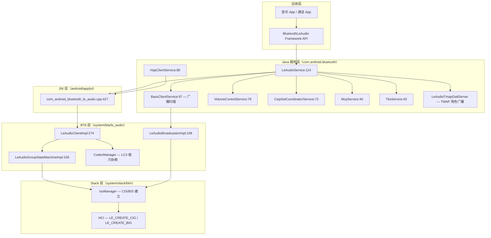

# 12.1 LE Audio 全景

> **速通摘要**：LE Audio 是蓝牙 5.2 引入的新一代音频框架，用 LC3 编解码器取代 SBC/AAC，以 ISO（等时流）通道替代 A2DP 的 L2CAP 通道，同时引入 Unicast（点对点）和 Broadcast（广播）两种拓扑。在 Android 16 中，LE Audio 已与 Classic 音频并列成为一等公民，车机工程师必须理解它与 A2DP/HFP 的关系才能做好多 Profile 共存。

---

## 学习目标

读完本节后，你能回答：
1. LE Audio 的体系架构里有哪些层、每层叫什么？
2. Unicast（CIS）和 Broadcast（BIS）分别适合哪些车载场景？
3. TMAP / HAP / CSIP / VCP / MCP / TBS 分别是什么、在源码哪里实现？
4. LE Audio 与传统 A2DP / HFP 的关键区别在哪里？

---

## 前置知识

- [08 BLE / GATT](../08_BLE_GATT/) — GATT 服务发现、Characteristic 读写是 LE Audio 上层配置的基础
- [05.3 Stack 核心导读](../05_Native栈基础/05.3_Stack核心导读.md) — L2CAP / HCI 层概念
- [06 A2DP & AVRCP](../06_A2DP与AVRCP/) — 与 Classic 音频的对照理解

---

## 场景故事

**2024 年，车机厂商接到需求**："下一款车要支持 AirPods Pro 直接当车载耳机，同时支持两个乘客各自用 LE Audio 耳机听不同的音乐。"

传统 A2DP 只能点对点传输，且编解码延迟随蓝牙拥堵升高。LE Audio 的 Broadcast 模式可以让车机"直播"音频，无限个 LE Audio 耳机接收，零额外连接成本——这是 **Auracast** 的核心能力。

同时，LE Audio 的 Unicast 模式通过 CIS（Connected Isochronous Stream）提供时延低于 40 ms 的双向音频，替代 HFP 的 SCO，彻底解决通话回声问题。

---

## 分层调用链

```
App / Settings
    │
    ▼
BluetoothLeAudio（framework/java/android/bluetooth/BluetoothLeAudio.java）
    │  getBluetoothProfile(PROFILE_LE_AUDIO, ...)
    ▼
LeAudioService（android/app/src/.../le_audio/LeAudioService.java:114）
    │  profileConnect / setActiveDevice / getAudioLocation
    ▼
LeAudioNativeInterface（android/app/src/.../le_audio/LeAudioNativeInterface.java:39）
    │  JNI 调用
    ▼
com_android_bluetooth_le_audio.cpp（android/app/jni/）
    │  connectLeAudioNative:496 / initNative:427
    ▼
LeAudioClientImpl（system/bta/le_audio/client.cc:274）
    │  BTA 层，管理设备组状态
    ▼
LeAudioGroupStateMachineImpl（system/bta/le_audio/state_machine.cc:156）
    │  CIG/CIS 建立
    ▼
IsoManager（system/stack/btm/btm_iso_impl.h）
    │  HCI ISO 命令
    ▼
HCI / 蓝牙控制器
```

**广播路径（Broadcast）：**

```
LeAudioBroadcasterNativeInterface（JNI）
    ▼
LeAudioBroadcasterImpl（system/bta/le_audio/broadcaster/broadcaster.cc:108）
    ▼
BroadcastStateMachineImpl（system/bta/le_audio/broadcaster/state_machine.cc:70）
    ▼
IsoManager → BIG 创建 → HCI LE_CREATE_BIG
```

---

## 源码导读

### 关键文件阅读顺序

| 步骤 | 文件 | 关注点 |
|------|------|--------|
| 1 | `android/app/src/.../le_audio/LeAudioService.java:114` | Profile 服务入口，看 `start()`、`setActiveDevice()` |
| 2 | `android/app/src/.../le_audio/LeAudioNativeInterface.java:39` | JNI 接口声明，所有 native 方法 |
| 3 | `android/app/jni/com_android_bluetooth_le_audio.cpp:427` | JNI 实现，`initNative` 注册 callbacks |
| 4 | `system/bta/le_audio/client.cc:274` | `LeAudioClientImpl` 主实现，`Connect()`、`GroupSetActive()` |
| 5 | `system/bta/le_audio/state_machine.cc:156` | `LeAudioGroupStateMachineImpl`，CIG 建立状态机 |
| 6 | `system/bta/le_audio/le_audio_types.h:392` | `CisState` / `CisType` 枚举，理解 ISO 状态 |
| 7 | `system/bta/le_audio/broadcaster/broadcaster.cc:108` | `LeAudioBroadcasterImpl`，Broadcast 路径 |

**TMAP 实现**：`android/app/src/.../le_audio/LeAudioTmapGattServer.java`，由 `LeAudioService.java:191` 持有引用，根据角色（CG/UMS/BMS）在 GATT 上广播 TMAP 特征值（`LeAudioService.java:251-267`）。

### 主要类/子模块总览

| 模块 | 位置 | 职责 |
|------|------|------|
| `LeAudioService` | `android/.../le_audio/LeAudioService.java:114` | Java 层 Profile 管理 |
| `LeAudioStateMachine` | `android/.../le_audio/LeAudioStateMachine.java:71` | 单设备连接状态机（4 个状态） |
| `LeAudioClientImpl` | `system/bta/le_audio/client.cc:274` | BTA 层主实现，管理设备组 |
| `LeAudioGroupStateMachineImpl` | `system/bta/le_audio/state_machine.cc:156` | 设备组 CIG/CIS 建立 |
| `CodecManager` | `system/bta/le_audio/codec_manager.cc` | LC3 能力协商与配置 |
| `DeviceGroups` | `system/bta/le_audio/device_groups.cc` | 设备组（CSIP 集合）管理 |
| `LeAudioBroadcasterImpl` | `system/bta/le_audio/broadcaster/broadcaster.cc:108` | Broadcast/BIG 管理 |
| `BassClientService` | `android/.../bass_client/BassClientService.java:97` | 广播音频扫描服务（BASS） |
| `IsoManager` | `system/stack/btm/btm_iso_impl.h` | CIS/BIS 建立与数据路径 |

---

## 简化代码片段

### 1. Java 层：LeAudioService 启动与活动设备设置

```java
// android/app/src/.../le_audio/LeAudioService.java:114
public class LeAudioService extends ConnectableProfile {
    // 设置活动 LE Audio 设备（车机选哪个耳机播放）
    public boolean setActiveDevice(BluetoothDevice device) {
        // 通过 NativeInterface 下发到 C++ BTA 层
        LeAudioNativeInterface.getInstance().groupSetActive(groupId);
        // ...
    }
}
```

### 2. Java 状态机：四个状态

```java
// android/app/src/.../le_audio/LeAudioStateMachine.java:136
class Disconnected extends State { /* 初始状态，收到 CONNECT 进入 Connecting */ }
// :249
class Connecting extends State { /* 发 GATT 连接，等 CIS 建立 */ }
// :347
class Disconnecting extends State { /* 发断连请求 */ }
// :466
class Connected extends State { /* 正常工作状态，接受 STREAM 事件 */ }
```

### 3. C++ 层：LeAudioClientImpl 初始化

```cpp
// system/bta/le_audio/client.cc:274
class LeAudioClientImpl : public LeAudioClient {
  void Connect(const RawAddress& address) override {
    // 通过 GATT 建立 BLE 连接，然后触发设备配置发现
    BTA_GATTC_Open(gatt_if_, address, BTM_BLE_DIRECT_CONNECTION, false);
  }
  void GroupSetActive(const int group_id) override {
    // 通知 CodecManager 准备 CIG 配置
    // 触发 LeAudioGroupStateMachineImpl 进入 CIG_CREATING 状态
  }
};
```

---

## LE Audio 架构总览（Mermaid）



---

## LE Audio vs Classic 音频对比

| 维度 | Classic（A2DP + HFP） | LE Audio |
|------|-----------------------|----------|
| 传输通道 | L2CAP（A2DP） / SCO（HFP） | ISO（CIS/BIS） |
| 编解码器 | SBC / AAC / aptX 等 | LC3（强制支持） |
| 典型延迟 | A2DP: 100-200 ms；SCO: 7.5 ms | CIS: < 40 ms；BIS: 无界 |
| 拓扑 | 点对点 | 点对点（Unicast）+ 一对多（Broadcast） |
| 双向音频 | HFP 专用通道 | Unicast CIS 天然双向 |
| 能耗 | 较高（A2DP 持续串流） | 更低（LC3 压缩效率高） |
| 同步多设备 | 不支持 | CSIP + BIS 可精确同步 |

---

## 各子协议速览

| 协议 | 全称 | 车载用途 | Java 服务 |
|------|------|---------|----------|
| **TMAP** | Telephony and Media Audio Profile | 定义 CG（通话网关）/ UMS（媒体源）/ BMS（广播源）角色 | `LeAudioTmapGattServer` |
| **HAP** | Hearing Access Profile | 助听器（HAP 取代旧版 ASHA，见 12.5） | `HapClientService.java:80` |
| **CSIP** | Coordinated Set Identification Profile | 左右耳机同步配对管理 | `CsipSetCoordinatorService.java:72` |
| **VCP** | Volume Control Profile | 统一音量控制（替代 AVRCP 绝对音量的 LE 版） | `VolumeControlService.java:79` |
| **MCP** | Media Control Profile | 播放控制（播放/暂停/下一曲等，类似 AVRCP） | `McpService.java:40` |
| **TBS** | Telephone Bearer Service | 通话状态通知（车机显示来电/接听） | `TbsService.java:40` |

---

## 调试方法

```bash
# 查看 LE Audio 当前状态
adb shell dumpsys bluetooth_manager | grep -A 20 "LeAudio"

# 查看 ISO 连接句柄
adb shell dumpsys bluetooth_manager | grep -i "cis\|bis\|iso"

# 过滤 LE Audio 日志（TAG：LeAudioService / LeAudioClientImpl）
adb logcat -s LeAudioService:V LeAudioClientImpl:V BtLeAudio:V

# 查看广播状态
adb shell dumpsys bluetooth_manager | grep -i "broadcast\|BIG"

# btsnoop 抓包观察 ISO 通道建立
# 重点看 HCI LE Create CIG / LE Setup ISO Data Path 命令
adb shell setprop persist.bluetooth.btsnooplogmode full
adb shell svc bluetooth disable && adb shell svc bluetooth enable
adb pull /data/misc/bluetooth/logs/btsnoop_hci.log
```

**关键日志 TAG**：

| TAG | 位置 | 内容 |
|-----|------|------|
| `LeAudioService` | Java 层 | 连接/断连/活动设备切换 |
| `LeAudioStateMachine` | Java 层 | 单设备状态转移 |
| `LeAudioClientImpl` | C++ BTA 层 | 设备组操作、CIG 建立 |
| `LeAudioGroupStateMachine` | C++ BTA 层 | CIS 状态转移 |
| `BtLeAudio` | 系统日志 | HAL 层音频路由 |

---

## FAQ

**Q1：LE Audio 和 A2DP 能同时使用吗？**
可以，Android 16 中 `ActiveDeviceManager` 负责调度：当 LE Audio 设备被设为活动时，A2DP 的活动设备会被清空，反之亦然。见第 17 章多设备共存。

**Q2：为什么我的 LE Audio 耳机连上了但不出声？**
最常见的原因是 ISO 数据路径没有建立。用 `adb logcat -s LeAudioGroupStateMachine:V` 查看状态机是否卡在 `CIS_CONNECTING` 或 `CODEC_CONFIGURED`，再结合 btsnoop 看 HCI 命令是否有 error code。

**Q3：TMAP 和 A2DP/HFP 是竞争关系还是共存关系？**
竞争关系。TMAP 定义了 LE Audio 世界的通话（CG 角色）和媒体（UMS 角色）如何工作，与经典蓝牙的 HFP+A2DP 覆盖相同场景，车机需要根据连接设备的能力选择走哪条路径。

**Q4：如何查看连接上来的耳机支持 Unicast 还是 Broadcast？**
通过 GATT 读取 PACS（Published Audio Capabilities Service）中的 Sink/Source PAC Characteristic，里面包含设备支持的 LC3 配置（采样率、帧时长等）。

---

## 上路任务

1. 用 `adb logcat -s LeAudioService:V` 过滤日志，观察 LE Audio 耳机连接时的完整状态机转移序列。
2. 在 `android/app/src/.../le_audio/LeAudioService.java:251` 附近阅读 TMAP 角色掩码的设置逻辑，理解车机在什么条件下会广播 CG / UMS / BMS 角色。
3. 在 `system/bta/le_audio/le_audio_types.h:392` 找到 `CisState` 枚举，数一数有多少个状态，猜测每个状态对应 CIS 生命周期的哪个阶段。
