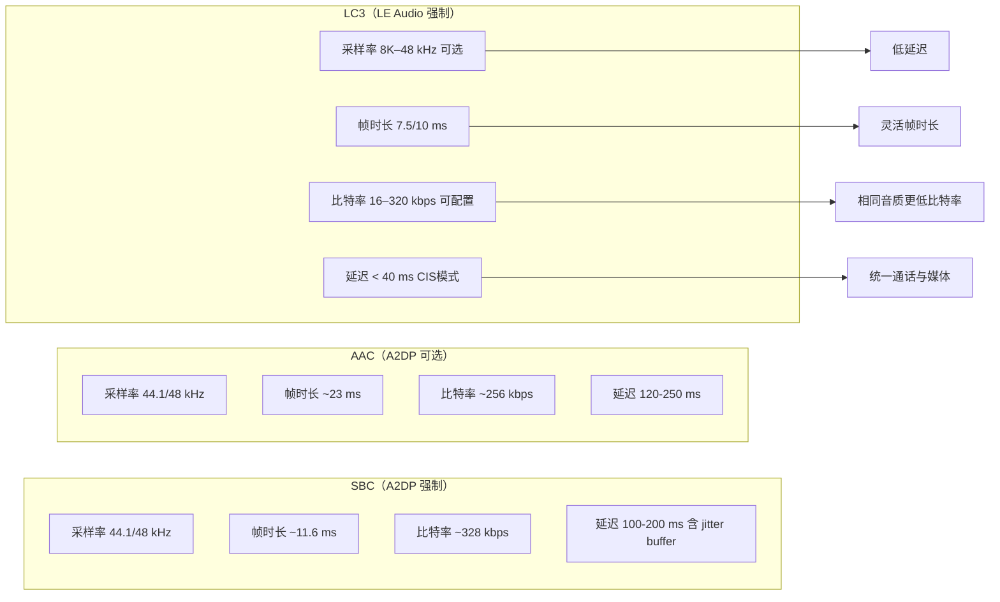

# 12.2 LC3 编解码

> **速通摘要**：LC3（Low Complexity Communication Codec）是蓝牙 5.2 强制要求的 LE Audio 编解码器，以 7.5 ms / 10 ms 帧时长为核心，在 48 kHz 采样率下可用 40 字节/帧就实现接近 CD 音质，是 SBC 效率的两倍以上。Android 的 LC3 编解码器配置存储在 `system/bta/le_audio/le_audio_types.h` 的常量中，由 `CodecManager` 负责能力协商。

---

## 学习目标

读完本节后，你能：
1. 解释 LC3 帧时长（7.5 ms / 10 ms）和比特率的关系。
2. 找到源码中 LC3 采样率、帧时长、每帧字节数的常量定义位置。
3. 理解 `CodecManager` 如何在连接时协商 LC3 参数。
4. 说出 LC3 与 SBC 的三个关键差异。

---

## 前置知识

- [12.1 LE Audio 全景](12.1_LE_Audio全景.md) — 了解 LE Audio 整体架构
- [06.1 A2DP 架构总览](../06_A2DP与AVRCP/06.1_A2DP架构总览.md) — SBC/AAC 的对照理解

---

## 场景故事

车机工程师在调试 LE Audio 通话时，发现连接 iPhone 15 的耳机时音质很好，但换了一款国产耳机后有明显的音质损失。

排查过程：用 `adb logcat -s LeAudioClientImpl` 发现协商出的 LC3 参数是 `16 kHz, 10 ms, 30 bytes`（对应 24 kbps），而非期望的 `48 kHz, 10 ms, 100 bytes`（对应 80 kbps）。问题出在耳机上报的 PAC（Published Audio Capabilities）只声明支持到 16 kHz，`CodecManager` 按照取最低公约数的原则降级了。

理解 LC3 参数协商，就能快速定位这类"连上了但音质差"的问题。

---

## LC3 核心参数

LC3 的音频帧由以下三个参数决定音质和延迟：

| 参数 | 含义 | 典型值 |
|------|------|--------|
| 采样率（Sampling Frequency） | 每秒采样次数 | 8K / 16K / 24K / 32K / 44.1K / 48K Hz |
| 帧时长（Frame Duration） | 每个音频帧覆盖的时间 | 7.5 ms 或 10 ms |
| 每帧字节数（Octets Per Frame） | 编码压缩后每帧字节数 | 26–200 字节 |

**比特率计算**：`bitrate = (octets_per_frame × 8) / frame_duration`

- `48 kHz, 10 ms, 100 bytes` → `(100 × 8) / 0.01 = 80 kbps`（媒体音质）
- `16 kHz, 7.5 ms, 30 bytes` → `(30 × 8) / 0.0075 = 32 kbps`（通话音质）

---

## 分层调用链

```
GATT 读取耳机的 PAC Characteristic
    ↓（Sink PAC / Source PAC）
LeAudioClientImpl::OnPacsRead()
    ↓
CodecManager::GetCodecConfig()
    ↓（从 audio_set_configurations.json 中选最优配置）
LeAudioGroupStateMachineImpl：协商 CIG 参数（SDU size = octets_per_frame）
    ↓
IsoManager：建立 CIS，配置 ISO Data Path（LC3 on controller 或 software）
```

---

## 源码导读

### 常量定义（le_audio_types.h）

采样率常量（`codec_spec_conf` 命名空间）：

```cpp
// system/bta/le_audio/le_audio_types.h:142
constexpr uint8_t kLeAudioSamplingFreq8000Hz  = 0x01;
constexpr uint8_t kLeAudioSamplingFreq16000Hz = 0x03;
constexpr uint8_t kLeAudioSamplingFreq24000Hz = 0x05;
constexpr uint8_t kLeAudioSamplingFreq32000Hz = 0x06;
constexpr uint8_t kLeAudioSamplingFreq44100Hz = 0x07;
constexpr uint8_t kLeAudioSamplingFreq48000Hz = 0x08;  // 媒体最常用
```

帧时长常量：

```cpp
// system/bta/le_audio/le_audio_types.h:157
constexpr uint8_t kLeAudioCodecFrameDur7500us  = 0x00;  // 7.5 ms，更低延迟
constexpr uint8_t kLeAudioCodecFrameDur10000us = 0x01;  // 10 ms，更通用
```

LTV（Length-Type-Value）类型标识：

```cpp
// system/bta/le_audio/le_audio_types.h:136
constexpr uint8_t kLeAudioLtvTypeFrameDuration      = 0x02;
// :138
constexpr uint8_t kLeAudioLtvTypeOctetsPerCodecFrame = 0x04;
```

LC3 编码格式常量（在 ISO 层使用）：

```cpp
// system/stack/include/btm_iso_api_types.h:29
constexpr uint8_t kIsoCodingFormatLc3 = 0x06;

// system/bta/le_audio/le_audio_types.h:311
constexpr uint8_t kLeAudioCodingFormatLC3 =
    bluetooth::hci::kIsoCodingFormatLc3;  // 即 0x06
```

### CodecManager：能力协商入口

```cpp
// system/bta/le_audio/codec_manager.h:59
class CodecManager {
  // 根据设备组支持的 PAC 和本地需求，选最优 LC3 配置
  virtual std::unique_ptr<AudioSetConfiguration> GetCodecConfig(
      const CodecManager::UnicastConfigurationRequirements& requirements,
      CodecManager::UnicastConfigurationVerifier verifier);

  // 查询是否有 offload（芯片编解码）的提供者信息
  virtual std::optional<ProviderInfo> GetCodecConfigProviderInfo(void) const;
};
```

### 配置文件（JSON）

`system/bta/le_audio/audio_set_configurations.json` 中预定义了多个场景配置，例如：
- `2_1`：单设备媒体，48 kHz，10 ms，100 bytes
- `4_1`：单设备高质量，48 kHz，7.5 ms，75 bytes
- `1_2`：通话，16 kHz，10 ms，40 bytes（双向）

`CodecManager` 在协商时会遍历这些预设，选出双方都支持的最优配置。

---

## 简化代码片段

```cpp
// system/bta/le_audio/le_audio_types.h：LTV 参数打包示例（简化）
struct CodecSpecificConfig {
  uint8_t sampling_frequency;   // 如 kLeAudioSamplingFreq48000Hz = 0x08
  uint8_t frame_duration;       // 如 kLeAudioCodecFrameDur10000us = 0x01
  uint16_t octets_per_frame;    // 如 100（80 kbps @ 48 kHz / 10 ms）
  uint8_t codec_frames_per_sdu; // 通常为 1
};

// LTV 格式打包（实际代码在 le_audio_types.cc）：
// [Length=2][Type=0x01][Value=0x08]  // 采样率 48 kHz
// [Length=2][Type=0x02][Value=0x01]  // 帧时长 10 ms
// [Length=3][Type=0x04][Value=100,0] // 每帧 100 字节
```

---

## LC3 vs SBC vs AAC 对比



---

## 调试方法

```bash
# 查看当前协商出的 LC3 参数
adb logcat -s LeAudioClientImpl:V | grep -i "codec\|lc3\|sampling\|octets"

# 查看 CodecManager 的配置选择日志
adb logcat -s CodecManager:V

# 读取设备 PAC 原始数据（需配对且已连接）
adb shell dumpsys bluetooth_manager | grep -A 10 "PAC\|Codec"

# btsnoop 中观察 PAC 读取过程：
# 搜索 ATT Read（0x12）操作，找 Published Audio Capabilities Service（UUID: 0x1850）
```

**常见 logcat 标志**：

| 关键字 | 含义 |
|--------|------|
| `codec config` | 协商完成，打印最终 LC3 参数 |
| `GetCodecConfig` | CodecManager 开始选配置 |
| `no valid codec config` | 双方没有公共支持的 LC3 参数，连接会失败 |
| `kIsoCodingFormatLc3` | ISO 数据路径配置时填入的编码格式 |

---

## FAQ

**Q1：LC3 有软件实现吗？还是必须靠芯片？**
两种都支持。`CodecManager::GetCodecConfigProviderInfo()` 返回的信息区分了 software codec（上层软件处理）和 offload（芯片直接处理）。车机芯片如果支持 LE Audio offload，则 LC3 编解码在芯片内完成，延迟更低、功耗更小。

**Q2：为什么有的 LE Audio 耳机接上去后只有 16 kHz？**
耳机的 Sink PAC Characteristic 里声明的最高采样率只有 16 kHz，或者其支持的最大 Octets Per Frame 太低，`CodecManager` 协商后只能降级。用 btsnoop 抓 GATT ATT_READ_RSP 找 PAC 的数据可以确认。

**Q3：LC3 和 LC3plus 是同一个东西吗？**
不是。LC3 是 Bluetooth SIG 规范的，LC3plus 是 Fraunhofer 的增强版本（支持更短帧时长和更高采样率），两者有专利授权差异。Android 16 标准实现只包含 LC3，LC3plus 需要厂商扩展。

---

## 上路任务

1. 打开 `system/bta/le_audio/le_audio_types.h:142`，找到所有 `kLeAudioSamplingFreq*` 常量，换算出 `0x08` 对应哪个采样率。
2. 在 `system/bta/le_audio/audio_set_configurations.json` 中找到 `2_1` 配置，验证其 octets_per_frame 字段值，并用比特率公式算出对应的 kbps。
3. 用 `adb logcat -s CodecManager:V` 抓取一次 LE Audio 设备连接日志，看 `GetCodecConfig` 选了哪个预设场景。
