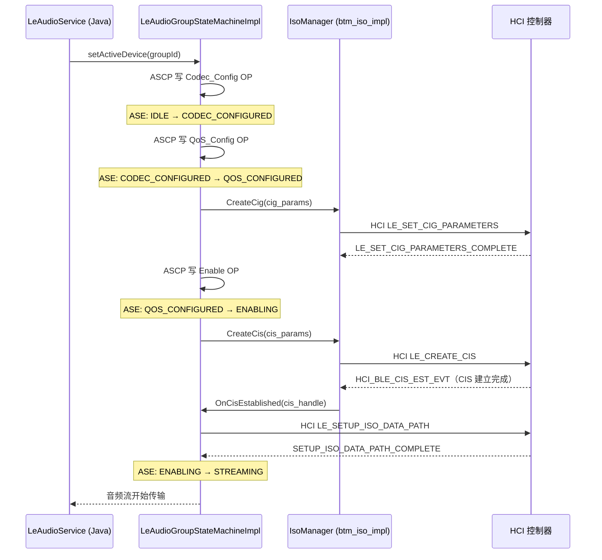

# 12.3 CIS / BIS（Isochronous Streams）/ ISO Channel

> **速通摘要**：LE Audio 的音频传输不走 L2CAP，而走 ISO（Isochronous）通道。Unicast 用 CIS（Connected Isochronous Stream）点对点传，Broadcast 用 BIS（Broadcast Isochronous Stream）一对多发。CIS 的建立过程涉及 CIG 参数协商 → HCI LE_Create_CIG → HCI LE_Create_CIS → ISO Data Path 配置这四步，每步都有状态机跟踪。

---

## 学习目标

读完本节后，你能：
1. 区分 CIS 和 BIS，各自适用什么场景。
2. 沿源码追踪 CIS 从建立到数据传输的完整路径。
3. 理解 ASE 状态机（IDLE → CODEC_CONFIGURED → QOS_CONFIGURED → ENABLING → STREAMING）。
4. 在 btsnoop 中识别 CIG/CIS 相关的 HCI 命令。

---

## 前置知识

- [12.1 LE Audio 全景](12.1_LE_Audio全景.md) — 体系架构
- [12.2 LC3 编解码](12.2_LC3编解码.md) — 参数协商
- [05.5 HCI 层](../05_Native栈基础/05.5_HCI层.md) — HCI 命令/事件机制

---

## 场景故事

车机连上一副左右耳独立的 LE Audio 耳机（如 Samsung Galaxy Buds3）：
- 左耳和右耳各是一个 BLE 设备，通过 CSIP 形成 Coordinated Set。
- 车机为这两个设备建立一个 CIG（CIS Group），里面有两条 CIS，一左一右，数据在同一时钟周期内同步发送。
- 这就是为什么 LE Audio 没有"左耳先响右耳后响"的问题——CIS 天然同步。

---

## 核心概念

| 概念 | 全称 | 比喻 |
|------|------|------|
| **ISO** | Isochronous Stream | 等时流，类似流水线，每隔固定时间打一帧 |
| **CIS** | Connected Isochronous Stream | "专线电话"——点对点，双向可用 |
| **BIS** | Broadcast Isochronous Stream | "广播电台"——一对多，单向 |
| **CIG** | CIS Group | 一组 CIS 的容器，共享同步时钟（如一副耳机的左右耳） |
| **BIG** | BIS Group | 一组 BIS 的容器（如一个广播源的多个音频流） |
| **ASE** | Audio Stream Endpoint | 设备上的一个音频端口（Sink 或 Source），用 GATT 表示 |
| **SDU** | Service Data Unit | 每个 ISO 帧的应用层数据单元（LC3 帧） |
| **ISO Interval** | — | CIG/BIG 发送数据的周期（单位 1.25 ms，通常配置为 7.5 ms 或 10 ms） |

---

## ASE 状态机

LE Audio Unicast 连接的关键状态由 **ASE（Audio Stream Endpoint）** 驱动，定义在：

```cpp
// system/bta/le_audio/le_audio_types.h:382
enum class AseState : uint8_t {
  BTA_LE_AUDIO_ASE_STATE_IDLE             = 0x00,
  BTA_LE_AUDIO_ASE_STATE_CODEC_CONFIGURED = 0x01,  // GATT 写 Codec_Config OP
  BTA_LE_AUDIO_ASE_STATE_QOS_CONFIGURED   = 0x02,  // GATT 写 QoS_Config OP（含 CIG 参数）
  BTA_LE_AUDIO_ASE_STATE_ENABLING         = 0x03,  // GATT 写 Enable OP
  BTA_LE_AUDIO_ASE_STATE_STREAMING        = 0x04,  // HCI CIS 建立完成，开始传 LC3 帧
  BTA_LE_AUDIO_ASE_STATE_DISABLING        = 0x05,
  BTA_LE_AUDIO_ASE_STATE_RELEASING        = 0x06,
};
```

**Java 对照**：与 `BluetoothProfile.STATE_CONNECTING / STATE_CONNECTED` 类似，但粒度更细——LE Audio 的状态机有 7 个阶段，对应 BLE Audio Profile 规范中的 ASE 控制点写操作序列。

### CIS 状态（C++ 层）

```cpp
// system/bta/le_audio/le_audio_types.h:392
enum class CisState {
  IDLE,         // 未分配
  ASSIGNED,     // 已分配给设备组，但未建立
  CONNECTING,   // HCI LE_Create_CIS 已发出
  CONNECTED,    // CIS 建立完成（HCI_BLE_CIS_EST_EVT 收到）
  DISCONNECTING,// 断开中
};

// :407
enum class CisType {
  CIS_TYPE_BIDIRECTIONAL,         // 双向（通话场景）
  CIS_TYPE_UNIDIRECTIONAL_SINK,   // 下行（只放音乐）
  CIS_TYPE_UNIDIRECTIONAL_SOURCE, // 上行（只收麦克风）
};
```

---

## 分层调用链

### Unicast（CIS）建立流程

```
LeAudioGroupStateMachineImpl::ProcessHciNotifOnCigCreate()
    │  BTA 层：收到 HCI LE_SET_CIG_PARAMETERS 完成回调
    ↓
IsoManager::CreateCis()
    │  system/stack/btm/btm_iso_impl.h
    ↓
HCI LE_CREATE_CIS（HCI 命令发往控制器）
    ↓
HCI_BLE_CIS_EST_EVT（控制器上报 CIS 建立完成）
    ↓
btm_iso_impl::OnCisEvent()  // system/stack/btm/btm_iso_impl.h:589
    ↓
LeAudioGroupStateMachineImpl 回调：开始配置 ISO Data Path
    ↓
HCI LE_SETUP_ISO_DATA_PATH（配置 LC3 数据流方向）
    ↓
数据传输开始（每 10 ms 发一个 LC3 SDU）
```

### Broadcast（BIS）建立流程

```
LeAudioBroadcasterImpl::CreateBroadcast()  // broadcaster.cc:108
    ↓
BroadcastStateMachineImpl → 进入 CREATING 状态
    ↓
IsoManager::SetupIsoDataPath()（BIS 场景）
    ↓
HCI LE_CREATE_BIG（创建广播等时组）
    ↓
HCI CREATE_BIG_COMPLETE 事件
    ↓
数据广播开始（无连接，耳机 Sync 到 BIG）
```

---

## 源码导读

| 文件 | 关注点 |
|------|--------|
| `system/stack/btm/btm_iso_impl.h:47` | ISO header 长度常量（带/不带 timestamp） |
| `system/stack/btm/btm_iso_impl.h:51` | `kStateFlagIsConnecting / IsConnected / IsBroadcast` 状态标志 |
| `system/stack/btm/btm_iso_impl.h:589` | `CIS_ESTABLISHED` 事件处理入口 |
| `system/gd/hci/le_iso_interface.h:25` | `SubeventCode` 枚举（CIS_ESTABLISHED / CIS_REQUEST / CREATE_BIG_COMPLETE 等） |
| `system/gd/hci/le_iso_interface.h:31` | `LeIsoInterface` 接口声明 |
| `system/bta/le_audio/le_audio_types.h:382` | `AseState` 枚举（7 个状态） |
| `system/bta/le_audio/le_audio_types.h:392` | `CisState` / `CisType` 枚举 |
| `system/bta/le_audio/state_machine.cc:156` | `LeAudioGroupStateMachineImpl` — CIG/CIS 状态驱动 |

---

## 简化代码片段

```cpp
// system/stack/btm/btm_iso_impl.h:47
static constexpr uint8_t kIsoHeaderWithTsLen    = 12;  // 含时间戳的 ISO 帧头
static constexpr uint8_t kIsoHeaderWithoutTsLen = 8;   // 不含时间戳

// 状态标志（用于 CIS/BIS 对象上）
// :51
static constexpr uint8_t kStateFlagIsConnecting = 0x01;
static constexpr uint8_t kStateFlagIsConnected  = 0x02;
// :54
static constexpr uint8_t kStateFlagIsBroadcast  = 0x10;  // 区分 BIS
static constexpr uint8_t kStateFlagIsCancelled  = 0x20;

// CIS 建立完成事件处理（简化）
// :589
void OnCisEvent(uint8_t subevent, void* data) {
  switch (subevent) {
    case SubeventCode::CIS_ESTABLISHED:
      // 更新 CIS 句柄，清除 Connecting 标志
      cis->state_flags &= ~kStateFlagIsConnecting;
      cis->state_flags |= kStateFlagIsConnected;
      // 通知上层（BTA 状态机）可以配置数据路径了
      break;
  }
}
```

---

## CIS / BIS 建立时序图



---

## 调试方法

```bash
# 观察 CIS 建立过程的状态转移
adb logcat -s LeAudioGroupStateMachine:V BtLeAudio:V | grep -i "cis\|ase\|streaming"

# 查看当前 ISO 连接句柄
adb shell dumpsys bluetooth_manager | grep -i "cis_handle\|iso_handle"

# btsnoop 中关键的 HCI 命令序列（过滤关键词）
# 1. LE Set CIG Parameters (OpCode 0x2062)
# 2. LE Create CIS (OpCode 0x2064)
# 3. LE Setup ISO Data Path (OpCode 0x206E)
# 4. Subevent: CIS Established (0x19)

# 查看 BIG 广播状态
adb logcat -s LeAudioBroadcasterImpl:V | grep -i "big\|broadcast\|bis"
```

---

## FAQ

**Q1：CIG 和 CIS 的关系是什么？**
CIG（CIS Group）是容器，一个 CIG 里有一条或多条 CIS。例如，一副真无线耳机的左耳 + 右耳各对应一条 CIS，这两条 CIS 同属一个 CIG，从而保证同步播放。

**Q2：CIS 建立为什么有时候卡在 ENABLING 状态？**
`ENABLING → STREAMING` 需要 HCI LE_CREATE_CIS 成功，如果控制器返回 error（常见如 `0x0D` = Connection Rejected）或 BLE 链路不稳定，状态机会超时并退回 QOS_CONFIGURED。用 btsnoop 抓 HCI_BLE_CIS_EST_EVT 的 Status 字段确认原因。

**Q3：Broadcast（BIS）和 Unicast（CIS）能同时用吗？**
可以，但需要控制器支持同时开启 CIG 和 BIG。Android 16 的 `LeAudioBroadcasterImpl` 和 `LeAudioClientImpl` 是分开的实现，可以并发运行。实际受芯片能力限制。

**Q4：ISO Interval 是什么，和帧时长是同一个东西吗？**
密切相关但不完全相同。LC3 帧时长（7.5 ms / 10 ms）决定了每帧音频数据的时间跨度，ISO Interval 是传输周期，通常与 LC3 帧时长对齐（即 7.5 ms 或 10 ms 发一次），但也可以是帧时长的整数倍。

---

## 上路任务

1. 打开 `system/bta/le_audio/le_audio_types.h:382`，把 `AseState` 的 7 个状态抄下来，和 GATT ASE Control Point 的操作码（Codec_Config / QoS_Config / Enable / Receiver_Start_Ready / Disable / Receiver_Stop_Ready / Release）对应起来。
2. 在 `system/stack/btm/btm_iso_impl.h:589` 附近阅读 `CIS_ESTABLISHED` 的处理代码，找到它最终通知 BTA 层的回调函数名。
3. 用 btsnoop 抓一次 LE Audio 连接，在 Wireshark 中过滤 `btbrlmp || bthci_cmd`，找到 `LE Set CIG Parameters` 命令，看看里面的 `sdu_interval`（SDU 间隔，即帧时长）填写的值是多少微秒。
