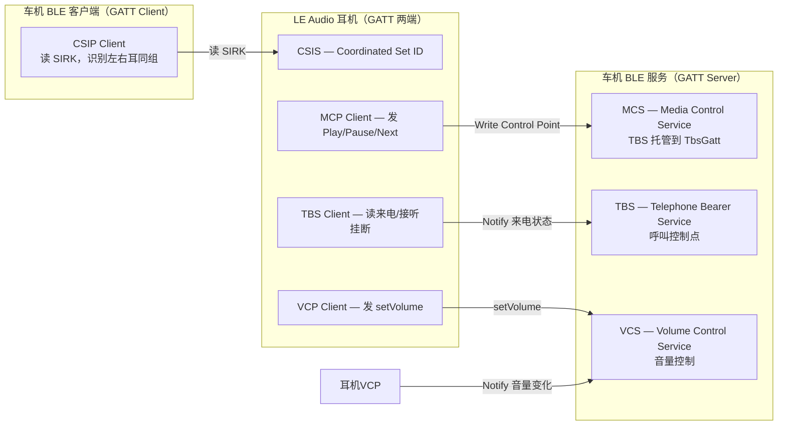

# 12.4 CSIP / VCP / MCP / TBS 四件套

> **速通摘要**：CSIP（协调集识别）、VCP（音量控制）、MCP（媒体控制）、TBS（电话承载服务）是 LE Audio 生态里的四个上层 Profile，分别解决"怎么同步管理左右耳"、"怎么控制 LE Audio 音量"、"怎么播放控制"、"怎么同步通话状态"这四个问题。它们都基于 GATT，与 Classic BT 的 AVRCP / GAVDP / HFP 功能对等，是车机做 LE Audio 定制时的高频改动点。

---

## 学习目标

读完本节后，你能：
1. 解释 CSIP 如何让车机把两个耳机当"一个设备"管理。
2. 找到 VCP / MCP / TBS 的 Java 服务入口和 C++ 实现文件。
3. 理解 MCP 与 AVRCP 的关系（功能对等，信道不同）。
4. 说出 TBS 在通话场景里替代 HFP 的哪个角色。

---

## 前置知识

- [12.1 LE Audio 全景](12.1_LE_Audio全景.md) — 各 Profile 在全景中的位置
- [08.2 GATT 连接与服务发现](../08_BLE_GATT/08.2_GATT连接与服务发现.md) — GATT 服务/特征操作基础
- [06.3 AVRCP Target/Controller](../06_A2DP与AVRCP/06.3_AVRCP_Target_Controller.md) — 与 MCP 功能对照

---

## 场景故事

用户戴着左右耳 LE Audio 耳机上车，车机需要：
1. 把左右耳识别为"一个设备"，连接一次就能同时控制 → **CSIP**
2. 通过 BLE 统一调节音量 → **VCP**
3. 点击方向盘"下一曲"按钮同步到耳机里的播放器 → **MCP**
4. 有来电时，耳机屏幕显示联系人名 → **TBS**

四个 Profile 各司其职，共同构成 LE Audio 场景的完整用户体验。

---

## 一、CSIP（Coordinated Set Identification Profile）

### 用途
把多个 BLE 设备（典型：左右耳）标识为同一个"协调集"，让车机一次配对/连接操作同时处理两个设备。

### 源码入口

| 层级 | 文件 | 类 | 行号 |
|------|------|-----|------|
| Java 服务 | `android/.../csip/CsipSetCoordinatorService.java` | `CsipSetCoordinatorService` | 72 |
| JNI | `android/app/jni/com_android_bluetooth_csip_set_coordinator.cpp` | — | 273+ |
| C++ BTA | `system/bta/csis/csis_client.cc` | `CsisClientImpl` | 129 |
| 类型定义 | `system/bta/csis/csis_types.h` | — | — |

### 工作原理（简化）
耳机在 GATT 上暴露 **CSIS（Coordinated Set Identification Service，UUID: 0x1846）**，里面包含：
- `Set Identity Resolving Key (SIRK)`：用于识别哪些设备属于同一组
- `Set Member Lock`：防止同一组中的其他成员在更新时被其他设备改配置

```java
// android/.../csip/CsipSetCoordinatorService.java:72
public class CsipSetCoordinatorService extends ConnectableProfile {
    // 当发现设备属于某个 Coordinated Set 时
    void onSetMemberAvailable(BluetoothDevice device, int groupId) {
        // 通知 LeAudioService 这两个设备属于同一个 group_id
    }
}
```

```cpp
// system/bta/csis/csis_client.cc:129
class CsisClientImpl : public CsisClient {
  void Connect(const RawAddress& address) override;
  // 读取 SIRK 并解析设备所属的 Set
  void OnGattReadComplete(uint16_t conn_id, tGATT_STATUS status,
                          uint16_t handle, uint16_t len, uint8_t* value,
                          void* data);
};
```

---

## 二、VCP（Volume Control Profile）

### 用途
通过 BLE GATT 控制 LE Audio 设备的音量（相当于 AVRCP 绝对音量的 LE Audio 版本），支持静音、单/组设备音量同步。

### 源码入口

| 层级 | 文件 | 类 | 行号 |
|------|------|-----|------|
| Java 服务 | `android/.../vc/VolumeControlService.java` | `VolumeControlService` | 79 |
| JNI | `android/app/jni/com_android_bluetooth_vc.cpp` | — | `initNative:415` |
| C++ BTA | `system/bta/vc/vc.cc` | `VolumeControlImpl` | 115 |
| 设备管理 | `system/bta/vc/devices.h` | `VolumeControlDevices` | — |

### 关键 API

```java
// android/.../vc/VolumeControlService.java:79
public class VolumeControlService extends ConnectableProfile {
    // 设置单个设备的音量（0-255）
    public boolean setVolumeOffset(BluetoothDevice device, int volumeOffset) { ... }
    // 设置设备组的音量（所有 CSIP 组成员）
    public void setGroupVolume(int groupId, int volume) { ... }
    // 静音/解除静音
    public void muteGroup(int groupId) { ... }
}
```

```cpp
// android/app/jni/com_android_bluetooth_vc.cpp:415
static void initNative(JNIEnv* env, jobject obj) {
  // 初始化 VolumeControl C++ 接口，注册 callbacks
}
// :519
static void setVolumeNative(JNIEnv* env, jobject obj, jbyteArray address,
                            jint volume) {
  // 调用 VolumeControl::Get()->SetVolume()
}
```

---

## 三、MCP（Media Control Profile）

### 用途
LE Audio 版的"媒体播放控制"（对应 Classic BT 的 AVRCP Controller/Target），通过 GATT 暴露 MCS（Media Control Service）。车机作为 MCP Client，读取 LE Audio 耳机 / 手机上的播放状态，并发送控制命令。

### 与 AVRCP 的对比

| 维度 | AVRCP | MCP |
|------|-------|-----|
| 传输层 | L2CAP over Classic BT | GATT over BLE |
| 发现方式 | SDP 查询 | GATT 服务发现（MCS UUID: 0x1848） |
| 控制命令 | 操作码（0x44 Play / 0x46 Pause...） | GATT Write（Media Control Point Characteristic） |
| 媒体信息 | AVRCP Metadata | GATT Read（Track Title / Artist...） |

### 源码入口

| 层级 | 文件 | 类 | 行号 |
|------|------|-----|------|
| Java 服务 | `android/.../mcp/McpService.java` | `McpService` | 40 |
| GATT 实现 | `android/.../mcp/MediaControlGattService.java` | — | — |
| 状态定义 | `android/.../mcp/MediaState.java` | `MediaState` | — |

### MCP 媒体状态枚举

```java
// android/.../mcp/MediaState.java（简化）
// 对应 MCS 规范中的 Media State Characteristic 值
// 0x00 Inactive / 0x01 Playing / 0x02 Paused / 0x03 Seeking
```

```java
// android/.../mcp/McpService.java:40
public class McpService extends ProfileService {
    // 更新当前播放状态（由 AudioManager 或 MediaSession 触发）
    public void updatePlayingOrderSupportedChar(int playingOrder) { ... }
    // 处理来自耳机的控制命令（如 Play / Pause / Next Track）
    public void setMediaControlRequest(BluetoothDevice device,
                                       int controlRequest) { ... }
}
```

---

## 四、TBS（Telephone Bearer Service）

### 用途
LE Audio 版的"通话状态同步"（对应 Classic BT 的 HFP 通话状态部分）。耳机通过 GATT 读取车机暴露的 TBS，了解来电信息；车机通过 TBS 上报通话状态变化（接听/挂断/来电号码）。

### 与 HFP 的对比

| 维度 | HFP | TBS |
|------|-----|-----|
| 传输层 | RFCOMM over Classic BT | GATT over BLE |
| 来电通知 | `+RING` AT 命令 | `Bearer URI Schemes Supported List` + `Incoming Call` Characteristic |
| 接听/挂断 | `ATA` / `ATH` AT 命令 | GATT Write 到 `Call Control Point` |
| 通话状态 | `+CIEV:call,1` AT 命令 | `Call State` Characteristic Notify |

### 源码入口

| 层级 | 文件 | 类 | 行号 |
|------|------|-----|------|
| Java 服务 | `android/.../tbs/TbsService.java` | `TbsService` | 40 |
| GATT 实现 | `android/.../tbs/TbsGatt.java` | `TbsGatt` | — |
| 通话数据 | `android/.../tbs/TbsCall.java` | `TbsCall` | — |
| 电话与系统对接 | `android/.../telephony/` | — | — |

```java
// android/.../tbs/TbsService.java:40
public class TbsService extends ProfileService {
    // 收到来电时，更新 GATT 上的 Incoming Call Characteristic
    public void onCallAdded(BluetoothLeCall call) { ... }
    // 通话状态变化时，Notify 连接的 LE Audio 设备
    public void onCallStateChanged(BluetoothLeCall call, int newState) { ... }
}
```

---

## 四者协作关系（Mermaid）



---

## 调试方法

```bash
# 观察 CSIP 组发现日志
adb logcat -s CsipSetCoordinatorService:V | grep -i "set\|group\|sirk"

# 观察 VCP 音量同步
adb logcat -s VolumeControlService:V | grep -i "volume\|mute"

# 观察 MCP 媒体控制命令
adb logcat -s McpService:V MediaControlGattService:V

# 观察 TBS 通话状态同步
adb logcat -s TbsService:V TbsGatt:V | grep -i "call\|state"

# dumpsys 查看连接状态
adb shell dumpsys bluetooth_manager | grep -A 5 "CSIP\|VolumeControl\|Mcp\|TBS"
```

---

## FAQ

**Q1：CSIP 只能管理耳机的左右耳吗？**
不是。CSIP 管理任何"协调集"——可以是左右耳、也可以是一组 LE Audio 扬声器。车机多区音频（前排/后排独立控音量）就可能用到 CSIP 来管理多个 LE Audio 音箱。

**Q2：VCP 和 AVRCP 绝对音量（Absolute Volume）能同时用吗？**
当设备同时支持 Classic 和 LE Audio（Dual Mode）时，Android 会根据活动的音频路由选择用 AVRCP 还是 VCP 做音量同步。`ActiveDeviceManager` 负责这个选择。

**Q3：MCP 和 AVRCP 在车机上哪个优先？**
如果当前活动设备走 LE Audio 路径，用 MCP；走 Classic A2DP 路径，用 AVRCP。`LeAudioService` 切换活动设备时会同时切换相关的控制 Profile。

**Q4：TBS 能完全替代 HFP 吗？**
从协议功能角度可以，但目前大多数手机（尤其 iPhone）在通话场景仍优先走 HFP。TBS 是 LE Audio 专属的通话控制层，只有在双端都走 LE Audio + CIS 通话路径时才会全程使用 TBS，否则通话音频仍走 HFP/SCO。

---

## 上路任务

1. 在 `android/.../csip/CsipSetCoordinatorService.java:72` 附近，找到 `getGroupId(BluetoothDevice device)` 方法，理解它如何把单个 BLE 设备映射到一个组 ID。
2. 打开 `system/bta/vc/vc.cc:115`，在 `VolumeControlImpl` 中找到处理 GATT Notification 的回调（`OnGattNotification`），看它在收到音量变化时如何通知 Java 层。
3. 对比 `android/.../tbs/TbsGatt.java` 中 `TBS_CALL_STATE_UUID` 和 `android/.../mcp/MediaState.java` 中的状态值，各自有几个状态？
