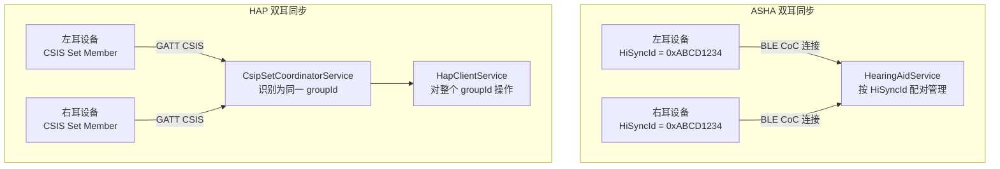

# 12.5 ASHA 助听器

> **速通摘要**：Android 有两套助听器协议栈：旧的 **ASHA（Audio Streaming for Hearing Aids）** 是 Google 自定义的 BLE 专有协议（源码在 `HearingAidService`），新的 **HAP（Hearing Access Profile，Bluetooth SIG 标准）** 于蓝牙 5.2 引入（源码在 `HapClientService`）。Android 16 同时支持两套，车机工程师需要知道什么设备走哪条路径，以及如何调试助听器连接问题。

---

## 学习目标

读完本节后，你能：
1. 区分 ASHA 和 HAP，各自对应哪些 Java 服务和 C++ 实现。
2. 理解助听器设备的"双耳同步"机制（HiSyncId / CSIP）。
3. 在 logcat 中定位助听器连接问题的关键日志。
4. 说出 HAP 和 LE Audio 全景（TMAP / VCP / MCP）的集成关系。

---

## 前置知识

- [12.1 LE Audio 全景](12.1_LE_Audio全景.md) — HAP 在 LE Audio 体系中的位置
- [12.4 CSIP / VCP / MCP / TBS](12.4_CSIP_VCP_MCP_TBS四件套.md) — CSIP 协调左右耳
- [08.2 GATT 连接与服务发现](../08_BLE_GATT/08.2_GATT连接与服务发现.md) — GATT 基础

---

## 场景故事

车机厂商反馈："用户戴 Phonak 助听器时，连车机没有声音，但同款助听器连 iPhone 正常。"

排查思路：
1. 先确认助听器支持的是 ASHA 还是 HAP（查 GATT 服务 UUID）。
2. 旧的 Phonak 助听器只支持 ASHA（Google 专有），HAP 是较新协议，看设备 SDK 版本。
3. 如果车机厂商没有正确配置 ASHA 的连接优先级，ASHA Profile 可能被 A2DP 挤占。
4. 用 `adb logcat -s HearingAidService:V` 看是否有 `hi_sync_id` 匹配失败的日志。

---

## 两套协议对比

| 维度 | ASHA（旧，Google 专有） | HAP（新，SIG 标准） |
|------|-----------------------|------------------|
| 标准化 | Google 自研，2019 年引入 | BT SIG 标准，蓝牙 5.2 |
| BLE 传输 | CoC（Connection Oriented Channel） | GATT + LE Audio CIS |
| 双耳同步 | `HiSyncId`（两台设备共享同一 ID） | CSIP（见 12.4） |
| 音频格式 | G.722（16 kHz 宽带语音） | LC3（灵活配置） |
| Java 服务 | `HearingAidService.java:62` | `HapClientService.java:80` |
| C++ 实现 | `system/bta/hearing_aid/hearing_aid.cc:274` | `system/bta/has/has_client.cc:123` |
| 车载适用性 | 已有大量存量设备 | 未来主流（Android 16 支持） |

---

## 分层调用链

### ASHA 路径

```
HearingAidService（Java，android/.../hearingaid/HearingAidService.java:62）
    │  通过 HearingAidNativeInterface
    ▼
com_android_bluetooth_hearing_aid.cpp（JNI）
    ▼
HearingAidImpl（system/bta/hearing_aid/hearing_aid.cc:274）
    │  建立 L2CAP CoC 通道
    │  传输 G.722 音频帧
    ▼
HCI 控制器
```

### HAP 路径

```
HapClientService（Java，android/.../hap/HapClientService.java:80）
    │  通过 HapClientNativeInterface
    ▼
com_android_bluetooth_hap_client.cpp（JNI）
    ▼
HasClientImpl（system/bta/has/has_client.cc:123）
    │  通过 GATT 读取/写入 HAS（Hearing Access Service）特征
    │  音频走 LE Audio CIS（见 12.3）
    ▼
LeAudioClientImpl / IsoManager
```

---

## 源码导读

### ASHA：HearingAidService

```java
// android/app/src/.../hearingaid/HearingAidService.java:62
public class HearingAidService extends ConnectableProfile {
    // HiSyncId 用于识别双耳（左右耳共享同一个 64-bit ID）
    private long mActiveDeviceHiSyncId = BluetoothHearingAid.HI_SYNC_ID_INVALID;

    // 当用户设置活动助听器时
    public boolean setActiveDevice(BluetoothDevice device) {
        // 找到和该设备 HiSyncId 相同的另一耳，也一并激活
        long hiSyncId = getHiSyncId(device);
        for (BluetoothDevice d : getConnectedDevices()) {
            if (getHiSyncId(d) == hiSyncId) activateBoth(d);
        }
    }
}
```

```cpp
// system/bta/hearing_aid/hearing_aid.cc:274
class HearingAidImpl : public HearingAid {
  // 建立 L2CAP CoC 通道（ASHA 用 CoC 传 G.722 音频）
  void Connect(const RawAddress& address) override;
  // 接收音频数据并写入 L2CAP CoC 通道
  void OnAudioResume(void) override;
};
```

### HAP：HapClientService

```java
// android/app/src/.../hap/HapClientService.java:80
public class HapClientService extends ConnectableProfile {
    // 获取设备支持的预设列表（如"安静环境"/"嘈杂环境"/"音乐"）
    public List<BluetoothHapPresetInfo> getAllPresetInfo(BluetoothDevice device) { ... }

    // 切换助听器预设（如切换到"嘈杂环境"模式）
    public void selectPreset(BluetoothDevice device, int presetIndex) { ... }

    // 切换同步组的所有设备预设
    public void selectPresetForGroup(int groupId, int presetIndex) { ... }
}
```

```cpp
// system/bta/has/has_client.cc:123
class HasClientImpl : public HasClient {
  void Connect(const RawAddress& address) override;
  // 读取 HAS（Hearing Access Service，UUID: 0x1854）特征
  // 获取 Hearing Aid Features / Preset Record List
  void OnGattServiceDiscovery(tBTA_GATTC_SRVC_DISC_DONE& evt) override;
};
```

---

## 双耳同步机制



---

## 调试方法

```bash
# ASHA 调试（旧协议）
adb logcat -s HearingAidService:V HearingAidImpl:V | grep -i "hi_sync\|connect\|audio"

# HAP 调试（新协议）
adb logcat -s HapClientService:V HasClientImpl:V | grep -i "preset\|hearing\|connect"

# 查看助听器连接状态
adb shell dumpsys bluetooth_manager | grep -A 10 "HearingAid\|HapClient"

# 查看当前活动设备的 HiSyncId（ASHA）
adb logcat -s HearingAidService:V | grep "HiSyncId\|setActiveDevice"

# btsnoop 观察要点
# ASHA: 找 L2CAP CoC Credit Based Connection Request（PSM 0x0001）
# HAP: 找 GATT Read（Hearing Aid Features Characteristic，UUID: 0x2BDA）
```

---

## FAQ

**Q1：怎么判断一个助听器设备走 ASHA 还是 HAP 路径？**
在 btsnoop 或 GATT 服务发现日志中：
- ASHA 设备会有 Google 自定义服务 UUID（`0xFDF0`，即 `Audio Streaming for Hearing Aids`）
- HAP 设备会有 HAS 服务 UUID（`0x1854`）

**Q2：车机为什么不推荐做 ASHA Server？**
ASHA 的 Server 角色（即助听器设备侧）实现不在 AOSP 的 packages/modules/Bluetooth 里，需要硬件级的低延迟音频通路支持，普通 Android 设备很难满足。车机通常作为 ASHA Client（音频源），助听器作为 Server（接收端）。

**Q3：HAP 和 TMAP 的关系是什么？**
HAP（Hearing Access Profile）定义了助听器特有的预设管理，TMAP（Telephony and Media Audio Profile）定义了通话和媒体的角色。助听器设备通常同时支持 HAP + TMAP，HAP 管控"模式切换"，TMAP 管控"音频路由"。

---

## 上路任务

1. 打开 `android/.../hearingaid/HearingAidService.java:87`，找到 `mActiveDeviceHiSyncId` 字段，再找到设置它的代码路径，理解 ASHA 双耳同步是如何触发的。
2. 在 `system/bta/has/has_client.cc:123` 的 `HasClientImpl` 中找到处理 `Preset Record` GATT Notification 的回调，看它如何更新预设列表。
3. 在 AOSP 文档或蓝牙规范中查找 ASHA 服务 UUID `0xFDF0`，确认它是 Google 注册的厂商自定义服务，而非 SIG 标准 UUID。
