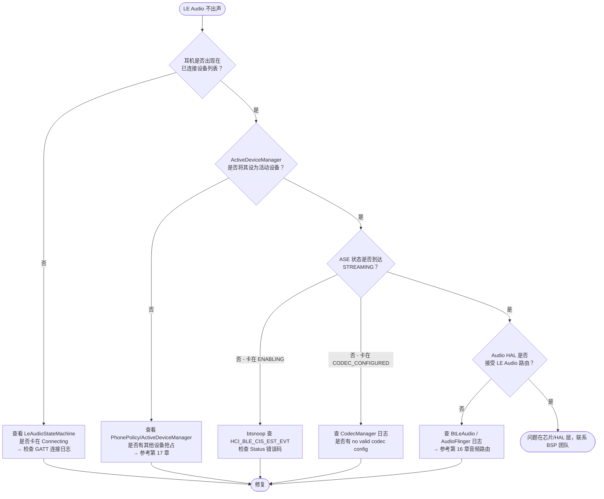

# 12.6 LE Audio 在车机上的接入与故障排查

> **速通摘要**：车机接入 LE Audio 的核心挑战有三：① 旧版 A2DP/HFP 和新版 LE Audio 的共存策略；② LE Audio 依赖的 aconfig flag 是否正确开启；③ CIS 建立失败的定位路径。本节提供车机 LE Audio 调试的完整 checklist 和常见问题的源码级根因分析。

---

## 学习目标

读完本节后，你能：
1. 按 checklist 逐项排查"LE Audio 连了但不出声"的问题。
2. 识别 LE Audio 相关的 aconfig flag 并知道如何覆盖。
3. 在 btsnoop 中找到 LE Audio 连接失败的 HCI error code。
4. 理解车机 LE Audio 与 A2DP 切换时可能的竞争问题。

---

## 前置知识

- [12.1–12.5 本章前五节](12.1_LE_Audio全景.md) — LE Audio 全套架构
- [01.2 日志体系](../01_开发与调试准备/01.2_日志体系.md) — logcat / btsnoop 工具
- [17 多设备共存](../17_多设备共存/) — LE Audio 与 Classic 的活动设备切换

---

## 场景故事

车机量产前的蓝牙 TE 测试，测试工程师反馈：
1. 用某款 LE Audio 耳机连车机，能显示"已连接"但播放音乐没有声音。
2. 用另一款耳机偶发连接断开，重连后 30 秒内可以正常播放，再过一会儿又断。
3. 通话时左耳有声音，右耳无声音。

三个问题涉及三个不同的层：音频路由层、CIS 稳定性层、CSIP 同步层。本节提供系统性排查框架。

---

## 车机 LE Audio 接入 Checklist

### 1. 确认 LE Audio 能力声明

```bash
# 确认本机是否声明 LE Audio 能力（需要 HCI controller 支持）
adb shell dumpsys bluetooth_manager | grep -i "LE_AUDIO\|le_audio_supported"

# 检查 LE Audio Feature Flag（aconfig）是否开启
adb shell device_config get bluetooth leaudio_broadcast_monitor_source_sync_status
adb shell device_config get bluetooth leaudio_improve_switching_le_audio_devices
```

### 2. 确认耳机 PACS 服务发现

```bash
# 查看是否有 PACS 相关的 GATT 发现日志
adb logcat -s LeAudioClientImpl:V | grep -i "pacs\|codec\|sink_pac\|source_pac"

# 检查 CIG 是否成功创建
adb logcat -s LeAudioGroupStateMachine:V | grep -i "cig\|cis\|streaming\|codec_configured"
```

### 3. 确认 ISO 数据路径

```bash
# 查看 IsoManager 日志
adb logcat -s btm_iso:V | grep -i "cis_established\|data_path\|setup_iso"

# 查看音频路由是否切换到 LE Audio
adb logcat -s BtLeAudio:V AudioFlinger:V | grep -i "le_audio\|routing"
```

---

## 常见问题与根因

### 问题 1：LE Audio 耳机连上但不出声

**症状**：`adb shell dumpsys bluetooth_manager` 显示 LE Audio 已连接，但 `ActiveDeviceManager` 没有把它设为活动设备。

**根因分析**：

```bash
# 步骤 1：确认 LE Audio 是否被设置为活动设备
adb logcat -s ActiveDeviceManager:V | grep -i "le_audio\|setActive"

# 步骤 2：如果没有活动，检查 PhonePolicy 是否阻止了 LE Audio 激活
adb logcat -s PhonePolicy:V | grep -i "connect\|active\|le_audio"

# 步骤 3：检查 Audio HAL 是否接受了 LE Audio 路由
adb logcat -s BtLeAudio:V | grep "onAudioResume\|onAudioSuspend"
```

**关键源码**：见第 16 章（音频路由与 Audio HAL 深入）和第 17 章（ActiveDeviceManager）。

---

### 问题 2：CIS 建立失败（卡在 ENABLING 状态）

**症状**：logcat 显示 ASE 状态卡在 `ENABLING`，无法到达 `STREAMING`。

**定位步骤**：

```bash
# 1. 查看状态机卡点
adb logcat -s LeAudioGroupStateMachine:V | grep -i "enabling\|cis\|hci_error"

# 2. 在 btsnoop 中过滤 HCI LE_CREATE_CIS（OpCode 0x2064）
# 检查 HCI_BLE_CIS_EST_EVT 的 Status 字段
# 常见错误码：
#   0x00 = 成功
#   0x0D = Connection Rejected Due to Limited Resources（控制器资源不足）
#   0x3A = Unacceptable Connection Parameters（QoS 参数不匹配）
#   0x22 = LMP/LL Response Timeout（对端超时）

# 3. 检查 CIG 参数是否在控制器支持范围内
adb logcat -s IsoManager:V | grep -i "cig\|interval\|latency\|sdu_size"
```

**源码定位**：

```cpp
// system/stack/btm/btm_iso_impl.h:589
// CIS_ESTABLISHED 事件处理 — 检查 Status 字段
void OnCisEvent(uint8_t subevent, void* data) {
  // 如果 status != 0，CIS 建立失败，状态机会重试或上报失败
  if (p_evt->status != HCI_SUCCESS) {
    LOG_ERROR("CIS establishment failed, status: 0x%02x", p_evt->status);
    // ...
  }
}
```

---

### 问题 3：左耳有声音，右耳无声音

**症状**：CSIP 双耳设备中只有一侧有声音。

**定位步骤**：

```bash
# 1. 确认两台设备都在同一个 CSIP groupId
adb logcat -s CsipSetCoordinatorService:V | grep -i "group\|member\|sync_id"

# 2. 查看两台设备是否都有独立的 CIS
adb logcat -s LeAudioGroupStateMachine:V | grep -i "cis\|device"
# 预期看到两条 CIS（一左一右）都进入 STREAMING 状态

# 3. 检查 CIG 配置是否包含双侧 CIS
adb logcat -s LeAudioClientImpl:V | grep -i "cig\|cis_count\|group_size"
```

**根因**：最常见原因是右耳设备的 GATT ASE Control Point 写操作失败（GATT error），或者 HCI LE_CREATE_CIS 只创建了一条 CIS。用 btsnoop 验证两条 CIS 建立命令都被发出且成功完成。

---

### 问题 4：LE Audio 和 A2DP 切换时音频中断

**症状**：从 A2DP 耳机切换到 LE Audio 耳机时，有 2–5 秒无声。

**根因**：`ActiveDeviceManager` 需要先停用 A2DP 活动设备，再激活 LE Audio，这个切换过程中 AudioFlinger 的路由切换有延迟。

```bash
# 查看切换时序
adb logcat -s ActiveDeviceManager:V A2dpService:V LeAudioService:V | \
  grep -i "active\|setActive\|resume\|suspend" | head -30

# 关键 flag：控制切换行为
adb shell device_config get bluetooth leaudio_improve_switching_le_audio_devices
# 如果为 false，切换逻辑走旧路径，可能更慢
```

---

## LE Audio 相关 aconfig Flag 速查

| Flag 名 | 文件路径 | 作用 |
|---------|---------|------|
| `leaudio_broadcast_monitor_source_sync_status` | `flags/leaudio.aconfig` | 改进广播源同步状态上报 API |
| `leaudio_broadcast_volume_control_for_connected_devices` | `flags/leaudio.aconfig` | 已连接设备的广播音量控制 |
| `leaudio_improve_switching_le_audio_devices` | `flags/leaudio.aconfig` | 优化 LE Audio 设备切换逻辑 |
| `le_audio_update_config_preference_to_hal` | `flags/leaudio.aconfig` | 向 HAL 更新配置偏好 |

**覆盖 flag（调试用）**：

```bash
# 开启某个 flag（设备重启后生效）
adb shell device_config put bluetooth leaudio_improve_switching_le_audio_devices true

# 查看所有蓝牙 flag 当前值
adb shell device_config list bluetooth | grep leaudio
```

---

## LE Audio 调试全流程图



---

## 调试工具汇总

| 工具 | 命令 | 看什么 |
|------|------|--------|
| logcat (LeAudio) | `adb logcat -s LeAudioService:V LeAudioClientImpl:V LeAudioGroupStateMachine:V` | 连接/状态机转移 |
| logcat (ISO) | `adb logcat -s btm_iso:V IsoManager:V` | CIS/BIS 建立与数据路径 |
| logcat (Audio) | `adb logcat -s BtLeAudio:V AudioFlinger:V` | 音频路由切换 |
| dumpsys | `adb shell dumpsys bluetooth_manager` | 当前连接状态全局视图 |
| btsnoop | 过滤 `LE_SET_CIG_PARAMETERS / LE_CREATE_CIS / LE_SETUP_ISO_DATA_PATH` | HCI 命令序列与错误码 |
| device_config | `adb shell device_config list bluetooth \| grep leaudio` | 查看所有 LE Audio flag 状态 |

---

## FAQ

**Q1：车机支持 LE Audio 需要什么硬件前提？**
蓝牙控制器必须支持蓝牙 5.2 及以上，并实现 ISO Channel 相关的 HCI 命令（LE_SET_CIG_PARAMETERS、LE_CREATE_CIS 等）。用 `adb shell dumpsys bluetooth_manager | grep "SUPPORTS_ISO"` 确认。

**Q2：LE Audio 耳机为什么有时候只能用 A2DP 连？**
如果设备支持 Dual Mode（同时支持 Classic BT 和 BLE），Android 会根据 `PhonePolicy` 和设备能力选择连接路径。如果 LE Audio 的 PAC 服务发现失败，会 fallback 到 A2DP。查看 `LeAudioClientImpl` 日志中的 GATT 服务发现结果。

**Q3：如何强制使用 LE Audio 而不是 A2DP？**
没有用户层的强制开关，但可以在 `PhonePolicy` / `ActiveDeviceManager` 的逻辑里调整 LE Audio 的优先级（厂商 OEM 定制点）。另外，确保 aconfig flag `leaudio_improve_switching_le_audio_devices` 为 `true`。

---

## 上路任务

1. 用 `adb shell device_config list bluetooth | grep leaudio` 列出当前设备上所有 LE Audio 相关 flag 的值，找出其中默认为 `false` 的 flag。
2. 连接一款 LE Audio 耳机，用 `adb logcat -s LeAudioGroupStateMachine:V` 抓日志，把 ASE 状态转移序列（IDLE→CODEC_CONFIGURED→QOS_CONFIGURED→ENABLING→STREAMING）完整记录下来，注意每个转移之间的时间差。
3. 用 btsnoop 抓取上述连接过程，在 Wireshark 中过滤 `bthci_cmd.opcode == 0x2062`（LE Set CIG Parameters），查看协商的 SDU Interval 和 Max SDU 字段值，与 LC3 配置（12.2 节）对应。
