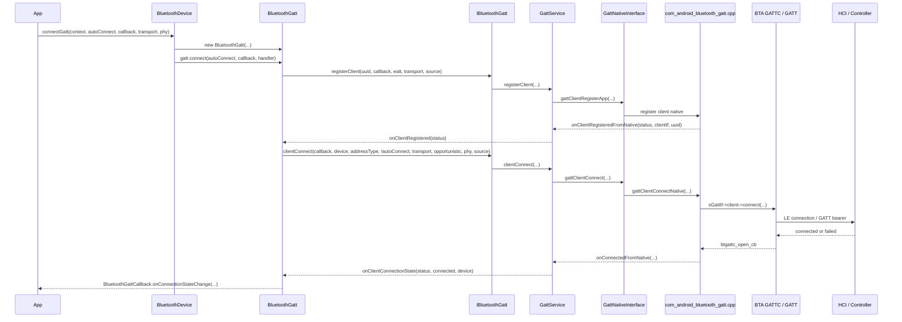
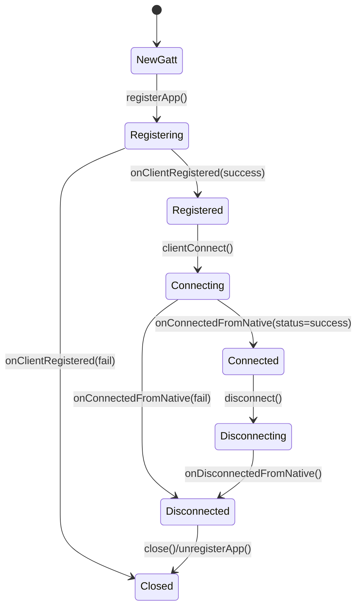
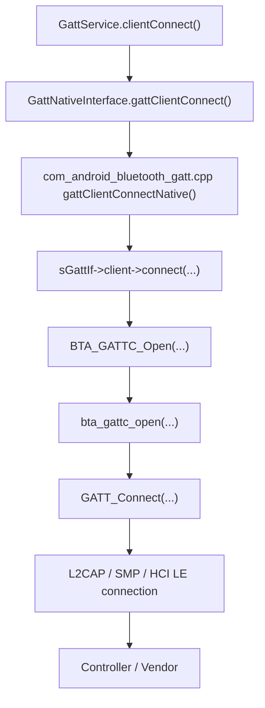

# 13-定向代码阅读报告：BLE Connect

## 1. 阅读目标

本报告聚焦 `BluetoothDevice.connectGatt()` 到 `BluetoothGattCallback.onConnectionStateChange()` 的完整链路。读完后要能判断 BLE 连接失败卡在 App 注册、Binder、`GattService` 上下文、Native GATTC、ATT/L2CAP/SMP，还是 Controller/Vendor。

## 2. 适用场景

- App 能扫描到设备，但 `connectGatt()` 失败。
- `onConnectionStateChange()` 返回非 0 status。
- direct connect 和 autoConnect 行为不符合预期。
- 双模设备 transport/address type 选错导致连接失败。
- 连接成功后马上断开，或者服务发现前断开。

## 3. 调用链全景图



## 4. 关键类与源码入口

| 层级 | 源码 | 关键入口 |
| --- | --- | --- |
| Framework API | `framework/java/android/bluetooth/BluetoothDevice.java` | `connectGatt(...)` |
| Framework GATT | `framework/java/android/bluetooth/BluetoothGatt.java` | `connect(...)`、`registerApp(...)`、`onClientRegistered(...)`、`onClientConnectionState(...)` |
| AIDL | `android/app/aidl/android/bluetooth/IBluetoothGatt.aidl` | `registerClient(...)`、`clientConnect(...)`、`clientDisconnect(...)` |
| Binder | `android/app/src/com/android/bluetooth/gatt/GattServiceBinder.java` | `registerClient(...)`、`clientConnect(...)`、`clientDisconnect(...)` |
| Bluetooth App | `android/app/src/com/android/bluetooth/gatt/GattService.java` | `registerClient(...)`、`clientConnect(...)`、`onConnectedFromNative(...)`、`onDisconnectedFromNative(...)` |
| 上下文表 | `android/app/src/com/android/bluetooth/gatt/ContextMap.java` | `add(...)`、`addConnection(...)`、`removeConnection(...)`、`getByConnId(...)` |
| Native 接口 | `android/app/src/com/android/bluetooth/gatt/GattNativeInterface.java` | `gattClientConnect(...)`、`onConnected(...)`、`onDisconnected(...)` |
| JNI | `android/app/jni/com_android_bluetooth_gatt.cpp` | `gattClientConnectNative(...)`、`btgattc_open_cb(...)`、`btgattc_close_cb(...)` |
| BTA/Stack | `system/bta/gatt/bta_gattc_api.cc`、`system/bta/gatt/bta_gattc_act.cc`、`system/stack/gatt/gatt_api.cc` | `BTA_GATTC_Open(...)`、`bta_gattc_open(...)`、`GATT_Connect(...)` |

## 5. 生命周期与状态



关键细节：

- `BluetoothDevice.connectGatt(...)` 只创建 `BluetoothGatt` 并调用 `connect(...)`，真正连接要等 client 注册成功。
- `BluetoothGatt.onClientRegistered(...)` 注释明确 `autoConnect` 与 `isDirect` 是反向关系：`autoConnect == false` 表示 direct connect。
- `GattService.onConnectedFromNative(...)` 成功后调用 `mClientMap.addConnection(clientIf, connId, transport, device)`，失败时会通知 `AdapterService.notifyGattClientConnectFailed(...)`。
- `GattService.onDisconnectedFromNative(...)` 会移除连接并回调 App。

## 6. 线程模型与回调分发

| 环节 | 线程/机制 | 注意点 |
| --- | --- | --- |
| App 调用 | App 线程 | 可指定 `Handler` 接收 GATT callback |
| Framework callback | `BluetoothGatt` 内部 callback 包装 | 最终触发 `BluetoothGattCallback` |
| Binder | `IBluetoothGatt` Stub | 跨进程进入 Bluetooth App |
| GATT Service | `HandlerThread("Bluetooth LE")` | `GattService` 初始化该线程管理 GATT 任务 |
| Java 回调到 App | `Utils.callbackToApp(...)` | 避免直接在服务线程跑 App callback |
| JNI/Native callback | `com_android_bluetooth_gatt.cpp` 回调表 | `btgattc_open_cb`、`btgattc_close_cb` 进入 Java |
| Native stack | BTIF/BTA/GATT/HCI | 连接建立、SMP、ATT bearer 都在 Native 层推进 |

## 7. 权限检查点与 Binder 边界

Binder 边界是 `IBluetoothGatt.aidl`：

- `registerClient(in ParcelUuid appId, in IBluetoothGattCallback callback, boolean eatt_support, in int transport, in AttributionSource attributionSource)`
- `clientConnect(in IBluetoothGattCallback callback, in BluetoothDevice device, in int addressType, in boolean isDirect, in int transport, in boolean opportunistic, in int phy, in AttributionSource attributionSource)`
- `clientDisconnect(...)`

`GattServiceBinder` 是权限检查的第一道 Bluetooth 进程边界。当前报告重点是 connect，后续 `19-定向代码阅读报告-Permission-AppOps.md` 会统一展开权限与 AppOps。这里阅读时至少要确认：

- 调用是否带了正确 `AttributionSource`。
- `BluetoothGatt` 是否已成功注册 client。
- `clientConnect(...)` 是否因为 App 未注册直接返回。

## 8. JNI / Native / Vendor 边界



关键锚点：

- `com_android_bluetooth_gatt.cpp` 的 `gattClientConnectNative(...)` 调 `sGattIf->client->connect(...)`。
- `system/bta/gatt/bta_gattc_api.cc` 的 `BTA_GATTC_Open(...)` 是 BTA GATT Client open 入口。
- `system/bta/gatt/bta_gattc_act.cc` 的 `bta_gattc_open(...)` 会调用 `GATT_Connect(...)`。
- `system/stack/gatt/gatt_api.cc` 的 `GATT_Connect(...)` 靠近 ATT/GATT stack 连接入口。

Vendor 边界：

- 当前仓库可追到 GATT stack 和 HCI 连接发起逻辑；连接参数、射频、controller firmware、白名单/offload 行为需要 btsnoop 和 vendor log 证明。

## 9. 可能失败点

| 层级 | 失败点 | 表现 | 观察方式 |
| --- | --- | --- | --- |
| Framework | `getBluetoothGatt()` 返回 null | `connectGatt()` 无法继续 | `BluetoothDevice.connectGatt()` log |
| Framework | `registerApp()` 失败 | `onClientRegistered(GATT_FAILURE)` | `BluetoothGatt` log |
| Binder | `IBluetoothGatt` 不可用 | RemoteException 或无回调 | Framework log |
| GattService | App 未注册 | `clientConnect(...) - App not registered` | `GattService` log |
| GattService | client 数过多 | registerClient 失败 | `registerClient() - failed due to too many clients` |
| 参数 | `autoConnect/isDirect` 理解反了 | 连接时机不符合预期 | `BluetoothGatt`、`GattService.clientConnect()` |
| 参数 | transport/addressType/phy 错误 | 双模或随机地址设备失败 | GattService log + snoop |
| Native | `sGattIf->client->connect` 失败 | 无 HCI create connection | JNI/native log |
| Security | 需要加密或 bond | 连接后 ATT/SMP 失败 | btsnoop SMP/ATT error |
| Controller | LE Create Connection timeout | status 非 0、连接超时 | btsnoop、vendor log |

## 10. dumpsys、logcat、bugreport 观察点

命令：

```bash
adb shell dumpsys bluetooth
adb logcat -b all | grep -E "BluetoothGatt|GattService|GattServiceBinder|GattNativeInterface|BtGatt|btgatt|BTA_GATTC|GATT_Connect"
adb bugreport bugreport.zip
```

重点看：

- `BluetoothGatt`：`registerApp()`、`onClientRegistered()`、`connect()`、`onClientConnectionState()`。
- `GattService`：`registerClient()`、`clientConnect()`、`onConnectedFromNative()`、`onDisconnectedFromNative()`。
- `ContextMap.dump()`：client app、connection、connId、transport。
- btsnoop：LE Create Connection、Connection Complete、SMP Pairing、ATT Exchange MTU 或 Error Response。

## 11. 定制修改思路

| 目标 | 涉及文件 | 修改思路 | 风险 |
| --- | --- | --- | --- |
| 增强连接诊断 | `BluetoothGatt.java`、`GattService.java` | 打印 uuid、clientIf、device、transport、addressType、isDirect、phy、status | 隐私与日志量 |
| 记录最后失败原因 | `GattService.onConnectedFromNative(...)` | status 非成功时记录到 per-client/per-device 诊断表并 dump | 需要避免锁顺序问题 |
| 排查 autoConnect | `BluetoothGatt.java`、`GattService.clientConnect(...)` | 明确打印 `autoConnect` 与 `isDirect` 的反向关系 | 不能改变系统语义 |
| 支持车机案例沉淀 | `GattService.dump(...)`、`ContextMap.dump(...)` | 输出最近连接失败、断开原因和 connId | dump 过长需裁剪 |

## 12. 最容易踩的坑

- `connectGatt()` 返回 `BluetoothGatt` 对象，不代表已经开始 HCI 连接。
- client 注册成功不代表连接成功，`onClientRegistered()` 之后才会走 `clientConnect()`。
- `autoConnect=false` 才是 direct connect，传到服务侧会变成 `isDirect=true`。
- `onConnectionStateChange(connected)` 不代表服务发现完成。
- 双模设备没指定 `TRANSPORT_LE` 时，连接可能走到不符合预期的 bearer。
- 随机地址、RPA、bond 信息不一致时，扫描看到的地址和连接使用地址可能不是一个简单静态 MAC。

## 13. 练习题与参考答案

### 练习 1：写出 `connectGatt()` 到 Native connect 的主链路

参考答案：

`BluetoothDevice.connectGatt()` -> `new BluetoothGatt(...)` -> `BluetoothGatt.connect()` -> `BluetoothGatt.registerApp()` -> `IBluetoothGatt.registerClient()` -> `GattServiceBinder.registerClient()` -> `GattService.registerClient()` -> `GattNativeInterface` 注册 client -> `onClientRegisteredFromNative()` -> `BluetoothGatt.onClientRegistered()` -> `IBluetoothGatt.clientConnect()` -> `GattService.clientConnect()` -> `GattNativeInterface.gattClientConnect()` -> `com_android_bluetooth_gatt.cpp gattClientConnectNative()` -> `sGattIf->client->connect(...)` -> `BTA_GATTC_Open()` -> `GATT_Connect()`。

### 练习 2：扫描能看到设备但连接失败，先看哪几个日志

参考答案：

先看 `BluetoothGatt` 的 `registerApp()` 和 `onClientRegistered()`，确认 client 注册成功；再看 `GattService.clientConnect()` 是否有正确 `transport/addressType/isDirect/phy`；再看 `onConnectedFromNative()` 的 status；最后用 btsnoop 判断是否发出 LE Create Connection 以及 controller 返回了什么状态。

### 练习 3：如何解释 autoConnect 和 isDirect

参考答案：

`BluetoothGatt` 源码注释指出 `autoConnect` 是 `isDirect` 的反向值。`autoConnect=false` 表示主动立即连接，对应 `isDirect=true`；`autoConnect=true` 表示后台/自动连接倾向，对应 `isDirect=false`。很多连接时机误判来自这里。

### 练习 4：要在 dumpsys 里补连接失败证据，应记录什么

参考答案：

至少记录 package/uid、clientIf、device、transport、addressType、isDirect、phy、connect start 时间、native status、disconnect status、connId。如果涉及隐私，地址要脱敏；如果日志量大，只保留最近 N 条。

## 14. 与案例库的映射

可映射到 `97-真实案例库.md`：

- “BLE 看得到广播但 connectGatt 失败”
- “GATT 连接成功但服务发现为空”
- “配对成功后无法自动回连”

案例沉淀时建议按三段证据组织：

1. 扫描阶段：是否确实发现目标设备。
2. 连接阶段：client 注册、`clientConnect` 参数、native status。
3. 底层阶段：btsnoop 中 HCI/SMP/ATT 的真实结果。
