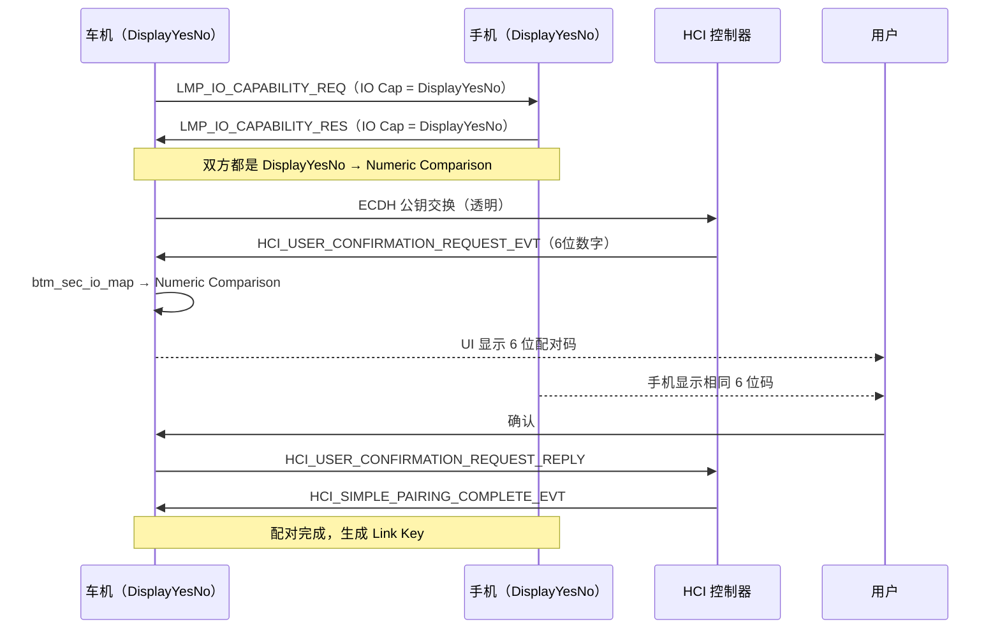

# 13.1 SSP 详解

> **速通摘要**：SSP（Secure Simple Pairing，安全简单配对）是 Bluetooth 2.1 引入的现代 Classic BT 配对机制，用 ECDH 密钥交换替代了旧版 PIN 码，分为四种关联模型：Numeric Comparison / Passkey Entry / Just Works / OOB。配对成功后生成 Link Key，存储在持久化的绑定记录中。车机上常见的"iPhone 配不上"或"显示配对码 × 但配不上"问题，根因通常在 IO Capability 协商或 Numeric Comparison 阶段。

---

## 学习目标

读完本节后，你能：
1. 解释 SSP 四种关联模型各自的触发条件（IO Capability 决策矩阵）。
2. 在源码中找到 IO Capability 矩阵定义和配对模型选择逻辑。
3. 用 btsnoop 识别 SSP 配对的 HCI 命令序列。
4. 定位"配对码错误"类问题的源码入口。

---

## 前置知识

- [03.3 配对（Bonding）：BondStateMachine 与 SMP](../03_核心流程/03.3_配对Bonding.md)
- [05.5 HCI 层](../05_Native栈基础/05.5_HCI层.md) — HCI 事件机制

---

## 场景故事

车机和 iPhone 15 配对失败，用户反映界面弹出"确认配对码"后点击确认，但 iPhone 这边无任何提示，连接断开。

排查：iPhone 的 IO Capability 是 `DisplayYesNo`（屏幕显示 + 能确认）。车机如果被设为 `NoInputNoOutput`，两者 IO Cap 协商后会走 **Just Works**——但 Just Works 不需要用户确认，不会弹配对码。如果车机错误弹出了配对码 UI，说明 UI 与底层 IO Cap 配置不一致。

---

## SSP 四种关联模型

| 模型 | 触发条件 | 用户操作 | 防中间人 |
|------|---------|---------|---------|
| **Just Works** | 至少一方是 `NoInputNoOutput` | 无（自动完成） | 否 |
| **Numeric Comparison** | 双方都是 `DisplayYesNo` | 双方确认 6 位数字 | 是 |
| **Passkey Entry** | 一方 `KeyboardOnly`，另一方能显示 | 在 Keyboard 端输入显示端的 PIN | 是 |
| **OOB** | 双方都支持 OOB | 通过 NFC 等带外通道交换信息 | 是（取决于 OOB 通道） |

---

## IO Capability 决策矩阵

```cpp
// system/stack/btm/btm_sec.cc:135
// true = 使用 Numeric Comparison；false = 使用 Just Works 或 Passkey Entry
static const bool btm_sec_io_map[BTM_IO_CAP_MAX][BTM_IO_CAP_MAX] = {
    //   Initiator →    OUT    IO     IN    NONE
    /* Responder ↓ */
    /* OUT  DisplayOnly  */ {false, true,  false, false},
    /* IO   DisplayYesNo */ {true,  true,  false, false},
    /* IN   KeyboardOnly */ {false, false, false, false},
    /* NONE NoIO         */ {false, false, false, false},
};

// :141
/*  BTM_IO_CAP_OUT   0  DisplayOnly    （只能显示） */
/*  BTM_IO_CAP_IO    1  DisplayYesNo   （显示+确认键） */
/*  BTM_IO_CAP_IN    2  KeyboardOnly   （只有键盘） */
/*  BTM_IO_CAP_NONE  3  NoInputNoOutput（无 UI） */
```

**Java 对照**：`BTM_IO_CAP_IO`（DisplayYesNo）对应 Android `BluetoothDevice.PAIRING_VARIANT_CONSENT`（Numeric Comparison）配对类型。

---

## 分层调用链

```
用户发起配对（BluetoothDevice.createBond()）
    ↓
BondStateMachine → 发 HCI_AUTHENTICATION_REQUESTED
    ↓
BTM 收到 HCI_USER_CONFIRMATION_REQUEST_EVT
    ↓
btm_sec_io_map[loc_io_caps][rmt_io_caps] 决定模型
    ↓
回调 Java 层展示 UI（BTM_SP_CFM_REQ_EVT / BTM_SP_KEY_REQ_EVT）
    ↓
用户确认 → BTM_ConfirmReqReply() / BTM_PasskeyReqReply()
    ↓
HCI_USER_CONFIRMATION_REQUEST_REPLY 发给控制器
    ↓
配对成功，生成 Link Key（见 13.4）
```

---

## 源码导读

### btm_sec.cc 关键函数

| 函数 | 行号 | 用途 |
|------|------|------|
| `BTM_PINCodeReply` | 277 | 旧版 PIN 码配对（Legacy Pairing）回复 |
| `BTM_SetEncryption` | 810 | 发起加密请求 |
| `BTM_PasskeyReqReply` | 1039 | Passkey Entry 模型用户输入 passkey |
| `BTM_ReadLocalOobData` | 1096 | 读取本地 OOB 数据 |
| `BTM_RemoteOobDataReply` | 1116 | 提供对端 OOB 数据 |

### IO Cap 默认值

```cpp
// system/stack/btm/btm_sec.cc:1948
btm_sec_cb.devcb.loc_io_caps = BTM_IO_CAP_IO;
// 车机默认设置为 DisplayYesNo，支持 Numeric Comparison
// 如需改为 NoInputNoOutput（Just Works），修改此处
```

---

## SSP 配对时序图



---

## 调试方法

```bash
# 查看配对过程日志
adb logcat -s BondStateMachine:V btm_sec:V | grep -i "io_cap\|pairing\|ssp\|link_key"

# 查看本机 IO Capability 设置
adb logcat -s btm_sec:V | grep "loc_io_caps"

# btsnoop 中 SSP 关键事件：
# 1. LMP_IO_CAPABILITY_RQUEST / RESPONSE（HCI Link Manager 事件）
# 2. HCI_USER_CONFIRMATION_REQUEST（0x0033）— 需要确认
# 3. HCI_USER_PASSKEY_REQUEST（0x0034）— Passkey Entry
# 4. HCI_SIMPLE_PAIRING_COMPLETE（0x0036）— 配对结果

# 修改本机 IO Cap（调试用，需要重建蓝牙堆栈）
# 临时通过 btsnooper 验证，或修改 btm_sec.cc:1948 重编
```

---

## FAQ

**Q1：Just Works 安全吗？为什么车机要避免 Just Works？**
Just Works 不防中间人攻击（Man-in-the-Middle）。攻击者可以在配对过程中插入自己，劫持连接。车机应尽量使用 Numeric Comparison（IO Cap = `DisplayYesNo`）来保护用户。仅当对方确实没有任何 UI 能力时（如无屏幕音响），才接受 Just Works。

**Q2：配对码一致但配对失败，可能是什么原因？**
可能原因：① 配对超时（用户没在 30 秒内确认）；② ECDH 密钥交换失败（控制器固件 bug）；③ Link Key 类型不被对端接受（见 13.4）。用 btsnoop 查 `HCI_SIMPLE_PAIRING_COMPLETE_EVT` 的 Status 字段。

**Q3：SSP 和 Legacy Pairing 的 PIN 码有什么区别？**
Legacy Pairing 用 4–16 位 PIN 码直接作为配对密钥（加密弱）；SSP 用 ECDH 建立临时密钥，Passkey（6 位数字）只是确认身份的手段，实际加密强度高得多。Android 已默认禁用 Legacy Pairing（除非对端只支持旧版）。

---

## 上路任务

1. 打开 `system/stack/btm/btm_sec.cc:135`，找到 `btm_sec_io_map`，验证当车机（DisplayYesNo）遇到手机（KeyboardOnly）时，选哪种配对模型（答案在矩阵第 IO 行 IN 列）。
2. 在 btsnoop 中抓一次配对过程，找到 `HCI_User_Confirmation_Request` 事件（Opcode 0x0033），记下里面的 6 位数字，与 UI 显示的码对比。
3. 找到 `system/stack/btm/btm_sec.cc:1948` 的 `loc_io_caps` 默认赋值，查找整个文件里有没有修改它的代码路径（提示：搜索 `loc_io_caps =`）。
