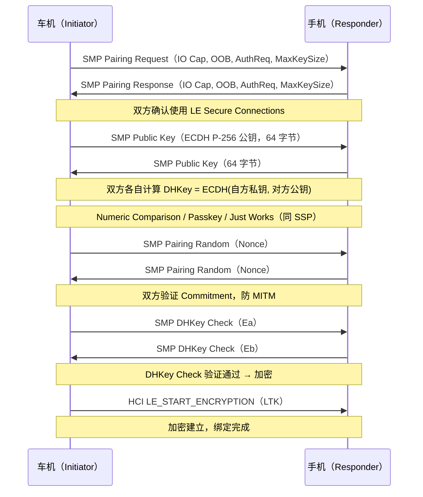

# 13.2 SMP 详解

> **速通摘要**：SMP（Security Manager Protocol）是 BLE 专用的配对协议，工作在 L2CAP 通道（CID 0x0006）上。分两代：**LE Legacy Pairing**（蓝牙 4.0，密码学较弱，已被认为安全性不足）和 **LE Secure Connections**（蓝牙 4.2+，用 ECDH P-256 密钥交换，与 SSP 等级相当）。Android 的实现在 `system/stack/smp/` 下，由 13 个状态组成的状态机驱动。

---

## 学习目标

读完本节后，你能：
1. 区分 LE Legacy Pairing 和 LE Secure Connections 的密码学差异。
2. 找到 SMP 状态机的 13 个状态定义位置。
3. 追踪 `SMP_Pair()` 的调用链到 ECDH 密钥交换阶段。
4. 在 btsnoop 中识别 SMP Pairing Request / Response PDU。

---

## 前置知识

- [13.1 SSP 详解](13.1_SSP详解.md) — Classic BT 配对对照
- [03.3 配对（Bonding）](../03_核心流程/03.3_配对Bonding.md) — BondStateMachine
- [08.2 GATT 连接与服务发现](../08_BLE_GATT/08.2_GATT连接与服务发现.md) — BLE 连接基础

---

## 场景故事

车机 BLE 钥匙（Digital Key）配对时，用户反映有时候配对失败，有时候能成功。查日志发现失败时的错误码是 `SMP_PAIR_AUTH_FAIL`（Authentication Failure）。

这通常意味着：① 两端期望的配对级别不一致（一端要求 Authenticated，另一端只提供 Unauthenticated）；② LE Secure Connections 的 ECDH Commitment 校验失败（可能遭受 MITM 攻击或实现 bug）。

---

## 两代 SMP 对比

| 维度 | LE Legacy Pairing | LE Secure Connections |
|------|------------------|----------------------|
| 蓝牙版本 | 4.0 | 4.2+ |
| 密钥交换 | 基于 TK（Temporary Key）的对称算法 | ECDH P-256 非对称密钥交换 |
| 防 MITM | 依赖 Passkey Display（6 位）| 数字比较 / Passkey / OOB |
| LTK 派生 | AES-128 + 随机数 | 基于 ECDH 共享密钥 HMAC 派生 |
| 安全性 | 较弱（TK 暴力破解可行） | 强（等价于 Classic BT SSP） |
| 源码标志 | `!p_cb->secure_connection_oobin_flag` | `p_cb->secure_connections_only` |

---

## SMP 状态机

```cpp
// system/stack/smp/smp_main.cc:34
const char* const smp_state_name[] = {
    "SMP_STATE_IDLE",
    "SMP_STATE_WAIT_APP_RSP",       // 等待 App 层响应（如显示 Passkey）
    "SMP_STATE_SEC_REQ_PENDING",    // 等待 Security Request
    "SMP_STATE_PAIR_REQ_RSP",       // 配对请求/响应交换
    "SMP_STATE_WAIT_CONFIRM",       // Legacy: 等待 Confirm Value
    "SMP_STATE_CONFIRM",            // Legacy: 计算并发送 Confirm
    "SMP_STATE_RAND",               // 随机数交换
    "SMP_STATE_PUBLIC_KEY_EXCH",    // LE SC: ECDH 公钥交换
    "SMP_STATE_SEC_CONN_PHS1_START",// LE SC: 阶段一开始
    "SMP_STATE_WAIT_COMMITMENT",    // LE SC: 等待 Commitment
    "SMP_STATE_WAIT_NONCE",         // LE SC: 等待随机数
    "SMP_STATE_SEC_CONN_PHS2_START",// LE SC: 阶段二开始
    "SMP_STATE_WAIT_DHK_CHECK",     // LE SC: 等待 DH Key Check
    "SMP_STATE_DHK_CHECK",          // LE SC: 执行 DH Key Check
    "SMP_STATE_ENCRYPTION_PENDING", // 等待加密完成
    "SMP_STATE_BOND_PENDING",       // 等待绑定（保存 LTK）
    "SMP_STATE_CREATE_LOCAL_SEC_CONN_OOB_DATA",
    "SMP_STATE_MAX"
};
```

**Java 对照**：SMP 的多阶段状态机类似于 Android `StateMachine`（见 10.5 节），但实现在 C 函数指针表而非 Java 类。每个状态对应一组 `{event, action, next_state}` 三元组，存储在 `smp_central_entry_map` 二维数组中（`smp_main.cc:234`）。

---

## 分层调用链

### LE Secure Connections 配对流程

```
BondStateMachine → btif_dm_create_bond（BLE 地址类型）
    ↓
SMP_Pair（system/stack/smp/smp_api.cc:83）
    ↓
SMP_STATE_PAIR_REQ_RSP → 发送 SMP Pairing Request PDU
    ↓
SMP_STATE_PUBLIC_KEY_EXCH → ECDH P-256 公钥交换
    ↓
SMP_STATE_SEC_CONN_PHS1_START → Commitment 值计算（AES-CMAC）
    ↓
SMP_STATE_WAIT_NONCE → 随机数交换，验证 Commitment
    ↓
SMP_STATE_DHK_CHECK → DH Key Check（验证 DH 密钥正确性）
    ↓
SMP_STATE_ENCRYPTION_PENDING → HCI LE_ENABLE_ENCRYPTION
    ↓
SMP_STATE_BOND_PENDING → 保存 LTK（见 13.4）
```

---

## 源码导读

### SMP_Pair()：配对入口

```cpp
// system/stack/smp/smp_api.cc:83
tSMP_STATUS SMP_Pair(const RawAddress& bd_addr, tBLE_ADDR_TYPE addr_type) {
  tSMP_CB* p_cb = &smp_cb;
  if (p_cb->state != SMP_STATE_IDLE) {
    return SMP_PAIR_BUSY;  // 防止并发配对
  }
  // 初始化状态机，从 IDLE 进入 PAIR_REQ_RSP
  p_cb->state = SMP_STATE_PAIR_REQ_RSP;
  // 发送 SMP Pairing Request PDU
  smp_send_pair_req(p_cb, nullptr);
  return SMP_SUCCESS;
}
```

### smp_generate_ltk()：LTK 生成

```cpp
// system/stack/smp/smp_keys.cc:530
void smp_generate_ltk(tSMP_CB* p_cb, tSMP_INT_DATA* /* p_data */) {
  // LE Legacy：基于 STK（Short Term Key）派生 LTK
  // LE SC：基于 ECDH 共享密钥直接生成 LTK，无需中间步骤
  if (p_cb->le_secure_connections_mode_is_used) {
    // Secure Connections：LTK = MacKey（DHKey Check 已验证）
  } else {
    smp_generate_ltk_cont(p_cb->div, p_cb);
  }
}
```

### smp_calculate_confirm()

```cpp
// system/stack/smp/smp_keys.cc:319
tSMP_STATUS smp_calculate_confirm(tSMP_CB* p_cb, const Octet16& rand,
                                   Octet16* output) {
  // 计算 Confirm 值（AES-128 加密 rand + 临时密钥）
  // LE Legacy: Confirm = AES-128(TK, rand || r || ia || ra)
  // LE SC:     Commitment = AES-CMAC(0, Na || Nb || ra || rb)
}
```

---

## SMP 配对时序图（LE Secure Connections）



---

## 调试方法

```bash
# 查看 SMP 状态转移
adb logcat -s smp:V | grep -i "state\|pair\|ltk\|ecdh"

# 查看 SMP 配对失败原因
adb logcat -s smp:V | grep -i "auth_fail\|error\|reject\|reason"

# btsnoop 中 SMP PDU 过滤（L2CAP CID = 0x0006）
# 关键 PDU：
# 0x01 Pairing Request
# 0x02 Pairing Response
# 0x0C Public Key（LE SC）
# 0x0D DHKey Check（LE SC）
# 0x05 Pairing Failed（含 Reason Code）

# 常见 Reason Code：
# 0x01 Passkey Entry Failed
# 0x03 OOB Not Available
# 0x05 Authentication Requirements
# 0x08 Unspecified Reason
```

---

## FAQ

**Q1：怎么确认当前连接用的是 LE SC 还是 LE Legacy？**
在 btsnoop 中查 SMP Pairing Request/Response 的 `AuthReq` 字段：bit 3（SC）=1 表示 LE Secure Connections，bit 3=0 表示 Legacy。Android 默认在双方都支持时使用 LE SC。

**Q2：LE SC 的 ECDH 密钥对是每次配对新生成的吗？**
是的，每次配对都生成临时 ECDH 密钥对（`SMP_STATE_PUBLIC_KEY_EXCH`），配对完成后公私钥对废弃，只保留生成的 LTK。这保证了前向安全性（Past Session Compromise）。

**Q3：SMP 配对失败后会自动重试吗？**
会有有限次数的重试（取决于上层策略），每次失败后有指数退避延迟（防暴力攻击）。在 `smp_api.cc` 里可以找到重试逻辑。

---

## 上路任务

1. 打开 `system/stack/smp/smp_main.cc:34`，数一数 `smp_state_name` 数组的元素数量，确认 SMP 状态机共有几个状态（答案不包括 `SMP_STATE_MAX`）。
2. 在 `system/stack/smp/smp_api.cc:83` 的 `SMP_Pair()` 中，找到状态检查逻辑，理解为什么要检查 `p_cb->state != SMP_STATE_IDLE`。
3. 搜索 `smp_calculate_confirm` 的调用者（`grep -n "smp_calculate_confirm" system/stack/smp/`），找出 Legacy 和 SC 路径各自在哪里调用它。
