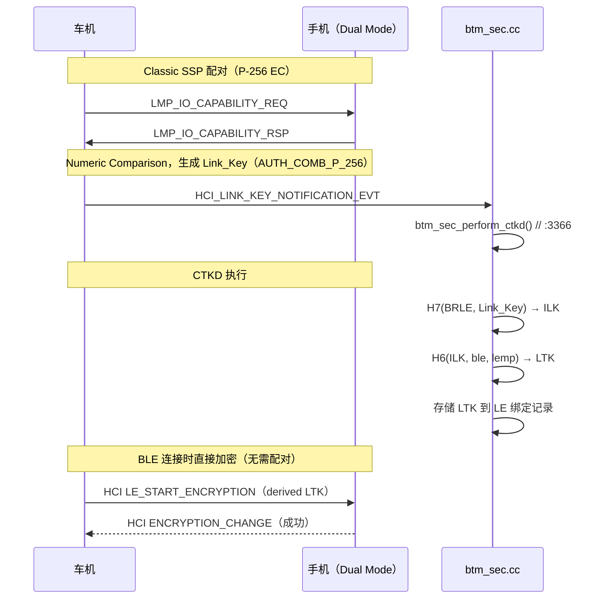

# 13.4 Link Key 类型、持久化、Cross-Transport Key Derivation

> **速通摘要**：Classic BT 配对完成后生成的密钥叫 **Link Key**，有 8 种类型，安全级别从低到高。支持双模（BR/EDR + BLE）的设备可以通过 **CTKD（Cross-Transport Key Derivation）** 机制，用一次配对同时派生 Classic Link Key 和 BLE LTK，避免用户配对两次。Android 的 `btm_sec_perform_ctkd()` 实现在 `system/stack/btm/btm_sec.cc:3152`。

---

## 学习目标

读完本节后，你能：
1. 列出 Link Key 的 8 种类型及其安全级别顺序。
2. 理解 P-256 Link Key 与普通 Link Key 的区别。
3. 解释 CTKD 的触发条件和派生方向（BR/EDR → BLE 还是 BLE → BR/EDR）。
4. 找到 Link Key 持久化存储的源码位置。

---

## 前置知识

- [13.1 SSP 详解](13.1_SSP详解.md) — Link Key 的产生过程
- [13.2 SMP 详解](13.2_SMP详解.md) — BLE 的 LTK 产生过程
- [03.3 配对（Bonding）](../03_核心流程/03.3_配对Bonding.md) — 绑定记录管理

---

## 场景故事

车机和 iPhone 已经通过 Classic BT 配对（A2DP/HFP），现在要建立 BLE 连接（用于 Digital Key / CarPlay 辅助链路）。如果没有 CTKD，用户需要在 BLE 侧再配对一次。

有了 CTKD，Classic 配对完成后，系统自动把 Classic 的密钥材料派生出 BLE 的 LTK，BLE 连接可以直接跳过配对。这是 "配一次，两边都通" 的关键机制。

---

## Link Key 类型（8 种）

```cpp
// system/stack/include/btm_sec_api_types.h:110
#define BTM_LKEY_TYPE_COMBINATION       HCI_LKEY_TYPE_COMBINATION       // 旧版，配对双方共同生成
#define BTM_LKEY_TYPE_REMOTE_UNIT       HCI_LKEY_TYPE_REMOTE_UNIT       // 极旧版，已废弃
#define BTM_LKEY_TYPE_DEBUG_COMB        HCI_LKEY_TYPE_DEBUG_COMB        // 调试用，密钥固定为 0
#define BTM_LKEY_TYPE_UNAUTH_COMB       HCI_LKEY_TYPE_UNAUTH_COMB       // SSP，非认证（Just Works）
#define BTM_LKEY_TYPE_AUTH_COMB         HCI_LKEY_TYPE_AUTH_COMB         // SSP，认证（Numeric Comparison）
#define BTM_LKEY_TYPE_CHANGED_COMB      HCI_LKEY_TYPE_CHANGED_COMB      // 从其他 Key 类型变化而来
#define BTM_LKEY_TYPE_UNAUTH_COMB_P_256 HCI_LKEY_TYPE_UNAUTH_COMB_P_256 // P-256 ECDH，非认证
#define BTM_LKEY_TYPE_AUTH_COMB_P_256   HCI_LKEY_TYPE_AUTH_COMB_P_256   // P-256 ECDH，认证（最高级别）
```

**安全级别顺序**（从低到高）：
```
DEBUG_COMB < COMBINATION < REMOTE_UNIT < UNAUTH_COMB < AUTH_COMB 
< UNAUTH_COMB_P_256 < AUTH_COMB_P_256
```

**P-256 类型**（`UNAUTH_COMB_P_256` / `AUTH_COMB_P_256`）是 SSP 用 ECDH P-256 算法生成的，对应 Classic BT Secure Connections（BC+）。

---

## Link Key 持久化存储

```java
// android/app/src/com/android/bluetooth/btservice/ 中的 btif_config
// 通过 BTIF_STORAGE_KEY_LINK_KEY 写入 LevelDB 持久存储

// 存储路径（外部依赖，system_server 负责）：
// /data/misc/bluedroid/bt_config.conf
// 包含：LinkKey = <hex> 和 LinkKeyType = <type>
```

**验证方式**：
```bash
adb shell cat /data/misc/bluedroid/bt_config.conf | grep -A 5 -i "LinkKey\|key_type"
```

---

## CTKD（Cross-Transport Key Derivation）

### 触发条件

1. 设备支持 Dual Mode（BR/EDR + LE）。
2. Classic 配对使用 P-256 ECDH（`AUTH_COMB_P_256` 或 `UNAUTH_COMB_P_256`）。
3. SMP Key Distribution 协商时对方请求 LINK_KEY（LE → BR 派生）或双方协商 H7/H6 算法。

### 派生方向

```
BR/EDR → BLE（更常用）：
  H7(BRLE, Link_Key) → ILK → H6(ILK, ble, lemp) → LTK

BLE → BR/EDR：
  H7(BRLE, LTK) → ILK → H6(ILK, lebr, brle) → Link_Key
```

### 源码实现

```cpp
// system/stack/btm/btm_sec.cc:3152
static bool btm_sec_perform_ctkd(tBTM_SEC_DEV_REC* p_dev_rec) {
  // 检查条件：是否支持 CTKD，Link Key 类型是否满足要求
  // :3221
  /* CTKD must not be disabled for this device */
  if (p_dev_rec->sec_rec.is_ctkd_disabled) return false;

  // 执行 H7/H6 密钥派生运算
  // 将派生出的 LTK 写入 LE 绑定记录
  // 触发 HCI LE_LONG_TERM_KEY_REQUEST 应答
}

// :3366（CTKD 调用点）
// 在 Classic 配对完成事件处理中触发
btm_sec_perform_ctkd(p_dev_rec);
```

---

## CTKD 触发时序图



---

## 调试方法

```bash
# 查看 Link Key 类型
adb logcat -s btm_sec:V | grep -i "link_key_type\|key_type"

# 查看 CTKD 执行
adb logcat -s btm_sec:V | grep -i "ctkd\|cross_transport\|h6\|h7"

# 验证 BLE 连接是否用了 CTKD 派生的 LTK
adb logcat -s smp:V | grep -i "derived.*ltk\|ctkd"

# 查看持久化的绑定记录
adb shell cat /data/misc/bluedroid/bt_config.conf | grep -B5 "LinkKeyType"
# KeyType 对应：
# 4 = BTM_LKEY_TYPE_UNAUTH_COMB
# 5 = BTM_LKEY_TYPE_AUTH_COMB
# 6 = BTM_LKEY_TYPE_CHANGED_COMB
# 7 = BTM_LKEY_TYPE_UNAUTH_COMB_P_256
# 8 = BTM_LKEY_TYPE_AUTH_COMB_P_256（最高级别）
```

---

## FAQ

**Q1：为什么有时候重新配对后，BLE 设备还是要求再次确认？**
可能是上次配对的 Link Key 类型不支持 CTKD（如 `UNAUTH_COMB` 而非 P-256 版本），导致没有派生出 BLE LTK。解决方案是确保配对走 P-256 ECDH（设置 IO Cap 为 `DisplayYesNo` 触发 Numeric Comparison）。

**Q2：`AUTH_COMB_P_256` 和 `AUTH_COMB` 有什么区别？**
`AUTH_COMB` 是 SSP 的 EC P-192 曲线生成的；`AUTH_COMB_P_256` 使用更强的 P-256 曲线，是 Classic BT Secure Connections 的输出。`AUTH_COMB_P_256` 必须是 P-256 算法，才能触发 CTKD。

**Q3：`is_ctkd_disabled` 什么时候会是 true？**
当对端设备通过某种方式（如 SMP 的 `Flags` 字段）声明不支持 CTKD，或者系统策略禁用时。见 `system/stack/btm/btm_sec.cc:3221` 附近的检查逻辑。

---

## 上路任务

1. 打开 `system/stack/include/btm_sec_api_types.h:110`，把 8 种 Link Key 类型的宏定义抄下来，对照注释理解每种类型的产生场景。
2. 在 `system/stack/btm/btm_sec.cc:3152` 的 `btm_sec_perform_ctkd` 函数中，找到判断"是否允许 CTKD"的条件代码，数一数共有几个条件（`if` 语句）。
3. 运行 `adb shell cat /data/misc/bluedroid/bt_config.conf`（需要 root），找到一个已配对设备的 `LinkKeyType` 值，对照上面的类型表确认它的安全级别。
