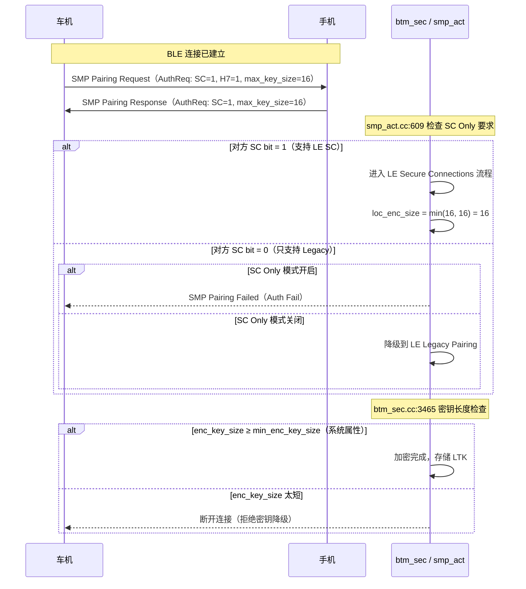

# 13.5 蓝牙 5.3+ 安全增强

> **速通摘要**：蓝牙 5.x 在安全上持续加固，主要方向有三：① **加密密钥长度强制执行**（防密钥降级攻击，最小 7 字节、推荐 16 字节）；② **SC Only 模式**（强制双方使用 LE Secure Connections，拒绝 Legacy Pairing）；③ **Enhanced Privacy Mode**（LE Set Privacy Mode，区分 Device Privacy 和 Network Privacy，提升地址解析策略）。Android 在 `system/stack/btm/btm_sec.cc` 和 `system/stack/smp/` 中实现了这三套机制的本地端控制。

---

## 学习目标

读完本节后，你能：
1. 解释密钥长度协商流程及 Android 的强制最小长度机制。
2. 区分 SC Only Mode 和普通 LE Secure Connections 的区别。
3. 理解 Enhanced Privacy Mode 的两种模式（Device / Network）及其应用场景。
4. 查阅 SMP 错误码完整表，快速定位配对失败原因。

---

## 前置知识

- [13.2 SMP 详解](13.2_SMP详解.md) — SMP 配对流程与 LTK 生成
- [13.3 LE Privacy（RPA / IRK）](13.3_LE_Privacy_RPA_IRK.md) — IRK 与地址轮换

---

## 场景故事

车机厂商在安全审计中发现：部分老款设备会在配对时协商只用 56 位（7 字节）密钥，而不是 128 位（16 字节）。攻击者可以利用密钥降级漏洞（BIAS 攻击家族），暴力破解短密钥后窃听通话。

修复方案：
1. 在 Android `build.prop` / 系统属性里设置 `persist.bluetooth.min_encryption_key_size = 16`，拒绝低于 16 字节的连接。
2. 同时启用 SC Only Mode，使所有 BLE 配对都走 LE Secure Connections 路径。

---

## 一、加密密钥长度（Encryption Key Size）

### 常量定义

```cpp
// system/stack/include/smp_api_types.h:134
#define SMP_ENCR_KEY_SIZE_MIN  7   // 最小 7 字节（BT 规范底线）
#define SMP_ENCR_KEY_SIZE_MAX  16  // 最大 16 字节（AES-128 完整密钥）

// system/stack/btm/btm_sec.cc:3435
static constexpr int MIN_KEY_SIZE = 7;
static constexpr int MAX_KEY_SIZE = 16;
```

### 协商流程

```
Initiator             Responder
    │  SMP Pairing Request (max_key_size=16)  │
    │─────────────────────────────────────────▶│
    │  SMP Pairing Response(max_key_size=16)  │
    │◀─────────────────────────────────────────│
         协商结果 = min(loc_enc_size, peer_enc_size)
```

```cpp
// system/stack/smp/smp_act.cc:1875
// 双方协商取最小值
loc_enc_size = std::min(peer_enc_size, loc_enc_size);

// :1014（保存到绑定记录）
le_key.penc_key.key_size = p_cb->loc_enc_size;

// :2079（写入 BTM 设备记录）
btm_ble_update_sec_key_size(bda, p_cb->loc_enc_size);
```

### Android 的强制最小长度

Android 允许通过系统属性设置最小可接受密钥长度：

```cpp
// system/stack/btm/btm_sec.cc:3438
static uint8_t get_min_enc_key_size() {
  // 从系统属性读取，默认 = SMP_ENCR_KEY_SIZE_MIN (7)
  // 车机厂商可在 build.prop 中设置：
  // persist.bluetooth.min_encryption_key_size = 16
  auto key_size = osi_property_get_int32(
      "persist.bluetooth.min_encryption_key_size",
      SMP_ENCR_KEY_SIZE_MIN);
  // ...
  return (uint8_t)key_size;
}

// :3465（密钥长度校验，协商完成后执行）
if (key_size < get_min_enc_key_size()) {
  // 断开连接，拒绝密钥降级
  btm_ble_disconnect(p_dev_rec, HCI_ERR_HOST_REJECT_SECURITY);
}
```

**设备记录中的字段**：

```cpp
// system/stack/btm/security_device_record.h:222
uint8_t enc_key_size;  // 最终协商的密钥长度，单位 byte

// :288
uint8_t get_encryption_key_size() const { return enc_key_size; }
```

**实际密钥有效位数** = `enc_key_size × 8`，多余的高位填 0。16 字节 = 128 位，7 字节 = 56 位（极不安全）。

---

## 二、SC Only 模式（Secure Connections Only）

### 什么是 SC Only

普通情况下，当对方设备不支持 LE Secure Connections（BT 4.2+）时，Android 会降级到 LE Legacy Pairing（基于 TK 的弱密码学）。

启用 SC Only 后：**拒绝 Legacy Pairing，只允许 LE Secure Connections**。这是 BT 5.0+ 推荐的安全基线。

### 源码位置

```cpp
// system/stack/smp/smp_int.h:322
bool sc_only_mode_locally_required;   // 本机是否要求 SC Only
bool sc_mode_required_by_peer;         // 对方是否要求 SC Only

// system/stack/include/smp_api_types.h:119
// SC + H7 支持（CTKD 基础）
#define SMP_AUTH_SC_ENC_ONLY  (SMP_H7_SUPPORT_BIT | SMP_SC_SUPPORT_BIT)  // = 0x28

// system/stack/include/btm_sec_api_types.h:473
#define BTM_LE_AUTH_REQ_SC_ONLY  SMP_AUTH_SC_ENC_ONLY
```

### 触发与验证逻辑

```cpp
// system/stack/smp/smp_act.cc:186
// 配对请求发出前，从设备策略中获取 SC Only 要求
p_cb->sc_only_mode_locally_required =
    (p_cb->init_security_mode & SMP_SEC_SC_ONLY_MODE);

// :609（收到对方 IO Capability Response 后验证）
if (p_cb->sc_only_mode_locally_required &&
    !p_cb->sc_mode_required_by_peer) {
  // 对方不支持 SC → 终止配对，返回 AUTH_FAIL
  smp_sm_event(p_cb, SMP_AUTH_CMPL_EVT, &failure);
}
```

### 在 BTIF 层启用

```cpp
// system/btif/src/btif_dm.cc:3335
// 设置 Auth Req 为 SC_ONLY：只接受 LE SC 配对
auth_req |= BTM_LE_AUTH_REQ_SC_ONLY;
```

---

## 三、Enhanced Privacy Mode（LE Set Privacy Mode）

蓝牙 5.0 引入了 **LE Set Privacy Mode** 命令，允许区分对不同已知设备的地址解析策略。

### 两种 Privacy Mode

| 模式 | 值 | 含义 |
|------|-----|------|
| **Network Privacy** | 0 | 默认：只接受 RPA 或 Identity Address；如果对方用 Identity Address 广播，拒绝接受（保护隐私） |
| **Device Privacy** | 1 | 兼容旧设备：接受对方的 Identity Address 广播（不强制 RPA） |

典型应用：已配对的老款车钥匙（只能广播固定 Identity Address，无 RPA 能力）必须用 **Device Privacy** 模式，否则车机会过滤掉它的广播。

### 源码定义

```cpp
// system/pdl/hci/hci_packets.pdl:4410
enum PrivacyMode : 8 {
  NETWORK = 0,
  DEVICE  = 1,
}

// HCI 命令
// system/pdl/hci/hci_packets.pdl:4415
packet LeSetPrivacyMode {
  address_type : AddressType,
  address      : Address,
  privacy_mode : PrivacyMode,
}
```

```cpp
// system/stack/include/hcidefs.h:375
#define HCI_BLE_SET_PRIVACY_MODE  (0x004E | HCI_GRP_BLE_CMDS)

// 控制器支持查询
// :1288
#define HCI_LE_SET_PRIVACY_MODE_SUPPORTED(x) \
    HCI_LE_SUPPORTED_FEATURE(x, HCI_LE_PRIVACY_MODE)
```

### BTM Privacy Mode 枚举

```cpp
// system/stack/btm/btm_ble_int_types.h:174
#define BTM_PRIVACY_NONE   0  // 关闭隐私
#define BTM_PRIVACY_1_1    1  // BT 4.1，无 IRK
#define BTM_PRIVACY_1_2    2  // BT 4.2，有 IRK
#define BTM_PRIVACY_MIXED  3  // 同时支持 1.1 和 1.2 设备

// :221
tBTM_PRIVACY_MODE  privacy_mode;  // 当前隐私模式
```

---

## 四、SMP 错误码完整参考

排查配对失败时必备的速查表：

```cpp
// system/stack/include/smp_status.h:28
enum tSMP_STATUS {
    SMP_SUCCESS             = 0,
    SMP_PASSKEY_ENTRY_FAIL  = 0x01, // Passkey 输入失败（用户输错）
    SMP_OOB_FAIL            = 0x02, // OOB 数据不匹配
    SMP_PAIR_AUTH_FAIL      = 0x03, // 认证失败（MITM 防护失败）
    SMP_CONFIRM_VALUE_ERR   = 0x04, // Confirm Value 不匹配（Legacy）
    SMP_PAIR_NOT_SUPPORT    = 0x05, // 对方不支持配对
    SMP_ENC_KEY_SIZE        = 0x06, // 密钥长度不满足要求
    SMP_CMD_NOTSUPP         = 0x07, // 对方不支持此 SMP 命令
    SMP_PAIR_FAIL_UNKNOWN   = 0x08, // 未知原因（catch-all）
    SMP_REPEATED_ATTEMPTS   = 0x09, // 配对尝试次数过多（冷却中）
    SMP_INVALID_PARAMETERS  = 0x0A, // 参数非法
    SMP_DHKEY_CHK_FAIL      = 0x0B, // DH Key Check 失败（LE SC，MITM 或 bug）
    SMP_NUMERIC_COMPAR_FAIL = 0x0C, // Numeric Comparison 用户拒绝
    SMP_BR_PARING_IN_PROGR  = 0x0D, // BR/EDR 配对正在进行
    SMP_XTRANS_DERIVE_NOT_ALLOW = 0x0E, // 跨 Transport 密钥派生被拒绝

    // Android 内部扩展错误码（0x11+，不对外暴露）
    SMP_PAIR_INTERNAL_ERR   = 0x11,
    SMP_UNKNOWN_IO_CAP       = 0x12,
    SMP_BUSY                = 0x17,
    SMP_ENC_FAIL            = 0x18,
    SMP_STARTED             = 0x19,
    SMP_RSP_TIMEOUT         = 0x1B, // 超时（对方无响应）
    SMP_FAIL                = 0x1C,
    SMP_CONN_TOUT           = 0x1D, // 连接超时
};
```

**常见失败场景对应**：

| 场景 | 错误码 |
|------|--------|
| 用户点"取消"或 Numeric Comparison 不一致 | `SMP_NUMERIC_COMPAR_FAIL (0x0C)` |
| 配对超时（30 秒内无响应） | `SMP_RSP_TIMEOUT (0x1B)` |
| 密钥长度不满足 SC Only 要求 | `SMP_ENC_KEY_SIZE (0x06)` |
| DH Key Check 失败（中间人或 bug） | `SMP_DHKEY_CHK_FAIL (0x0B)` |
| 对方发来非法 SMP 参数 | `SMP_INVALID_PARAMETERS (0x0A)` |
| 车机设为 SC Only 但对方不支持 | `SMP_PAIR_AUTH_FAIL (0x03)` |

---

## 五、安全能力协商时序图



---

## 调试方法

```bash
# 查看密钥长度协商结果
adb logcat -s smp:V | grep -i "enc_size\|key_size\|encr"

# 查看 SC Only 模式是否触发
adb logcat -s smp:V | grep -i "sc_only\|secure_conn\|sc_mode"

# 查看 SMP 配对失败错误码（十六进制，对照上表）
adb logcat -s smp:V | grep -i "fail\|status\|error\|reason"

# 查看 Privacy Mode 设置
adb logcat -s hci:V | grep -i "privacy_mode\|set_privacy"

# 查看当前最小密钥长度系统属性
adb shell getprop persist.bluetooth.min_encryption_key_size

# 临时设置最小密钥长度（需要 root）
adb shell setprop persist.bluetooth.min_encryption_key_size 16

# 在 btsnoop 中识别 SC Only 失败：
# SMP Pairing Failed PDU，Reason = 0x03（Auth Fail）
# 在 Wireshark 中：btatt && btl2cap.cid == 0x0006
```

---

## FAQ

**Q1：`SMP_ENCR_KEY_SIZE_MIN = 7` 是规范要求还是 Android 自定义的？**
这是蓝牙核心规范（Core Spec Vol 3, Part H Section 2.3.4）规定的底线：密钥长度 7–16 字节。Android 同时提供系统属性允许厂商将最小值提高到 16 字节，实现比规范更严格的约束。

**Q2：SC Only 模式会影响经典蓝牙（A2DP/HFP）吗？**
`sc_only_mode_locally_required` 是 SMP 层标志，只影响 BLE 配对。Classic BT 的 SC Only 模式（`BTM_SEC_MODE_SC`）由 `btm_sec.cc` 中的独立标志控制，两者独立设置。

**Q3：什么情况下选 Device Privacy 而非 Network Privacy？**
如果已配对设备广播的是 Identity Address（老款设备、低功耗 beacon），需要对该设备设为 Device Privacy，否则控制器会过滤掉它的广播包，导致无法重连。对于支持 RPA 的设备，使用默认的 Network Privacy 即可。

**Q4：蓝牙 5.4 还有什么新安全特性？**
蓝牙 5.4 引入了 **Encrypted Advertising Data (EAD)**，允许广播包的 AD Structure 部分也加密（用 Session Key 派生自 GATT Encrypted Data Key Material 特征）。Android 16 的支持尚在推进中，相关代码在 `system/gd/hci/` 中。

---

## 上路任务

1. 查询当前设备的最小密钥长度属性：运行 `adb shell getprop persist.bluetooth.min_encryption_key_size`，如果为空说明使用默认值 7。查看 `system/stack/btm/btm_sec.cc:3438` 确认默认值来源。
2. 在 `system/stack/smp/smp_act.cc` 中搜索 `sc_only_mode_locally_required`，找出该标志在哪个函数中被设为 `true`（提示：搜索 `sc_only_mode_locally_required = true`），理解触发路径。
3. 用 `adb logcat -s smp:V` 在配对过程中抓日志，找到 `enc_size` 相关的行，确认车机和手机协商后的最终密钥长度。
