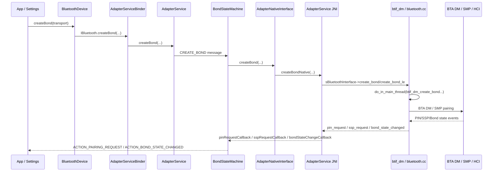
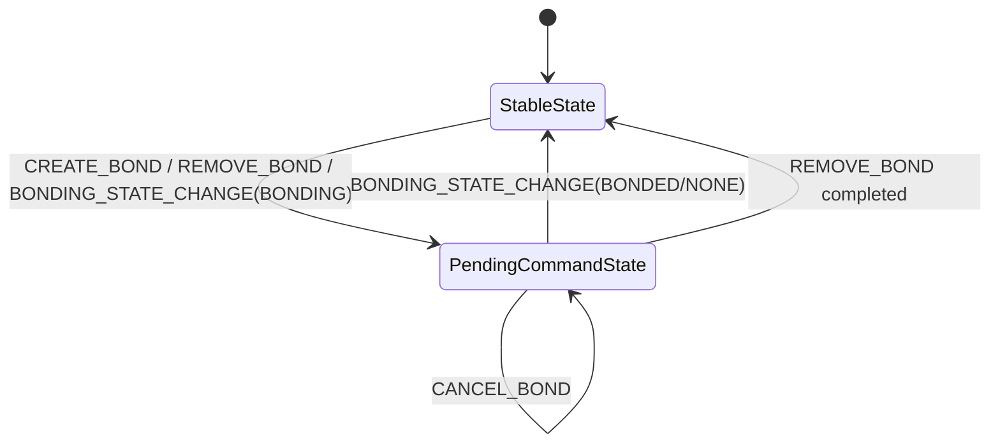
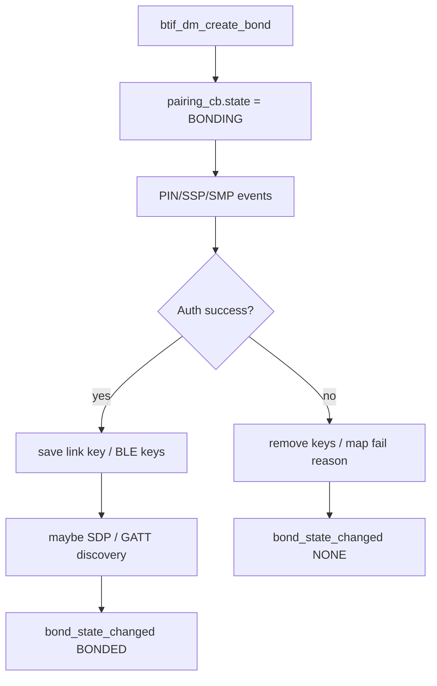
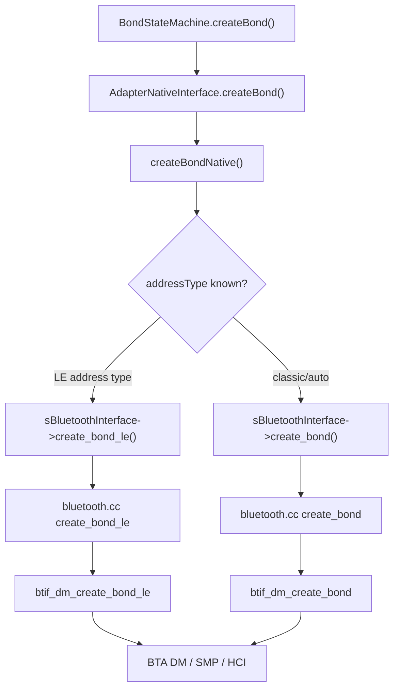

# 14-定向代码阅读报告：Pairing/Bonding

## 1. 阅读目标

本报告聚焦配对/绑定链路：`BluetoothDevice.createBond()` 如何进入 `AdapterService`、`BondStateMachine`、JNI、Native `btif_dm`，以及 PIN/SSP 请求和 bond state 如何回到 Framework。

读完后要能区分：

- pairing 与 bonding 的差异。
- `BOND_BONDED` 与 Profile/GATT 可用的差异。
- Java `BondStateMachine` 状态与 Native `pairing_cb` 的差异。
- 车机场景中“配对成功但回连失败”“双端删除配对后才恢复”的根因层级。

## 2. 适用场景

- 点击配对后无弹窗或弹窗消失。
- PIN/Passkey/Consent 交互失败。
- `ACTION_BOND_STATE_CHANGED` 到 `BOND_NONE`，但原因不清。
- 显示已配对，但 A2DP/HFP/GATT 无法回连。
- BLE 随机地址、RPA、cross-key pairing 导致同一设备身份混乱。
- 删除配对后仍回连异常。

## 3. 调用链全景图



## 4. 关键类与源码入口

| 层级 | 源码 | 关键入口 |
| --- | --- | --- |
| Framework API | `framework/java/android/bluetooth/BluetoothDevice.java` | `createBond()`、`createBond(int transport)`、`ACTION_PAIRING_REQUEST`、`ACTION_BOND_STATE_CHANGED` |
| Binder | `android/app/src/com/android/bluetooth/btservice/AdapterServiceBinder.java` | `createBond(...)`、`cancelBondProcess(...)`、`removeBond(...)`、`setPin(...)`、`setPairingConfirmation(...)` |
| Service | `android/app/src/com/android/bluetooth/btservice/AdapterService.java` | `createBond(...)`、`getBondState(...)`、`updateUuids(...)`、bond state profile handling |
| Java 状态机 | `android/app/src/com/android/bluetooth/btservice/BondStateMachine.java` | `CREATE_BOND`、`CANCEL_BOND`、`REMOVE_BOND`、`BONDING_STATE_CHANGE`、`sendIntent(...)` |
| 设备缓存 | `android/app/src/com/android/bluetooth/btservice/RemoteDevices.java` | `onBondStateChange(...)`、bond loss、key missing、bonded/known dump |
| Native Interface | `android/app/src/com/android/bluetooth/btservice/AdapterNativeInterface.java` | `createBond(...)`、`removeBond(...)`、`cancelBond(...)`、`pinReply(...)`、`sspReply(...)` |
| JNI | `android/app/jni/com_android_bluetooth_btservice_AdapterService.cpp` | `createBondNative(...)`、`removeBondNative(...)`、`cancelBondNative(...)`、`pin_request_callback(...)`、`ssp_request_callback(...)`、`bond_state_changed_callback(...)` |
| Native HAL interface | `system/btif/src/bluetooth.cc` | `create_bond(...)`、`create_bond_le(...)`、`remove_bond(...)`、`cancel_bond(...)`、`pin_reply(...)`、`ssp_reply(...)` |
| Native DM | `system/btif/src/btif_dm.cc` | `btif_dm_create_bond(...)`、`btif_dm_create_bond_le(...)`、`btif_dm_cancel_bond(...)`、`btif_dm_remove_bond(...)`、`bond_state_changed(...)` |
| Native API | `system/include/hardware/bluetooth.h` | `bond_state_changed_callback`、`pin_request_callback`、`ssp_request_callback` |

## 5. 状态机详解

Java 侧 `BondStateMachine` 状态很少，但事件很多：



关键点：

- `StableState` 表示没有设备正在 bonding/unbonding。
- `PendingCommandState` 表示有设备正在 bonding/unbonding。
- `BONDING_STATE_CHANGE` 来自 Native 回调 `bondStateChangeCallback(...)`。
- `sendIntent(...)` 负责更新 `RemoteDevices` 并广播 `ACTION_BOND_STATE_CHANGED`。
- 如果 bonded 后还要等 SDP/GATT post-pairing，广播可能被延后，代码中有“wait for SDP complete”的逻辑。

Native 侧不是 Java StateMachine，而是 `btif_dm.cc` 的 `pairing_cb` 控制块：



## 6. 线程模型与回调分发

| 环节 | 执行环境 | 注意点 |
| --- | --- | --- |
| App/Settings 调用 | App 或系统 UI 线程 | 调用 `BluetoothDevice.createBond()` |
| Binder | `AdapterServiceBinder` | 做 active/managed user、connect permission 等检查 |
| AdapterService | Bluetooth 进程主服务线程/looper | 创建 `BondStateMachine`，发送消息 |
| BondStateMachine | 自己的 StateMachine looper 或 Adapter looper | 处理 CREATE/CANCEL/REMOVE/BONDING_STATE_CHANGE |
| JNI callback | AdapterService JNI callback | Native 回调 PIN/SSP/bond state |
| Native main thread | `bluetooth.cc` 用 `do_in_main_thread(...)` | `create_bond/remove_bond/cancel_bond` 投递到 BTIF 主线程 |
| BTIF/BTA/SMP | Native stack 线程 | 处理 security manager、key、SDP/GATT post-pairing |

关键线程坑：

- Java 侧看到 `BOND_BONDED` 回调晚，不一定是配对慢，可能在等 SDP/GATT post-pairing 结束。
- Native `pairing_cb` busy 时，Java 新的 CREATE_BOND 可能延迟或失败。
- 配对 UI 响应走 `setPin(...)`、`setPairingConfirmation(...)`，要确认是否仍处于 bonding 状态。

## 7. 权限检查点与 Binder 边界

主要 Binder 边界在 `AdapterServiceBinder.java`：

- `createBond(...)`：检查调用方、用户和连接权限后进入 `AdapterService.createBond(...)`。
- `cancelBondProcess(...)`：取消当前 bonding。
- `removeBond(...)`：删除已 bonded 设备，要求设备当前是 `BOND_BONDED`。
- `setPin(...)`、`setPairingConfirmation(...)`：配对 UI 回填 PIN/SSP 结果，要求设备仍在 bonding 或特定安全状态。

仓库边界：

- 配对 UI 包名、Settings 入口、多用户策略、设备管理策略可能在仓库外；本文只确认 Bluetooth 进程内权限和状态入口。

## 8. JNI / Native / Vendor 边界



Native 回调：

- `bluetooth.cc` 的 `invoke_pin_request_cb(...)`、`invoke_ssp_request_cb(...)`、`invoke_bond_state_changed_cb(...)` 通过 HAL callback 表回到 JNI。
- `com_android_bluetooth_btservice_AdapterService.cpp` 的 `pin_request_callback(...)`、`ssp_request_callback(...)`、`bond_state_changed_callback(...)` 回到 Java callbacks。
- `BondStateMachine.bondStateChangeCallback(...)` 把 HAL state 映射成 `BOND_NONE/BOND_BONDING/BOND_BONDED`。

Vendor 边界：

- 控制器安全流程、远端设备 IO capability、SMP timing、firmware key storage 属于仓库外；需要 btsnoop 和 vendor log 证明。

## 9. 可能失败点

| 层级 | 失败点 | 表现 | 观察方式 |
| --- | --- | --- | --- |
| Framework | 设备地址/transport 不合法 | `createBond()` 立即 false | App/Framework log |
| Binder | 权限、用户、调用方不满足 | Binder 拒绝 | `AdapterServiceBinder` log |
| AdapterService | 已经 bonded 或 bonding | 不重复发起或返回当前 bonding | `AdapterService.createBond()` |
| BondStateMachine | Native pairing busy | 延迟或失败 | `Native was busy`、`pairingIsBusyNative()` |
| Pairing UI | PIN/SSP 没有及时响应 | 超时、取消 | `ACTION_PAIRING_REQUEST`、`setPin`、`setPairingConfirmation` |
| Native DM | `pairing_cb` 设备不一致 | 状态变化被忽略 | `btif_dm.cc` unexpected device log |
| Security | SMP/auth 失败 | `BOND_NONE` + reason | btsnoop SMP、`EXTRA_UNBOND_REASON` |
| Post-pairing | SDP/GATT discovery 失败 | bonded intent 延迟或 profile 不可用 | `btif_dm` SDP/GATT logs |
| Key storage | link key / BLE key 未保存或旧 key 冲突 | 下次回连失败 | `btif_debug_linkkey_type_dump`、snoop |
| Remote | 远端保留旧 bond | 本端 bonded 但远端拒绝加密 | 双端删除配对验证 |

## 10. dumpsys、logcat、bugreport 观察点

命令：

```bash
adb shell dumpsys bluetooth
adb logcat -b all | grep -E "BtBondStateMachine|BtAdapterService|BtRemoteDevices|btif_dm|bond|pairing|ssp|pin"
adb bugreport bugreport.zip
```

重点看：

- `BluetoothDevice.ACTION_BOND_STATE_CHANGED`：`EXTRA_BOND_STATE`、`EXTRA_PREVIOUS_BOND_STATE`、`EXTRA_UNBOND_REASON`。
- `ACTION_PAIRING_REQUEST`：`EXTRA_PAIRING_VARIANT`、`EXTRA_PAIRING_KEY`。
- `BondStateMachine`：CREATE/CANCEL/REMOVE、`bondStateChangeCallback`、`sendIntent`。
- `RemoteDevices.dump(...)`：known devices、bonded devices、device properties。
- Native dump：`bluetooth.cc dump()` 会包含 `btif_debug_bond_event_dump(fd)` 和 `btif_debug_linkkey_type_dump(fd)`。
- btsnoop：Pairing Request/Response、Confirm/Random、Encryption、Key Distribution、Authentication Failed。

## 11. 定制修改思路

| 目标 | 涉及文件 | 修改思路 | 风险 |
| --- | --- | --- | --- |
| 增加配对诊断 | `BondStateMachine.java`、`AdapterService.java` | 记录 caller package、transport、old/new bond state、reason、hciReason | 地址/包名隐私 |
| 定位配对 UI 超时 | `BondStateMachine.java`、`AdapterServiceBinder.java` | 记录 pairing request 发出时间、setPin/sspReply 返回时间 | 不能泄露 PIN/passkey |
| 解决回连失败 | `RemoteDevices.java`、`btif_dm.cc` | 记录 key missing、bond loss、identity/static address | 可能误删合法 bond |
| 增强 dumpsys | `RemoteDevices.dump(...)`、`AdapterService.dump(...)` | 输出最近 bond events、bond loss reason、key missing 计数 | dump 输出不能包含密钥 |
| 处理车机兼容性 | Java 策略层 + Native 证据 | 先用案例库记录，再做设备名/厂商白名单策略 | 白名单会增加维护成本 |

## 12. 最容易踩的坑

- `BOND_BONDED` 不代表 A2DP/HFP/GATT 已连接。
- `BOND_BONDED` 广播可能等待 SDP/GATT post-pairing，不一定立刻发。
- 本端 `removeBond()` 不代表远端也删除旧 key；回连异常常要双端删除配对。
- BLE RPA/static address/cross-key pairing 会让“同一设备”看起来有多个地址。
- 配对 UI 的 `setPin` 或 `setPairingConfirmation` 必须在 bonding 状态内响应。
- Native pairing busy 时，新配对请求可能看似发出但很快失败。

## 13. 练习题与参考答案

### 练习 1：写出 createBond 主链路

参考答案：

`BluetoothDevice.createBond()` -> `AdapterServiceBinder.createBond()` -> `AdapterService.createBond()` -> `BondStateMachine.CREATE_BOND` -> `AdapterNativeInterface.createBond()` -> `createBondNative()` -> `sBluetoothInterface->create_bond/create_bond_le` -> `bluetooth.cc` -> `btif_dm_create_bond/btif_dm_create_bond_le` -> BTA DM/SMP/HCI。

### 练习 2：为什么 bonded 后 Profile 仍然连不上

参考答案：

bonded 只说明安全密钥层完成。Profile 还依赖 SDP/GATT 服务发现、连接策略、Profile 状态机、远端服务可用性和可能的音频/业务通道。排查时先看 bond state，再看 UUID/SDP/GATT discovery，再看具体 Profile 的 StateMachine。

### 练习 3：配对失败时如何建立证据链

参考答案：

先看 `ACTION_BOND_STATE_CHANGED` 的 old/new state 和 reason；再看 `BondStateMachine.bondStateChangeCallback()` 的 status/hciReason；然后看 `btif_dm` bond event dump 和 btsnoop SMP/Auth 失败包。若涉及 UI，再补 `ACTION_PAIRING_REQUEST` 和 `setPin/sspReply` 的响应时间。

### 练习 4：要新增车机配对失败诊断，最小改动是什么

参考答案：

在 `BondStateMachine` 增加最近 N 次 bond event 缓存，字段包括 device 脱敏地址、transport、old/new state、reason、hciReason、caller package、pairing variant、事件时间；在 `AdapterService.dump()` 或 `BondStateMachine.dump()` 输出。不要记录 PIN、passkey 原文或密钥内容。

## 14. 与案例库的映射

可映射到 `97-真实案例库.md`：

- “配对成功后无法自动回连”
- “BLE 看得到广播但 connectGatt 失败”
- “PBAP/MAP 授权后仍不同步”
- “HFP 可连但电话无声”中的安全前置确认

案例沉淀建议：

1. 先写 bond state 变化和 unbond reason。
2. 再写 PIN/SSP/SMP 证据。
3. 最后写 Profile/GATT 连接后续表现，避免把后续 Profile 问题误判成配对问题。
