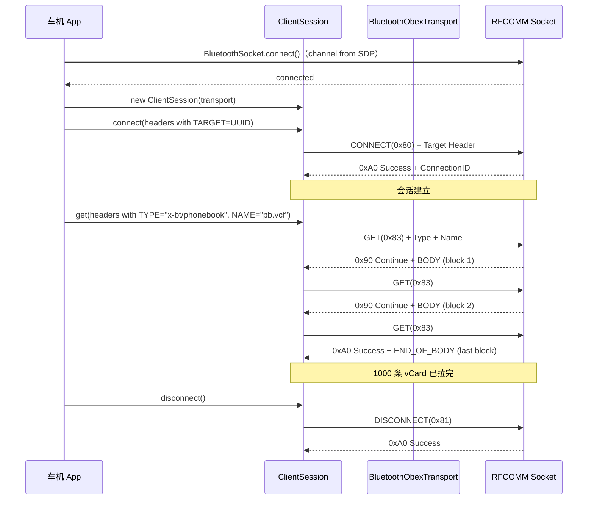

# 14.1 OBEX 协议族总览

> **速通摘要**：OBEX（Object Exchange）是基于 RFCOMM 的"小型 HTTP"——支持 CONNECT / GET / PUT / SETPATH / ABORT / DISCONNECT 六种基本请求，用 HeaderSet 携带元信息（Type、Name、Body、Application Parameters 等）。蓝牙生态里，**PBAP（电话簿）/ MAP（短信）/ OPP（文件推送）/ SAP（SIM 访问）/ FTP（文件浏览）** 全部基于 OBEX。Android 用 `com.android.obex` Java 包（系统类库）实现，蓝牙 App 通过 `BluetoothObexTransport` 把 OBEX over RFCOMM 拼起来。

---

## 学习目标

读完本节后，你能：
1. 说出 OBEX 的 6 种请求操作码及典型用途。
2. 找到 Android 中 OBEX 客户端 / 服务端实现位置。
3. 理解 PBAP / MAP / OPP / SAP 在 OBEX 之上的分工与 UUID 区分。
4. 知道一次 OBEX CONNECT 在 RFCOMM 上的实际字节流。

---

## 前置知识

- [05.8 RFCOMM](../05_Native栈基础/05.8_RFCOMM.md) — OBEX 的载体
- [05.7 SDP](../05_Native栈基础/05.7_SDP.md) — Profile UUID 发现

---

## 场景故事

车机插入新手机，几秒钟内就把 1000 条联系人和近一周的通话记录显示在车机通讯录里——背后就是 PBAP（基于 OBEX）。换个场景：用户给副驾发一张照片，副驾收到一个 "蓝牙文件" 通知——这是 OPP（也基于 OBEX）。再换：导航需要从手机读卡 SIM 号码上发短信——这是 SAP（OBEX 之上的扩展）。

所有"文件型 / 对象型 / 大块数据型"的蓝牙数据交换，几乎都走 OBEX。

---

## OBEX 协议族在蓝牙栈中的位置

```
┌──────────────────────────────────────────────────┐
│  应用层 (PBAP / MAP / OPP / SAP / FTP 等)        │
├──────────────────────────────────────────────────┤
│  OBEX (com.android.obex / Java 系统类库)         │
│  - ClientSession / ServerSession                 │
│  - HeaderSet (Name, Type, Body, AppParam ...)    │
├──────────────────────────────────────────────────┤
│  BluetoothObexTransport (蓝牙 App 适配层)         │
├──────────────────────────────────────────────────┤
│  RFCOMM / L2CAP (Channel/PSM 由 SDP 发现)        │
├──────────────────────────────────────────────────┤
│  ACL (Classic BT)                                │
└──────────────────────────────────────────────────┘
```

---

## OBEX 六大请求

| Opcode | 操作 | 用途 |
|--------|------|------|
| `0x80` | CONNECT | 建立 OBEX 会话（含 Target UUID） |
| `0x81` | DISCONNECT | 关闭会话 |
| `0x02 / 0x82` | PUT | 上传对象（0x82 = 含 Final 位） |
| `0x03 / 0x83` | GET | 下载对象（0x83 = 含 Final 位） |
| `0x85` | SETPATH | 切换当前文件夹（FTP / PBAP 用） |
| `0xFF` | ABORT | 中断当前操作 |

**Java 对照**：OBEX 的 `ClientSession.connect(HeaderSet)` ≈ HTTP `POST /connect`；`get(HeaderSet)` ≈ HTTP `GET`，但底层是流式块传输（每个请求/响应可以分多个 packet）。

---

## HeaderSet：携带元信息

```
+----+----+--------+--------+--------+--------+
| 0x42 | NAME    | 0x4C | LENGTH  | 0x49 | BODY ...
+----+----+--------+--------+--------+--------+
   ↑                ↑              ↑
 Type            Length         Body Data
```

常见 Header 类型（取自 `com.android.obex.HeaderSet`）：

| Header | 值 | 用途 |
|--------|-----|------|
| NAME | 0x01 | 对象名（如 "pb.vcf"） |
| TYPE | 0x42 | MIME（如 "x-bt/phonebook"） |
| LENGTH | 0xC3 | 对象总长 |
| BODY / END_OF_BODY | 0x48 / 0x49 | 数据载荷 |
| TARGET | 0x46 | CONNECT 时指定服务 UUID（区分 PBAP/MAP/OPP）|
| APPLICATION_PARAMETER | 0x4C | Profile 自定义 TLV 参数 |
| AUTH_CHALLENGE / RESPONSE | 0x4D / 0x4E | OBEX 认证 |

---

## OBEX 在 Android 中的实现

### Java 包

`com.android.obex` 是 Android 系统提供的 Java 类库（不在本仓库内，外部依赖）。它来源于 AOSP `external/javaobex/`，提供：
- `ClientSession` / `ServerSession`：会话两端
- `HeaderSet`：Header 容器
- `Operation`：单次 GET/PUT 抽象（含 InputStream/OutputStream）
- `ResponseCodes`：HTTP-like 响应码（OK = 0xA0、NOT_FOUND = 0xC4 等）

### 蓝牙 App 适配

```java
// android/app/src/com/android/bluetooth/BluetoothObexTransport.java（仓内文件）
// 把 BluetoothSocket（RFCOMM/L2CAP 已建立）包装成 OBEX 可用的 Transport
public class BluetoothObexTransport implements ObexTransport {
  // openInputStream() / openOutputStream() 委托给 BluetoothSocket
}
```

各 Profile 创建 OBEX Session 的典型代码：

```java
// PbapClient: android/app/src/com/android/bluetooth/pbapclient/obex/PbapClientObexClient.java:64
private static final byte[] BLUETOOTH_UUID_PBAP_CLIENT = {
    /* 0x796135f0-f0c5-11d8-0966-0800200c9a66 */
};

// :518（CONNECT 时设置 TARGET Header 指定 PBAP UUID）
headers.setHeader(HeaderSet.TARGET, BLUETOOTH_UUID_PBAP_CLIENT);
session.connect(headers);
```

---

## 五大 OBEX-Based Profile 速查

| Profile | UUID（SDP 服务） | 车机角色 | 主要操作 |
|---------|------------------|---------|---------|
| **PBAP** Phone Book Access | `0x1130` (PSE) / `0x112F` (PCE) | PCE（拉取） | GET pb.vcf / GET cch.vcf |
| **MAP** Message Access | `0x1132` (MSE) / `0x1133` (MCE) | MCE（订阅） | GET messages-listing / PUT outbox |
| **OPP** Object Push | `0x1105` | Server / Client 均可 | PUT vcf/jpg/任意文件 |
| **SAP** SIM Access | `0x112D` | Client（车机用手机 SIM 上网） | OBEX-like 自定义命令 |
| **FTP** File Transfer | `0x1106` | 较少用 | SETPATH + GET/PUT |

**Android 仓库内的实现位置**：

| Profile | Service 类 | 文件路径 |
|---------|-----------|---------|
| PBAP Server（手机端） | `BluetoothPbapService` | `android/app/src/com/android/bluetooth/pbap/BluetoothPbapService.java` |
| PBAP Client（车机端） | `PbapClientService` | `android/app/src/com/android/bluetooth/pbapclient/PbapClientService.java:52` |
| MAP Server（手机端） | `BluetoothMapService` | `android/app/src/com/android/bluetooth/map/BluetoothMapService.java:67` |
| MAP Client（车机端） | `MapClientService` | `android/app/src/com/android/bluetooth/mapclient/MapClientService.java:55` |
| OPP | `BluetoothOppService` | `android/app/src/com/android/bluetooth/opp/BluetoothOppService.java:86` |
| SAP | `SapService` | `android/app/src/com/android/bluetooth/sap/SapService.java:63` |

**车机选 Client 还是 Server？** 车机做 IVI，电话簿/短信是从手机"拉过来"展示在自己屏幕上，所以**车机必须实现 Client 端**（PCE / MCE）。手机已经是 PSE / MSE。

---

## 时序图：典型 OBEX 会话



---

## 响应码（HTTP-like）

```java
// com.android.obex.ResponseCodes
OBEX_HTTP_CONTINUE         = 0x90  // 继续（分块传输）
OBEX_HTTP_OK               = 0xA0  // 成功
OBEX_HTTP_BAD_REQUEST      = 0xC0  // 请求非法
OBEX_HTTP_UNAUTHORIZED     = 0xC1  // 未授权
OBEX_HTTP_FORBIDDEN        = 0xC3  // 拒绝（如用户没同意分享电话簿）
OBEX_HTTP_NOT_FOUND        = 0xC4  // 对象不存在
OBEX_HTTP_NOT_ACCEPTABLE   = 0xC6  // 类型不支持
OBEX_HTTP_INTERNAL_ERROR   = 0xD0  // 对端内部错误
OBEX_HTTP_NOT_IMPLEMENTED  = 0xD1  // 未实现该操作
OBEX_HTTP_VERSION          = 0xD5  // 版本不匹配
```

调试时若收到 `0xC1`（Unauthorized），多半是 OBEX 认证（PBAP 1.2+ 的 Authenticate Challenge）失败；`0xC3` 多见于"用户在手机上拒绝授权车机访问通讯录"。

---

## 调试方法

```bash
# 查看 OBEX 会话日志
adb logcat -s PbapClientObexClient:V MapClientObexClient:V MnsObexClient:V

# 查看 BluetoothObexTransport
adb logcat -s BluetoothObexTransport:V

# btsnoop 中过滤 OBEX（基于 RFCOMM）
# Wireshark：rfcomm && btobex

# 关键字段（btsnoop）：
# - Opcode：0x80 CONNECT / 0x83 GET-FINAL / 0x82 PUT-FINAL
# - Final Bit：高位 = 是否是当前请求的最后一个 packet
# - Response Code：0xA0 OK / 0x90 Continue / 0xC* 错误
```

---

## FAQ

**Q1：OBEX 必须走 RFCOMM 吗？**
不是。OBEX 还可以走 L2CAP（GOEP 2.0 引入了 OBEX over L2CAP CoC，速度更快，PBAP/MAP 1.2+ 都支持），也可以走 IrDA（红外，蓝牙生态已废弃）。Android 默认 RFCOMM 优先，L2CAP 作为可选。

**Q2：`Application Parameter` Header 是干什么的？**
是 Profile-specific 的 TLV 容器。例如 PBAP 用它传递 `Filter`（要哪些字段）、`MaxListCount`（最多多少条）、`Order`（排序方式）；MAP 用它传 `MessageType`（SMS/MMS/EMAIL）、`SubjectLength` 等。`PbapApplicationParameters.java` 和 `BluetoothMapAppParams.java` 分别封装两者。

**Q3：为什么 Android 同时有 PBAP Server（pbap/）和 PBAP Client（pbapclient/）两套实现？**
手机模式下 Android 是 PSE（提供电话簿给车机），用 `pbap/`；车机模式下 Android 是 PCE（向手机要电话簿），用 `pbapclient/`。两者底层都依赖同一个 `com.android.obex` 库，但角色完全相反。车机厂商一般只启用 `pbapclient`、`mapclient` 这些 Client 端服务。

---

## 上路任务

1. 打开 `android/app/src/com/android/bluetooth/BluetoothObexTransport.java`，读 `openInputStream()` 实现，理解它如何把 `BluetoothSocket` 包装成 OBEX 可用的流接口。
2. 在 `android/app/src/com/android/bluetooth/pbapclient/obex/PbapClientObexClient.java:64` 找到 `BLUETOOTH_UUID_PBAP_CLIENT` 字节数组，对照 PBAP 规范确认 UUID 值（提示：是 PCE Service Class UUID 的 128 位形式）。
3. 用 `adb shell dumpsys bluetooth_manager` 查看车机当前启用了哪些 OBEX Profile（PbapClientService / MapClientService / OppService 等），对照 14.1 中"车机角色"列。
