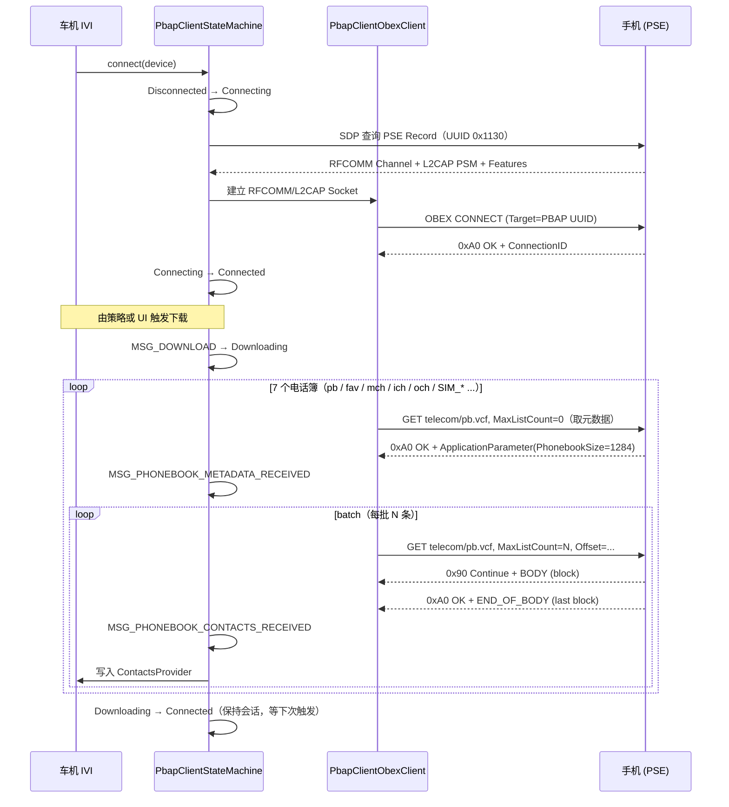

# 14.2 PBAP（车机电话簿同步）

> **速通摘要**：PBAP（Phone Book Access Profile）是车机最高频使用的 Profile 之一，让车机能从手机拉取 **联系人（pb.vcf）+ 通话记录（mch/ich/och.vcf）+ 收藏（fav.vcf）+ SIM 联系人**。车机是 PCE（Client / Engine），手机是 PSE（Server / Equipment）。Android 实现在 `android/app/src/com/android/bluetooth/pbapclient/`，核心类 `PbapClientService:52` + 五态状态机 `PbapClientStateMachine:59`（Disconnected / Connecting / Connected / Downloading / Disconnecting）。

---

## 学习目标

读完本节后，你能：
1. 区分 PBAP 的 PCE / PSE 角色和五种状态。
2. 找到下载电话簿的核心代码路径（CONNECT → SETPATH → GET）。
3. 识别 PBAP 的 7 个标准路径（pb / fav / mch / ich / och 等）。
4. 排查 "联系人下载到一半失败" 类问题。

---

## 前置知识

- [14.1 OBEX 协议族总览](14.1_OBEX协议族总览.md) — Client/Server 与 Header
- [05.7 SDP](../05_Native栈基础/05.7_SDP.md) — RFCOMM Channel 发现
- [03.4 连接（ACL + Profile）](../03_核心流程/03.4_连接ACL_Profile.md) — Profile 连接框架

---

## 场景故事

司机上车，手机自动通过蓝牙连接车机（A2DP+HFP+PBAP 三连）。10 秒内车机屏幕上显示了"通讯录已同步 1284 条"，再 5 秒显示"通话记录已同步 100 条"。

如果车机不实现 PBAP，会出现：**电话簿空、车机来电只能显示号码（无姓名）、HFP 通话记录无法查阅**。所以 PBAP 是 IVI 蓝牙的"门面"——出错就立刻被用户投诉。

---

## 角色定义

| 角色 | 缩写 | 实现位置 | 说明 |
|------|------|---------|------|
| **PCE** Phone Book Client Equipment | 车机 | `pbapclient/` | 主动 Connect，发 GET 拉数据 |
| **PSE** Phone Book Server Equipment | 手机 | `pbap/`（Android 手机端） | 接受连接，响应 GET |

车机厂商需要启用并维护 `pbapclient/`。`pbap/` 是 Android 手机模式下作为 PSE 时用的（车机不需要）。

---

## 七种电话簿对象

```java
// android/app/src/com/android/bluetooth/pbapclient/obex/PbapPhonebook.java:44
public static final String LOCAL_PHONEBOOK_PATH  = "telecom/pb.vcf";    // 手机本地通讯录
public static final String FAVORITES_PATH        = "telecom/fav.vcf";   // 收藏（PBAP 1.2+）
public static final String MCH_PATH              = "telecom/mch.vcf";   // 未接来电（Missed Call History）
public static final String ICH_PATH              = "telecom/ich.vcf";   // 来电记录（Incoming Call History）
public static final String OCH_PATH              = "telecom/och.vcf";   // 拨出记录（Outgoing Call History）
public static final String SIM_PHONEBOOK_PATH    = "SIM1/telecom/pb.vcf";   // SIM 卡通讯录
public static final String SIM_MCH_PATH          = "SIM1/telecom/mch.vcf";  // SIM 未接
// 还有 SIM_ICH_PATH / SIM_OCH_PATH
```

每个路径都是一个 vCard 集合（`pb.vcf` 实际上是 N 条 vCard 拼接的大文件，不是单个联系人）。

---

## 五态状态机

```cpp
// PbapClientStateMachine.java:59
class PbapClientStateMachine extends StateMachine {
    // :364 Disconnected
    // :401 Connecting
    // :512 Connected
    // :585 Downloading
    // :852 Disconnecting
}
```

```
Disconnected ─MSG_CONNECT─▶ Connecting ──SDP+OBEX 完成──▶ Connected
                                │
                                │  MSG_DOWNLOAD
                                ▼
                            Downloading ◀───循环：MetaData / Contacts
                                │
                                │  MSG_DISCONNECT
                                ▼
                            Disconnecting ─OBEX_DISC─▶ Disconnected
```

**关键事件**：

```java
// PbapClientStateMachine.java:63
private static final int MSG_CONNECT                    = 1;
private static final int MSG_DISCONNECT                 = 2;
private static final int MSG_SDP_COMPLETE               = 3;
private static final int MSG_OBEX_CLIENT_CONNECTED      = 4;
private static final int MSG_OBEX_CLIENT_DISCONNECTED   = 5;
private static final int MSG_STORAGE_READY              = 6;
private static final int MSG_ACCOUNT_ADDED              = 7;
private static final int MSG_DOWNLOAD                   = 9;
private static final int MSG_PHONEBOOK_METADATA_RECEIVED = 10;
private static final int MSG_PHONEBOOK_CONTACTS_RECEIVED = 11;

// 超时
public static final int MSG_CONNECT_TIMEOUT = 12;       // 默认 12 秒（:81）
public static final int MSG_DISCONNECT_TIMEOUT = 13;    //  默认 3 秒（:82）
```

---

## 分层调用链

```
BluetoothPbapClient.connect()（API）
    ↓
PbapClientService.connect()  // PbapClientService.java:52
    ↓
PbapClientStateMachine.sendMessage(MSG_CONNECT)
    ↓ Connecting 状态
sdpSearch() 发起 SDP 找 PSE Record（PsRecord）
    ↓ MSG_SDP_COMPLETE
PbapClientObexClient.connect() 发 OBEX CONNECT
    ↓ MSG_OBEX_CLIENT_CONNECTED → Connected
进入 Connected，等触发 MSG_DOWNLOAD
    ↓ Downloading 状态
downloadPhonebookMetadata(currentPhonebook)   // :599
  → PullPhonebookMetadataRequest（OBEX GET，maxListCount=0 只取 Size）
    ↓ MSG_PHONEBOOK_METADATA_RECEIVED
downloadPhonebook(currentPhonebook, 0, batch) // :639
  → PullPhonebookRequest（OBEX GET，分批拉）
    ↓ MSG_PHONEBOOK_CONTACTS_RECEIVED（循环直到拉完）
PbapClientContactsStorage.write() → Contacts Provider
```

---

## 源码导读

### PbapClientService 入口

```java
// android/app/src/com/android/bluetooth/pbapclient/PbapClientService.java:52
public class PbapClientService extends ConnectableProfile {
  // 通过 Binder 接收 BluetoothPbapClient API 调用
  // 内部为每个设备维护一个 PbapClientStateMachine
}
```

### Downloading 状态的核心循环

```java
// PbapClientStateMachine.java:585
class Downloading extends State {
  public boolean processMessage(Message message) {
    switch (message.what) {
      case MSG_PHONEBOOK_METADATA_RECEIVED:
        // :638
        downloadPhonebook(currentPhonebook, 0, CONTACT_DOWNLOAD_BATCH_SIZE);
        break;
      case MSG_PHONEBOOK_CONTACTS_RECEIVED:
        // 继续下一批，或切换下一个电话簿
        break;
    }
  }
}
```

### OBEX 客户端

```java
// android/app/src/com/android/bluetooth/pbapclient/obex/PbapClientObexClient.java:64
private static final byte[] BLUETOOTH_UUID_PBAP_CLIENT = { ... };

// :518
headers.setHeader(HeaderSet.TARGET, BLUETOOTH_UUID_PBAP_CLIENT);
session.connect(headers);  // OBEX CONNECT，含 Target UUID
```

### Application Parameter（拉取过滤）

```java
// android/app/src/com/android/bluetooth/pbapclient/obex/PbapApplicationParameters.java
// PBAP 在 OBEX GET 里用 ApplicationParameter Header 携带：
// - PROPERTY_*  位掩码：要哪些 vCard 字段（VERSION/FN/N/TEL/EMAIL ...）
// - MaxListCount：最多多少条（0 = 只问总数）
// - ListStartOffset：从第几条开始（分批用）
// - vCardSelector_Operator AND/OR 过滤器
// - SearchProperty / SearchValue：按字段过滤
```

---

## 时序图：完整下载流程



---

## 调试方法

```bash
# 查看 PBAP Client 状态机
adb logcat -s PbapClientStateMachine:V PbapClientService:V PbapClientObexClient:V

# 查看下载进度（每条联系人都会打）
adb logcat | grep -i "phonebook\|vcard\|pb.vcf"

# 查看 SDP 结果
adb logcat -s PbapSdpRecord:V

# btsnoop 分析
# Wireshark 过滤：btatt or rfcomm or btobex
# 关键 OBEX 包：
# - CONNECT（0x80），Header TARGET = 79 61 35 F0 F0 C5 11 D8 09 66 08 00 20 0C 9A 66
# - GET-FINAL（0x83），Name = "telecom/pb.vcf"，ApplicationParameter 含 MaxListCount

# 查看持久化的联系人
adb shell content query --uri content://com.android.contacts/contacts --projection display_name | head -20
```

---

## 常见问题排查

| 现象 | 可能原因 | 排查点 |
|------|---------|--------|
| 完全不下载 | SDP 找不到 PSE | `adb logcat PbapSdpRecord:V` 看 SDP 结果 |
| 下载一半中断 | RFCOMM 断开 / OBEX 超时 | 看 `MSG_DISCONNECT` 触发原因 |
| 来电只有号码无姓名 | PBAP 未启用 / 通讯录未同步 | `getConnectionState()` 是否 STATE_CONNECTED |
| iPhone 通讯录少了部分字段 | iPhone 默认不导出 Email / Address | PBAP 的 vCard Filter 设置 |
| 通话记录乱序 | 排序参数 Order 没设 | 检查 ApplicationParameter Order 字段 |
| 同一手机重复创建 Account | PbapClientAccountManager 异常 | 看 `MSG_ACCOUNT_ADDED` 是否被处理 |

---

## FAQ

**Q1：PBAP 1.1 和 1.2 有什么差别？车机要支持哪个？**
PBAP 1.2 新增：① `fav.vcf`（收藏）；② Default Image Format（支持联系人头像）；③ OBEX over L2CAP（更快）；④ 反向通话记录（X-BT-UID 字段）。车机推荐 1.2，且声明 `FEATURE_DOWNLOADING | FEATURE_DEFAULT_IMAGE_FORMAT`（见 `PbapClientStateMachine.java:91`）。

**Q2：iPhone 的 PBAP 有什么坑？**
- iPhone 默认禁用 PBAP 中的"过往呼叫"分享，需要用户在 设置 → 蓝牙 → i → 显示通知 + 同步联系人 中开启。
- iPhone 只导出 vCard 3.0，不支持 2.1，需要确保 `DEFAULT_VCARD_VERSION = FORMAT_VCARD_30`（见 `:95`）。
- 部分 iOS 版本会在 SDP 中省略 PSE Record，车机要 fallback 到固定 RFCOMM Channel。

**Q3：CONTACT_DOWNLOAD_BATCH_SIZE 设多大合适？**
默认值（具体看 `PbapClientStateMachine`）通常是 250 条/批。太小会导致 GET 次数多、效率低；太大会让单次 OBEX BODY 包过大触发分片问题。250 是经验值。

---

## 上路任务

1. 打开 `android/app/src/com/android/bluetooth/pbapclient/obex/PbapPhonebook.java:44`，把 7 个 PATH 抄下来对照 PBAP 规范，理解 `SIM1/telecom/` 前缀的含义。
2. 在 `PbapClientStateMachine.java:585` 的 `Downloading` 状态中，找到从一个电话簿切到下一个的逻辑，理解七个电话簿是怎么串行下载的。
3. 抓 btsnoop，找一次 PBAP CONNECT，确认 Target Header 的 16 字节 UUID（对照规范："PBAP Client" Service Class UUID = 0x796135F0-F0C5-11D8-0966-0800200C9A66）。
