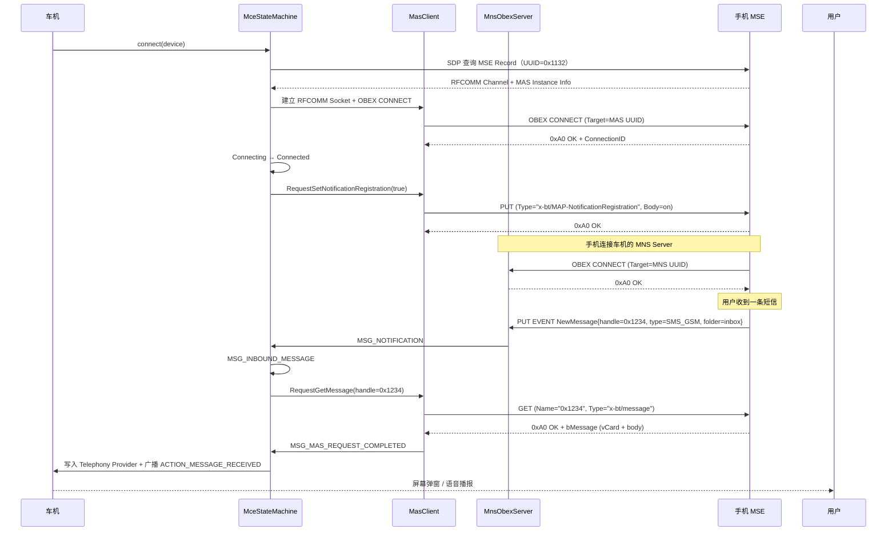

# 14.3 MAP（车机短信 + 通知）

> **速通摘要**：MAP（Message Access Profile）让车机能在屏幕上**显示手机收到的短信、播报新消息、回复短信**。车机是 **MCE**（Message Client Equipment），手机是 **MSE**（Server）。MAP 比 PBAP 复杂的地方在于它是**双向连接**——MCE 拉消息走 MAS（Message Access Service），MSE 推新消息通知走 MNS（Message Notification Service，方向反转）。Android 实现在 `android/app/src/com/android/bluetooth/mapclient/`，状态机 `MceStateMachine:95`，反向 MNS 服务 `MnsService:36`。

---

## 学习目标

读完本节后，你能：
1. 区分 MAS（Client→Server 拉）和 MNS（Server→Client 推）两条 OBEX 通道。
2. 找到 MAP 五大消息类型（SMS_GSM / SMS_CDMA / MMS / EMAIL / IM）。
3. 理解通知注册（SetNotificationRegistration）的作用。
4. 排查"车机收不到新短信通知"类问题。

---

## 前置知识

- [14.1 OBEX 协议族总览](14.1_OBEX协议族总览.md)
- [14.2 PBAP](14.2_PBAP.md) — 类似的 OBEX 客户端模型

---

## 场景故事

驾驶时手机收到一条短信，车机立刻在屏幕上方弹出："张三：晚上几点回来？"，用户按方向盘按键，车机用语音读出短信内容，并询问"是否要回复？"。司机说"我七点到家"，车机把这句话作为短信发出。

这是 MAP 的典型 Auto 场景，对应以下技术动作：
- 启动时车机用 MNS 通道**注册新消息通知**；
- 手机收到 SMS → 通过 MNS 推送 EVENT NewMessage（含消息 handle）；
- 车机收到通知 → 用 MAS 通道 GET 这条消息的全文（bMessage 格式）；
- TTS 播报，用户回复后 → 车机用 MAS PUT 把回复发到 outbox。

---

## 双通道架构

```
       ┌───────────────────────────────────────┐
       │           车机（MCE）                 │
       └────┬──────────────────────────┬───────┘
            │  MAS Client              │  MNS Server
            │  (GET/PUT 拉消息)         │  (等待通知)
            ▼                           ▲
       ┌────┴──────────────────────────┴───────┐
       │           手机（MSE）                 │
       │  MAS Server                MNS Client  │
       │  (响应 GET/PUT)            (主动 PUT)  │
       └───────────────────────────────────────┘
```

**关键点**：MNS 通道的方向是**反过来的**——手机是 OBEX Client（推送 EVENT），车机是 OBEX Server（接收）。这意味着车机必须同时实现 OBEX 的 Client 端（MasClient）和 Server 端（MnsObexServer）。

```java
// android/app/src/com/android/bluetooth/mapclient/MnsService.java:36
public class MnsService {
  // :40
  private static final int MNS_VERSION = 0x0104;  // MAP version 1.4
  // 监听 RFCOMM Channel，等手机连接过来推 EVENT
}
```

---

## 五大消息类型

```java
// android/app/src/com/android/bluetooth/mapclient/obex/Bmessage.java
public enum Type {
    EMAIL,
    SMS_GSM,
    SMS_CDMA,
    MMS,
    IM,           // Instant Message（如 RCS）
}
```

车机一般只关心 SMS_GSM/SMS_CDMA/MMS，可以通过 `Bmessage.Type` 过滤。

---

## 四态状态机

```java
// MceStateMachine.java:95
class MceStateMachine extends StateMachine {
    private final State mDisconnected   = new Disconnected();   // :519
    private final State mConnecting     = new Connecting();     // :538
    private final State mConnected      = new Connected();      // :633
    private final State mDisconnecting  = new Disconnecting();  // :1212
}
```

注意：MAP 客户端**没有独立的 Downloading 状态**（区别于 PBAP）。它在 Connected 状态里持续响应消息事件。

---

## 关键事件

```java
// MceStateMachine.java:99
static final int MSG_MAS_CONNECTED              = 1001;
static final int MSG_MAS_DISCONNECTED           = 1002;
static final int MSG_MAS_REQUEST_COMPLETED      = 1003;
static final int MSG_MAS_REQUEST_FAILED         = 1004;
static final int MSG_MAS_SDP_DONE               = 1005;
static final int MSG_MAS_SDP_UNSUCCESSFUL       = 1006;
static final int MSG_OUTBOUND_MESSAGE           = 2001;  // 用户要发短信
static final int MSG_INBOUND_MESSAGE            = 2002;  // 收到新消息，开始拉全文
static final int MSG_NOTIFICATION               = 2003;  // MNS 推来 EVENT
static final int MSG_GET_LISTING                = 2004;  // 列文件夹
static final int MSG_GET_MESSAGE_LISTING        = 2005;  // 列消息（如 inbox 最新 N 条）
static final int MSG_SET_MESSAGE_STATUS         = 2006;  // 标已读 / 删除
static final int MSG_SEARCH_OWN_NUMBER_TIMEOUT  = 2007;  // 找自己号码超时

// 超时
@VisibleForTesting static final Duration CONNECT_TIMEOUT    = Duration.ofSeconds(10);  // :119
@VisibleForTesting static final Duration DISCONNECT_TIMEOUT = Duration.ofSeconds(3);   // :118

private static final int MAX_MESSAGES = 20;  // :120 默认下载最近 20 条
```

---

## 标准文件夹路径

```java
// MceStateMachine.java:139
private static final String FOLDER_TELECOM = "telecom";
private static final String FOLDER_MSG     = "msg";
private static final String FOLDER_OUTBOX  = "outbox";
static final String FOLDER_INBOX           = "inbox";
static final String FOLDER_SENT            = "sent";
private static final String INBOX_PATH     = "telecom/msg/inbox";
```

MAP 用 OBEX SETPATH 切目录，类似 FTP：
```
SETPATH "telecom"  → SETPATH "msg"  → SETPATH "inbox"  → GET MessageListing
```

---

## 完整调用链

```
连接：
BluetoothMapClient.connect()（API，外部依赖）
    ↓
MapClientService.connect()  // MapClientService.java:55, :106
    ↓
new MceStateMachine() + MSG_CONNECT
    ↓ Connecting
SDP 找 MSE Record（UUID 0x1132）
    ↓ MSG_MAS_SDP_DONE
MasClient 建立 RFCOMM/L2CAP + OBEX CONNECT（Target=MAS UUID）
    ↓ MSG_MAS_CONNECTED → Connected
RequestSetNotificationRegistration(true)  // 注册新消息通知
    ↓
（MNS 通道建立完成，等待 EVENT）

收到新消息：
手机推 EVENT NewMessage → MNS Server 收到 → MSG_NOTIFICATION
    ↓
解析 EventReport，拿到 messageHandle
    ↓
sendMessage(MSG_INBOUND_MESSAGE, handle)
    ↓
new RequestGetMessage(handle) → MAS GET 拉全文
    ↓ MSG_MAS_REQUEST_COMPLETED
解析 Bmessage（vCard + 文本）
    ↓
MapClientContent.storeMessage() → Telephony Provider
    ↓
广播 ACTION_MESSAGE_RECEIVED，车机 App / 通知中心展示

发送：
sendMessage(MSG_OUTBOUND_MESSAGE, bmsg)  // :405
    ↓
new RequestPushMessage("outbox", bmsg) → MAS PUT
    ↓ 手机 MSE 把消息发到运营商网络
```

---

## 源码导读

### MapClientService 入口

```java
// android/app/src/com/android/bluetooth/mapclient/MapClientService.java:55
public class MapClientService extends ConnectableProfile {
  // :106
  public synchronized boolean connect(BluetoothDevice device) {
    // 为每个设备创建一个 MceStateMachine
    // 同时启动 MnsService 监听反向连接
  }
}
```

### MNS Server（反向通道）

```java
// android/app/src/com/android/bluetooth/mapclient/MnsService.java:36
public class MnsService {
  private static final int MNS_VERSION = 0x0104;
  // 在车机本地开 RFCOMM Listening Socket
  // 等手机作为 MNS Client 主动连接进来
  // 收到 PUT EVENT 后，回调 MceStateMachine.MSG_NOTIFICATION
}
```

### Request 类家族（OBEX 请求封装）

```
android/app/src/com/android/bluetooth/mapclient/obex/
├── Request.java                      // 基类
├── RequestSetPath.java               // SETPATH
├── RequestGetFolderListing.java      // GET 文件夹列表
├── RequestGetMessagesListing.java    // GET 消息列表（含 Filter）
├── RequestGetMessage.java            // GET 单条消息全文
├── RequestPushMessage.java           // PUT outbox（发送）
├── RequestSetMessageStatus.java      // PUT 标已读/删除
└── RequestSetNotificationRegistration.java  // 开关通知
```

---

## 时序图：从 SDP 到收消息



---

## 调试方法

```bash
# 查看 MAP Client 状态机
adb logcat -s MceStateMachine:V MapClientService:V MasClient:V

# 查看 MNS 反向通道
adb logcat -s MnsService:V MnsObexServer:V

# 查看具体 Request
adb logcat -s RequestGetMessage:V RequestPushMessage:V RequestSetNotificationRegistration:V

# btsnoop 中识别 MAP
# Wireshark：rfcomm or btatt，filter btobex
# - MAS Service UUID = 0x1132（在 SDP 中）
# - MNS Service UUID = 0x1133
# - x-bt/MAP-NotificationRegistration（PUT Type Header）
# - x-bt/message（GET Type Header，拉消息）
# - x-bt/MAP-event-report（PUT Type Header，推 EVENT）

# 查看 Telephony Provider 中的蓝牙消息
adb shell content query --uri content://mms-sms/conversations --projection thread_id,body,date | head -10
```

---

## FAQ

**Q1：iPhone 的 MAP 有什么限制？**
- iPhone 默认禁用 MAP，需要用户在 设置 → 蓝牙 → i → "显示通知"中开启。
- iPhone 的 MAP 只支持读（PUSH EVENT + GET Message），**不支持 PUT outbox**——即车机不能通过 iPhone 发短信，只能展示。这是 Apple 的安全策略，无法绕过。
- 因此车机的"按方向盘回复短信"功能在 iPhone 上不可用，只能在 Android 手机上工作。

**Q2：MNS_VERSION = 0x0104 是什么意思？**
0x0104 = MAP 版本 1.4。MAP 1.4 引入了 IM 类型（用于 RCS、WhatsApp 等）。如果想兼容老的 MAP 1.2 设备，需要降级 SDP 中通告的版本，但功能也会减少。

**Q3：为什么有时候开了 MAP 但收不到通知？**
最常见的原因：① 没注册通知（`RequestSetNotificationRegistration(true)` 失败）；② MNS 反向通道没建立（手机没主动连过来，可能被防火墙阻挡）；③ 手机端被用户在蓝牙设置里关闭了"显示通知"开关。用 `MnsService:V` 日志查看是否有 incoming connection。

**Q4：MAX_MESSAGES = 20 能改吗？**
能改，但要小心。它限制了 `mSentMessageLog` / `mSentReceiptRequested` 等缓存的大小，改大会占更多内存；改小可能导致回执无法匹配。车机一般保持 20 够用。

---

## 上路任务

1. 打开 `android/app/src/com/android/bluetooth/mapclient/MceStateMachine.java:139`，把 5 个文件夹常量抄下来，理解 `INBOX_PATH = "telecom/msg/inbox"` 与 OBEX SETPATH 的关系。
2. 在 `android/app/src/com/android/bluetooth/mapclient/MnsService.java:40` 找到 `MNS_VERSION = 0x0104`，搜索这个常量在 SDP Record 中是怎么被声明的（提示：和 `createMapMnsSdpRecord` 相关）。
3. 抓 btsnoop 录一次新消息通知流程，找到 MNS 通道（手机→车机的 OBEX）里的 EVENT PUT 包，确认 Type Header 是 `x-bt/MAP-event-report` 且 Body 是 XML 格式的 EventReport。
