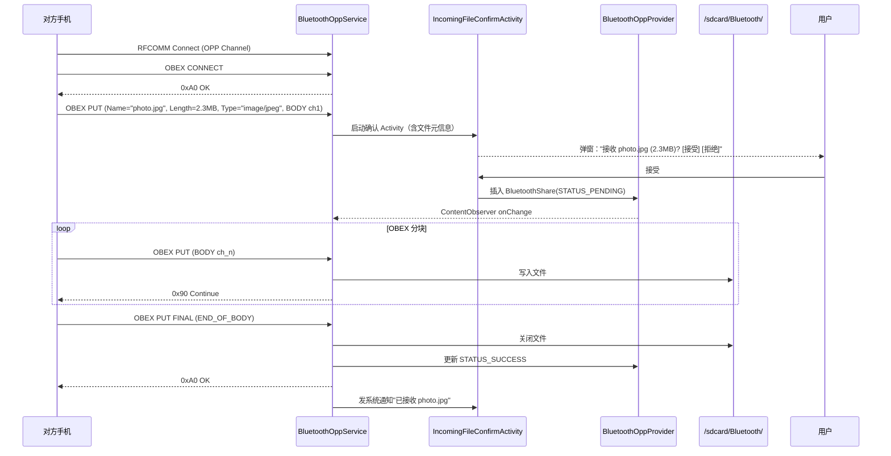

# 14.4 SAP（SIM Access）+ OPP（Object Push）

> **速通摘要**：**SAP** 和 **OPP** 是车机上相对小众但仍重要的两个 Profile。SAP 让车机通过手机的 SIM 卡上网/打电话（车机本身无 SIM 槽时用得到），通信走 RFCOMM + 自定义 TLV（不是 OBEX），实现在 `android/app/src/com/android/bluetooth/sap/`。OPP 是经典的"蓝牙发文件"协议（vCard / 图片 / 任意文件），走 OBEX，实现在 `android/app/src/com/android/bluetooth/opp/`。两者在 Android 16 都保留了完整实现。

---

## 学习目标

读完本节后，你能：
1. 解释 SAP 不属于 OBEX 但与 OBEX 同生态的原因。
2. 找到 SAP 关键消息类型（CONNECT_REQ / TRANSFER_APDU_REQ）。
3. 找到 OPP 收发文件的 ContentProvider 数据结构。
4. 区分 OPP 的 STATUS 状态码（来源于 HTTP）。

---

## 前置知识

- [14.1 OBEX 协议族总览](14.1_OBEX协议族总览.md)
- [05.8 RFCOMM](../05_Native栈基础/05.8_RFCOMM.md)

---

## 一、SAP（SIM Access Profile）

### 1.1 用途与场景

SAP 让车机/远端设备通过蓝牙**完全接管手机的 SIM 卡**：
- 车机有 GSM 模组但没有 SIM 卡槽 → 用手机 SIM 注册到运营商网络，车机就有蜂窝信号
- 车载电话（不通过手机）：车机直接拨打电话、发短信，但流量/计费走手机的 SIM
- 早期 BMW、Mercedes 等高端车型有该需求；近年随 5G 模组普及和 eSIM 兴起逐步被淘汰

### 1.2 协议特点

SAP 不是 OBEX！它走 RFCOMM 上的**裸 TLV 协议**：

```java
// android/app/src/com/android/bluetooth/sap/SapMessage.java:36
public class SapMessage {
    // :42
    public static final int ID_CONNECT_REQ        = 0x00;  // 建立 SAP 会话
    public static final int ID_DISCONNECT_REQ     = 0x02;  // 断开
    public static final int ID_TRANSFER_APDU_REQ  = 0x05;  // 发 APDU 给 SIM（核心）
    public static final int ID_TRANSFER_APDU_RESP = 0x06;  // SIM 回 APDU
    // 还有 POWER_SIM_ON / POWER_SIM_OFF / RESET_SIM / TRANSFER_ATR 等
}
```

**APDU**（Application Protocol Data Unit）是 ISO 7816 定义的 SIM 卡通信格式。SAP 的核心就是把车机要发给 SIM 的 APDU 通过蓝牙转发给手机，手机把 SIM 的响应再转回车机。

### 1.3 源码结构

```java
// android/app/src/com/android/bluetooth/sap/SapService.java:63
public class SapService extends ConnectableProfile
        implements AdapterService.BluetoothStateCallback {
    private static final String SDP_SAP_SERVICE_NAME = "SIM Access";  // :67
    private static final int SDP_SAP_VERSION = 0x0102;                // :68

    // 重要消息
    public static final int MSG_SERVERSESSION_CLOSE    = 5000;  // :76
    public static final int MSG_SESSION_ESTABLISHED    = 5001;  // :77
    public static final int MSG_SESSION_DISCONNECTED   = 5002;  // :78
    public static final int MSG_ACQUIRE_WAKE_LOCK      = 5005;  // :80
}
```

**关键文件**：
- `SapService.java` — Service 入口 + SDP Record 注册
- `SapServer.java` — RFCOMM Server 接受连接、解析 SapMessage
- `SapMessage.java` — TLV 编解码（ID 是 1 字节，后跟参数）
- `SapRilReceiver.java` — 桥接到 Android RIL（vendor.qti.hardware.radio.am 或 IRadio）

### 1.4 SAP 调用链

```
车机 → SAP CONNECT_REQ → SapServer 收到
    ↓
SapServer → SapRilReceiver → RIL.handleApduSapReq
    ↓
RIL → Modem → 手机本地 SIM
    ↓ APDU 响应
反向回到车机
```

### 1.5 SAP 调试

```bash
# 查看 SAP Service
adb logcat -s SapService:V SapServer:V SapMessage:V SapRilReceiver:V

# SAP UUID = 0x112D，过滤 SDP
adb logcat -s sdp:V | grep -i "112D\|sap"

# btsnoop 中找 RFCOMM 通道的 SAP 数据
# 不同于 OBEX，第一个字节是 SapMessage ID（0x00=CONNECT_REQ）
```

---

## 二、OPP（Object Push Profile）

### 2.1 用途与场景

OPP 是最经典的"蓝牙发文件"：手机给手机推 vCard 名片、推照片、推任意文件。车机场景里：
- 副驾给主驾发坐标 / 联系人 → 车机收到通知用户接收
- 车机将一个故障日志 vCard 推送给售后手机 → 蓝牙快速取证
- 车机一般不主动用 OPP 推文件出去，主要做"接收方"

### 2.2 OPP 与 PBAP 的关键差异

| 维度 | OPP | PBAP |
|------|-----|------|
| 方向 | Push（推） | Pull（拉） |
| 触发 | 用户在源端选择文件 | 客户端主动发 GET |
| 对象 | 任意文件 + vCard / vCal | 仅电话簿 vCard |
| OBEX 主请求 | PUT | GET |
| 是否需要授权 | 接收端需用户确认 | 配对时一次性授权 |

### 2.3 源码结构

```java
// android/app/src/com/android/bluetooth/opp/BluetoothOppService.java:86
public class BluetoothOppService extends ProfileService
        implements IObexConnectionHandler {

    // 支持接收的格式
    // :102
    private static final byte[] SUPPORTED_OPP_FORMAT = {
        0x01,  // vCard 2.1
        0x02,  // vCard 3.0
        0x03,  // vCal 1.0
        0x04,  // iCal 2.0
        (byte) 0xFF,  // 任意文件
    };
}
```

**关键文件**：
- `BluetoothOppService.java` — Service 入口 + 文件传输调度
- `BluetoothOppObexServerSession.java` — 接收方 OBEX Server（处理 PUT）
- `BluetoothOppObexClientSession.java` — 发送方 OBEX Client（发 PUT）
- `BluetoothOppTransfer.java` — 单次传输的状态管理
- `BluetoothOppProvider.java` — ContentProvider，存所有传输记录
- `BluetoothShare.java` — ContentProvider 字段常量

### 2.4 BluetoothShare 数据模型

OPP 用 ContentProvider（`content://com.android.bluetooth.opp/btopp`）持久化所有传输记录。

```java
// android/app/src/com/android/bluetooth/opp/BluetoothShare.java:39
public final class BluetoothShare implements BaseColumns {
    // 方向
    public static final String DIRECTION = "direction";   // :108
    public static final int DIRECTION_OUTBOUND = 0;       // :181 发送
    public static final int DIRECTION_INBOUND  = 1;       // :184 接收

    // 状态（HTTP-like）
    public static final String STATUS = "status";         // :150
    public static final int STATUS_PENDING       = 190;   // 等待
    public static final int STATUS_RUNNING       = 192;   // 传输中
    public static final int STATUS_SUCCESS       = 200;   // 完成
    public static final int STATUS_BAD_REQUEST   = 400;
    public static final int STATUS_FORBIDDEN     = 403;   // 用户拒绝
    // 还有：STATUS_CANCELED / STATUS_UNHANDLED_OBEX_CODE / STATUS_CONNECTION_ERROR ...
}
```

### 2.5 OPP 调用链（接收）

```
对方蓝牙设备 PUT 一个文件
    ↓
RFCOMM 接受连接 → BluetoothOppService.onConnect()
    ↓
BluetoothOppObexServerSession 解析 OBEX PUT 头
    ↓
启动 BluetoothOppIncomingFileConfirmActivity 弹窗
    ↓ 用户点"接受"
插入 BluetoothShare 记录（STATUS_PENDING）
    ↓ Provider Observer 触发
BluetoothOppTransfer 启动传输线程
    ↓
读 OBEX BODY → 写文件到 /sdcard/Bluetooth/
    ↓ 完成
更新 STATUS_SUCCESS，发通知（BluetoothOppNotification）
```

### 2.6 OPP 调用链（发送）

```
其他 App 用 ACTION_SEND Intent → BluetoothOppLauncherActivity
    ↓ 用户选目标蓝牙设备
插入 BluetoothShare（DIRECTION_OUTBOUND, STATUS_PENDING）
    ↓
BluetoothOppService 调度 → BluetoothOppTransfer
    ↓
BluetoothOppObexClientSession 建立 OBEX Session → PUT 文件
    ↓ 远端 ACK
更新 STATUS_SUCCESS
```

---

## 三、OPP 时序图（接收方）



---

## 调试方法

```bash
# OPP
adb logcat -s BluetoothOppService:V BluetoothOppObexServerSession:V \
              BluetoothOppObexClientSession:V BluetoothOppTransfer:V

# 查看 OPP ContentProvider 中所有传输记录
adb shell content query --uri content://com.android.bluetooth.opp/btopp \
    --projection _id,direction,status,total_bytes,current_bytes,_data

# SAP
adb logcat -s SapService:V SapServer:V

# 看 OPP 接收目录
adb shell ls -lh /sdcard/Bluetooth/

# btsnoop 中
# OPP UUID = 0x1105，SDP 含 SUPPORTED_OPP_FORMAT
# SAP UUID = 0x112D
```

---

## FAQ

**Q1：SAP 在 Android 16 还能正常工作吗？**
Service 实现仍然保留在 `android/app/src/com/android/bluetooth/sap/`，但实际能否工作取决于 vendor RIL 实现（`SapRilReceiver` 调用 IRadio HAL）。现代车机基本不再使用 SAP，因为：① 车机自带 4G/5G 模组；② eSIM 普及；③ 安全顾虑（手机 SIM 暴露给车机）。

**Q2：OPP 接收的文件存哪？默认目录能改吗？**
默认 `/sdcard/Bluetooth/`，由 `Constants.java` 中的常量控制。可以通过修改 Constants 中的路径常量改变，但需要注意 SELinux 权限 (`bluetooth_data_file` 类型)。

**Q3：OPP 为什么没有 Client/Server 分开的 Service？**
OPP 本身角色对称——任何设备都可以同时收和发。所以 Android 把收发都放在 `BluetoothOppService` 一个进程内：用 `BluetoothOppObexServerSession` 处理收方，`BluetoothOppObexClientSession` 处理发方。

**Q4：为什么 SUPPORTED_OPP_FORMAT 里有 0xFF（任意文件）？**
0xFF 是 OPP 规范的兜底——表示接收方愿意接收任何类型的文件（不限于 vCard/vCal）。如果只声明 0x01-0x04，对端只能推 vCard/vCal，无法推 JPG/PDF/APK。0xFF 是 Android 默认行为，但车机厂商可能出于安全考虑禁用它（修改 SUPPORTED_OPP_FORMAT 数组）。

---

## 上路任务

1. 打开 `android/app/src/com/android/bluetooth/sap/SapMessage.java:42`，把 `ID_*` 常量抄下来，对照 SAP 规范理解 CONNECT_REQ → TRANSFER_ATR → TRANSFER_APDU_REQ 的典型会话顺序。
2. 在 `android/app/src/com/android/bluetooth/opp/BluetoothShare.java:255` 找到所有 `STATUS_*` 常量，对比 HTTP 状态码（200 OK / 400 Bad Request / 403 Forbidden 一致），思考 Android 为什么选这套编码。
3. 用 `adb shell content query` 列出 OPP 历史传输记录，对照 `STATUS` 列理解每条记录的最终状态。
