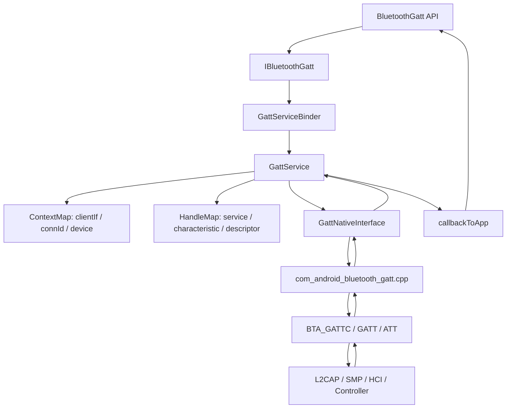
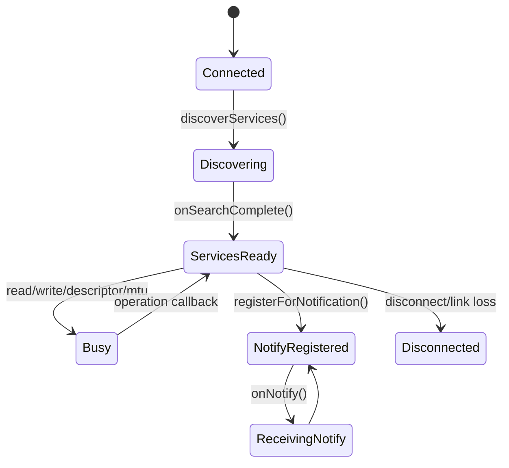
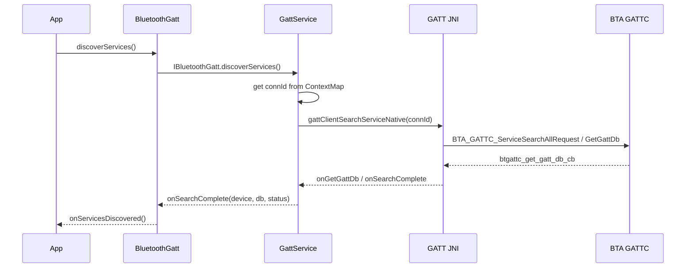
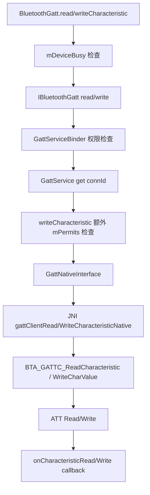
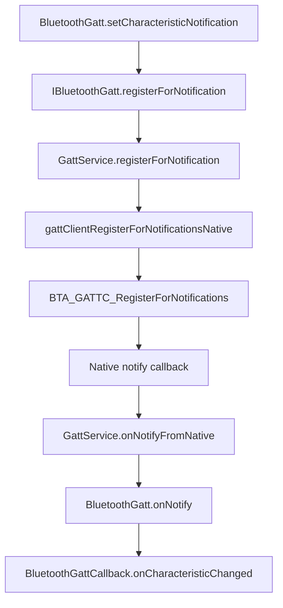

# 15-定向代码阅读报告：GATT Client

## 1. 阅读目标

本报告聚焦 BLE 连接成功后的 GATT Client 操作：服务发现、读写特征、读写描述符、Notify/Indicate 注册、MTU 配置，以及这些操作如何从 `BluetoothGatt` 经 Binder、`GattService`、JNI 进入 BTA/Stack。

读完后要能定位：

- `onConnectionStateChange(CONNECTED)` 后服务发现为空。
- read/write 返回 busy 或没有 callback。
- `setCharacteristicNotification/registerForNotification` 成功但收不到通知。
- OTA 写入频率高导致卡顿、busy、断连。

## 2. 适用场景

- GATT 连接成功但 `discoverServices()` 后服务列表为空。
- `readCharacteristic()`、`writeCharacteristic()` 返回 false 或错误码。
- `onCharacteristicWrite()` 长时间不回。
- CCCD 写了但 `onCharacteristicChanged()` 不回。
- MTU 协商失败，OTA 只能低吞吐。

## 3. 调用链全景图



## 4. 关键类与源码入口

| 层级 | 源码 | 关键入口 |
| --- | --- | --- |
| Framework | `framework/java/android/bluetooth/BluetoothGatt.java` | `discoverServices()`、`readCharacteristic()`、`writeCharacteristic()`、`readDescriptor()`、`writeDescriptor()`、`setCharacteristicNotification()`、`requestMtu()` |
| AIDL | `android/app/aidl/android/bluetooth/IBluetoothGatt.aidl` | `discoverServices`、`readCharacteristic`、`writeCharacteristic`、`registerForNotification`、`configureMTU` |
| Binder | `android/app/src/com/android/bluetooth/gatt/GattServiceBinder.java` | 权限检查和 Binder 入参转发 |
| Service | `android/app/src/com/android/bluetooth/gatt/GattService.java` | `discoverServices(...)`、`readCharacteristic(...)`、`writeCharacteristic(...)`、`registerForNotification(...)`、`configureMTU(...)` |
| Context | `android/app/src/com/android/bluetooth/gatt/ContextMap.java` | `getByConnId(...)`、`getConnectionsByDevice(...)`、`addConnection(...)` |
| Handle | `android/app/src/com/android/bluetooth/gatt/HandleMap.java` | GATT server handle 和 request context；Client 侧主要看 native db 结果 |
| Native Interface | `android/app/src/com/android/bluetooth/gatt/GattNativeInterface.java` | GATT client native methods and callbacks |
| JNI | `android/app/jni/com_android_bluetooth_gatt.cpp` | `gattClientSearchServiceNative`、`gattClientReadCharacteristicNative`、`gattClientWriteCharacteristicNative`、`gattClientRegisterForNotificationsNative`、`gattClientConfigureMTUNative` |
| BTA/Stack | `system/bta/gatt/bta_gattc_api.cc`、`system/bta/gatt/bta_gattc_act.cc`、`system/stack/gatt/gatt_api.cc` | `BTA_GATTC_ServiceSearchAllRequest`、`BTA_GATTC_ReadCharacteristic`、`BTA_GATTC_WriteCharValue`、`BTA_GATTC_RegisterForNotifications` |

## 5. GATT Client 操作生命周期



注意：

- `CONNECTED` 只是 GATT bearer 建立，业务通常要等 `onServicesDiscovered()`。
- Framework 侧 `BluetoothGatt` 用 `mDeviceBusy` 避免同一个 `BluetoothGatt` 同时发多个操作。
- Service 侧 `GattService` 还用 `mPermits` 对每个远端设备的 writeCharacteristic 做串行保护。
- Native/ATT 层也有请求/响应顺序限制，所以 OTA 要按 callback 节奏推进。

## 6. 关键操作链路

### 6.1 服务发现



失败点：

- App 未注册。
- 无 connection / connId。
- Native db 为空。
- 远端服务变化但缓存未刷新。
- 配对后服务发现还未完成就被业务读取。

### 6.2 读写 Characteristic



关键源码：

- `BluetoothGatt.java`：`mDeviceBusyLock`、`mDeviceBusy`。
- `GattService.java`：`writeCharacteristic()` 里 “trying to acquire permit”、“no permit available”。
- `GattService.java`：`onCharacteristicWriteFromNative(...)` 回来后释放 permit 并 callback。

### 6.3 Notify / Indicate



重要提醒：

- Java 的 notification 注册只让本端准备接收 notify/indicate。
- 对大多数标准外设，还需要业务层写 CCCD descriptor，远端才会真正发送通知。
- `registerForNotification()` 成功不等于 CCCD 写成功。

### 6.4 MTU

`BluetoothGatt.requestMtu()` -> `IBluetoothGatt.configureMTU()` -> `GattService.configureMTU()` -> `gattClientConfigureMTUNative()` -> `btgattc_configure_mtu_cb()` -> `onConfigureMTUFromNative()` -> `BluetoothGattCallback.onMtuChanged()`。

MTU 坑点：

- MTU 只是 ATT payload 上限之一，不等于实际业务吞吐。
- OTA 还受连接间隔、PHY、write type、controller buffer、远端处理速度影响。

## 7. 线程模型与回调分发

| 环节 | 线程/机制 | 说明 |
| --- | --- | --- |
| App API | App 线程 | 调用 GATT API，可指定 callback Handler |
| Framework busy | `mDeviceBusyLock` | 同一个 `BluetoothGatt` 串行 read/write/descriptor/reliable write |
| Binder | `IBluetoothGatt` | 进入 Bluetooth 进程 |
| GattService | `HandlerThread("Bluetooth LE")` | GATT service 自己的 handler thread |
| Service write permit | `mPermits` | 每个远端设备限制 writeCharacteristic 并发 |
| Java 回调 | `callbackToApp(...)` | 回调到 App binder/callback |
| Native callback | `com_android_bluetooth_gatt.cpp` callbacks | read/write/notify/mtu/search complete |

## 8. 权限检查点与 Binder 边界

`GattServiceBinder.getServiceAndEnforceConnect(...)` 是大多数 GATT client/server Binder 方法的入口，会做 connect permission data delivery 检查。

敏感 handle 还会走：

- `enforcePrivilegedPermissionIfNeededForHandle(...)`
- `mRestrictedHandles`
- `BLUETOOTH_PRIVILEGED`

典型日志：

- `readCharacteristic() - permission check failed!`
- `readDescriptor() - permission check failed!`
- `registerForNotification() - permission check failed!`

仓库边界：

- AppOps、运行时权限弹窗、Settings 权限 UI 不在本报告展开，后续 Permission/AppOps 专题统一处理。

## 9. JNI / Native / Vendor 边界

| 操作 | JNI 方法 | Native/BTA |
| --- | --- | --- |
| 服务发现 | `gattClientSearchServiceNative` | `BTA_GATTC_ServiceSearchAllRequest`、GATT DB |
| 读特征 | `gattClientReadCharacteristicNative` | `BTA_GATTC_ReadCharacteristic` |
| 写特征 | `gattClientWriteCharacteristicNative` | `BTA_GATTC_WriteCharValue` |
| 读描述符 | `gattClientReadDescriptorNative` | `BTA_GATTC_ReadCharDescr` |
| 写描述符 | `gattClientWriteDescriptorNative` | `BTA_GATTC_WriteCharDescr` |
| Notify 注册 | `gattClientRegisterForNotificationsNative` | `BTA_GATTC_RegisterForNotifications` |
| MTU | `gattClientConfigureMTUNative` | `BTA_GATTC_ConfigureMTU` |

Vendor 边界：

- ATT Error、controller buffer、连接参数、PHY、远端设备处理速度需要 btsnoop 和远端日志证明。

## 10. 可能失败点

| 层级 | 失败点 | 表现 | 观察方式 |
| --- | --- | --- | --- |
| Framework | `mDeviceBusy` 已占用 | API 返回 false 或 busy 错误 | `BluetoothGatt` log |
| Binder | 权限失败 | 操作被拒 | `GattServiceBinder` log |
| Service | App 未注册 | `App not registered` | `GattService` log |
| Service | 无连接 | `No connection for device` | `ContextMap`、connId |
| Service | write permit 不可用 | `no permit available` | `GattService.writeCharacteristic()` |
| Native | db 为空 | 服务发现为空 | `btgattc_get_gatt_db_cb`、snoop |
| ATT | 读写不允许 | GATT read/write status 非 success | ATT Error Response |
| Notify | 未写 CCCD | 注册成功但无通知 | snoop 是否有 CCCD Write |
| MTU | 远端拒绝或未响应 | `onMtuChanged` status 异常 | snoop Exchange MTU |
| OTA | 发送太快 | busy、吞吐低、断连 | callback 间隔、ATT flow |

## 11. dumpsys、logcat、bugreport 观察点

命令：

```bash
adb shell dumpsys bluetooth
adb logcat -b all | grep -E "BluetoothGatt|GattService|GattServiceBinder|GattNativeInterface|HandleMap|ContextMap|btgattc|BTA_GATTC|GATT"
adb bugreport bugreport.zip
```

重点看：

- `GattService.dump(...)` 输出 `ClientMap`、`ServerMap`、`HandleMap`。
- `ContextMap` 中 client app、connId、transport 是否存在。
- `GattService` 操作日志是否出现 `No connection`、`permission check failed`、`no permit available`。
- btsnoop 中是否有 ATT Read/Write/Notify/Exchange MTU。

## 12. 定制修改思路

| 目标 | 涉及文件 | 修改思路 | 风险 |
| --- | --- | --- | --- |
| OTA 写入诊断 | `BluetoothGatt.java`、`GattService.java` | 记录 write 发起时间、callback 时间、status、handle、value length | 不打印敏感 payload |
| 服务发现为空诊断 | `GattService.onSearchComplete` 附近 | 记录 db count、restricted handle、connId、device | dump/log 需脱敏 |
| Notify 诊断 | `registerForNotification`、`onNotifyFromNative` | 记录注册状态、notify 到达次数、handle | 高频 notify 日志要限流 |
| MTU 诊断 | `configureMTU`、`onConfigureMTUFromNative` | 记录请求 mtu、协商 mtu、status | 不要把 MTU 当吞吐唯一指标 |
| dumpsys 增强 | `GattService.dump`、`ContextMap.dump` | 输出最近 N 次 GATT 操作流水 | 注意锁和输出长度 |

## 13. 最容易踩的坑

- `onConnectionStateChange(CONNECTED)` 后必须等 `discoverServices()`。
- `setCharacteristicNotification()` 不等于写 CCCD。
- 同一个 `BluetoothGatt` 上 read/write/descriptor 操作要串行等 callback。
- OTA 不能只按 for-loop 连续写，要按 `onCharacteristicWrite()` 或业务 ACK 节奏推进。
- `GATT_SUCCESS` 只代表某层操作成功，不代表业务协议包被远端处理。
- 服务发现为空可能是缓存、权限、加密、远端固件、服务变化或发现时机问题。

## 14. 练习题与参考答案

### 练习 1：写出 GATT write 主链路

参考答案：

`BluetoothGatt.writeCharacteristic()` -> `mDeviceBusy` 检查 -> `IBluetoothGatt.writeCharacteristic()` -> `GattServiceBinder.writeCharacteristic()` -> 权限/privileged handle 检查 -> `GattService.writeCharacteristic()` -> connId 与 permit 检查 -> `GattNativeInterface` -> `gattClientWriteCharacteristicNative()` -> `BTA_GATTC_WriteCharValue()` -> ATT Write -> `btgattc_write_characteristic_cb()` -> `GattService.onCharacteristicWriteFromNative()` -> `BluetoothGatt.onCharacteristicWrite()` -> App callback。

### 练习 2：Notify 收不到，先看哪三件事

参考答案：

1. `registerForNotification()` 是否走到 `GattService` 且没有 `No connection` 或权限失败。
2. App 是否写了 CCCD descriptor，snoop 里是否有 ATT Write Request 到 0x2902。
3. snoop 里是否有 Handle Value Notification/Indication。如果 snoop 有但 App 没有，再查 `onNotifyFromNative()` 和 callback 分发。

### 练习 3：OTA 高频写为什么会 busy

参考答案：

Framework 有 `BluetoothGatt.mDeviceBusy`，Service 有 per-device `mPermits`，ATT 本身也要求请求/响应顺序。连续 for-loop 写入会在 Java 层或 Service 层被判 busy，即使没 busy 也可能把远端或 controller buffer 打满。正确方式是按 write callback、MTU、连接参数和业务 ACK 节奏推进。

### 练习 4：服务发现为空如何建证据链

参考答案：

先确认 `onConnectionStateChange(CONNECTED)` 后确实调用了 `discoverServices()`；再看 `GattService.discoverServices()` 是否拿到 connId；然后看 `btgattc_get_gatt_db_cb` 返回 count；最后用 snoop 看 ATT service discovery 或 GATT DB 是否有响应。若配对刚完成，要考虑加密和 post-pairing 发现时机。

## 15. 与案例库的映射

可映射到 `97-真实案例库.md`：

- “GATT 连接成功但服务发现为空”
- “GATT 订阅通知成功但收不到回调”
- “OTA 写入频繁 busy”
- “BLE 看得到广播但 connectGatt 失败”中的连接后续阶段
