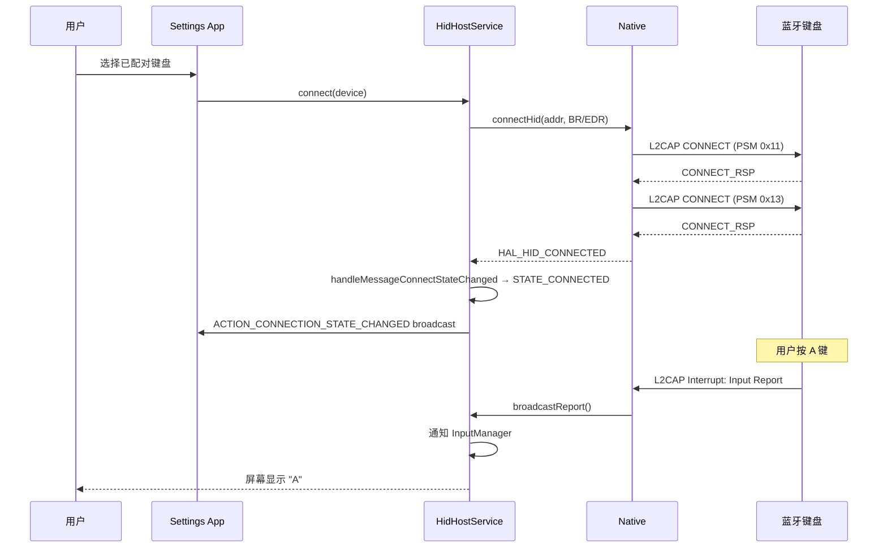

# 15.1 HID Host + HID Device

> **速通摘要**：HID (Human Interface Device) Profile 把蓝牙键盘、鼠标、游戏手柄、车机方向盘按键等"人机输入设备"接入主机。Android 实现两个对称角色：① **HID Host**——车机/手机当 Host，接外设输入（`HidHostService.java:63`，最常见）；② **HID Device**——本机当被外设，反向当蓝牙键鼠（`HidDeviceService.java:59`，少见，需 App 主动注册 SDP 记录）。底层走 L2CAP 两条固定 PSM：Control（0x0011）+ Interrupt（0x0013）。核心命令：SetReport / GetReport / SetProtocol / Virtual Cable Unplug。

---

## 学习目标

读完本节后，你能：
1. 区分 HID Host 与 HID Device 两种角色，理解车机为何 90% 场景都是 Host。
2. 解释 Control / Interrupt 两条 L2CAP 通道的分工。
3. 在 `HidHostService` 找到 connect/disconnect/setReport/getReport 入口。
4. 看懂 Report Protocol 与 Boot Protocol 的差异。
5. 用 dumpsys / logcat 排查"HID 输入设备掉线 / 无响应"。

---

## 前置知识

- [05.6 L2CAP](../05_Native栈基础/05.6_L2CAP.md)
- [02.3 BluetoothProfile 与 Profile Proxy](../02_Framework_API导读/02.3_BluetoothProfile.md)
- [04.3 Java→Native 调用栈](../04_JNI桥接机制/04.3_Java_to_Native调用栈.md)

---

## 场景故事

司机给车机配了一个蓝牙小键盘，平时用来输入导航目的地。某天发现：键盘按一下后等 1 秒才响应，偶尔按住某键车机会"鬼按"（持续重复字符）。

排查时要回答：
- 键盘到底连上的是 HID Host 还是 Audio 设备？（看 dumpsys 中 Profile 分类）
- 是 L2CAP Interrupt 通道丢数据还是上层 InputManager 处理慢？（看 hci 日志的 Interrupt PSM 包频）
- 是 Boot Protocol（PS/2 兼容）还是 Report Protocol 模式？（看 SetProtocolMode 历史）

这一节就是建立这些排查所需的"地图"。

---

## 一、HID 角色对照

| 角色 | 谁充当 | 典型车机场景 | Service |
|------|--------|--------------|---------|
| **HID Host** | 主机（PC / 手机 / 车机） | 接蓝牙键盘、鼠标、游戏手柄、方向盘控制器 | `HidHostService` |
| **HID Device** | 被接入的"外设"（也可以是手机模拟键盘） | 车机当被外设极少；手机当蓝牙键盘控制 PPT 是个例 | `HidDeviceService` |

**关键差异**：HID Device 需要应用层主动 `registerApp(sdpRecord, qosOutgoing, callback)`，把 SDP 记录注册到本机才能被对方发现成 HID 外设；HID Host 则是被动接入对方主动连接过来的 HID 设备。

---

## 二、L2CAP 双通道架构

HID 在 L2CAP 上固定使用两条 PSM：

| PSM | 名称 | 用途 | 流控 |
|-----|------|------|------|
| **0x0011** | Control Channel | 双方协商命令（GET_REPORT、SET_PROTOCOL、HID 控制命令） | 有 ACK，可靠 |
| **0x0013** | Interrupt Channel | 输入事件流（按键、鼠标移动、游戏手柄轴位） | 无 ACK，低延迟 |

为什么要分两条？
- Control 通道是"命令-应答"模型，每条命令都要等回应（GetReport 返回结果）。
- Interrupt 通道是"火喷射"模型，键鼠移动每秒几十到几百个事件，等 ACK 会卡。
- 类似 USB HID 也分 Control Endpoint 0 和 Interrupt Endpoint，本质照搬。

---

## 三、HID Host：源码导读

### 3.1 类与入口

```java
// android/app/src/com/android/bluetooth/hid/HidHostService.java:63
public class HidHostService extends ConnectableProfile {

    // :126 构造（标准 ProfileService 模式）
    public HidHostService(AdapterService adapterService) { ... }

    // :654 主动连接
    public boolean connect(BluetoothDevice device) {
        // → processConnection() → nativeConnect()
    }

    // :692 主动断开
    public boolean disconnect(BluetoothDevice device) {
        return disconnect(device, /* reconnectAllowed */ true);
    }

    // :260 Native 桥接（实际下发 L2CAP 连接命令）
    private boolean nativeConnect(BluetoothDevice device, int transport) {
        return mNativeInterface.connectHid(
                getByteAddress(device, transport),
                getAddressType(device),
                transport);
    }
}
```

### 3.2 消息分发

`HidHostService` 用 `Handler` 处理所有异步事件（不是 StateMachine）：

```java
// HidHostService.java:299 mHandler
public void handleMessage(Message msg) {
    switch (msg.what) {
        case MESSAGE_CONNECT             -> handleMessageConnect(msg);             // :587
        case MESSAGE_DISCONNECT          -> handleMessageDisconnect(msg);          // :576
        case MESSAGE_CONNECT_STATE_CHANGED -> handleMessageConnectStateChanged(msg); // :515
        case MESSAGE_GET_PROTOCOL_MODE   -> handleMessageGetProtocolMode(msg);     // :507
        case MESSAGE_ON_GET_PROTOCOL_MODE -> handleMessageOnGetProtocolMode(msg);  // :495
        case MESSAGE_VIRTUAL_UNPLUG      -> handleMessageVirtualUnplug(msg);       // :487
        case MESSAGE_SET_PROTOCOL_MODE   -> handleMessageSetProtocolMode(msg);     // :474
        case MESSAGE_GET_REPORT          -> handleMessageGetReport(msg);           // :457
        case MESSAGE_ON_GET_REPORT       -> handleMessageOnGetReport(msg);         // :444
        case MESSAGE_ON_HANDSHAKE        -> handleMessageOnHandshake(msg);         // :433
        case MESSAGE_SET_REPORT          -> handleMessageSetReport(msg);           // :418
        case MESSAGE_ON_VIRTUAL_UNPLUG   -> handleMessageOnVirtualUnplug(msg);     // :408
        case MESSAGE_GET_IDLE_TIME       -> handleMessageGetIdleTime(msg);         // :400
        case MESSAGE_ON_GET_IDLE_TIME    -> handleMessageOnGetIdleTime(msg);       // :388
        case MESSAGE_SET_IDLE_TIME       -> handleMessageSetIdleTime(msg);         // :378
        case MESSAGE_SET_PREFERRED_TRANSPORT -> handleMessageSetPreferredTransport(msg); // :340
        case MESSAGE_SEND_DATA           -> handleMessageSendData(msg);            // :329
    }
}
```

### 3.3 双传输（Classic + LE）

注意 `HidHostService` 用 `transport` 参数区分 BR/EDR 和 LE。LE HID（HOGP - HID over GATT Profile）走 GATT，不走 L2CAP 双通道：

```java
// HidHostService.java:340 handleMessageSetPreferredTransport
private void handleMessageSetPreferredTransport(Message msg) {
    int transport = msg.arg1;  // BR/EDR or LE
    int prevTransport = getTransport(device);

    if (getConnectionPolicy(device) == CONNECTION_POLICY_ALLOWED) {
        if (prevTransport != transport) {
            // 切换传输：先断旧的，再连新的
        }
    }
}
```

车载用例：Apple Pencil 走 LE HID（HOGP）；普通 Bluetooth 键盘走 Classic HID。

---

## 四、HID Device：源码导读

### 4.1 类与入口

```java
// android/app/src/com/android/bluetooth/hid/HidDeviceService.java:59
public class HidDeviceService extends ConnectableProfile {

    // :428 主动发起连接（极少用，通常 Host 主动连过来）
    public synchronized boolean connect(BluetoothDevice device) { ... }

    // :441 主动断开
    public synchronized boolean disconnect(BluetoothDevice device) { ... }
}
```

### 4.2 消息事件

```java
// HidDeviceService.java:62-69
private static final int MESSAGE_APPLICATION_STATE_CHANGED = 1;  // App 注册/反注册成功
private static final int MESSAGE_CONNECT_STATE_CHANGED     = 2;
private static final int MESSAGE_GET_REPORT                = 3;  // Host 来取本机 Report
private static final int MESSAGE_SET_REPORT                = 4;  // Host 设本机 Report
private static final int MESSAGE_SET_PROTOCOL              = 5;  // Host 切 Report/Boot 模式
private static final int MESSAGE_INTR_DATA                 = 6;  // Host 通过 Interrupt 发数据
private static final int MESSAGE_VC_UNPLUG                 = 7;  // Virtual Cable Unplug
private static final int MESSAGE_IMPORTANCE_CHANGE         = 8;  // App 进程优先级变化
```

### 4.3 App 注册流程

要让本机变成蓝牙键盘，App 要先注册 SDP 描述符：

```java
// 应用层（伪代码）
BluetoothHidDevice hid = ...;  // 获取 Proxy
hid.registerApp(
    sdpSettings,         // SDP 记录（描述符、Vendor ID 等）
    qosOutgoing,         // 出向 QoS
    qosIncoming,         // 入向 QoS
    callback             // 回调接收 Host 事件
);
```

注册成功后：
1. `HidDeviceService` 收到 `MESSAGE_APPLICATION_STATE_CHANGED`，把 `mHidDevice` 设为目标。
2. 通过 `mCallback.onAppStatusChanged()` 通知 App。
3. App 进程死亡时，`BluetoothHidDeviceDeathRecipient` 自动反注册（HidDeviceService.java:142）。

---

## 五、调用链

```
[App: KeyEvent / 鼠标移动]
     ↓
android.bluetooth.BluetoothHidDevice (Framework, 外部依赖)
     ↓ AIDL
HidDeviceService.java       ←→  HidHostService.java （角色对称）
     ↓ JNI
HidDeviceNativeInterface       HidHostNativeInterface
     ↓
system/btif/src/btif_hd.cc     system/btif/src/btif_hh.cc
     ↓
system/bta/hd/                  system/bta/hh/
     ↓
system/stack/hid/               system/stack/hid/
     ↓
L2CAP (PSM 0x11 + 0x13)        ──→ HCI ──→ Controller
```

---

## 六、SetReport / GetReport / SetProtocolMode

### 6.1 Report 类型

| Type | 值 | 含义 |
|------|---|------|
| Input | 0x01 | 设备 → Host（按键事件） |
| Output | 0x02 | Host → 设备（LED 灯、震动） |
| Feature | 0x03 | 配置项（如鼠标 DPI） |

### 6.2 Boot Protocol vs Report Protocol

| 模式 | 用途 | 报告格式 |
|------|------|---------|
| **Boot Protocol** | BIOS 启动时键鼠（无 HID 描述符即可工作） | 固定格式：8 字节键盘 / 3 字节鼠标 |
| **Report Protocol** | 正常运行 | 按 HID 描述符的自定义格式 |

主机连上设备后，先用 Boot Protocol 立刻能用（不需要解析 HID 描述符），再下发 SetProtocol 切到 Report Protocol 享受全功能。

---

## 七、连接状态时序



---

## 八、调试方法

```bash
# 看 HID Host 服务状态 + 已连 HID 设备
adb shell dumpsys bluetooth_manager | grep -A 20 "HidHost"

# 看 HID Device 注册状态
adb shell dumpsys bluetooth_manager | grep -A 10 "HidDevice"

# logcat HID 主标签
adb logcat -s HidHostService:V HidDeviceService:V BluetoothHidHostJni:V

# 看 HCI L2CAP 通道（PSM 0x11 / 0x13）
adb logcat -s bt_l2cap:V | grep -i "PSM_HID\|0x11\|0x13"

# btsnoop 抓包，filter HID
# 关键过滤：l2cap.cid == 0x0040+ 且 PSM 是 0x11/0x13
# Wireshark 中：bthid

# 排查"按键无响应"
# 1) 看 Interrupt 通道是否有 Input Report 上来
adb logcat -s HidHostService:V | grep -i "broadcastReport"

# 2) 看 InputManager 是否接收
adb shell dumpsys input | grep -i "bluetooth"

# 排查"鬼按 / 持续重复"
# 多半是设备端 Keepalive 异常或断连后 Host 没释放按键状态
adb shell input keyevent KEYCODE_TAB  # 测试本地输入是否正常
```

---

## 九、与 Audio Profile 的对比

| 维度 | HID | A2DP |
|------|-----|------|
| 传输 | L2CAP Interrupt (无 ACK) | L2CAP + AVDTP |
| 数据率 | 极低（事件触发） | 高（连续流 200-400kbps） |
| 延迟敏感 | 极敏感（按键 → 显示 < 50ms） | 中等（A/V 同步 < 100ms） |
| 资源占用 | 低 | 高（占用音频管线） |
| 与 A2DP 共存 | OK（不抢音频管线） | — |

车机同时连一个蓝牙音乐（A2DP）和一个蓝牙手柄（HID）完全没问题，不会互相干扰。但同时连 HFP（SCO 占射频）+ HID 时，HID 输入会有明显延迟突增——这是 SCO 时隙抢占 L2CAP 带宽导致。

---

## FAQ

**Q1：为什么蓝牙鼠标接车机后系统不识别？**
检查三步：① `dumpsys` 确认 HidHostService 是否处于 CONNECTED；② `dumpsys input` 看 InputDevice 列表是否出现该鼠标；③ aconfig flag 是否禁用了 HID（部分车机精简版关掉 HID profile）。

**Q2：HID Device 模式车机有什么用？**
理论上车机可以伪装成蓝牙键盘控制手机（如 PPT 翻页）。实际车载几乎不用。Android `HidDeviceService` 是为手机端"用手机当蓝牙键盘"的应用预留的。

**Q3：HOGP（HID over GATT）和经典 HID 是什么关系？**
- 经典 HID = 走 L2CAP 双通道（0x11 + 0x13），用于 BR/EDR。
- HOGP = 走 GATT 的 HID Service (UUID 0x1812)，用于 LE。
- `HidHostService.transport` 字段区分两种，但上层 API 一致。

**Q4：Virtual Cable Unplug 是什么？**
HID 协议规定的"软拔线"机制——设备主动告诉 Host "我要彻底断开，请删除我"。Host 收到后会主动 unbond（取消配对）。常见于键盘开关键场景。`MESSAGE_ON_VIRTUAL_UNPLUG` 处理这个事件（HidHostService.java:408）。

---

## 上路任务

1. 打开 `android/app/src/com/android/bluetooth/hid/HidHostService.java:299` 的 `mHandler`，把 17 个 MESSAGE_* 抄下来，分类成"主动 → Native"和"Native → 上报"两组。
2. 用 `adb shell dumpsys bluetooth_manager | grep -A 20 HidHost` 在车机连一个蓝牙键盘后看输出，找到 `mInputDevices` 列表。
3. 用 `adb logcat -s HidHostService:V` 抓键盘按键时的日志，找 `broadcastReport()` 调用频率，估算每秒事件数。
